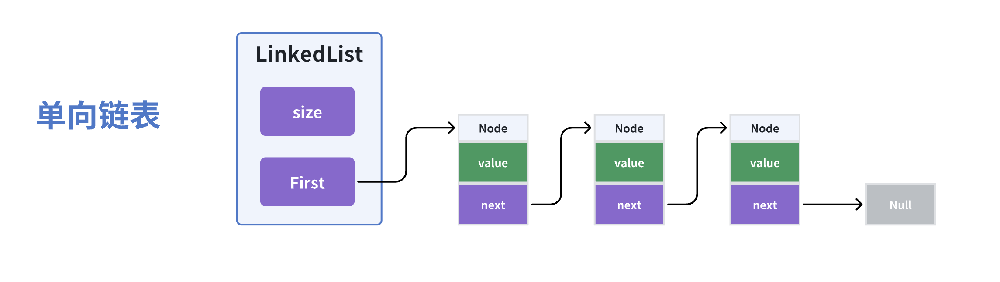
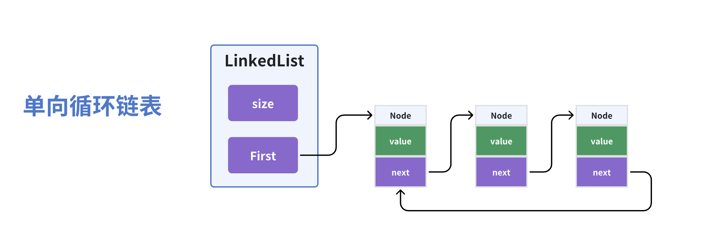
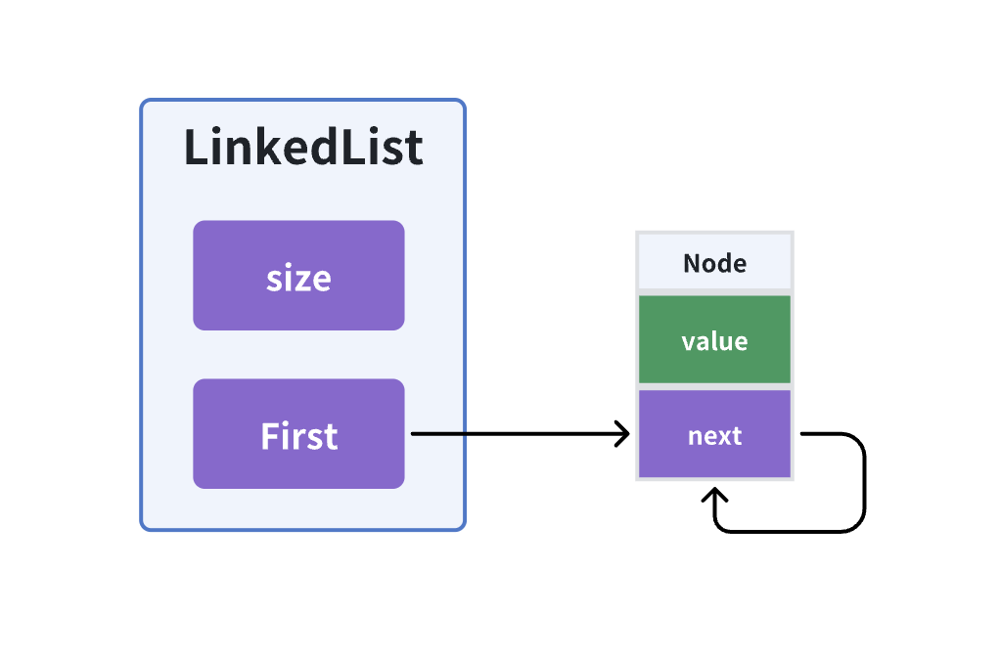
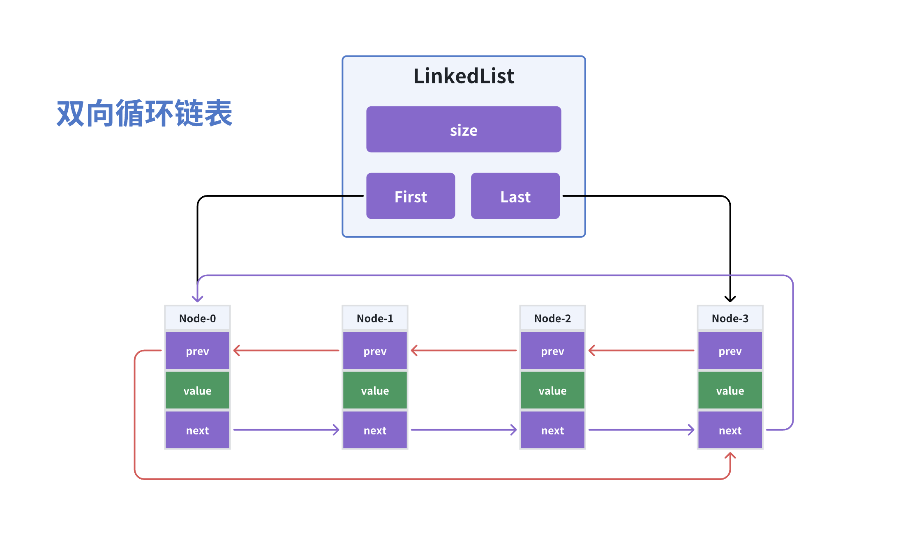
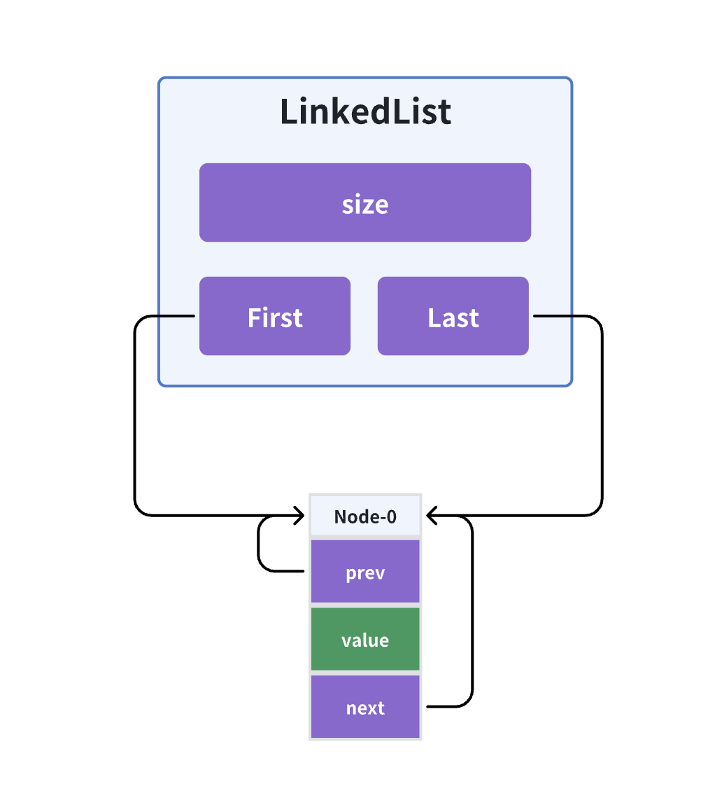

# LinkedList 链表

> **链表 LinkedList**：内存地址无须连续，每个节点都包含下一个节点的指针。（查询慢，修改快）

## 单向链表

单向链表：每个节点都包含下一个节点的指针，末尾节点指向null。

- 注意新增、删除 first 头节点时特殊处理



::: details 代码实现 SinglyLinkedList（重点关注 **add**、**remove** 方法）

```java
package datastructure;

import java.util.AbstractList;
import java.util.List;

/**
 * 单向链表（通过指针引用关联节点）
 *
 * @author XRZ
 */
public class SinglyLinkedList<E> extends AbstractList<E> {

    private Node<E> first; //头节点
    private int size;      //记录节点长度

    public SinglyLinkedList(){
    }

    public void add(int index, E element) {
        this.rangeCheckForAdd(index);
        // 特殊处理
        if(index == 0){
            // 首次新增时，first = null
            // 插入头节点时，first节点往后移，并且置为新节点的next节点。
            first = new Node<>(element,first);
        }else{
            Node<E> prev = this.node(index - 1); //获取前节点

            // 新节点的next为当前index的节点，等于当前节点后移
            Node<E> newNode = new Node<>(element, prev.next);
            // 修改前节点的引用为新节点
            prev.next = newNode;
        }
        size++;
    }

    public E remove(int index) {
        this.rangeCheck(index);
        E oldItem;
        // 删除0号位时，特殊处理
        if(index == 0) {
            oldItem = first.item;
            first = first.next;   //覆盖引用
        }else{
            Node<E> prev = this.node(index - 1); //获取前节点
            oldItem = prev.next.item;
            //前节点直接指向当前节点的next（prev.next = 当前节点）
            prev.next = prev.next.next;
        }
        size--;
        return oldItem;
    }

    @Override
    public E get(int index) {
        this.rangeCheck(index);
        // 遍历节点取值
        return this.node(index).item;
    }

    @Override
    public int size() {
        return size;
    }

    public E set(int index, E element) {
        this.rangeCheck(index);
        Node<E> node = this.node(index);
        E oldVal = node.item;
        node.item = element; // 覆盖值
        return oldVal;
    }


    public void clear() {
        size = 0;
        first = null;
    }

    /**
     * 遍历节点
     * @param index 遍历到指定下标
     * @return
     */
    private Node<E> node(int index){
        Node<E> node = first;
        for (int i = 0; i < index; i++){
            node = node.next;
        }
        return node;
    }

    public static class Node<E>{
        E item;
        Node<E> next;

        public Node(E item, Node<E> next){
            this.item = item;
            this.next = next;
        }
    }


    private void rangeCheck(int index){
        if(index < 0 || index >= size)
            throw new IndexOutOfBoundsException("Index:" + index + ", Size:" + size);
    }

    private void rangeCheckForAdd(int index) {
        if (index < 0 || index > size)
            throw new IndexOutOfBoundsException("Index:" + index + ", Size:" + size);
    }
}

```

:::

## 单向链表（循环）

单向链表的末尾节点next指向null，而循环链表的末尾节点next指向first节点，形成一个环。



除了新增、删除 first 头节点时需要特殊处理，单节点时的情况也要考虑

- 首次新增：没有尾节点，自己指向自己
- 删除最后一个节点：first 直接置空即可



::: details 代码实现 SinglyLinkedCircularList（重点关注 **add**、**remove** 方法）

```java
package datastructure;

import java.util.AbstractList;
import java.util.List;

/**
 * 单向链表（循环）
 *
 *  单向链表的末尾节点next指向null，而循环链表的末尾节点next指向first节点
 *
 * @author XRZ
 */
public class SinglyLinkedCircularList<E> extends AbstractList<E> {

    private Node<E> first; //头节点
    private int size;      //记录节点长度

    public SinglyLinkedCircularList(){

    }

    public void add(int index, E element) {
        this.rangeCheckForAdd(index);
        if(index == 0){ // 特殊处理
            Node<E> newFirst = new Node<>(element,first);

            // 首次新增时
            if(size == 0){
                newFirst.next = newFirst; //没有尾节点，自己指向自己
            }
            // 插入头节点时
            else{
                Node<E> lastNode = this.node(size - 1); // 获取尾节点
                lastNode.next = newFirst; //尾节点指向新first
            }
            first = newFirst; //更新头节点

        }else{
            Node<E> prev = this.node(index - 1); //获取前节点
            // 新节点的next为当前index的节点，等于当前节点后移
            Node<E> newNode = new Node<>(element, prev.next); //此处的prev在末尾时，next是first节点
            // 修改前节点的引用为新节点
            prev.next = newNode;
        }
        size++;
    }


    public E remove(int index) {
        this.rangeCheck(index);
        E oldItem;
        if(index == 0) { // 特殊处理
            oldItem = first.item;

            //当只有一个节点时
            if(size == 1){
                first = null;
            }
            // 删除0号位时
            else{
                Node<E> lastNode = this.node(size - 1);
                lastNode.next = first; //更新尾节点引用
                first = first.next;    // 覆盖头节点
            }

        }else{
            Node<E> prev = this.node(index - 1); //获取前节点
            oldItem = prev.next.item;
            //前节点直接指向当前节点的next（prev.next = 当前节点）
            prev.next = prev.next.next;
        }
        size--;
        return oldItem;
    }

    @Override
    public E get(int index) {
        this.rangeCheck(index);
        // 遍历节点取值
        return this.node(index).item;
    }

    @Override
    public int size() {
        return size;
    }

    public E set(int index, E element) {
        this.rangeCheck(index);
        Node<E> node = this.node(index);
        E oldVal = node.item;
        node.item = element; // 覆盖值
        return oldVal;
    }


    public void clear() {
        size = 0;
        first = null;
    }

    /**
     * 遍历节点
     * @param index 遍历到指定下标
     * @return
     */
    private Node<E> node(int index){
        Node<E> node = first;
        for (int i = 0; i < index; i++){
            node = node.next;
        }
        return node;
    }

    public static class Node<E>{
        E item;
        Node<E> next;

        public Node(E item, Node<E> next){
            this.item = item;
            this.next = next;
        }
    }

    private void rangeCheck(int index){
        if(index < 0 || index >= size)
            throw new IndexOutOfBoundsException("Index:" + index + ", Size:" + size);
    }

    private void rangeCheckForAdd(int index) {
        if (index < 0 || index > size)
            throw new IndexOutOfBoundsException("Index:" + index + ", Size:" + size);
    }
}

```

:::

## 双向链表（java.util.LinkedList）

每个数据节点中都有两个指针，分别指向前节点和后节点。头节点的前节点和尾节点的后节点都为null。

> 优化单向链表的查询效率：（空间换时间） 
>
> - 把链表一分为二 
> - 当判断index节点在左边时，就从头节点的next往后查询
> - 当判断index节点在右边时，就从尾节点的prev往前查询


### 二分遍历节点

```java
    /**
     * 遍历节点（采用二分思想）
     *
     * @param index 遍历到指定下标
     * @return
     */
    private Node<E> node(int index){

        int median = size >> 1; // 除以2，向下取整（5 >> 1 = 2）

        // 当判断index节点在左边时，就从头节点的next往后查询
        if(index < median){
            Node<E> node = first;
            for (int i = 0; i < index; i++){ // 从左往右 找index
                node = node.next;
            }
            return node;
        }
        // 当判断index节点在右边时，就从尾节点的prev往前查询
        else{
            Node<E> node = last;
            // size-1的元素就是last
            for (int i = size - 1; i > index; i--){ // 从右往左 找index

                // [1,2,3,4,5]
                //  0 1 2 3 4
                // 假设 median=3，index=3，i=4，符合i>index
                // 返回的是node的prev，注意不是返回node，所以此处循环条件不需要i=index
                node = node.prev;
            }
            return node;
        }
    }
```


::: details 代码实现 XLinkedList（重点关注 **add**、**remove** 方法）

```java
package datastructure;

import java.util.AbstractList;
import java.util.List;

/**
 * 双向链表（java.util.LinkedList）
 *
 *  每个数据节点中都有两个指针，分别指向前节点和后节点。头节点的前节点和尾节点的后节点都为null。
 *
 *  优化单向链表的查询效率：（空间换时间）
 *     把链表一分为二
 *     当判断index节点在左边时，就从头节点的next往后查询
 *     当判断index节点在右边时，就从尾节点的prev往前查询
 *
 * @author XRZ
 */
public class XLinkedList<E> extends AbstractList<E> {

    private Node<E> first; //头节点
    private Node<E> last;  //尾节点
    private int size;      //记录节点长度

    public void add(int index, E element) {
        this.rangeCheckForAdd(index);

        // 处理首次新增（index=0）或者末尾新增
        if(index == size){
            if(index == 0){
                first = new Node<>(null,element,null);
                last = first; // 首次新增，末尾节点指向自己

            }else{ // 末尾新增 index == size
                Node<E> oldLast = last;
                Node<E> newLast = new Node<>(oldLast,element,null);
                oldLast.next = newLast;
                last = newLast; // 更新last引用
            }
        }
        // 处理插入0号位和插入中间的情况
        else{
            Node<E> curr = this.node(index);
            Node<E> prev = curr.prev;
//            Node<E> next = curr.next;

            Node<E> node = new Node<>(prev ,element, curr);

            if(prev == null){ // 0号位插入
                first = node;
            }else{
                prev.next = node;  // 修改前节点的next指向新节点
            }
            curr.prev = node;      // 修改后节点的prev指向新节点
        }
        size++;
    }

    public E remove(int index) {
        this.rangeCheck(index);

        Node<E> curr = this.node(index);
        Node<E> prev = curr.prev;
        Node<E> next = curr.next;

        if(prev == null){ // 删除头节点
            first = next;
        }else{
            prev.next = next;
        }

        if(next == null){ // 删除尾节点
            last = prev;
        }else{
            next.prev = prev;
        }

        size--;
        return curr.item;
    }

    /**
     * 遍历节点（采用二分思想）
     *
     * @param index 遍历到指定下标
     * @return
     */
    private Node<E> node(int index){

        int median = size >> 1; // 除以2，向下取整（5 >> 1 = 2）

        // 当判断index节点在左边时，就从头节点的next往后查询
        if(index < median){
            Node<E> node = first;
            for (int i = 0; i < index; i++){ // 从左往右 找index
                node = node.next;
            }
            return node;
        }
        // 当判断index节点在右边时，就从尾节点的prev往前查询
        else{
            Node<E> node = last;
            // size-1的元素就是last
            for (int i = size - 1; i > index; i--){ // 从右往左 找index

                // [1,2,3,4,5]
                //  0 1 2 3 4
                // 假设 median=3，index=3，i=4，符合i>index
                // 返回的是node的prev，注意不是返回node，所以此处循环条件不需要i=index
                node = node.prev;
            }
            return node;
        }
    }


    @Override
    public E get(int index) {
        this.rangeCheck(index);
        return node(index).item;
    }

    @Override
    public int size() {
        return size;
    }

    public E set(int index, E element) {
        this.rangeCheck(index);
        Node<E> node = this.node(index);
        E oldItem = node.item;
        node.item = element;
        return oldItem;
    }

    public void clear() {
        size = 0;
        first = null;
        last = null;
    }

    public static class Node<E>{
        E item;
        Node<E> prev; // 指向前驱节点
        Node<E> next; // 指向后继节点

        public Node(Node<E> prev, E item, Node<E> next){
            this.item = item;
            this.prev = prev;
            this.next = next;
        }
    }


    private void rangeCheck(int index){
        if(index < 0 || index >= size)
            throw new IndexOutOfBoundsException("Index:" + index + ", Size:" + size);
    }

    private void rangeCheckForAdd(int index) {
        if (index < 0 || index > size)
            throw new IndexOutOfBoundsException("Index:" + index + ", Size:" + size);
    }
}

```

:::

## 双向链表（循环）

在双向链表的基础上，头节点的前节点指向尾节点，尾节点的后节点指向头节点。





::: details 代码实现 XLinkedCircularList（重点关注 **add**、**remove** 方法）

```java
package datastructure;

import java.util.AbstractList;
import java.util.List;

/**
 * 双向链表（循环）
 *
 *  在双向链表的基础上，头节点的前节点指向尾节点，尾节点的后节点指向头节点。
 *
 * @author XRZ
 */
public class XLinkedCircularList<E> extends AbstractList<E> {

    private Node<E> first; //头节点
    private Node<E> last;  //尾节点
    private int size;      //记录节点长度


    public void add(int index, E element) {
        this.rangeCheckForAdd(index);

        // 处理首次新增（index=0）或者末尾新增
        if(index == size){
            if(index == 0){
                Node<E> node = new Node<>(null,element,null);
                node.prev = node;  // 首次新增，循环引用
                node.next = node;
                first = node;
                last = node;

            }else{ // 末尾新增 index == size
                Node<E> oldLast = last;
                Node<E> newLast = new Node<>(oldLast,element,oldLast.next);
                oldLast.next = newLast;
                last = newLast;         // 更新last引用
                first.prev = newLast;   // 更新头节点的应用
            }
        }
        // 处理插入0号位和插入中间的情况
        else{
            Node<E> curr = this.node(index);
            Node<E> prev = curr.prev;
            Node<E> next = curr.next;

            Node<E> node = new Node<>(prev ,element, curr);

            prev.next = node;  // 修改前节点的next指向新节点
            next.prev = node;  // 修改后节点的prev指向新节点

            if(curr == first){ // 0号位插入，更新头节点
                first = node;
            }
        }
        size++;
    }

    public E remove(int index) {
        this.rangeCheck(index);
        Node<E> curr = this.node(index);

        if(size == 1){ // 只有单节点时特殊处理，避免循环覆盖无法删除的问题
            first = null;
            last = null;
        }else{
            Node<E> prev = curr.prev;
            Node<E> next = curr.next;

            prev.next = next;
            next.prev = prev;

            if(curr == first){ // 删除头节点
                first = next;
            }

            if(curr == last){ // 删除尾节点
                last = prev;
            }
        }

        size--;
        return curr.item;
    }


    /**
     * 遍历节点（采用二分思想）
     *
     * @param index 遍历到指定下标
     * @return
     */
    private Node<E> node(int index){

        int median = size >> 1; // 除以2，向下取整（5 >> 1 = 2）

        // 当判断index节点在左边时，就从头节点的next往后查询
        if(index < median){
            Node<E> node = first;
            for (int i = 0; i < index; i++){ // 从左往右 找index
                node = node.next;
            }
            return node;
        }
        // 当判断index节点在右边时，就从尾节点的prev往前查询
        else{
            Node<E> node = last;
            // size-1的元素就是last
            for (int i = size - 1; i > index; i--){ // 从右往左 找index

                // [1,2,3,4,5]
                //  0 1 2 3 4
                // 假设 median=3，index=3，i=4，符合i>index
                // 返回的是node的prev，注意不是返回node，所以此处循环条件不需要i=index
                node = node.prev;
            }
            return node;
        }
    }


    @Override
    public E get(int index) {
        this.rangeCheck(index);
        return node(index).item;
    }

    @Override
    public int size() {
        return size;
    }

    public E set(int index, E element) {
        this.rangeCheck(index);
        Node<E> node = this.node(index);
        E oldItem = node.item;
        node.item = element;
        return oldItem;
    }

    public void clear() {
        size = 0;
        first = null;
        last = null;
    }

    public static class Node<E>{
        E item;
        Node<E> prev; // 指向前驱节点
        Node<E> next; // 指向后继节点

        public Node(Node<E> prev, E item, Node<E> next){
            this.item = item;
            this.prev = prev;
            this.next = next;
        }
    }


    private void rangeCheck(int index){
        if(index < 0 || index >= size)
            throw new IndexOutOfBoundsException("Index:" + index + ", Size:" + size);
    }

    private void rangeCheckForAdd(int index) {
        if (index < 0 || index > size)
            throw new IndexOutOfBoundsException("Index:" + index + ", Size:" + size);
    }
}

```

:::

## 测试用例

```java
package datastructure;

import org.junit.Test;

import java.util.List;

/**
 * @author XRZ
 */
public class LinkedListTest {

    @Test
    public void testSinglyLinkedList(){
        List<Integer> singlyLinkedList = new SinglyLinkedList<>();
        runTests(singlyLinkedList, "单向链表");
    }

    @Test
    public void testSinglyLinkedCircularList(){
        List<Integer> singlyCircularList = new SinglyLinkedCircularList<>();
        runTests(singlyCircularList, "单向循环链表");
    }

    @Test
    public void testXLinkedList(){
        List<Integer> xLinkedList = new XLinkedList<>();
        runTests(xLinkedList, "双向链表");
    }

    @Test
    public void testXLinkedCircularList(){
        List<Integer> doublyCircularList = new XLinkedCircularList<>();
        runTests(doublyCircularList, "双向循环链表");
    }


    public static void runTests(List<Integer> list, String listName) {
        System.out.println("===== 测试链表: " + listName + " =====");

        // 1. 测试空链表操作
        try {
            list.get(0);
        } catch (Exception e) {
            System.out.println("get from empty list: " + e);
        }

        try {
            list.remove(0);
        } catch (Exception e) {
            System.out.println("remove from empty list: " + e);
        }

        // 2. 测试添加节点
        System.out.println("\n测试添加操作：");
        list.add(0, 10); // 添加到头部
        System.out.println("Add 10 at index 0: " + list);

        list.add(1, 20); // 添加到尾部
        System.out.println("Add 20 at index 1: " + list);

        list.add(1, 15); // 添加到中间
        System.out.println("Add 15 at index 1: " + list);

        // 3. 测试获取节点
        System.out.println("\n测试获取操作：");
        System.out.println("Get index 0: " + list.get(0));
        System.out.println("Get index 1: " + list.get(1));
        System.out.println("Get index 2: " + list.get(2));

        // 4. 测试更新节点
        System.out.println("\n测试更新操作：");
        list.set(0, 100); // 更新头部节点
        System.out.println("Set index 0 to 100: " + list);

        list.set(2, 200); // 更新尾部节点
        System.out.println("Set index 2 to 200: " + list);

        // 5. 测试删除节点
        System.out.println("\n测试删除操作：");
        list.remove(0); // 删除头部节点
        System.out.println("Remove index 0: " + list);

        list.remove(1); // 删除尾部节点
        System.out.println("Remove index 1: " + list);

        // 6. 测试清空链表
        System.out.println("\n测试清空链表：");
        list.clear();
        System.out.println("List after clear: " + list);

        System.out.println("链表测试完成: " + listName + "\n");
    }

}

```

## 扩展

- 加强版循环链表：新增current属性、reset()、next()、remove()，解决约瑟夫环的问题。
- 静态链表：使用数组实现的链表
