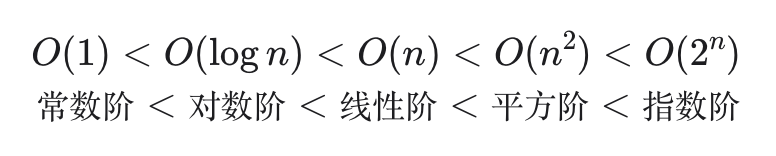

# Data Structure And Algorithm 数据结构与算法

- WEB书籍：https://www.hello-algo.com/chapter_hello_algo/
- ==B站视频左程云==：https://space.bilibili.com/8888480/channel/seriesdetail?sid=3509640&ctype=0
- 课上代码、ppt、资料：https://github.com/algorithmzuo/algorithm-journey
- 排序动画演示：http://www.donghuasuanfa.com/sort
- 代码Demo：/Users/Work/Pagoda/Demo/AlgorithmDemo
- [Hello 算法](https://www.hello-algo.com/chapter_data_structure/classification_of_data_structure/#311)
- [恋上数据结构 CSDN学习笔记](https://blog.csdn.net/weixin_43734095/article/details/105116064)

---

- 动态规划

  - [公司使用案例: 最优代金券组合-动态规划](https://doc.weixin.qq.com/doc/w3_AE0AAgY_ACUZXUpp7CYToG8sn3xNx?scode=APEAlweLAA4OntJsnrAE0AAgY_ACU)

## 复杂度评估（Big O）

**大O表示法（Big O）**

一般用大O表示法来描述复杂度，它表示的是数据规模 n 对应的复杂度。

#### 时间复杂度

**线性阶 O(n)**： 单层循环

**平方阶 O(n^2^)**： 两层循环

**对数阶 O(logn)** ：常出现于分治策略的算法中，例如二分查找（每轮数据量减半）

**线性对数阶 O(nlogn)** ：在两层循环中，时间复杂度分别为 O(log⁡n) 和 O(n) 

**指数阶 O(2^n^)**： 常出现于递归函数中，与对数阶相反（次方级别，例如1->2->4->8->16）

#### 空间复杂度

## 线性数据结构

### 数组 Array

数组是一种线性表数据结构。它用一组连续的内存空间，来存储一组具有相同类型的数据。

- 存储数组的内存空间是连续的
- 特点是查询快，增删慢

### 链表 Linked List

链表也是线性的顺序存储数据，只是在内存地址上不是连续的，每一个节点里存到下一个节点的指针(Pointer)。

- 内存地址无须连续
- 单向链表：每个节点都包含下一个节点的指针。
- 双向链表：每个数据节点中都有两个指针，分别指向前节点和后节点。

### 队列 Queue

&emsp;队列是只允许在一端进行插入操作，而在另一端进行删除操作的线性表。

- 特点是先进先出，后进后出

### 栈 Stack

栈是只在表尾进行插入或者删除的线性表。

- 对于栈来说，表尾端称为栈顶（top），表头端称为栈低（bottom）。
- 是一个后进先出的线性表，简称LIFO（Last In First Out）

## 非线性数据结构

## 参考

- [Hello 算法](https://www.hello-algo.com/chapter_data_structure/classification_of_data_structure/#311)
- [恋上数据结构 CSDN学习笔记](https://blog.csdn.net/weixin_43734095/article/details/105116064)

