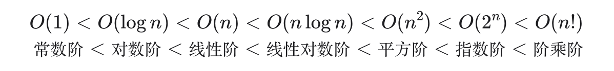
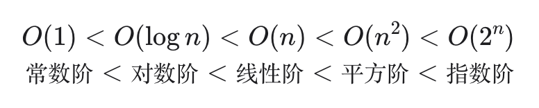

# Data Structure 数据结构

- WEB书籍：https://www.hello-algo.com/chapter_hello_algo/
- ==B站视频左程云==：https://space.bilibili.com/8888480/channel/seriesdetail?sid=3509640&ctype=0
- 课上代码、ppt、资料：https://github.com/algorithmzuo/algorithm-journey
- 排序动画演示：http://www.donghuasuanfa.com/sort
- 代码Demo：/Users/Work/Pagoda/Demo/AlgorithmDemo

- 动态规划

  - [公司使用案例: 最优代金券组合-动态规划](https://doc.weixin.qq.com/doc/w3_AE0AAgY_ACUZXUpp7CYToG8sn3xNx?scode=APEAlweLAA4OntJsnrAE0AAgY_ACU)

---

- [Hello 算法](https://www.hello-algo.com/chapter_data_structure/classification_of_data_structure/#311)
- [恋上数据结构 CSDN学习笔记](https://blog.csdn.net/weixin_43734095/article/details/104847976)
- 飞书绘图：https://onyfgwe19l.feishu.cn/docx/MIgjdurh8o0nINxG4nwcJx4MnVe

## 数据结构分类

>注意：==所有数据结构都是基于数组、链表或二者的组合实现的==
>
>- **基于数组可实现**：栈、队列、哈希表、树、堆、图、矩阵、张量（维度 ≥3 的数组）等。
>- **基于链表可实现**：栈、队列、哈希表、树、堆、图等。

### 线性数据结构

- **数组 Array**：用一组连续的内存空间，来存储一组具有相同类型的数据。（查询快，修改慢）
- **链表 LinkedList**：内存地址无须连续，每个节点都包含下一个节点的指针。（查询慢，修改快）
  - 单向链表：每个节点都包含下一个节点的指针，末尾节点指向null。
  - 单向循环链表：在单向链表的基础上，末尾节点指向头节点，形成一个环。
  - 双向链表：每个数据节点中都有两个指针，分别指向前节点和后节点。头节点的前节点和尾节点的后节点都为null。
  - 双向循环链表：在双向链表的基础上，头节点的前节点指向尾节点，尾节点的后节点指向头节点。
- **栈 Stack**：单端操作，后进先出，简称LIFO（Last In First Out）
- **队列 Queue**：双端操作，队尾入队，队头出队。先进先出，简称FIFO（First In First Out）
  - 双端队列：队尾支持出队、入队，队头支持出队、入队。
  - 循环队列：通过数组实现的队列，通过维护 front 队头形成循环。
  - 循环双端队列：在循环队列基础上，队尾支持出队、入队，队头支持出队、入队。

### 非线性数据结构

- **哈希表 HashTable**：又称散列表，通过建立键 key 与值 value 之间的映射，实现高效的元素查询。
- **树 Tree**：一种层级结构，由一个根节点和若干子树组成，每个节点包含数据和指向子节点的指针。
- **图 Graph**：由节点和边构成，支持有向图、无向图等表示方式和遍历算法（深度优先搜索（DFS）、广度优先搜索（BFS））。
- **堆 Heap**：一种特殊的树。最大堆的父节点值大于等于子节点，最小堆反之。常用于优先队列。

## 复杂度评估（Big O）

**大O表示法（Big O）**

一般用大O表示法来描述复杂度，它表示的是数据规模 n 对应的复杂度。

#### 时间复杂度

**线性阶 O(n)**： 单层循环

**平方阶 O(n^2^)**： 两层循环

**对数阶 O(logn)** ：常出现于分治策略的算法中，例如二分查找（每轮数据量减半）

**线性对数阶 O(nlogn)** ：在两层循环中，时间复杂度分别为 O(log⁡n) 和 O(n) 

**指数阶 O(2^n^)**： 常出现于递归函数中，与对数阶相反（次方级别，例如1->2->4->8->16）

#### 空间复杂度

## 参考

- [Hello 算法](https://www.hello-algo.com/chapter_data_structure/classification_of_data_structure/#311)
- [恋上数据结构 CSDN学习笔记](https://blog.csdn.net/weixin_43734095/article/details/105116064)

