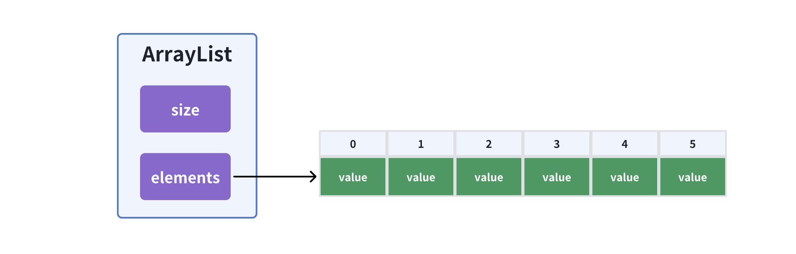

# ArrayList 动态数组

##  ArrayList

**数组 Array**：用一组连续的内存空间，来存储一组具有相同类型的数据。（查询快，修改慢）

> 继承 `java.util.AbstractList` ，实现一些通用的方法
>
> - 动态数组：通过扩容实现动态数组：grow(int minCapacity)
> - 添加功能：通过部分元素右移实现添加：add(int index, E element)
> - 删除功能：通过部分元素左移实现删除：remove(int index)



### 扩容

新增时，需要对现有数组扩容，大致流程：创建一个新数组，将旧数组移到新数组中

```java
private void ensureCapacity(int minCapacity) {
    int oldCapacity = elements.length;
    if(minCapacity <= oldCapacity) return; //空闲容量还很充裕

    //新容量 = 旧容量1.5倍（`>> 1` = 除以2）
    int newCapacity = oldCapacity + (oldCapacity >> 1);
    Object[] newElements = new Object[newCapacity];

    //旧数组移到新数组中
    for (int i = 0; i < size; i++){
      newElements[i] = elements[i];
    }
    elements = newElements;
}
```

### 缩容

删除数据时，避免空闲容量过多，考虑缩容。

```java
private void trim() {
    int oldCapacity = elements.length;
    int newCapacity = oldCapacity >> 1; //缩小0.5倍

    if(oldCapacity <= DEFAULT_CAPACITY || //容量太小，没必要缩容
       size >= newCapacity){ // 实际使用量超过总容量的一半，也没必要缩容
      return;
    }
    // 当实际使用量 小于 总容量的一半，触发缩容
    // 新建数组迁移
    Object[] newElements =  new Object[newCapacity];
    for (int i = 0 ; i < size ; i++){
      newElements[i] = elements[i];
    }
    elements = newElements;
}
```

**注意缩容时机的问题：**

例如：当扩容数量为*2，新增数据，触发扩容，容量20 -> 40，size=21。如果这时候删除了2个元素，size回退到19，触发缩容，如果又新增了2个元素， 又触发了扩容，容易反复横跳，造成复杂度震荡。

解决：调整缩容的时机，例如当只有实际使用量小于总容量的四分之一时才出发缩容。

## 完整代码实现

```java
package datastructure;

import java.util.AbstractList;
import java.util.ArrayList;
import java.util.List;

/**
 *  ArrayList（动态数组）
 *
 *    继承AbstractList，实现一些通用的方法
 *    动态数组：通过扩容实现动态数组：grow(int minCapacity)
 *    添加功能：通过部分元素右移实现插入：add(int index, E element)
 *    删除功能：通过部分元素左移实现删除：remove(int index)
 *
 * @author XRZ
 */
public class XArrayList<E> extends AbstractList<E> {

    private Object[] elements; // 使用数组实现List（动态数组）
    private int size;          // 记录实际使用量（element.lenth是总容量）
    private static int DEFAULT_CAPACITY = 10;


    public XArrayList(){
        elements = new Object[DEFAULT_CAPACITY];
    }

    @Override
    public int size() {
        return size;
    }

    @Override
    public E get(int index) {
        this.rangeCheck(index);
        return (E) elements[index];
    }

    public void add(int index, E element) {
        this.rangeCheckForAdd(index);
        // 扩容
        this.ensureCapacity(size + 1);

        //通过部分元素右移实现插入
        // [1,2,3,4,x,x,x] size = 4, i = 3（1起始）
        // [1,2,2,3,4,x,x] 假设 index = 1 位置插入（0起始）
        for (int i = size - 1; i >= index; i--){
            // 右移覆盖
            elements[i + 1] = elements[i];
        }
        elements[index] = element; //指定位置插入
        size++; //记录使用量
    }

    public E remove(int index) {
        this.rangeCheck(index);
        Object oldElment = elements[index];

        //通过部分元素左移实现删除
        // [1,2,3,4,x,x,x]
        // [2,3,4,x,x,x,x] 假设 index = 0, size = 4
        for (int i = index; i < size; i++){
            // 左移覆盖
            elements[i] = elements[i + 1];
        }
        elements[size - 1] = null; //尾部元素置空
        size--;

        // 缩容（可选）
        this.trim();

        return (E) oldElment;
    }

    public void clear() {
        for (int i = 0; i < size; i++){
            elements[i] = null;
        }
        size = 0;

        //缩容2
        if(elements.length > DEFAULT_CAPACITY){
            elements = new Object[DEFAULT_CAPACITY];
        }
    }

    public E set(int index, E element) {
        this.rangeCheck(index);

        Object oldElement = elements[index];

        elements[index] = element; //指定下标位置覆盖

        return (E) oldElement;
    }


    /**
     * 扩容
     * @param minCapacity
     */
    private void ensureCapacity(int minCapacity) {
        int oldCapacity = elements.length;
        if(minCapacity <= oldCapacity) return; //空闲容量还很充裕

        //新容量 = 旧容量1.5倍（`>> 1` = 除以2）
        int newCapacity = oldCapacity + (oldCapacity >> 1);
        Object[] newElements = new Object[newCapacity];

        //旧数组移到新数组中
        for (int i = 0; i < size; i++){
            newElements[i] = elements[i];
        }
        elements = newElements;
    }

    /**
     * 缩容：删除数据时，避免空闲容量过多，考虑缩容。
     */
    private void trim() {
        int oldCapacity = elements.length;
        int newCapacity = oldCapacity >> 1; //缩小0.5倍

        if(oldCapacity <= DEFAULT_CAPACITY || //容量太小，没必要缩容
                size >= newCapacity){ // 实际使用量超过总容量的一半，也没必要缩容
            return;
        }
        // 当实际使用量 小于 总容量的一半，触发缩容
        Object[] newElements =  new Object[newCapacity];  // 新建数组迁移
        for (int i = 0 ; i < size ; i++){
            newElements[i] = elements[i];
        }
        elements = newElements;
    }


    private void rangeCheck(int index){
        if(index < 0 || index >= size)
            throw new IndexOutOfBoundsException("Index:" + index + ", Size:" + size);
    }

    private void rangeCheckForAdd(int index) {
        if (index < 0 || index > size)
            throw new IndexOutOfBoundsException("Index:" + index + ", Size:" + size);
    }
}

```

## 测试用例

```java
package datastructure;

import org.junit.Test;

import java.util.List;

/**
 * @author XRZ
 */
public class ListTest {

    @Test
    public void testXArrayList(){
        List<Integer> list = new XArrayList<>();

        System.out.println("===== 测试 XArrayList 功能 =====");

        // 1. 测试空列表操作
        try {
            list.get(0);
        } catch (IndexOutOfBoundsException e) {
            System.out.println("get from empty list: " + e);
        }

        try {
            list.remove(0);
        } catch (IndexOutOfBoundsException e) {
            System.out.println("remove from empty list: " + e);
        }

        // 2. 测试添加操作
        System.out.println("\n测试添加操作：");
        list.add(0, 10); // 插入到头部
        System.out.println("Add 10 at index 0: " + list);

        list.add(1, 20); // 插入到尾部
        System.out.println("Add 20 at index 1: " + list);

        list.add(1, 15); // 插入到中间
        System.out.println("Add 15 at index 1: " + list);

        list.add(3, 25); // 尾部插入
        System.out.println("Add 25 at index 3: " + list);

        // 3. 测试获取操作
        System.out.println("\n测试获取操作：");
        System.out.println("Get index 0: " + list.get(0));
        System.out.println("Get index 1: " + list.get(1));
        System.out.println("Get index 3: " + list.get(3));

        // 4. 测试设置操作
        System.out.println("\n测试设置操作：");
        list.set(0, 100);
        System.out.println("Set index 0 to 100: " + list);

        list.set(2, 200);
        System.out.println("Set index 2 to 200: " + list);

        // 5. 测试删除操作
        System.out.println("\n测试删除操作：");
        list.remove(0); // 删除头部
        System.out.println("Remove index 0: " + list);

        list.remove(1); // 删除中间
        System.out.println("Remove index 1: " + list);

        list.remove(list.size() - 1); // 删除尾部
        System.out.println("Remove last index: " + list);

        // 6. 测试动态扩容
        System.out.println("\n测试动态扩容：");
        for (int i = 0; i < 15; i++) {
            list.add(i);
        }
        System.out.println("List after adding 15 elements: " + list);
        System.out.println("List size: " + list.size());

        // 7. 测试缩容
        System.out.println("\n测试缩容：");
        for (int i = 0; i < 10; i++) {
            list.remove(0);
        }
        System.out.println("List after removing 10 elements: " + list);
        System.out.println("List size: " + list.size());

        // 8. 测试清空列表
        System.out.println("\n测试清空列表：");
        list.clear();
        System.out.println("List after clear: " + list);
        System.out.println("List size: " + list.size());
    }
}

```

## 扩展

- 优化 ArrayList：新增 first 属性，记录首元素位置，可以最大限度规避或者减少元素位移。(循环队列)
