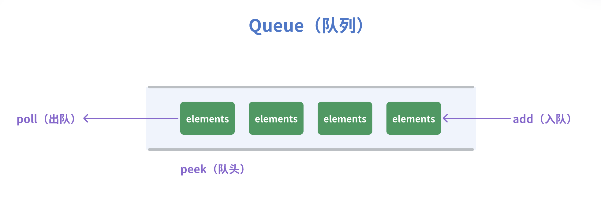
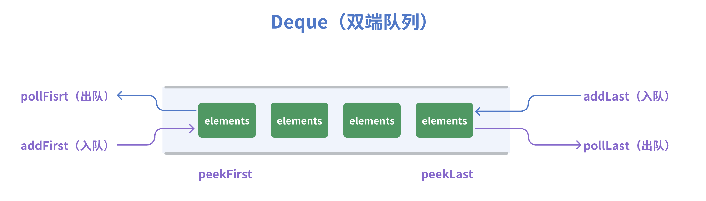

# Queue 队列

## Queue 队列

> **Queue 队列**：双端操作，队尾入，队头出。先进先出，简称FIFO（First In First Out）

**队列的实现**：可以基于动态数组 或者 双向链表实现

- 优先使用双向链表，因为队列主要是往头尾操作元素。双向链表头尾操作都是 O(1)，动态数组头尾操作可能是 O(n)
- 官方 java.util.Queue 是基于 LinkedList 实现（双向链表）



:::  details 代码实现 XQueue（基于 LinkedList 实现）

```java
package datastructure.queue;
import datastructure.linkedlist.XLinkedList;
import java.util.List;

/**
 * @author XRZ
 */
public class XQueue<E> {

    private List<E> list = new XLinkedList<>();

    /**
     * 入队
     * @param e
     * @return
     */
    public boolean add(E e){
        return list.add(e); //链表末尾 = 队列队尾
    }

    /**
     * 出队
     * @return
     */
    public E poll(){
        return list.remove(0);
    }

    /**
     * 获取队头
     * @return
     */
    public E peek(){
        return list.get(0);
    }


    public void clear(){
        list.clear();
    }

    public int size(){
        return list.size();
    }

    public boolean isEmpty(){
        return list.isEmpty();
    }
}
```

:::

## Deque 双端队列

>**双端队列 Deque（duble ended queue）**：队尾、队头都支持出队和入队。
>
>- 官方 java.util.Deque 是基于 LinkedList 实现（双向链表）



:::  details 代码实现 XDeque（基于 LinkedList 实现）

```java
package datastructure.queue;
import datastructure.linkedlist.XLinkedList;
import java.util.List;

/**
 * @author XRZ
 */
public class XDeque<E> {

    private List<E> list = new XLinkedList<>();

    /**
     * 队头-入队
     * @param e
     */
    public void addFirst(E e){
        list.add(0,e); //链表头插入
    }

    /**
     * 队尾-入队
     * @param e
     */
    public void addLast(E e){
        list.add(e); //链表尾插入
    }

    /**
     * 队头-出队
     * @return
     */
    public E pollFirst(){
        return list.remove(0);
    }

    /**
     * 队尾-出队
     * @return
     */
    public E pollLast(){
        return list.remove(this.size() - 1);
    }

    /**
     * 获取队头
     * @return
     */
    public E peekFirst(){
        return list.get(0);
    }

    /**
     * 获取队尾
     * @return
     */
    public E peekLast(){
        return list.get(this.size() - 1);
    }


    public void clear(){
        list.clear();
    }

    public int size(){
        return list.size();
    }

    public boolean isEmpty(){
        return list.isEmpty();
    }
}
```

:::

## 扩展：使用栈实现队列

> Leetcode原题：https://leetcode.cn/problems/implement-queue-using-stacks

实现逻辑：维护两个栈，A栈，B栈。入队时放入A栈，出队时从B栈取值。

- B栈为空时，将A栈 倾倒在 B栈上，这样B栈出栈时取的就是A栈的底部数据，即队头。

```java
/**
* 将A栈 倾倒在 B栈上
*/
private void transform(){
    if(bStack.isEmpty()){
        while(! aStack.isEmpty()){
            bStack.push(aStack.pop());
        }
    }
}
```

::: details 完整代码实现

```java
class MyQueue {

    Stack<Integer> aStack = new Stack<>();
    Stack<Integer> bStack = new Stack<>();

    public MyQueue() {}

    public void push(int x) {
      aStack.push(x);
    }


    public int pop() {
      this.transform();

      return bStack.pop(); // 出队，从B栈上取
    }

    public int peek() {
      this.transform();

      return bStack.peek();
    }


    /**
     * 将A栈 倾倒在 B栈上
     */
    private void transform(){
      if(bStack.isEmpty()){
        while(! aStack.isEmpty()){
          bStack.push(aStack.pop());
        }
      }
    }

    public boolean empty() {
      return aStack.isEmpty() && bStack.empty();
    }
}
```


:::