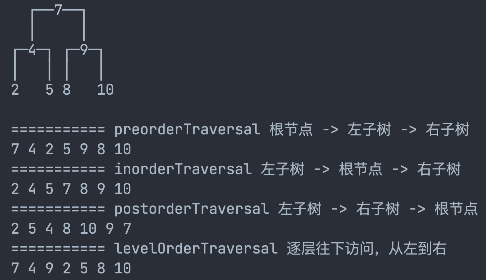
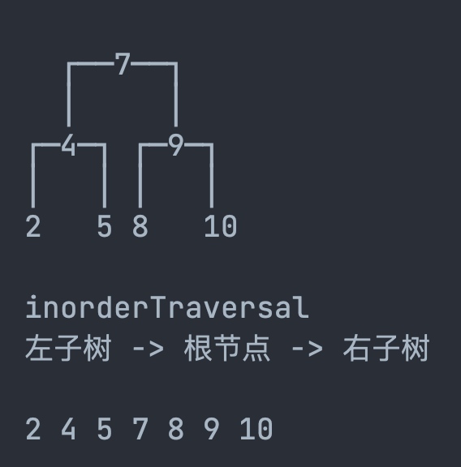

# Binary Tree

## 基本概念

### 常用术语

- 根节点（root node）：树的起点节点，通常记为`root`。
- 子节点和父节点：根节点以下的节点称为子节点，与子节点直接相连的节点称为其父节点。
- 叶子节点（leaf node）：没有子节点的节点。
- 边（edge）：连接两个节点的线段，即节点引用（指针）。
- 节点所在的层（level）：从顶至底递增，根节点所在层为 1 。
- 节点的度（degree）：节点的子节点的数量。在二叉树中，度的取值范围是 0、1、2 。
- 树的高度（height）：从根节点到叶子节点的最长边数。
- 节点的深度（depth）：从当前节点到跟节点的边数。
- 节点的高度（height）：从当前节点到叶子节点的最长边数。


### 二叉树的类型

- **二叉树（Binary tree）**：
  - 每个节点最多有两个子节点，分别称为左子节点和右子节点。
- **完美二叉树（Perfect binary tree）**：
  - 又称满二叉树。
  - 每个非叶子节点都有两个子节点，且所有叶子节点在同一层。即所有层的节点都被填满
- **完全二叉树（Complete binary tree）**：
  - 除最后一层外，其他层的节点都被完全填满，且最后一层的节点靠左排列，中间不能有空缺。
- **完满二叉树（Full binary tree）**：
  - 又称严格二叉树，真二叉树。
  - 每个节点要么没有子节点，要么有两个子节点。即所有节点的度都为0或2


- **二叉搜索树（Binary Search Tree）**：
  - 又称BST、二叉查找树。
  - 引入二分查找，将小于根节点的元素放在左子树，大于的放在右子树。具备高效查询，时间复杂度为 O(logn)。
  - 但是极端情况下，如果每次插入的数据都是最小或者都是最大的元素，那么树结构会退化成链表。时间复杂度为 O(n)
- **平衡二叉树（Balanced binary tree）**：
  - 又称AVL树。在二叉查找树的基础上加上限制，保证让每个节点的左右子树高度差不能超过 1，那么这样让可以让左右子树都保持平衡。
- **红黑树（Red-Black Tree）**：
  - 又称RBTree、RBT。也是自平衡二叉树中的一种，不过是非严格的平衡树。时间复杂度为 O(logn)
  - 不管自平衡树是平衡二叉查找树还是红黑树，每个节点只能有 2 个子节点，那么随着数据量增大的时候，节点个数越多，树高度也会增高（也就是树的深度越深），会导致IO的次数变多，影响查询效率，可以通过B树、B+树解决。

### 二叉树的遍历

根据节点访问顺序的不同，二叉树的常见遍历方式有 4 种：

- **前序遍历（Preorder Traversal）：根节点 -> 左子树 -> 右子树**
  - 应用：树状结构展示

- **中序遍历（Inorder Traversal）：左子树 -> 根节点 -> 右子树**
  - 应用：在二叉搜索树中，即所有节点有序的情况下，中序遍历 = 升序遍历 / 降序遍历。

- **后序遍历（Postorder Traversal）：左子树 -> 右子树 -> 根节点** 
  - 应用：使用一些先子后父的操作

- **层序遍历（Level Order Traversal）：逐层往下访问，从左到右（利用队列，逐一入队）**
  - 应用：计算二叉树的高度、判断一棵树是否为完全二叉树





## 树的基本结构 + add()

### 树节点的定义

```java
/**
 * 树节点 基本构造
 *
 * @param <E>
 */
public static class Node<E> {
    E element;
    Node<E> parent;
    Node<E> left;
    Node<E> right;

    public Node(E element, Node<E> parent) {
        this.element = element;
        this.parent = parent;
    }

    public boolean isLeaf(){
        return left == null && right == null;
    }

}
```

### 基本属性 + add()

```java
/**
 * @author XRZ
 */
public class BinarySearchTree<E> {

    private int size;      //节点数
    public Node<E> root;   //根节点
    private Comparator<E> comparator;
  
    /**
     * 新增节点
     * @param element
     */
    public void add(E element) {
        //======初始化
        if (root == null) {
            root = new Node<>(element, null);
            size++;
            return;
        }

        //======添加普通节点
        // 查找叶子节点位置，用于存储新节点
        Node<E> node = root;
        Node<E> parent = null;
        int cmp = 0;

        //遍历树，当到末尾的叶子节点时退出
        while (node != null) {
            parent = node;
            cmp = this.compare(element, node.element); //比较新元素大小
            if (cmp > 0) {    // 比当前节点元素大，找树的右节点
                node = node.right;
            } else if (cmp < 0) { // 比当前节点元素小，找树的左节点
                node = node.left;
            } else { // 相等的元素
                node.element = element; // 覆盖处理（可选）
                return;
            }
        }

        // 新增节点
        Node<E> newNode = new Node<>(element, parent);
        if (cmp > 0) {
            parent.right = newNode; // 比当前节点元素大，放置右边
        } else {
            parent.left = newNode;  // 比当前节点元素小，放置左边
        }
        size++;
    }

    public int size() {
        return size;
    }

    public boolean isEmpty() {
        return size == 0;
    }
  
     public BinarySearchTree() {
    }

    public BinarySearchTree(Comparator<E> comparator) {
        this.comparator = comparator; //指定比较器
    }
}
```

### 节点的比较

```java
/**
 * 比较给定元素大小，由节点类型自定义
 *
 * @param e1
 * @param e2
 * @return -1 = e1 < e2
 * 0 = e1 = e2
 * 1 = e1 > e2
 */
private int compare(E e1, E e2) {
    //优先使用比较器
    if (this.comparator != null)
        return comparator.compare(e1, e2);

    // 强制转换，软限制元素必须实现Comparable接口（强限制：BinarySearchTree<E extends Comparable<E>> ）
    Comparable icmp = (Comparable) e1;
    // 节点类型自定义比较规则
    return icmp.compareTo(e2);
}
```

## 树的遍历

### Visitor 访问器定义

 声明访问器，供节点实现自定义处理逻辑

```java
@FunctionalInterface
public interface Visitor<E> {
    void visit(E element);
}
```

### 前、中、后序遍历（递归实现）

```java

/**
 * 前序遍历（Preorder Traversal）：根节点 -> 左子树 -> 右子树
 * @param node
 */
public void preorderTraversal(Node<E> node, Visitor<E> visitor){
    if(node == null) return;
    visitor.visit(node.element); //使用元素
    preorderTraversal(node.left,visitor);
    preorderTraversal(node.right,visitor);
}

/**
 * 中序遍历（Inorder Traversal）：左子树 -> 根节点 -> 右子树
 * @param node
 */
public void inorderTraversal(Node<E> node, Visitor<E> visitor){
    if(node == null) return;
    inorderTraversal(node.left,visitor);
    visitor.visit(node.element); //使用元素
    inorderTraversal(node.right,visitor);
}

/**
 * 后序遍历（Postorder Traversal）：左子树 -> 右子树 -> 根节点
 * @param node
 */
public void postorderTraversal(Node<E> node, Visitor<E> visitor){
    if(node == null) return;
    postorderTraversal(node.left,visitor);
    postorderTraversal(node.right,visitor);
    visitor.visit(node.element); //使用元素
}
```

### 层序遍历（队列实现）

```java
/**
 * 层序遍历（Level Order Traversal）：逐层往下访问，从左到右（利用队列，逐一入队）
 *
 * @param node
 * @param visitor
 */
public void levelOrderTraversal(Node<E> node, Visitor<E> visitor) {
    Queue<Node<E>> queue = new LinkedList<>();
    queue.add(node);
    while (!queue.isEmpty()) {

        // 每层循环，取出节点
        Node<E> poll = queue.poll();
        visitor.visit(poll.element); //使用元素

        // 将子节点从左到右，按顺序放入队
        if (poll.left != null) {
            queue.add(poll.left);
        }
        if (poll.right != null) {
            queue.add(poll.right);
        }

    }
}
```

### 调用示例

```java
int[] nodes = {7,4,9,2,5,8,10};

BinarySearchTree<Integer> tree = new BinarySearchTree<>();

for (int node : nodes) {
 tree.add(node);
}

System.out.println("\n=========== preorderTraversal 根节点 -> 左子树 -> 右子树");
tree.preorderTraversal(tree.root,(e) -> System.out.print(e+" "));
System.out.println("\n=========== inorderTraversal 左子树 -> 根节点 -> 右子树");
tree.inorderTraversal(tree.root,(e) -> System.out.print(e+" "));
System.out.println("\n=========== postorderTraversal 左子树 -> 右子树 -> 根节点 ");
tree.postorderTraversal(tree.root,(e) -> System.out.print(e+" "));
System.out.println("\n=========== levelOrderTraversal 逐层往下访问，从左到右 ");
tree.levelOrderTraversal(tree.root,(e) -> System.out.print(e+" "));
```

### 强化遍历（支持终止遍历）

在上述基础遍历的功能上增加停止遍历的功能。

1. **Visitor改造，增加停止遍历的标识**

```java
public static abstract class Visitor<E>{

    boolean stop; //停止遍历的标识

    public abstract boolean visit(E element);
}
```

2. **层序遍历终止比较简单，直接return**

```java
public void levelOrderTraversal(Node<E> node, Visitor<E> visitor) {
    if (node == null) return;
    Queue<Node<E>> queue = new LinkedList<>();
    queue.add(node);
    while (!queue.isEmpty()) {

        // 每层循环，取出节点
        Node<E> poll = queue.poll();
        boolean stop = visitor.visit(poll.element);//使用元素
        if(stop) return; //停止遍历树

        // 将子节点从左到右，按顺序放入队
        if (poll.left != null) {
            queue.add(poll.left);
        }
        if (poll.right != null) {
            queue.add(poll.right);
        }

    }
}
```

3. **前、中、后序遍历需要双重校验**

```java
public void preorderTraversal(Node<E> node, Visitor<E> visitor) {
    if (node == null || visitor.stop) return;
    visitor.stop = visitor.visit(node.element); //使用元素

    this.preorderTraversal(node.left, visitor);
    this.preorderTraversal(node.right, visitor);
}

public void inorderTraversal(Node<E> node, Visitor<E> visitor) {
    if (node == null || visitor.stop) return;
    this.inorderTraversal(node.left, visitor);

    if(visitor.stop) return;  //双重校验
    visitor.stop = visitor.visit(node.element); //使用元素

    this.inorderTraversal(node.right, visitor);
}

public void postorderTraversal(Node<E> node, Visitor<E> visitor) {
    if (node == null || visitor.stop) return;
    postorderTraversal(node.left, visitor);
    postorderTraversal(node.right, visitor);

    if(visitor.stop) return;  //双重校验
    visitor.stop = visitor.visit(node.element); //使用元素
}
```

4. **调用示例**

```java
tree.preorderTraversal(tree.root, new BinarySearchTree.Visitor<Integer>(){
    @Override
    public boolean visit(Integer element) {
        System.out.print(element + "");
        if(element == 5) return true;
        return false;
    }
});
```

## 获取树的高度

### 递归实现

```java
public int height() {
    return height(this.root);
}

public int height(Node<E> node) {
    if (node == null) return 0;

    int left = this.height(node.left);
    int right = this.height(node.right);
    // 递归 寻找最深的子节点
    return 1 + Math.max(left, right);
}
```

### 迭代实现（基于层序遍历）

```java
public int heightByIteration(Node<E> node) {
    if (node == null) return 0;

    //====== 基于层序遍历实现
    Queue<Node<E>> queue = new LinkedList<>();
    queue.offer(node);

    int height = 0;  //高度
    int levelSize = queue.size(); //记录每一层的节点数量

    while (!queue.isEmpty()) {

        Node<E> poll = queue.poll();
        levelSize--;  // 每取出一个节点就 -1


        if (poll.left != null) queue.offer(poll.left);
        if (poll.right != null) queue.offer(poll.right);

        //当层节点在队列中出队完了，准备访问下一层
        if (levelSize == 0) {
            levelSize = queue.size(); //重置新的一层节点数
            height++;
        }

    }
    return height;
}

```

## 练习：判断是否为完全二叉树

判断是否为完全二叉树（通过层序遍历实现）

- 完全二叉树（Complete binary tree）：除最后一层外，其他层的节点都被完全填满，且最后一层的节点靠左排列，中间不能有空缺。

```java
public boolean isComplete(){
    Queue<Node<E>> queue = new LinkedList<>();
    queue.add(root);
    boolean leaf = false;

    while (! queue.isEmpty()) {
        Node<E> node = queue.poll();

        // 要求是叶节点，但是当前节点不是叶节点
        if(leaf && !node.isLeaf()) return false;

        if (node.left != null) {
            queue.add(node.left);
        }else if( node.right != null){
            return false;  // 左节点为空，右节点为空，不符合完全二叉树的定义
        }

        if (node.right != null) {
            queue.add(node.right);
        }else{
            leaf = true; // 右节点为空，要求后续所有节点都要为叶节点
        }

    }
    return true;
}
```

## 练习：翻转二叉树

遍历取出节点，将左右节点交换

- [leetcode原题](https://leetcode.cn/problems/invert-binary-tree/description/)

### 层序遍历实现

```java
public Node<E> invertTree(Node<E> root) {
    Queue<Node<E>> queue = new LinkedList<>();
    queue.add(root);
    while (!queue.isEmpty()) {
        Node<E> node = queue.poll();
        // 交换左右节点
        Node<E> temp = node.left;
        node.left = node.right;
        node.right = temp;

        if (node.left != null) queue.add(node.left);
        if (node.right != null) queue.add(node.right);
    }
    return root;
}
```

### 递归实现（前、中、后序遍历）

注意中序遍历时right节点的替换

```java
public Node<E> invertTreeByPreorderTraversal(Node<E> root) {
    if (root == null) return root;
    // 交换左右节点
    Node<E> temp = root.left;
    root.left = root.right;
    root.right = temp;

    this.invertTreeByPreorderTraversal(root.left);
    this.invertTreeByPreorderTraversal(root.right);
    return root;
}

public Node<E> invertTreeByPostorderTraversal(Node<E> root) {
    if (root == null) return root;
    this.invertTreeByPostorderTraversal(root.left);
    this.invertTreeByPostorderTraversal(root.right);

    // 交换左右节点
    Node<E> temp = root.left;
    root.left = root.right;
    root.right = temp;
    return root;
}

public Node<E> invertTreeByInorderTraversal(Node<E> root) {
    if (root == null) return root;
    this.invertTreeByInorderTraversal(root.left);
    // 交换左右节点
    Node<E> temp = root.left;
    root.left = root.right;
    root.right = temp;

    //注意此处 left 节点是已经被替换为 right 节点
    this.invertTreeByInorderTraversal(root.left);
    return root;
}
```

## 前驱节点 / 后继节点

**前驱节点定义：在中序遍历时的前一个节点**

- 如果是二叉搜索树，前驱节点就是前一个比它小的节点

**后驱节点定义：在中序遍历时的后一个节点**

- 如果是二叉搜索树，后驱节点就是后一个比它大的节点



> 7的前驱节点是5，后继节点是8。
>
> 8的前驱节点是7，后继节点是9。

### 获取前驱节点

```java
/**
 * 获取前驱节点（在中序遍历时的前一个节点）
 *
 * @param node
 * @return
 */
public Node<E> predecessor(Node<E> node) {

    // 左子树不为空时，前驱节点在左子树的最右节点中
    if (node.left != null) {
        node = node.left;

        while (node.right != null) { // 循环左子树的右节点，为空时则到最末尾
            node = node.right;
        }
        return node;
    }

    // 左子树为空时，从父节点、祖父节点中寻找前驱节点
    // node == node.parent.left表示一直往右上（↗）找。
    // 当不符合条件时，即向左上（↖）找了，说明到了顶层转折点，那么当前节的点就是前驱节点
    while (node.parent != null && node == node.parent.left) {
        node = node.parent;
    }

    //只有两种情况退出循环，node.parent就是前驱节点
    // node.parent == null
    // node == node.parent.right
    return node.parent;
}
```

### 获取后继节点

```java
/**
 * 获取后继节点（在中序遍历时的后一个节点）
 *
 * @param node
 * @return
 */
public Node<E> successor(Node<E> node) {
    // 右子树不为空时，后继节点在右子树的最左节点中
    if (node.right != null) {
        node = node.right;

        while (node.left != null) { // 循环右子树的左节点，为空时则到最末尾
            node = node.left;
        }
        return node;
    }

    // 右子树为空时，从父节点、祖父节点中寻找后继节点，寻找顶层转折点
    while (node.parent != null && node == node.parent.right) {
        node = node.parent;
    }

    return node.parent;
}
```

