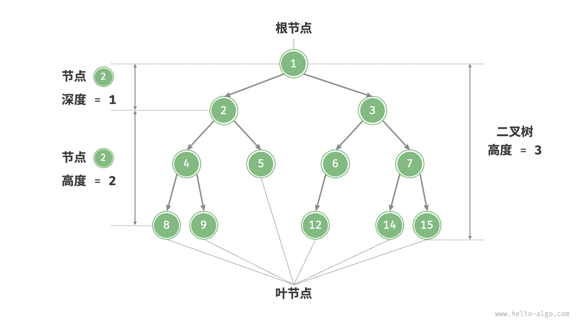

# Binary Tree

## 基本概念

### 常用术语

- 根节点（root node）：树的起点节点，通常记为`root`。
- 子节点和父节点：根节点以下的节点称为子节点，与子节点直接相连的节点称为其父节点。
- 叶子节点（leaf node）：没有子节点的节点。
- 边（edge）：连接两个节点的线段，即节点引用（指针）。
- 节点所在的层（level）：从顶至底递增，根节点所在层为 1 。
- 节点的度（degree）：节点的子节点的数量。在二叉树中，度的取值范围是 0、1、2 。
- 树的高度（height）：从根节点到叶子节点的最长边数。
- 节点的深度（depth）：从当前节点到跟节点的边数。
- 节点的高度（height）：从当前节点到叶子节点的最长边数。

### 二叉树的类型

- **二叉树（Binary tree）**：
  - 每个节点最多有两个子节点，分别称为左子节点和右子节点。

- **完美二叉树（Perfect binary tree）**：
  - 又称满二叉树。每个非叶子节点都有两个子节点，且所有叶子节点在同一层。
  - 即所有层的节点都被填满

- **完全二叉树（Complete binary tree）**：
  - 除最后一层外，其他层的节点都被完全填满，且最后一层的节点靠左排列。

- **完满二叉树（Full binary tree）**：
  - 又称严格二叉树，真二叉树。每个节点要么没有子节点，要么有两个子节点。
  - 即所有节点的度都为0或2

- **二叉搜索树（Binary Search Tree）**：
  - 又称BST、二叉查找树。
  - 引入二分查找，将小于根节点的元素放在左子树，大于的放在右子树。具备高效查询，时间复杂度为 O(logn)。
  - 但是极端情况下，如果每次插入的数据都是最小或者都是最大的元素，那么树结构会退化成链表。时间复杂度为 O(n)
- **平衡二叉树（Balanced binary tree）**：
  - 又称AVL树。在二叉查找树的基础上加上限制，保证让每个节点的左右子树高度差不能超过 1，那么这样让可以让左右子树都保持平衡。
- **红黑树（Red-Black Tree）**：
  - 又称RBTree、RBT。也是自平衡二叉树中的一种，不过是非严格的平衡树。时间复杂度为 O(logn)
  - 不管自平衡树是平衡二叉查找树还是红黑树，每个节点只能有 2 个子节点，那么随着数据量增大的时候，节点个数越多，树高度也会增高（也就是树的深度越深），会导致IO的次数变多，影响查询效率，可以通过B树、B+树解决。

## 代码实现

