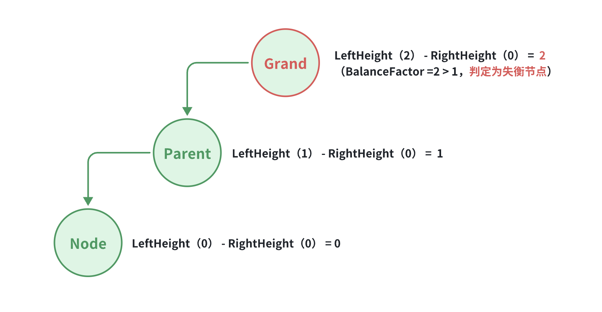
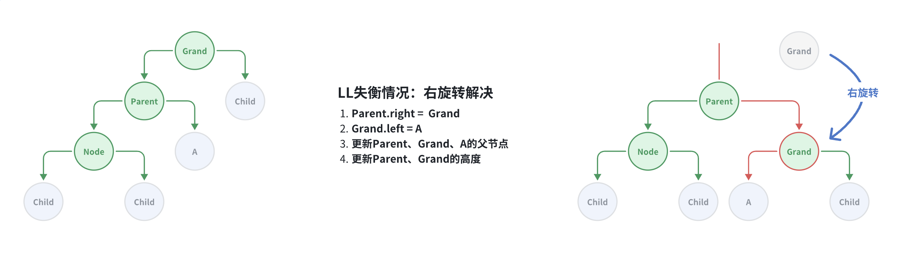
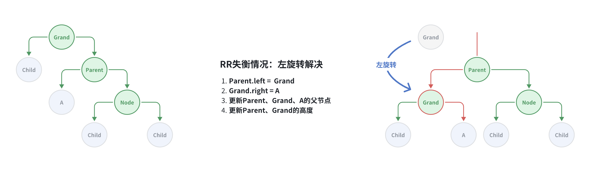
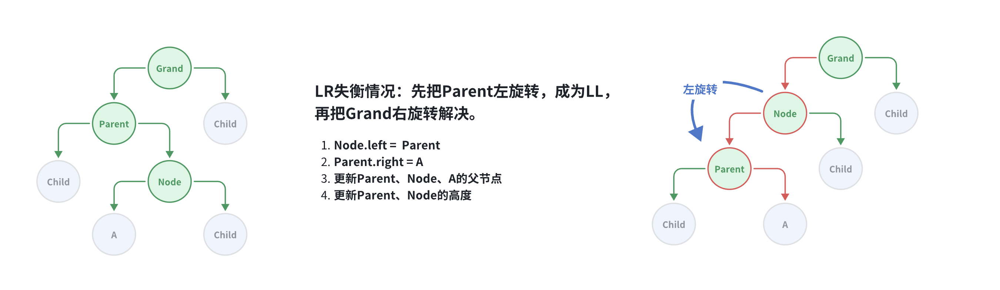
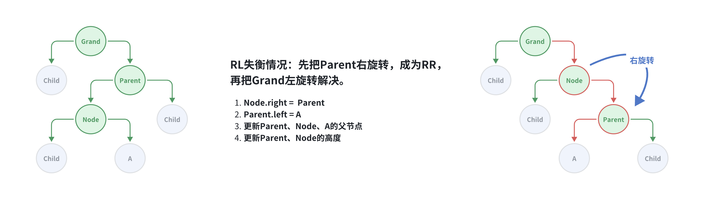

# Balanced Binary Search Tree

## 平衡二叉搜索树

**问题**：二叉搜索树在极端情况下，如果每次插入的数据都是最小或者都是最大的元素，那么树结构会退化成链表，二叉树时间复杂度也将从O(logn)退化为 O(n)。

**解决方案**：在节点的添加、删除操作之后，想办法让二叉搜索树恢复平衡（减小树的高度）——自平衡

**常见的平衡二叉搜索树**：AVL树、红黑树

## AVL Tree

AVL树（取名源自两位发明者的名字： G. M. **A**delson-**V**elsky 和 E. M. **L**andis ，苏联的科学家）

在二叉查找树的基础上加上限制，保证让每个节点的左右子树高度差不能超过 1，那么这样让可以让左右子树都保持平衡，使其时间复杂度保持为 O(logn)。

### 平衡因子（Balance Factor）

- 指某节点的左右子树的高度差（即节点左子树的高度减去右子树的高度）

- 每个节点的平衡因子只可能是 1、0、-1（绝对值 ≤ 1，如果超过 1，称之为 “失衡"）



### 失衡的四种情况

注意：Child节点可能为null节点。

- **LL = left - left**：Grand.left.left节点有添加，导致的失衡
- **RR = right - right**

Grand的最高子节点 = Parent，Parent的最高子节点  = Node，以下四种情况涵盖了所有失衡节点的情况。

#### LL失衡：右旋转



#### RR失衡：左旋转



#### LR失衡：先左旋转，再右旋转



转换为 LL 的情况之后，再按上方 LL 失衡情况处理。

#### RL失衡：先右旋转，再左旋转



转换为 RR 的情况之后，再按上方 RR 失衡情况处理。

## 代码实现

### Node节点的扩展

新增`isLeftChild`、`isRightChild`、`balancefactor`、`isBalanced`、`updateHight`、`tallerChild`方法，`height`属性

```java
/**
 *  树节点 基本构造
 * 
 * @author XRZ
 */
public class Node<E> {

    public E element;
    public Node<E> parent;  //AVL树、红黑树中使用
    public Node<E> left;
    public Node<E> right;

    public Node(E element, Node<E> parent) {
        this.element = element;
        this.parent = parent;
    }

    public boolean isLeaf() {
        return left == null && right == null;
    }

    public boolean hasTwoChildren() {
        return left != null && right != null;
    }

    public boolean isLeftChild(){
        return parent != null && this == parent.left;
    }

    public boolean isRightChild(){
        return parent != null && this == parent.right;
    }


    //===================【供AVL树使用】

    public int height; //节点高度

    /**
     * 平衡因子（Balance Factor）
     *      指某节点的左右子树的高度差（即节点左子树的高度减去右子树的高度）
     *      每个节点的平衡因子只可能是 1、0、-1（绝对值 ≤ 1，如果超过 1，称之为 “失衡"）
     *
     * @return
     */
    public int balancefactor(){
        int leftHeight = this.left == null ? 0 : this.left.height;
        int rightHeight = this.right == null ? 0 : this.right.height;
        return leftHeight - rightHeight;
    }

    /**
     * 判断是否为平衡节点（平衡因子绝对值不能超过1）
     *      绝对值：负数将会被转换为正数返回
     * @return
     */
    public boolean isBalanced(){
        return Math.abs(this.balancefactor()) <= 1;
    }

    /**
     * 更新当前节点高度
     */
    public void updateHight(){
        int leftHeight = this.left == null ? 0 : this.left.height;
        int rightHeight = this.right == null ? 0 : this.right.height;
        height = 1 + Math.max(leftHeight,rightHeight);
    }

    /**
     * 获取最高的子节点
     * @return
     */
    public Node<E> tallerChild(){
        int leftHeight = this.left == null ? 0 : this.left.height;
        int rightHeight = this.right == null ? 0 : this.right.height;

        if(leftHeight > rightHeight) return this.left;
        if(rightHeight > leftHeight) return this.right;

        // 相同高度时，返回相同方向的子节点
        return this.isLeftChild() ? this.left : this.right;
    }
}
```

### afterAdd()

添加节点之后调整，确保树的平衡。获取添加的节点，向上寻找其失衡的父节点。

找到第一个失衡的父节点（Grand节点）修复它，其余的父节点也就恢复了。

```java
/**
 * 添加节点之后调整，确保树的平衡
 * @param node
 */
public void afterAdd(Node<E> node){
    // 向上循环，寻找第一个失衡的父节点
    while((node = node.parent) != null){

        if(node.isBalanced()){
            //平衡节点，更新高度即可
            node.updateHight();
        }else{
            //失衡节点，需要重新恢复平衡
            this.rebalance(node);
            break; //第一个失衡的父节点恢复后，所有失衡的父节点也就恢复了，直接退出
        }
    }
}
```

#### 恢复平衡 rebalance()

```java

```

#### 右旋转 rotateRight()

```java
```

#### 左旋转 rotateLeft()

```java

```

### afterRemove()

删除之后失衡的处理 


## 参考

- https://onyfgwe19l.feishu.cn/docx/MIgjdurh8o0nINxG4nwcJx4MnVe
- https://www.hello-algo.com/chapter_tree/avl_tree/#__tabbed_4_1
- https://blog.csdn.net/weixin_43734095/article/details/104728663