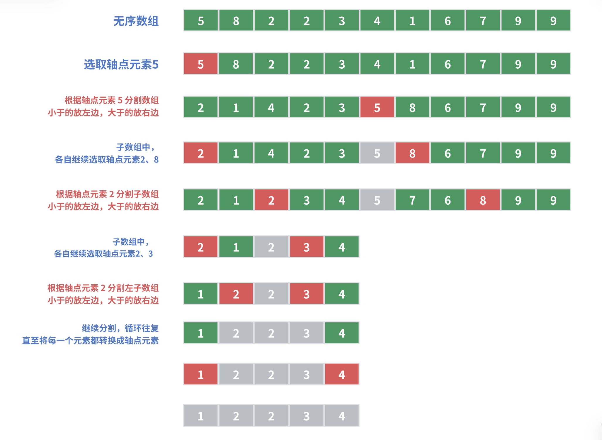
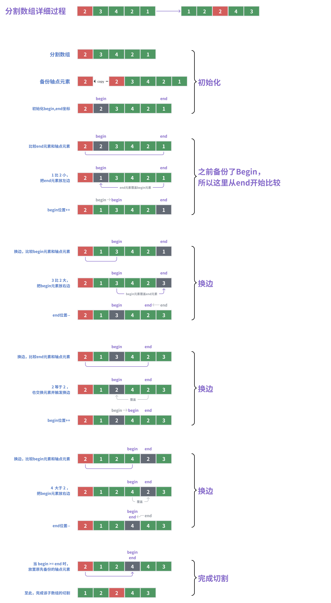

# Sort 排序算法

## Quick Sort 快速排序

快速排序（Quick Sort）是一种基于分治法的排序算法。

其基本思想是通过一个“轴点”元素（pivot）将待排序的数组分成两个子数组，分别对这两个子数组进行递归排序，从而达到整个数组有序。

### 大致步骤

1. 从数组中选择一个轴点元素（pivot）
   - 假设每次选择 0 位置的元素为轴点元素
2. 根据轴点元素将数组分割为两个子数组：小于的放左边，大于的放右边
   - 等于pivot的元素放哪边都可以
3. 对子数组进行1、2操作
   - 循环往复，直至将每一个元素都转换成轴点元素
   - 此时，数组即完成排序



### 分割数组详细过程

根据轴点元素将数组分割为两个子数组

- 放置规则：小于的放左边，大于的放右边

- 等于轴点元素的放哪边都可以，但是要触发换边（为了保证左右子数组长度的均衡）



### 轴点元素取值优化

优化轴点元素取值策略，防止极端情况

- 例如输入数组是完全倒序的：54321；如果默认取值 0号位置/begin位置 的元素为轴点元素，即5。
- 那么左小右大的规则，切割后的右子数组长度会为0，全部元素都被分配到左子数组上，分治策略变相失效。
- O(logn)效率会退化为O(n)，类似冒泡排序。

**解决方案：尽量保证轴点元素是当前数组中的中位值。**

- 传递当前数组 头、中、尾 三个元素的下标
- 选取其中的中位数作为轴点元素，降低极端情况发生的概率
  - 例如入参数组（54321）值中，会选取3作为轴点元素

### 代码实现

#### sort 递归排序

```java
/**
 * 快速排序（一种基于分治策略的排序算法）
 * @param arr
 * @param begin 对 [begin, end) 范围的元素进行快速排序
 * @param end
 */
private void sort(int[] arr,int begin,int end) {

    // 子数组长度为 1 时终止递归
    if(begin >= end) return;

    // 选取轴点元素，并切割数组
    // 根据轴点元素分割为两个子数组：小于的放左边，大于的放右边
    int pivotIndex = this.partition(arr,begin,end);

    // 继续分割，循环往复，直至将每一个元素都转换成轴点元素
    this.sort(arr,begin,pivotIndex -1);
    this.sort(arr,pivotIndex + 1,end);
}
```

#### partition 切割数组

```java
/**
 * 选取轴点元素，并切割数组
 * @param arr
 * @param begin
 * @param end
 * @return
 */
private int partition(int[] arr, int begin, int end) {

    // 默认选择begin位置为轴点元素，并备份
    int pivotIndex = this.smartBeginIndex(arr,begin,end);
    int pivotValue = arr[pivotIndex];


    // =========== 根据轴点元素分割为两个子数组：小于的放左边，大于的放右边
    while(begin < end){ // 遍历所有元素

        // =========== 逐一和轴点元素比较，从右边end开始（因为上方pivotValue备份的是begin位置的元素）
        while(begin < end){
            if(arr[end] > pivotValue){ // end元素 大于 pivot：即在正确的位置上，不需要触发交换，end--继续比较下一个元素即可
                end--;
            }else{
                // end元素 小于或者等于 pivot：触发交换，end元素需放置左边begin元素的位置上
                /**
                 * 原先begin位置的元素在上方已经被备份了，所以此处end元素可以覆盖begin位置的元素
                 **/
                this.swap(arr,begin,end);
                begin++; // 更新begin位置
                break;   // 并换边，从begin位置开始比较
            }
        }
        //换边
        while(begin < end){
            if(arr[begin] < pivotValue){
                begin++; //begin元素小于pivot，处于合适位置，继续比较下一个begin++元素
            }else{
                // begin元素 大于或者等于 pivot：触发交换，begin元素需放置右边end元素的位置上
                this.swap(arr,begin,end);
                end--;
                break; // 换边
            }
        }
    }

    // 遍历结束后，把轴点元素 放置 在begin/end的位置上
    arr[begin] = pivotValue;

    return begin; //返回轴点元素下标，begin/end都可以
}

private void swap(int[] arr, int begin, int end) {
    int temp = arr[begin];
    arr[begin] = arr[end];
    arr[end] = temp;
}
```

#### smartBeginIndex 轴点元素取值

```java
/**
 * 默认选择begin位置为轴点元素下标
 * - 优化轴点元素取值策略，防止极端情况（例如输入数组是完全倒序的）
 * @return
 */
private int smartBeginIndex(int[] arr, int begin, int end) {
//       return begin;
    /**
     * 例如输入数组是完全倒序的：54321
     * - 如果取值begin位置元素为轴点元素，即5。
     * - 那么切割后的右子数组长度会为0，全部元素都被分配到左子数组上，分治策略失效。
     * - O(logn)效率会退化为O(n)，类似冒泡排序。
     *
     * 解决方案：尽量保证轴点元素是当前数组中的中位值。
     * - 传递当前数组 头、中、尾 三个元素的下标
     * - 选取其中的中位数作为轴点元素，降低极端情况发生的概率
     */
    int midIndex = this.medianPivot(arr, begin, (begin + end) >> 1, end);
    // 注意将中位数交换至数组最左端，避免影响后续实现
    this.swap(arr,begin,midIndex);
    return begin;
}

/**
 * 取数组指定下标位置的中位值
 * @return index
 */
private int medianPivot(int[] arr, int begin,int mid,int end){
    int b = arr[begin], m = arr[mid], e = arr[end];
    if((m >= b && m <= e) || (m <= b && m >= e)) // 123、321
        return mid;    // m 在 b 和 e 之间
    if((b >= m && b <= e) || (m >= b && b >= e)) // 213、231
        return begin; // b 在 m 和 e 之间
    return end;
}
```


#### 完整代码实现

::: details QuickSort 完整代码实现

```java
package algorithm.sort;

import org.junit.Test;

/**
 * @author XRZ
 * @version 1.00
 * @Date 2025/2/22 11:19
 */
public class QuickSortTest {


    @Test
    public void test(){

        // https://blog.csdn.net/weixin_43734095/article/details/105156039

        int[] arr = {2,1,6,3,5,4,7,8,9,9,1};

        this.sort(arr,0,arr.length - 1);

        for (int i : arr) {
            System.out.println(i);
        }
    }

    /**
     * 快速排序（一种基于分治策略的排序算法）
     * @param arr
     * @param begin 对 [begin, end) 范围的元素进行快速排序
     * @param end
     */
    private void sort(int[] arr,int begin,int end) {

        // 子数组长度为 1 时终止递归
        if(begin >= end) return;

        // 选取轴点元素，并切割数组
        // 根据轴点元素分割为两个子数组：小于的放左边，大于的放右边
        int pivotIndex = this.partition(arr,begin,end);

        // 继续分割，循环往复，直至将每一个元素都转换成轴点元素
        this.sort(arr,begin,pivotIndex -1);
        this.sort(arr,pivotIndex + 1,end);
    }

    /**
     * 选取轴点元素，并切割数组
     * @param arr
     * @param begin
     * @param end
     * @return
     */
    private int partition(int[] arr, int begin, int end) {

        // 默认选择begin位置为轴点元素，并备份
        int pivotIndex = this.smartBeginIndex(arr,begin,end);
        int pivotValue = arr[pivotIndex];


        // =========== 根据轴点元素分割为两个子数组：小于的放左边，大于的放右边
        while(begin < end){ // 遍历所有元素

            // =========== 逐一和轴点元素比较，从右边end开始（因为上方pivotValue备份的是begin位置的元素）
            while(begin < end){
                if(arr[end] > pivotValue){ // end元素 大于 pivot：即在正确的位置上，不需要触发交换，end--继续比较下一个元素即可
                    end--;
                }else{
                    // end元素 小于或者等于 pivot：触发交换，end元素需放置左边begin元素的位置上
                    /**
                     * 原先begin位置的元素在上方已经被备份了，所以此处end元素可以覆盖begin位置的元素
                     **/
                    this.swap(arr,begin,end);
                    begin++; // 更新begin位置
                    break;   // 并换边，从begin位置开始比较
                }
            }
            //换边
            while(begin < end){
                if(arr[begin] < pivotValue){
                    begin++; //begin元素小于pivot，处于合适位置，继续比较下一个begin++元素
                }else{
                    // begin元素 大于或者等于 pivot：触发交换，begin元素需放置右边end元素的位置上
                    this.swap(arr,begin,end);
                    end--;
                    break; // 换边
                }
            }
        }

        // 遍历结束后，把轴点元素 放置 在begin/end的位置上
        arr[begin] = pivotValue;

        return begin; //返回轴点元素下标，begin/end都可以
    }

    private void swap(int[] arr, int begin, int end) {
        int temp = arr[begin];
        arr[begin] = arr[end];
        arr[end] = temp;
    }

    /**
     * 默认选择begin位置为轴点元素下标
     * - 优化轴点元素取值策略，防止极端情况（例如输入数组是完全倒序的）
     * @return
     */
    private int smartBeginIndex(int[] arr, int begin, int end) {
//       return begin;
        /**
         * 例如输入数组是完全倒序的：54321
         * - 如果取值begin位置元素为轴点元素，即5。
         * - 那么切割后的右子数组长度会为0，全部元素都被分配到左子数组上，分治策略失效。
         * - O(logn)效率会退化为O(n)，类似冒泡排序。
         *
         * 解决方案：尽量保证轴点元素是当前数组中的中位值。
         * - 传递当前数组 头、中、尾 三个元素的下标
         * - 选取其中的中位数作为轴点元素，降低极端情况发生的概率
         */
        int midIndex = this.medianPivot(arr, begin, (begin + end) >> 1, end);
        // 注意将中位数交换至数组最左端，避免影响后续实现
        this.swap(arr,begin,midIndex);
        return begin;
    }

    /**
     * 取数组指定下标位置的中位值
     * @return index
     */
    private int medianPivot(int[] arr, int begin,int mid,int end){
        int b = arr[begin], m = arr[mid], e = arr[end];
        if((m >= b && m <= e) || (m <= b && m >= e)) // 123、321
            return mid;    // m 在 b 和 e 之间
        if((b >= m && b <= e) || (m >= b && b >= e)) // 213、231
            return begin; // b 在 m 和 e 之间
        return end;
    }

}

```

:::

## 其它排序

### 冒泡排序

#### 视频动画演示

https://www.douyin.com/user/self?from_tab_name=main&modal_id=7368479698277436711

#### 代码实现

```java
// XRZ-TODO 冒泡排序：选择最大的数往后排
void bubbleSortFromLeft(int[] arr) {
    int length = arr.length;

    //外循环：倒序循环，选择最大的数往后排（冒泡）
    // i > 0;  头尾都可预留一位，无需比较（内循环会覆盖到）
    for (int i = length - 1; i > 0; i--) { // 从右往左

        //截止条件中：j不能等于i,要给下方[j+1]预留一位
        for (int j = 0; j < i; j++) {

            //内循环：逐一比较相邻的两个元素，将最大的数往后排
            if(arr[j] > arr[j +1]){
                swap(arr, j, j +1);
            }
        }
    }

}

/**
 * 使用异或运算符交换arr中的a和b
 * @param arr
 * @param a
 * @param b
 */
void swap(int[] arr, int a,int b){
    arr[a] = arr[a] ^ arr[b];
    arr[b] = arr[a] ^ arr[b]; // arr[a] = a ^ b
    arr[a] = arr[a] ^ arr[b];
}
```

#### 代码实现（标志优化）

```java

/* 冒泡排序（标志优化） */
void bubbleSortWithFlag2(int[] nums) {
    // 外循环：未排序区间为 [0, i]
    for (int i = nums.length - 1; i > 0; i--) {
        boolean flag = false; // 初始化标志位
        // 内循环：将未排序区间 [0, i] 中的最大元素交换至该区间的最右端
        for (int j = 0; j < i; j++) {
            if (nums[j] > nums[j + 1]) {
                // 交换 nums[j] 与 nums[j + 1]
                int tmp = nums[j];
                nums[j] = nums[j + 1];
                nums[j + 1] = tmp;
                flag = true; // 记录交换元素
            }
        }
        if (!flag)
            break; // 此轮“冒泡”未交换任何元素，直接跳出
    }

    // {1,2,3,5,6,7,10,9,8} 这种情况下，在外循环i=7时就会跳出循环，返回结果。
    // 如果内循环一次都没有触发交换，则说明已经是有序的了，无需再替换。
    // 使用break跳出循环，减少不必要的比较。
}

```


### 插入排序

#### 视频动画演示

https://www.douyin.com/user/self?from_tab_name=main&modal_id=7368040191535189287

#### 代码实现

```java
// XRZ-TODO 插入排序：假设0号位有序，从1号位开始，把未排序的值（从左到右）逐一比较 插入到已排序的区间。(类似整理扑克牌)
void insertionSortFromLeft(int[] arr) {
    int length = arr.length;

    //外循环，从左到右，循环未排序的区间
    // i 表示待比较的数（未排序的值）
    // 头尾都可预留一位
    //      0号位假设有序，无需比较，所以从1开始
    //      i不能等于length,要给下方arr[j+1]预留一位
    for (int i = 1; i < length; i++) {

        //内循环，从右到左，循环比较已排序的区间
        // j >= 0 是为了触发0号位和1号位的比较
        for (int j = i-1; j >= 0; j--) {

            // 逐一比较最小值，把最小值往左插
            // arr[j]   = 已排序的值
            // arr[j+1] = 未排序的值
            if(arr[j] > arr[j+1]){
                swap(arr,j,j+1);
            }
        }
    }

}
```

### 选择排序

#### 代码实现

```java
// XRZ-TODO 选择排序：选择最小的数 往左边排
void selectSortFromLeft(int[] arr) {
    int length = arr.length;

    // 外循环，循环未排序区间
    // i < length - 1 此处最后一次不需要比较了，应为上一次的j循环已经比较过了
    for (int i = 0; i < length - 1; i++) {

        //记录最小值下标，假设0是最小值
        int minIndex = i;

        // 从1开始比较。每次循环未排序区间 寻找最小值放至 左边已排序区
        for (int j = i + 1; j < length; j++) {

            //内循环寻找最小值
            if(arr[j] < arr[minIndex]){
                // 更新最小值下标
                minIndex = j;
            }
            swap(arr,i,minIndex);
        }
    }
}

void swap(int[] arr, int a,int b){
    int t = arr[a];
    arr[a] = arr[b];
    arr[b] = t;
}
```

## 参考

- https://blog.csdn.net/weixin_43734095/article/details/105156039
- https://www.hello-algo.com/chapter_sorting/bubble_sort/
