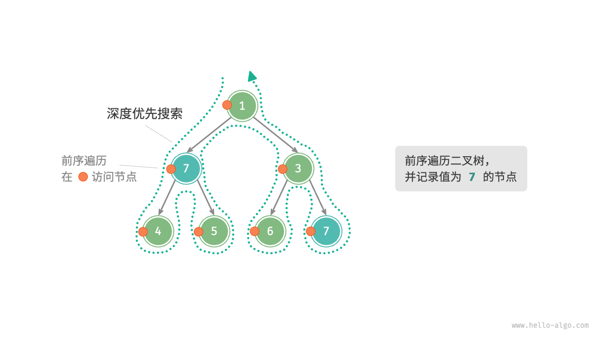
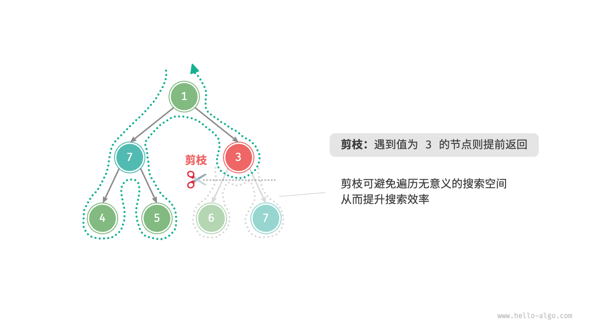
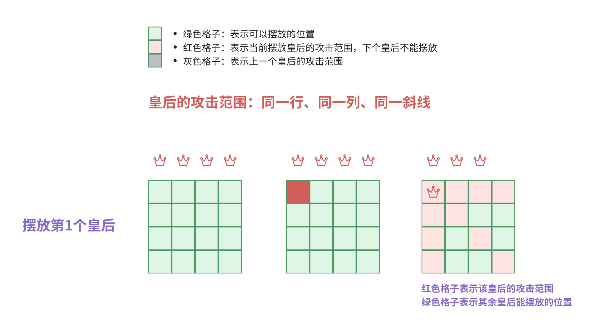
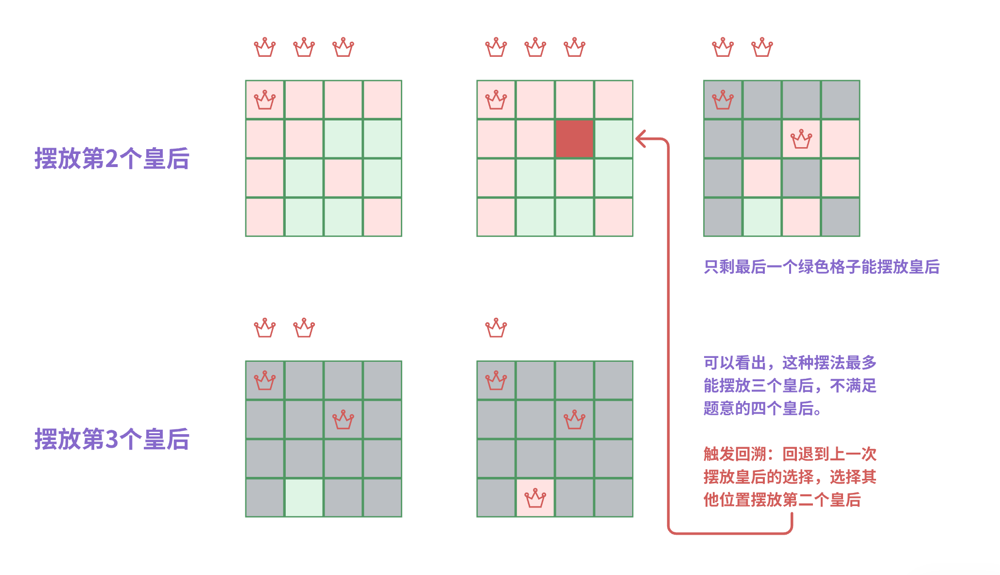
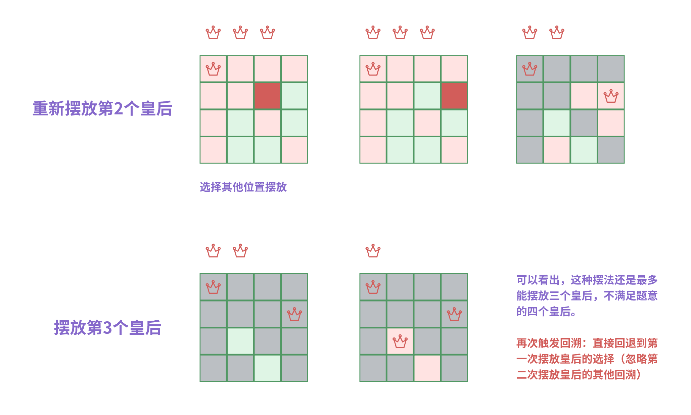
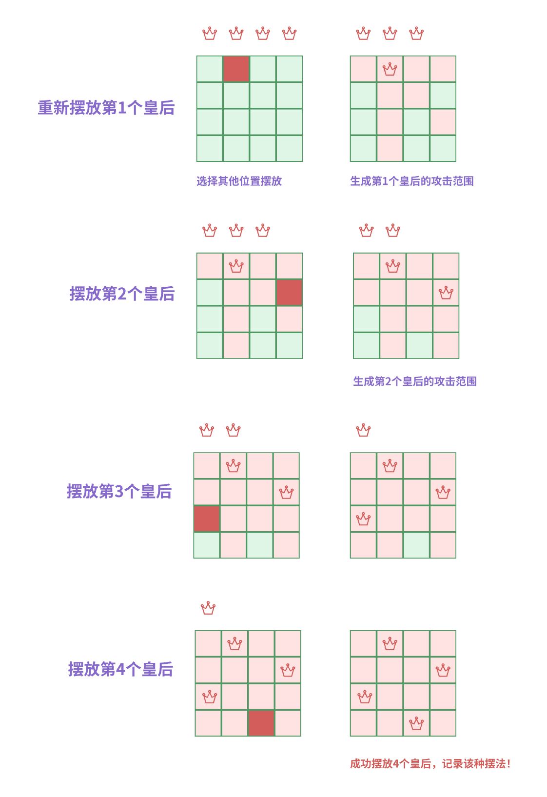
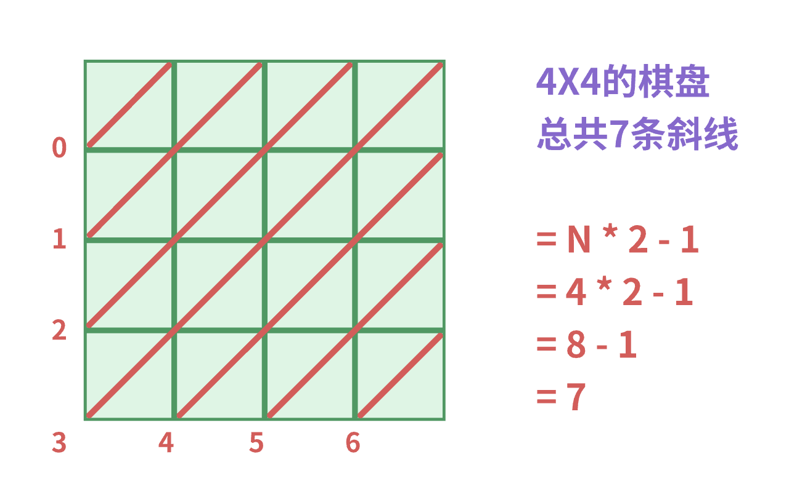
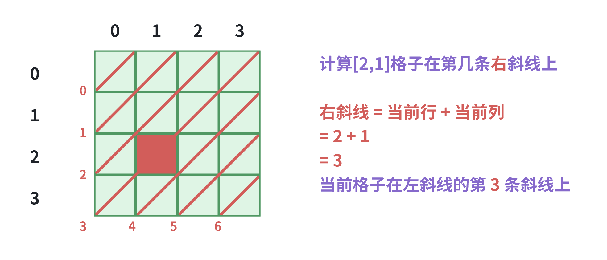
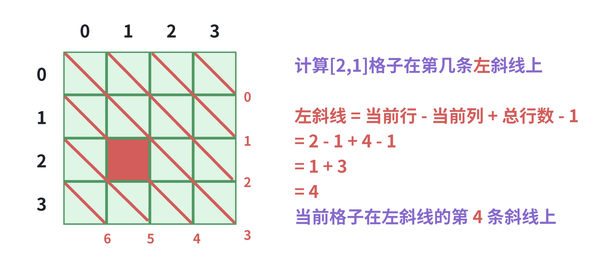
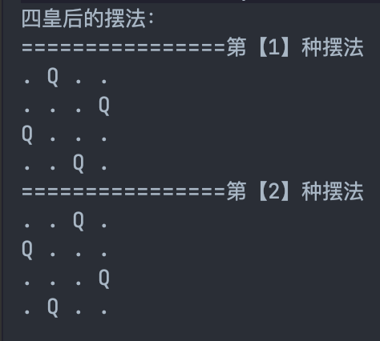

# Back Tracking 回溯

## 核心概念

### 回溯（Back Tracking）

回溯可以简单理解为：通过选择不同的岔路口来通往目的地（找到想要的结果）

- 每一步都选择一条路出发，能进则进，不能进则退回上一步（回溯），换一条路再试

**树的前序遍历**、**图的深度优先搜索（DFS）**、**八皇后**、**走迷宫**都是典型的回溯应用。



### 剪枝（pruning）

复杂的回溯问题通常包含一个或多个约束条件，约束条件通常可用于“剪枝”。

“剪枝”是一个非常形象的名词。在搜索过程中，可以“剪掉”不满足约束条件的搜索分支，避免许多无意义的尝试，从而提高搜索效率。

- 例如，在上图的搜索动作中增加一个条件：**要求路径中不包含值为 3 的节点**



### 八皇后（Eight Queens）

> 八皇后问题是一个古老而著名的问题
>
> - **在8x8格的国际象棋上摆放八个皇后，使其不能互相攻击：任意两个皇后都不能处于同一行、同一列、同一斜线上。**
>
> 请问有多少种摆法？

#### 四皇后

为方便理解，缩小数据规模，把八皇后改为四皇后：4X4的棋盘上，摆放4个皇后。




#### 摆放第2个皇后

在绿色格子中选择摆放第二个皇后，并生成对应的攻击范围。



可以看出，这种摆法无论怎么摆，最多能摆放三个皇后，不满足题意的四个皇后。

- 触发回溯：回退到上一次摆放皇后的选择，选择其他位置摆放第二个皇后




#### 重新摆放第1个皇后

重新选择第二个皇后的位置后发现，无论后续怎么摆，依旧只能最多只能摆三个皇后

- 继续回溯，回退到第一次摆放皇后，重新选择第一次摆放皇后的位置




可以看出，这种摆法成功在 4x4 的棋盘上摆放了四个皇后，满足题意，记录该种摆法！

## 代码实现

### 棋盘斜线概念

实现前先来了解一下斜线的概念：皇后的攻击范围除了同一行、同一列上，还有同一斜线（又区分为左斜线、右斜线）

- 同一行、同一列就是对应的行号、列号，那么对应斜线呢？
- 如图所示：4x4 的棋盘总共有7条斜线
- **得出斜线条数计算公式：`(n << 1) - 1`**




**计算出了斜线条数后，如何计算当前位置是在棋盘上的第几条斜线呢？**

- 皇后的攻击范围除了上下左右，还包含对角斜线，所以需要判断当前位置在几条斜线上？
- 进一步再判断当前位置的斜线上有没有皇后？如果有，则当前格子位置不能摆放皇后，继续判断下一个格子。

**示例：计算当前位置`[2,1]`在棋盘的第几条==右==斜线**

- 计算公式：`当前行 + 当前列`



**示例：计算当前位置`[2,1]`在棋盘的第几条==左==斜线**

- 计算公式：`当前行 + 当前列 + 总行数 - 1`



### 完整代码实现

  不管是四皇后还是八皇后，在代码中我们直接抽象为N，即入参为N皇后

```java
@Test
public void test(){
  System.out.println("四皇后的摆法："+new EightQueensTest().placeQueens(4));
  System.out.println("八皇后的摆法："+new EightQueensTest().placeQueens(8));
}

public int placeQueens(int n){
    if(n < 1) return 0;

    /**
     * 初始化变量
     * - 8皇后的话就是8X8的棋盘，皇后最多放置8列，N皇后就是N列。
     * - 位运算：(n << 1) 左位移一位 = N * 2
     * - 斜线的条数 = N * 2 - 1，即如果是 8X8 的棋盘，共有15条斜线。
     */
    cols     = new boolean[n];
    leftTop  = new boolean[(n << 1) - 1];
    rightTop = new boolean[(n << 1) - 1];

    // 开始摆放皇后，从0行位置开始摆放
    this.place(0);

    return ways;
}

boolean[] cols;     //记录每列是否有皇后：cols[1] = ture 表示第2列有皇后了
boolean[] leftTop;  //记录每条斜线是否有皇后（左斜线）[ ↘ ]
boolean[] rightTop; //记录每条斜线是否有皇后（右斜线）[ ↙ ]
int ways = 0;       //记录摆放的次数

public void place(int row){
    //=== 终止递归条件：每种摆法最少摆N个皇后（cols.length = n）
    if(row == cols.length){
        // 表示每行都摆了一个皇后（满足题意）
        // 例：8皇后即8行8列，如果摆到第8行（实际下标为7），则表示该种摆法满足题意
        ways++;
        return;
    }

    //=== 循环每一列，尝试所有摆法
    for (int i = 0 ; i < cols.length; i++){

        //=== 剪枝：判断当前格子是否可以摆放皇后

        // 判断当前i列是否有皇后（每列只能放一个皇后）
        if(cols[i]) continue; // 第i列已经有皇后

        // 判断当前位置左右斜线是否有皇后
        /**
         * 先计算当前格子在第几条斜线上
         *
         * 左斜线 = 当前行 - 当前列 + 总行数 - 1
         * 右斜线 = 当前行 + 当前列
         */
        int leftIndex = row - i + cols.length - 1;
        int rightIndex = row + i;
        if(leftTop[leftIndex]) continue;  //当前格子的左斜线有皇后
        if(rightTop[rightIndex]) continue;//当前格子的右斜线有皇后

        //=== 可以摆放，放置皇后，记录位置
        cols[i] = leftTop[leftIndex] = rightTop[rightIndex] = true;

        //=== 递归下一行（每行只能放一个皇后）
        place(row + 1);

        //=== 触发回溯：每一次 i++ 就是回溯操作
        // 回溯后需要清空记录，还原皇后
        cols[i] = leftTop[leftIndex] = rightTop[rightIndex] = false;
    }
}

```

### 改造：打印出皇后位置

增加`queens`属性和`print()`方法

```java
int[] queens;           //记录每行每列皇后的位置（用于打印）
public void placeQueensPrint(int n){
    if(n < 1) return;
    queens   = new int[n];
    cols     = new boolean[n];
    leftTop  = new boolean[(n << 1) - 1];
    rightTop = new boolean[(n << 1) - 1];
    this.placePrint(0);
}

public void placePrint(int row){
    if(row == cols.length){
        ways++;
        this.print(); // 打印当前摆法
        return;
    }
    for (int i = 0 ; i < cols.length; i++){
        if(cols[i]) continue;
        int leftIndex = row - i + cols.length - 1;
        int rightIndex = row + i;
        if(leftTop[leftIndex]) continue;
        if(rightTop[rightIndex]) continue;

        queens[row] = i; //记录 row 行皇后的位置在 i
        cols[i] = leftTop[leftIndex] = rightTop[rightIndex] = true;
        placePrint(row + 1);
        cols[i] = leftTop[leftIndex] = rightTop[rightIndex] = false;
    }
}

private void print() {
    System.out.println("================第【"+ways+"】种摆法");
    for (int row = 0; row < cols.length; row++){
        for (int col = 0; col < cols.length; col++){
            if(queens[row] == col){ // 遍历所有格子，皇后位置打印Q
                System.out.print("Q ");
            }else{
                System.out.print(". ");
            }
        }
        System.out.println();
    }
}
```

效果如下：



## 参考

- **LeetCode题目参考**
  - [51. N 皇后](https://leetcode.cn/problems/n-queens/)
  - [52. N 皇后 II](https://leetcode.cn/problems/n-queens-ii/)

- https://www.hello-algo.com/chapter_backtracking/backtracking_algorithm/
- https://blog.csdn.net/weixin_43734095/article/details/105567135

