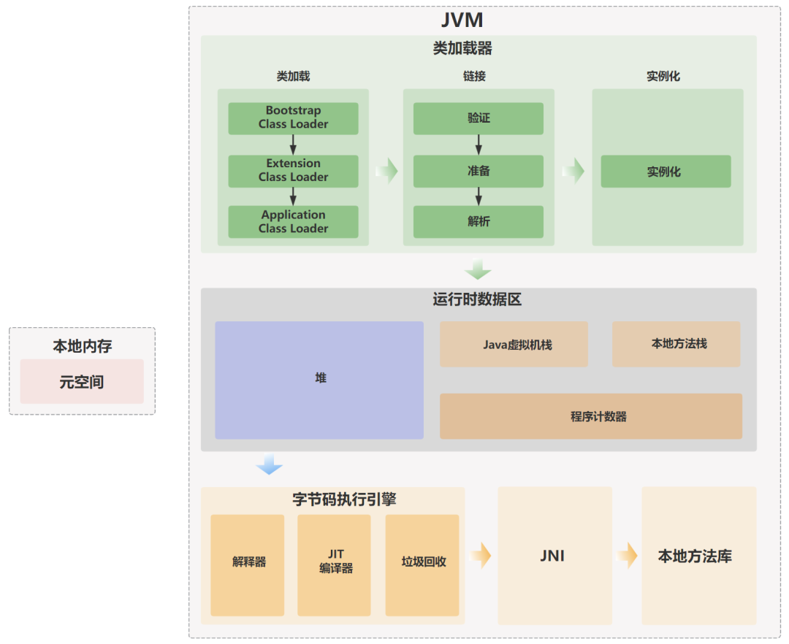
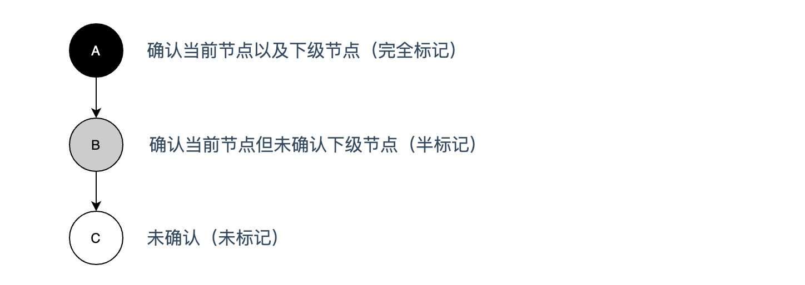
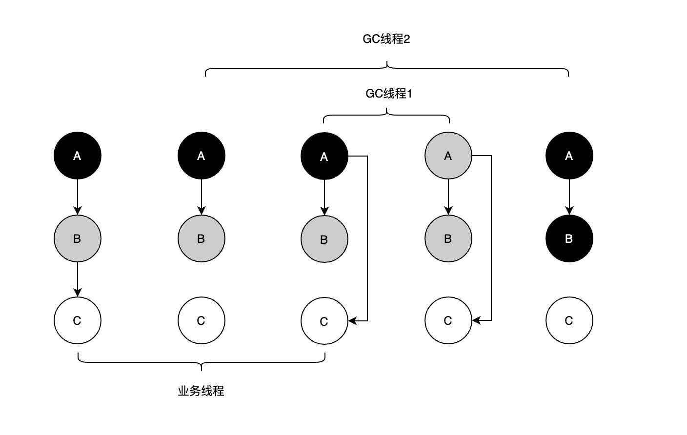
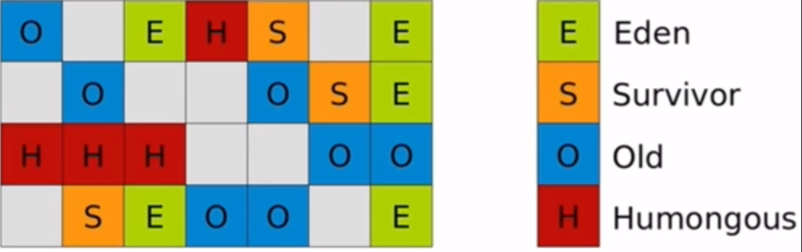
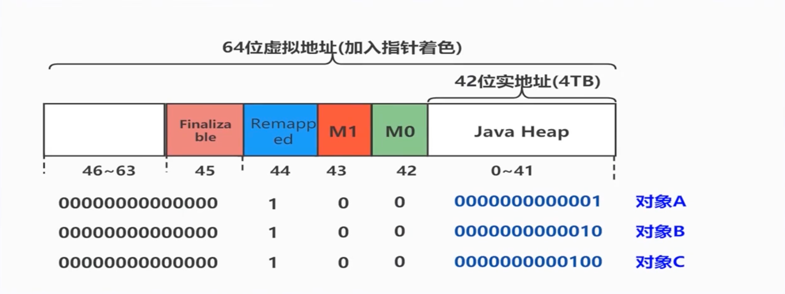

# JVM的内存管理

## 不同语言的内存管理方式

### C、C++

手工管理内存

- 容易忘记释放内存——产生内存泄漏，最终导致内存溢出
- 释放多次
- 开发效率低，运行效率高

### Java、Python、Go

GC（Garbage Collector）管理内存

- 开发效率高，运行效率相对低
- 使用门槛低

### Rust

无需管理内存（栈帧推出时自动清理）

- 运行效率高，使用门槛高

> 所有权（ownership）：同一时刻只有一个变量指向一个对象
>
> 共享变量： 使用独特的写法处理并发的问题

## JVM

>JVM，也就是 Java 虚拟机，它是 Java 实现跨平台的基石。
>
>Java 程序运行的时候，编译器会将 Java 源代码（.java）编译成平台无关的 Java 字节码文件（.class），接下来对应平台的 JVM 会对字节码文件进行解释，翻译成对应平台的机器指令并运行。

JVM 大致可以划分为三个部分：类加载器、运行时数据区和执行引擎。

- 类加载器：负责从文件系统、网络或其他来源加载 Class 文件，将 Class 文件中的二进制数据读入到内存当中，以便被程序调用。
- 运行时数据区：JVM 在执行 Java 程序时，需要在内存中分配空间来处理各种数据，这些内存区域主要包括方法区、堆、栈、程序计数器和本地方法栈。
- 执行引擎：负责执行字节码，并对字节码进行优化，并通过GC来清理垃圾。

## JVM的类加载机制

>JVM 的操作对象是 Class 文件，JVM 把 Class 文件中描述类的数据结构加载到内存中，并对数据进行校验、解析和初始化，最终形成可以被 JVM 直接使用的类型，这个过程被称为类加载机制。

其中最重要的三个概念就是：类加载器、类加载过程和类加载器的双亲委派模型。

- 类加载器：负责加载类文件，将类文件加载到内存中，生成 Class 对象。
  - 启动类加载器：比如Bootstrap ClassLoader，负责加载<JAVA_HOME>\lib目录，或者被-Xbootclasspath参数制定的路径，例如jre/lib/rt.jar里所有的class文件。同时，启动类加载器是无法被 Java 程序直接引用的
  - 拓展类加载器：比如Extension ClassLoader，负责加载 Java 平台中扩展功能的一些 jar 包，包括<JAVA_HOME>\lib\ext目录中或java.ext.dirs指定目录下的 jar 包。同时，开发者可以直接使用扩展类加载器
  - 应用程序类加载器：比如Application ClassLoader，负责加载ClassPath路径下所有 jar 包，如果应用程序中没有自定义过自己的类加载器，一般情况下它就是程序中默认的类加载器

- 类加载过程：加载、验证、准备、解析和初始化。
- 双亲委派模型：类加载器在加载类时，都会先让其父类进行加载，只有父类无法加载（或者没有父类）的情况下，才尝试自己加载。
  - 保证 Java 核心类库的类型安全
  - 避免类的重复加载

## JVM的运行时数据区

> JVM 在执行 Java 程序时，需要在内存中分配空间来处理各种数据，这些内存区域主要包括方法区、堆、栈、程序计数器和本地方法栈。其中方法区和堆是线程共享的，虚拟机栈、本地方法栈和程序计数器是线程私有的。

- Java 虚拟机栈（Java Virtual Machine Stacks）
  - 用来执行Java方法的
  - 每个线程都会创建一个栈，执行每一个方法时都会创建一个栈帧
  - 每个栈帧都会存储局部变量表、操作数栈、动态链接、方法出口等信息

- 本地方法栈（Native Method Stack）
  - 用来执行非Java代码比如C/C++的native方法

- 程序计数器（Program Counter Register）
  - 记录当前字节码的执行行号

- 堆（Heap）
  - 存储对象信息，具体模式由GC决定

- 方法区（Method Area）/元空间（Metaspace）
  - 存储类信息、常量、静态变量、即时编译后的代码等。
  - 方法区是 Java 虚拟机规范上的一个逻辑区域，在不同的 JDK 版本上有着不同的实现。在 JDK 7 的时候，方法区被称为永久代，而在 JDK 8 的时候，永久代被彻底移除，取而代之的是元空间。
    - 移除的原因：永久代存在内存限制和管理难题，特别是在使用大量动态生成类的应用（如运行时代理、动态生成类框架等）中，容易引发OutOfMemoryError。
  - 元空间使用的是本地内存（即不再受限于JVM堆内存的大小），可以根据需求动态增长，这减少了内存管理上的限制。
    - 可以通过-XX:MetaspaceSize和-XX:MaxMetaspaceSize来设置元空间的初始大小和最大大小。

## 垃圾回收器 GC（Garbage Collector）

> 垃圾：没有任何引用指向的对象（包括循环引用）

### 对象的引用类型

- 强引用（Strong Reference）：GC不会回收
  - 强引用是 Java 中最常见的引用类型。
  - 使用 new 关键字赋值的引用就是强引用，只要强引用关联着对象，垃圾收集器就不会回收这部分对象。
- 软引用（Soft Reference）：内存不足时GC才回收
  - 软引用是一种相对较弱的引用类型，可以通过 SoftReference 类实现。软引用对象在内存不足时才会被回收。
- 弱引用（Weak Reference）：只要GC就会回收
  - 弱引用可以通过 WeakReference 类实现。
  - 弱引用对象在下一次垃圾回收时会被回收，不论内存是否充足。
- 虚引用（Phantom Reference）：只要GC就会回收
  - 虚引用可以通过 PhantomReference 类实现。
  - 虚引用对象在任何时候都可能被回收。主要用于跟踪对象被垃圾回收的状态，可以用于管理直接内存。

### 查找垃圾算法

- 引用计数法（Reference Counting Algorithm）
  - 每个对象有一个引用计数器，记录该对象被引用的次数。当一个对象的引用计数为 0 时，表示该对象不再被引用，可以进行回收。
  - 循环引用问题：如果两个对象互相引用，引用计数永远不会为 0，导致无法回收。

- 根可达算法
  - 通过一系列名为GC Roots的对象作为起始点，从这些节点开始向下搜索，搜索所走过的路径称为引用链，当一个对象到GC Roots没有任何引用链相连时（对象不可达），则定位为垃圾
  - GC Roots对象
    - 虚拟机栈中引入的对象（局部变量）
    - 方法区中的类静态属性引用的对象（静态变量 static）
    - 方法区中常量引用的对象（常量 final）
    - 本地方法栈中JNI(native方法)引用的对象
    - 正在运行的线程

### 清除垃圾算法

- **标记-清除算法（Mark-Sweep）**
  - 标记：从根集合出发，遍历所有可达对象，并标记它们为“存活”。清除：遍历堆中未标记的对象，进行回收。
    - 缺点：效率低、位置不连续，产生碎片

- **复制算法（Copying Algorithm）**
  - 将内存分成两部分，每次只使用其中一部分。当内存用尽GC时，将存活的对象复制到另一块区域，剩余的对象则被回收。
    - 优点：无碎片问题（回收时会对存活对象进行紧凑排列）、回收效率高
    - 缺点：内存空间需要划分成两块，浪费了一部分内存。
- **标记-整理算法（Mark-Compact）**
  - 标记阶段：与标记-清除算法一样，标记存活对象。整理阶段：将所有存活的对象移动到内存的一端，压缩剩余的空闲内存。
    - 优点：解决了内存碎片问题，压缩后内存连续分配更高效，空间利用率高。
    - 缺点：移动对象的操作开销较大，影响性能。
- **分代回收（Generational Garbage Collection）**

  - JVM 的垃圾回收器采用分代收集策略，将堆内存划分为新生代和老年代，并针对不同区域的对象生命周期特点使用不同的垃圾回收算法。

    -  新生代（Young Generation）：采用复制算法
    -  老年代（Old Generation）：采用标记-压缩算法

### 垃圾回收器

- 分代模型（将堆内存按比例划分为新生代、老年代等）
  - 串行回收器（单线程GC）
    - Serial 新生代
    - SerialOld 老年代
  - 并行回收器（多线程GC）
    - ParallelScavenge 新生代
    - ParallelOld 老年代
    - ParNew 新生代（提供给CMS使用） 
    - CMS老年代（采用标记-清除算法）
- 分区模型（将堆内存划分为多个大小一致的独立区域）
  - G1（一个Region内使用标记-清除算法，两个Region之间使用复制算法）
  - ZGC

> JDK1.8默认垃圾回收器为： `ParallelScavenge` + `ParallelOld`

## CMS (Concurrent Mark Sweep) 

此回收器在分代模型回收器中最大的区别是使用了并发GC，即业务线程和GC线程同时执行，以此进一步缩短 STW的时间，但同时也产品了致命的问题。

### GC运作阶段

1. **初始标记**（CMS initial mark）
   - 仅标记GC Roots能直接关联的对象
   - STW
  
2. **并发标记**（CMS concurrent mark）	
   - 使用三色标记算法进行并发标记
  
3. **重新标记**（CMS remark）

   - 重新标记在并发标记中产生变动的对象

   - STW

4. **并发清除**（CMS concurrent sweep）

   - 使用标记清除算法进行垃圾清理

### 三色标记算法

为了能让业务线程和GC线程并发执行，使用了三色标记算法，即在标记节点时添加一个状态，记录当前查找的进度

例：有三个对象A、B、C，A对象引用B，B对象引用C

#### 问题一（浮动垃圾）

例：当A、B、C三个节点都已经被GC线程完全标记的情况下，业务线程把B到C的引用删除了，按照根可达算法此时C就是垃圾，但是在三色标记它确是完全标记的状态，这种节点称之为浮动垃圾

> 解决方案：下次GC时处理，并且提前GC，预留空间存放浮动垃圾
>

#### 问题二（漏标）

例：A（黑）、B（灰）、C（白）三个节点，业务线程把B到C的引用删除了，同时增加了A到C的引用，此时C是存在引用关系的，但是上级节点A已经是完全标记的状态，GC线程不会再扫描A的下级节点了，导致C即使存在引用，也会被当成垃圾清理，这种情况称之为漏标

> 解决方案：Incremental Update增量更新方案，即GC线程检测A增加引用C时，将A置为半标记状态（灰色），后续GC线程即可扫描下级节点

#### 问题三（Incremental Update的问题）

Incremental Update新增引用时将该节点置为半标记状态（灰色）在单线程是没有问题的，但是CMS除了是GC线程和业务线程并发执行外还是多线程GC

例：还是A（黑）、B（灰）、C（白）三个节点，业务线程把B到C的引用删除了，同时增加了A到C的引用，GC线程1检测到A增加了引用则将A置为半标记状态（灰色），此时上下文切换GC线程2，GC线程2由A扫描到B，GC线程2是在GC线程1执行之前就开始，只知道A节点只有一个B的子节点需要扫描，而且并不知道GC线程1将A置为半标记状态（灰色），GC线程2扫描完B之后则将A置为完全标记状态（黑色），此时C节点还是漏标了

>解决方案：记录并发标记中产生变动的对象，在重新标记时处理，从GCRoots重新扫描一遍这种类型的对象

### 并发清除

使用三色标记算法标记好后， 就需要清除垃圾，为了实现并发清除，只能选择使用`标记清除算法`，因为`标记整理算法`和`复制算法`都不适用于并发清理的情况。

标记清除算法最大的问题就是会存在内存碎片，如果CMS遇到了内存碎片无法分配大对象时，此时jvm会自动切换Serial Old回收器使用单线程进行`标记整理算法`执行垃圾回收

> CMS根本问题：
>
> 1、无法彻底解决漏标的问题， 导致需要重新标记 ，影响效率
>
> 2、为了解决内存碎片的问题，切换Serial Old回收器进行回收，严重影响效率

## G1（Garbage First）

在G1之前的垃圾回收器全部都是采用分代模型进行内存划分，而G1则采用分区模型进行内存划分，同时保存了分代模型的概念，相比CMS内部实现逻辑更复杂，同时性能也更高，适用于管理大内存的程序。

### 分区模型

将堆划分为多个大小相同的区域（Region），最多是2048个Region。每个Region大小 = 堆大小/ 2048，例如 对内存为4G（4096M），则Region大小为2M。也通过参数`-XX:G1HeapRegionSize`指定

#### Region的角色

- Eden
- Survivor
- Old
- Humongous（专门存放大对象的Region，当对象大小超过Region大小的50%时存放至此）

每一个区的角色都是不固定的，在GC后动态变化

#### Region的分配

默认年轻代的占比为5%，系统运行时会自动增加，最大占比为60%，可通过参数`-XX:G1NewSizePercent`调整初值

年轻代中的区域分配和之前分代模型一样，默认是8:1:1。例：年轻代分配到了1000个Region，则Eden类型的Region数量为800个，S0类型的Region数量为100个，S1类型的Region数量为800个

### GC运作阶段

1. **初始标记**（Initial mark）
   - 仅标记GC Roots能直接关联的对象
   - STW
   
2. **并发标记**（CMS concurrent mark）	

   - 使用三色标记算法进行并发标记（使用SATB解决漏标的问题）

3. **最终标记**（Remark）

   - 重新标记在并发标记中产生变动的对象

   - STW

4. **筛选回收**（Clean Up）
	 - 使用复制算法进行垃圾清理
   - STW

### SATB（Snapshost At The Beginning）

CMS处理漏标的方式是使用Incremental Update方式进行处理，而G1则使用SATB堆栈快照的方式进行处理。同在CMS问题二漏标的情况中， 不需要去关心A是否新增了引用，而是去在乎B指向C消失的引用，有点解铃人还须系铃人的意思。当B指向C的引用消失时，则把该引用放置当前GC线程的栈中，相当于在删除时了一次备份，在`最终标记阶段`中重新确认这些被删除的节点是否还存在引用。

### 筛选回收

一个很有意思的清理垃圾方式，主要使用的是复制算法，==回收开始阶段对各个Region的回收价值和回收成本进行排序==，配合`-XX:MaxGCPauseMillis`（用户所期望的STW时间，默认是200ms）参数制定回收计划。

例1：1000个Old类型的Region都使用满了，而STW时间最多允许的是200ms，根据之前回收成本的计算，只能回收500个Region，那么只会回收这500个Region，从而达到控制STW的时间

例2：两个Region，一个需要花费50ms的时间释放10M的空间，而另一个只需要花费30ms的时间即可释放10M的空间，G1则会优先选择后者进行回收（First，G1名字的由来）

**这种方式能极大提高在有限STW时间下的回收效率，这也是分区带来的最大优势**

> 可预测的停顿（`-XX:MaxGCPauseMillis`）：由用户指定STW的时间是G1一个很强大的功能，但是个值不能设置过低，如设置为20ms，响应是快了，但是回收的时间短，导致每次只能回收一小部分，当运行时间长后大部分无法回收Region占满内存，导致内存泄漏，提前Full GC，严重降低性能，所以一般设置为200ms上下是比较合理的。

### GC过程分类

1、当年轻代类型的Region存放满后估算回收时间是否远远小于用户设置的STW时间，如果小于，则新增Region，直到估算回收时间接近STW时间则触发`Young GC`

2、当老年代类型的Region占有率达到了一定的值，触发`Mixed GC`回收所有年轻代类型的Region和部分老年代的Region（根据STW时间优先选择）以及大对象类型的Region

3、当`Mixed GC`时发现提供复制算法拷贝的空间不足，则触发`Full GC`，停止系统程序，采用单线程进行标记、清理、和压缩整理，这点类似于CMS

## ZGC（Z Garbage Collector）

在JDK11中推出，STW时间>=10ms，支持TB级别的内存管理，但在吞吐量方面相会有所降低

### 分区模型

也是划分为多个Region，和G1的区别是在于完全没有了分代的概念，改用了一种页面的概念

- 小页面（Small Region）：2MB，放置小于 256 KB 的小对象。
- 中页面（Medium Region）：32MB，放置大于等于 256 KB 小于 4 MB 的对象。
- 大页面（Large Region）：N * 2MB，放置大于4MB的对象

> 为什么要分代：如果每个对象每次GC都要扫描一遍，是很浪费性能的，有些对象存活时间长，有些存活时间短，分代，就是用来区分这些对象，而ZGC目前因技术原因还没有实现，只能使用页面的概念

### 染色指针（Colored Pointer）

ZGC之前的垃圾回收器都是在堆的对象头Markword中记录GC的状态，而ZGC是在对象引用地址上进行标记

在64位系统中这个地址长度为64，而实际上高位的地址我们是用不上的，ZGC则利用这些空闲的高位地址来进行标记

### 读屏障

读屏障是JVM向应用代码插入一小段代码的技术（aop）。当应用线程从堆中读取对象引用时，就会执行这段代码，用于处理并发标记和并发转移时产生的问题

### GC运作阶段

1. **初始标记**
	 - 仅标记GC Roots能直接关联的对象
   - STW
   
2. **并发标记** /**对象重定位**
   - 采用三色标记算法实现并发标记（读屏障方式处理漏标问题）
  
3. **再标记**
   - 重新标记在并发标记中产生变动的对象

   - STW

4. **并发转移准备**
   - 相当于是G1筛选回收的开始阶段，找到回收价值高的Region
   
5. **初始转移**
   - 使用复制算法移动GC Roots能直接关联的对象
   - STW

6. **并发转移**
   - 将剩页面中剩余节点进行并发转移（转发表+读屏障方式处理并发问题）
   
7. **对象重定位**
   - 下次GC是在并发标记中处理

## 常见面试题

### CMS和G1的异同

- CMS：采用分代模型进行内存划分，并发GC，采用标记-清除算法
- G1：采用分区模型进行内存划分，但是整体保留分代模型概念；整体采用标记-整理算法，局部采用复制算法；支持可预测停顿时间；

> 6G及以上时使用G1

### G1什么时候触发Full GC?

当分配内存的速度大于回收速度时

## 参考

[沉默的王二：JVM面试题](https://javabetter.cn/sidebar/sanfene/jvm.html)
[class 字节码文件进入到 Java JVM 后发生了什么？为什么有双亲委派机制？](https://mp.weixin.qq.com/s/WaCg6bGpBXfOpgXCgNRkOg)
[Java性能优化必读：深入理解JVM内存结构与调优策略](https://mp.weixin.qq.com/s/UkwLETPpmxdLmfcEXZCtLA)
[Java Hotspot G1 GC的一些关键技术 - 美团技术团队](https://tech.meituan.com/2016/09/23/g1.html)
[极致八股文之JVM垃圾回收器G1&ZGC详解 - 阿里云开发者](https://mp.weixin.qq.com/s/Ywj3XMws0IIK-kiUllN87Q)
[ZGC垃圾回收器](https://www.cnblogs.com/ciel717/p/16190585.html)
[新一代垃圾回收器ZGC的探索与实践](https://tech.meituan.com/2020/08/06/new-zgc-practice-in-meituan.html)
