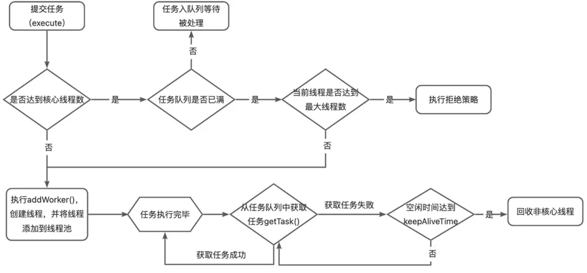

# Java线程池

## 核心概念

>线程池，主要是用来管理和复用线程。
>
>Java中的线程池核心实现类是ThreadPoolExecutor。

### 线程池的核心参数

```java
public ThreadPoolExecutor(int corePoolSize,
                                      int maximumPoolSize,
                                      long keepAliveTime,
                                      TimeUnit unit,
                                      BlockingQueue<Runnable> workQueue,
                                      ThreadFactory threadFactory,
                                      RejectedExecutionHandler handler) 
```

1. **corePoolSize:  核心线程数**
   - 定义了线程池中的核心线程数量。即使这些线程处于空闲状态，它们也不会被回收。这是线程池保持在等待状态下的线程数。

2. **maximumPoolSize:  最大线程数**
   - 线程池允许的最大线程数量。当工作队列满了之后，线程池会创建新线程来处理任务，直到线程数达到这个最大值。

3. **keepAliveTime:  线程的空闲时间**
   - 非核心线程的空闲存活时间。如果线程池中的线程数量超过了 corePoolSize，那么这些多余的线程在空闲时间超过 keepAliveTime 时会被回收。

4. **unit:  空闲时间的单位（秒、分、小时等等）**
   - keepAliveTime 参数的时间单位，TimeUnit.SECONDS、TimeUnit.MINUTES;

5. **workQueue:  工作队列**
   - 用于存放待处理任务的阻塞队列。当所有核心线程都忙时，新任务会被放在这个队列里等待执行。

6. **threadFactory:  线程工厂**
   - 一个创建新线程的工厂。它用于创建线程池中的线程。可以通过自定义 ThreadFactory 来给线程池中的线程设置有意义的名字，或设置优先级等。

7. **handler:  拒绝策略**
   - 拒绝策略 RejectedExecutionHandler，定义了当线程池和工作队列都满了之后对新提交的任务的处理策略。

### 线程池的拒绝策略

- **ThreadPoolExecutor.AbortPolicy**（默认策略）：丢弃任务并抛出RejectedExecutionException异常。
- **ThreadPoolExecutor.DiscardPolicy**：丢弃任务，但是不抛出异常。
- **ThreadPoolExecutor.DiscardOldestPolicy**：丢弃队列最前面的任务（即队列中等待最久的任务），然后重新尝试执行任务（重复此过程）。
- **ThreadPoolExecutor.CallerRunsPolicy**：让提交任务的线程（即调用 execute 方法的线程）自己来执行这个任务。
- 自定义拒绝策略：通过实现RejectedExecutionHandler接口实现。

### 线程池的等待队列

- ArrayBlockingQueue：数组实现（查询的时间复杂度为 O(1)），单向队列（一把锁）
  - 是一个有界队列，在创建时必须指定固定的容量，一旦达到容量上限，再次插入操作会被阻塞，直到有空间为止
  - 采用`ReentrantLock`进行加锁，只有一个`ReentrantLock`对象，这意味着生产者和消费者无法并行运行
    - 出入栈锁：`final ReentrantLock lock = this.lock`

- LinkedBlockingQueue：链表实现（插入和删除操作的时间复杂度为 O(1)），双向队列（两把锁）
  - 如果不指定大小，默认大小是 Integer.MAX_VALUE（2^31 - 1，即21亿），相当于一个无界队列。
  - 采用`ReentrantLock`进行加锁，有两个`ReentrantLock`对象，生产者和消费者可以并行运行
    - 入栈锁：`final ReentrantLock putLock = this.putLock;`
    - 出栈锁：`final ReentrantLock takeLock = this.takeLock;`

- PriorityBlockingQueue：一个支持优先级排序的无界阻塞队列。任务按照其自然顺序或通过构造器给定的 Comparator 来排序。
- DelayQueue：类似于 PriorityBlockingQueue，由二叉堆实现的无界优先级阻塞队列。
- SynchronousQueue：实际上它不是一个真正的队列，因为没有容量。每个插入操作必须等待另一个线程的移除操作，同样任何一个移除操作都必须等待另一个线程的插入操作。

> 无界指的是没有长度限制。
> 使用有界队列可以避免资源耗尽的风险，但是可能会导致任务被拒绝。
> 使用无界队列虽然可以避免任务被拒绝，但是可能会导致内存耗尽出现OOM。

### 线程池的创建方式

四种常见的线程池：

- newSingleThreadExecutor (单线程的线程池)
  - 核心线程数和最大线程数都是1
  - 适用于串行执行任务的场景，一个任务一个任务地执行。
- newFixedThreadPool (固定线程数目的线程池)
  - 核心线程数和最大线程数大小一样
  - 适用于处理 CPU 密集型的任务，确保 CPU 在长期被工作线程使用的情况下，尽可能的少的分配线程，即适用执行长期的任务。
- newCachedThreadPool (可缓存线程的线程池)
  - 核心线程数为0，最大线程数为 Integer.MAX_VALUE
  - 用于并发执行大量短期的小任务。
- newScheduledThreadPool (定时及周期执行的线程池)
  - 核心线程数由入参指定，最大线程数为 Integer.MAX_VALUE
  - 用于并发执行大量短期的小任务。

### 线程池的状态

- RUNNING：（running）运行状态
  - 线程池一旦被创建，就处于RUNNING状态，任务数为0，能够接收新任务，对已排队的任务进行处理。

- SHUTDOWN：（shutdown）关闭状态
  - 不接收新任务，但能处理已排队的任务。当调用线程池的shutdown()方法时，线程池会由RUNNING转变为SHUTDOWN状态。

- STOP：（stop）停止状态
  - 不接收新任务，不处理已排队的任务，并且会中断正在处理的任务。当调用线程池的shutdownNow()方法时，线程池会由RUNNING或SHUTDOWN转变为STOP状态。

- TIDYING：（tidying）整理状态
  - 当线程池在SHUTDOWN状态下，任务队列为空且执行中任务为空，或者线程池在STOP状态下，线程池中执行中任务为空时，线程池会变为TIDYING状态，会执行terminated()方法。这个方法在线程池中是空实现，可以重写该方法进行相应的处理。

- TERMINATED：（terminated）终止状态
  - 线程池彻底终止。线程池在TIDYING状态执行完terminated()方法后，就会由TIDYING转变为TERMINATED状态。


### 线程池的工作流程

1. 调用线程池的execute()方法，检测运行状态，在RUNNING状态下在提交任务。
2. 如果workerCount < corePoolSize，则创建并启动一个线程来执行新提交的任务。
3. 如果workerCount >= corePoolSize，且线程池内的阻塞队列未满，则将任务添加到该阻塞队列中。
4. 如果workerCount >= corePoolSize && workerCount < maximumPoolSize，且线程池内的阻塞队列已满，则创建并启动一个线程来执行新提交的任务。
5. 如果workerCount >= maximumPoolSize，并且线程池内的阻塞队列已满, 则根据拒绝策略来处理该任务, 默认的处理方式是直接抛异常。



### 线程池的线程数配置

根据任务类型决定：

- **CPU 密集型任务： N（CPU 核心数）+1**
  - CPU密集定义：数据计算、加密解密、压缩文件等。
  - 这种任务消耗的主要是 CPU 资源，可以将线程数设置为 N（CPU 核心数）+1。比 CPU 核心数多出来的一个线程是为了防止线程偶发的缺页中断，或者其它原因导致的任务暂停而带来的影响。一旦任务暂停，CPU 就会处于空闲状态，而在这种情况下多出来的一个线程就可以充分利用 CPU 的空闲时间。
- **IO 密集型任务： N（CPU 核心数）x2**
  - IO密集定义：磁盘读写、网络请求、数据库操作等
  - 这种任务系统会用大部分的时间来处理 I/O 交互，而线程在处理 I/O 的时间段内不会占用 CPU 来处理，这时就可以将 CPU 交出给其它线程使用。因此在 I/O 密集型任务的应用中，可以多配置一些线程，具体的计算方法是 2N

> 处理器的核心数可以通过 Java 的Runtime.getRuntime().availableProcessors()方法获取

```java
ThreadPoolExecutor executor = new ThreadPoolExecutor(
    cores, // 核心线程数设置为CPU核心数
    cores * 2, // 最大线程数为核心数的两倍
    60L, TimeUnit.SECONDS, // 非核心线程的空闲存活时间
    new LinkedBlockingQueue<>(100) // 任务队列容量
);
```

## 实际应用

### 自定义线程池ThreadPoolTaskExecutor

通过@Bean直接注入到Spring容器中，实现单例全局唯一。

通过@Value声明线程池核心参数，通过配置文件来管理（可以通过分布式配置中心如 Nacos、Apollo实现动态修改）。
```java
@Configuration
public class ThreadPoolConfig {

    @Value("${config.core.poolsize}")
    private int configCorePoolSize;
    @Value("${config.max.poolsize}")
    private int configMaxPoolSize;
    @Value("${config.queue.capacity}")
    private int configQueueCapacity;
    @Value("${config.keepAlive.seconds}")
    private int configKeepAliveSeconds;
    @Value("${config.thread.name.prefix}")
    private String configThreadNamePrefix;

    @Bean(name="configTask")
    public ThreadPoolTaskExecutor configTaskExecutor() {
        //newFixedThreadPool
        ThreadPoolTaskExecutor executor = new ThreadPoolTaskExecutor();
        // 设置核心线程数
        executor.setCorePoolSize(configCorePoolSize);
        // 设置最大线程数
        executor.setMaxPoolSize(configMaxPoolSize);
        // 设置队列容量
        executor.setQueueCapacity(configQueueCapacity);
        // 设置线程活跃时间（秒）
        executor.setKeepAliveSeconds(configKeepAliveSeconds);
        // 设置默认线程名称
        executor.setThreadNamePrefix(configThreadNamePrefix);
        // 拒绝策略：让提交任务的线程（即调用 execute 方法的线程）自己来执行这个任务
        executor.setRejectedExecutionHandler(new ThreadPoolExecutor.CallerRunsPolicy());
        // 电脑关机时是否等待任务执行完成
        executor.setWaitForTasksToCompleteOnShutdown(true);
        executor.initialize();
        return executor;
    }
}
```

### 通过CompletableFuture使用的默认线程池ForkJoinPool

java.util.concurrent.CompletableFuture，Java8中用来处理异步任务的API，入参可以指定线程池，默认使用ForkJoinPool。

- CompletableFuture 在没有显式指定线程池的情况下，默认使用 ForkJoinPool.commonPool() 来执行异步任务。
  - 线程池中的线程数量是基于CPU核心数动态调整的，适合处理轻量级的计算密集型任务。默认大小等于 Runtime.getRuntime().availableProcessors()。

- 共享线程池：系统中的其它使用 ForkJoinPool 的任务也可能会复用这个线程池中的线程。

### ForkJoinPool 比较 ThreadPoolExecutor

- 任务分解与窃取机制：
  - ForkJoinPool 使用任务窃取算法，适合递归、分治的任务；而常用的 ThreadPoolExecutor 更适合用于需要持久运行或执行少量大任务的场景。
- 默认并发性：
  - ForkJoinPool.commonPool() 的线程数量基于 CPU 核心数，适合 CPU 密集型任务，而 ThreadPoolExecutor 的并发性和规模是由用户配置的，可以适应更多的 IO 密集型任务。
- 共享线程池 vs 专用线程池：
  - 默认的 ForkJoinPool.commonPool() 是 JVM 级别的共享资源，而 ThreadPoolExecutor 可以为不同的任务或模块创建独立的线程池。

> 任务窃取算法（Work Stealing Algorithm） 是一种用于并行计算的调度算法，通常在多线程环境下使用，特别是在像 **ForkJoinPool** 这样的框架中，它能够有效地提高 CPU 的利用率。
>
> 该算法的核心思想是：
>
> - 每个线程都有自己的任务队列，当某个线程完成了自己的任务但其他线程还在忙碌时，它可以从其他线程的任务队列中“窃取”任务来继续执行，从而避免线程空闲的情况。
> - 双端队列：工作窃取发生的时候，它们会访问同一个队列，为了减少线程之间的竞争，通常任务会使用双端队列，即A永远从双端队列的头部拿，而B线程永远从双端队列的尾部拿任务执行。


## 常见面试题

### submit()和execute()方法的区别

- execute：没有返回值，仅仅是把一个任务提交给线程池处理，轻量级方法，适用于处理不需要返回结果的任务

- submit：返回值为Future类型，future可以用来检查任务是否已经完成，获取任务的结果等，适用于需要处理返回结果的任务

### 线程池的核心线程可以回收吗？（可以）

ThreadPoolExecutor默认不回收核心线程，但是提供了allowCoreThreadTimeOut(boolean value)方法，当参数为true时，可以在达到线程空闲时间后，回收核心线程，在业务代码中，如果线程池是周期性的使用，可以考虑将该参数设置为true；

### 线程池在提交任务前，可以提前创建线程吗？（可以）

ThreadPoolExecutor提供了两个方法：

- prestartCoreThread():启动一个线程，等待任务，如果核心线程数已达到，这个方法返回false，否则返回true；
- prestartAllCoreThreads():启动所有的核心线程，返回启动成功的核心线程数 。

通过这种设置，可以在提交任务前，完成核心线程的创建，从而实现线程池预热的效果；

### 局部变量定义的线程池对象在方法结束后可以被垃圾回收吗？（不可以）

正常来说局部变量会保存在栈中，随着方法的结束，栈帧出栈，栈帧中的局部变量也会销毁。

但在方法结束后，线程池中还存在活跃的线程，正在运行的线程是GC Roots对象，不会回收，可能会出现内存泄漏问题。

```java
public static void test2(){

    ExecutorService executorService = Executors.newFixedThreadPool(10);
    executorService.execute(new Runnable() {
        @Override
        public void run() {
            System.out.println("方法二执行完成");
        }
    });
}
```

### 如果线程池中执行任务的线程异常，发生异常的线程会销毁吗？其他任务还能正常执行吗？（会，能）

通过观察源码：java.util.concurrent.ThreadPoolExecutor#runWorker，在processWorkerExit方法内，可以看到如果运行中的线程池有线程执行异常，会调用workers.remove()移除当前线程，并调用addWorker()重新创建新的线程。

线程池中执行任务的线程异常，并不会影响其他任务的执行。

- 如果使用execute()提交任务，会直接打印异常信息。
- 如果使用submit()提交任务，通过trycatch返回future.get()来获取异常

## 参考

- [Java线程池的实现原理及其在业务中的最佳实践](https://mp.weixin.qq.com/s/doCvSGWvhnx5FUxPH0eG3Q)
- [Java线程池实现原理及其在美团业务中的实践 - 美团技术团队](https://tech.meituan.com/2020/04/02/java-pooling-pratice-in-meituan.html)

- [这些年背过的面试题——多线程篇](https://mp.weixin.qq.com/s/IVgGXQKU1QiT1ToN2wXHJg)

- [Java并发编程：线程池在使用的时候需要注意什么](https://javabetter.cn/sidebar/sanfene/javathread.html#_68-%E7%BA%BF%E7%A8%8B%E6%B1%A0%E5%9C%A8%E4%BD%BF%E7%94%A8%E7%9A%84%E6%97%B6%E5%80%99%E9%9C%80%E8%A6%81%E6%B3%A8%E6%84%8F%E4%BB%80%E4%B9%88-%E8%A1%A5%E5%85%85)