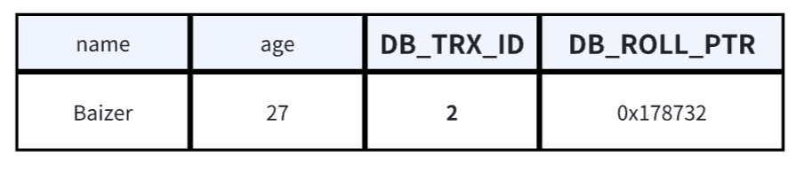
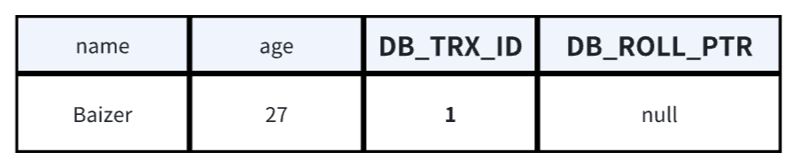
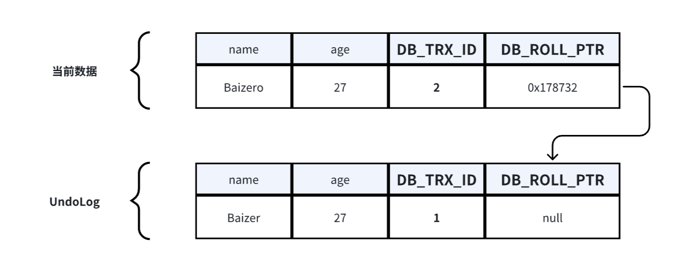
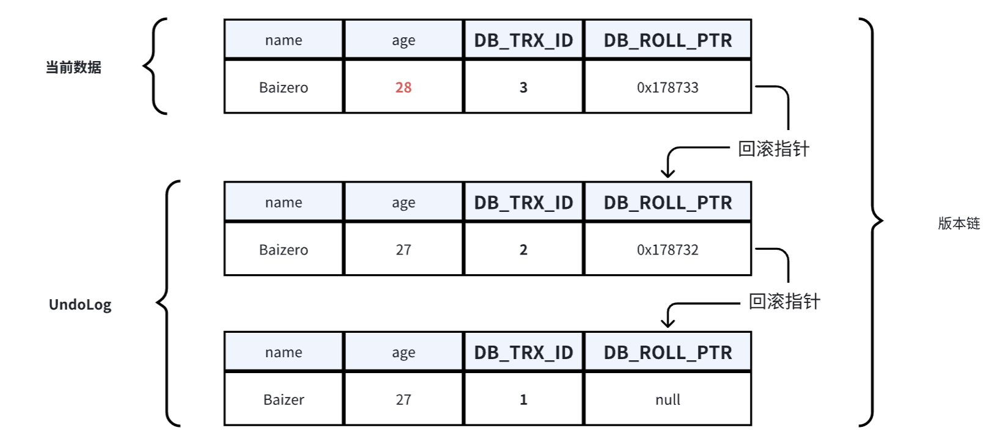
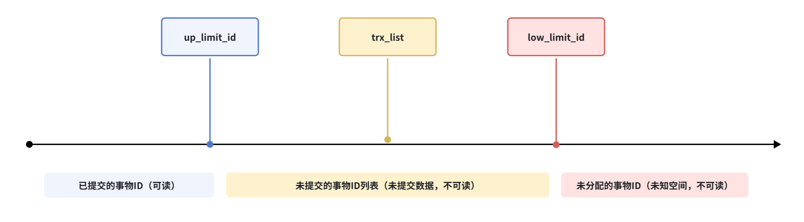
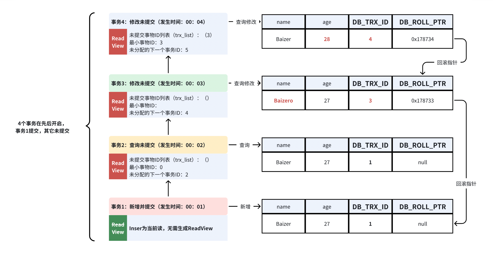
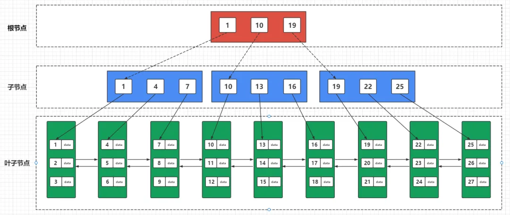
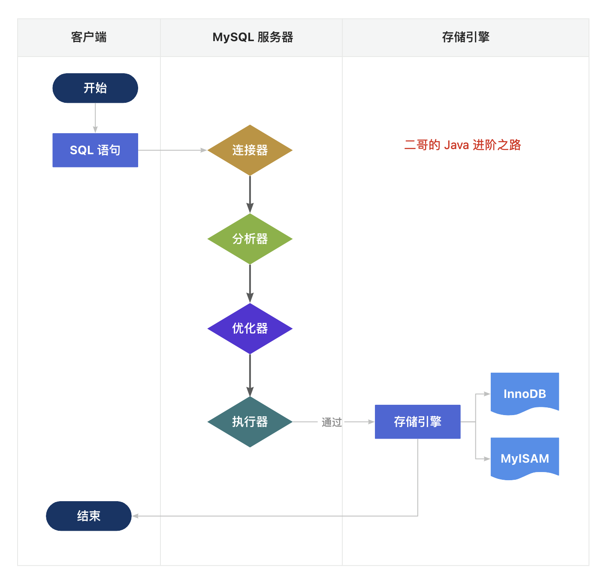

# MySQL Summary

## 核心概念

### 事务

事务是确保数据库操作完整性的一种机制，其特性概括为 ACID

- 原子性（Atomicity）：事务的所有操作要么全部成功，要么全部失败并回滚。
  - MySQL通过 Undo Log（回滚日志）来保证原子性。
- 隔离性（Isolation）：多个并发事务之间需要相互隔离，即一个事务的执行不能被其他事务干扰。
  - MySQL通过不同的隔离级别控制事务的并发行为，实现事物的隔离性。
- 持久性（Durability）：事务一旦提交，所做的修改将永久保存，即使系统崩溃也能恢复。
  - MySQL通过 Redo Log（重做日志）来保证持久性。
- 一致性（Consistency）：执⾏事务前后，数据保持⼀致。
  - 一致性与业务规则有关，比如银行转账，不论事务成功还是失败，转账双方的总金额应该是不变的。
  - MySQL通过上述的原子性、隔离性，还有数据库约束（如主键、外键、唯一性约束）来保证一致性。
  

> 只有MySQL的 InnoDB 存储引擎才支持事务

### 事务的隔离级别

为了保证事务的隔离性，MySQL通过不同的隔离级别控制事务的并发行为，防止常见的并发问题。

**例如脏读、不可重复读和幻读：**

- 脏读：A事物读取到了B事物未提交数据
- 不可重复读：A事物读取到了B事物已提交的修改（update）数据，导致A事物内部多次查询结果不一致
  - 通过MVCC解决

- 幻读：A事物读取到了B事物新已提交的新增（insert）数据，导致A事物内部多次查询结果不一致
  - 通过MVCC+间隙锁解决

**InnoDB存储引擎支持四种标准的隔离级别：**

- Read Uncommitted（读未提交）：可以读取未提交的数据，可能导致脏读问题。
  - 不提供任何锁机制来保护读取的数据。
- Read Committed（读已提交）：只能读取已提交的数据，避免脏读问题，但可能会产生不可重复读。
  - 通过MVCC实现，每次读取数据前都生成一个 ReadView，保证每次读操作都是最新的数据。
- Repeatable Read（可重复读）：确保当前事务中多次读取到的数据记录是一致的，即使其它事务对这条记录进行了修改，也不会影响到当前事务。解决了不可重复读问题，但可能遇到“幻读”。
  - 通过MVCC实现，只在第一次读操作时生成一个 ReadView，后续读操作都使用这个 ReadView，保证事务内读取的数据是一致的。
- Serializable（可串行化）：最高隔离级别，事务完全串行化执行，确保没有并发问题，但性能较差。
  - 通过加表级锁实现。读的时候加共享锁，也就是其他事务可以并发读，但是不能写。写的时候加排它锁，其他事务不能并发写也不能并发读。

>隔离级别通过加锁+MVCC来实现，隔离级别越低，锁越少。
>
>MySQL的默认隔离级别是可重复读。


### 读取数据的方式

无论什么样的隔离级别，数据读取的结果只有两种：1、读取的是旧数据；2、一直读取的新数据

- 当前读：指的是读取数据的最新版本。读取时还要保证其他并发事务不能修改当前记录，会对读取的记录进行加锁。
  - 涉及的SQL操作：
    - select lock in share mode（共享锁）
    - select for update（排他锁）
    - update、insert、delete
- 快照读：支持读取数据的快照版本，可以提高数据库的并发查询能力。基于MVCC实现。
  - 涉及的SQL操作：不加锁的select
  - 快照读的前提是隔离级别不是串行级别，串行级别下的快照读会退化成当前读

## MVCC（多版本并发控制）

为了解决隔离级别中的并发问题（实现不可重复读、可重复读），MySQL 引入了MVCC（Multi-Version Concurrency Control），它通过维护数据的多个版本来实现事务之间的隔离。

MVCC是通过行的隐藏字段、UndoLog、ReadView来实现的。

### 隐藏字段

每行记录除了我们自定义的字段外，还有数据库隐式定义的DB_TRX_ID、DB_ROLL_PTR、DB_ROW_ID等字段。

- DB_TRX_ID：最近修改事务id，记录创建这条记录或者最后一次修改该记录的事务id（6字节）
- DB_ROLL_PTR：回滚指针，指向这条记录的上一个版本，用于配合undolog，指向上一个旧版本（7字节）
- DB_ROW_ID：隐藏的主键，如果数据表没有主键，那么innodb会自动生成一个6字节的row_id（6字节）



### UndoLog

UndoLog被称之为回滚日志，保存的备份数据不仅用于实现事务的回滚（实现事务的原子性），也用于支持其他并发事务的读取（实现多版本并发控制MVCC）。

- 在当前读下进行insert，delete，update操作支持事务回滚。
  - 对于`UPDATE`操作，InnoDB会将该行的**旧版本数据**（即修改前的内容）拷贝到Undo Log中。
  - 对于`DELETE`操作，会将整个被删除的行拷贝到Undo Log中，以便在回滚时可以恢复。
  - 对于`INSERT`操作，Undo Log会记录一条“反向操作”的日志，用于在回滚时删除该新插入的记录。

- 在快照读下进行select操作支持并发读，并可以按需读取不同版本的快照数据。

#### 如何生成UndoLog

1、创建事务1，新增一条数据，事务提交。数据状态如下：

- 记录该行操作事务ID=1（事务ID全局递增） 
- 回滚指针为null（新行默认为null）



2、创建事务2，修改数据的name。流程和数据状态如下：

- 加锁：事务修改该行记录数据时，首先会对该行加排他锁
- 读取并备份：然后读取最新数据，因为要修改，所以会先拷克一份到UndoLog中当备份，再修改当前行数据
- 修改：修改当前行数据，改name的Baizer为Baizero，并修改事务ID和回滚指针
  - 记录该行操作事务ID=2
  - 回滚指针为UndoLog中备份地址
- 释放锁：事务提交后，释放锁



3、创建事务3，修改数据的age。流程和数据状态如下：

- 加锁：事务修改该行记录数据时，首先会对该行加排他锁
- 读取并备份：然后读取数据，因为要修改，所以会先拷克一份到UndoLog中当备份，当发现UndoLog中已经存在一个备份了，新备份会作为链表的表头插在最前面，再修改当前行数据。
- 修改：修改当前行数据，改age的27为28，并修改事务ID和回滚指针
  - 记录该行操作事务ID=2
  - 回滚指针为UndoLog中最新备份地址
- 释放锁：事务提交后，释放锁



> 在上诉的流程中，不同事务或者相同事务的对同一行数据进行修改时，会为该行数据在UndoLog中生成一条多版本的线性链表，即版本链，链首是最新的备份，链尾是最早的备份。

#### 什么时候删除UndoLog

- 当进行insert操作的时候，产生的UndoLog只在事务回滚的时候需要，所以在事务提交之后会被删除。
- 当进行update和delete操作的时候，产生的UndoLog不仅仅在事务回滚的时候需要，在快照读的时候也需要，所以不能随便删除，只有在快照读或事务回滚不涉及该日志时，对应的日志才会被purge线程统一清除。

### ReadView

当事务开始执行时，InnoDB 会为该事务创建一个 ReadView，这个 ReadView 会记录并维护系统当前活跃事务的ID，用于判断当前事务可以读取到UndoLog中的那一条版本数据。

**首先，ReadView创建时会记录三个全局属性：**

- `trx_list`：记录ReadView生成时，系统正活跃的事务ID列表（即未提交的事务ID列表）

- `up_limit_id`：记录trx_list列表中最小的事务ID

- `low_limit_id`：ReadView生成时，系统尚未分配的下一个事务ID

  

#### 可见性判断

**根据记录的全局属性，在UndoLog版本链中判断那一条数据可以给当前事务读取：**

- 首先判断UndoLog版本链数据中的`DB_TRX_ID < up_limit_id`
  - true：当前UndoLog版本链数据可读（该版本链数据的事物ID比trx_list中的最小ID还小，说明创建ReadView之前就已经提交过了，所以可读）
  - false：下一个判断
- 继续判断`DB_TRX_ID >= low_limit_id`
  - true：当前UndoLog版本链数据不可读（该版本链数据是ReadView创建之后生成的，可能是并发创建，不可读）
  - false：下一个判断

- 继续判断`DB_TRX_ID是否在trx_list中`
  - true：当前UndoLog版本链数据不可读（该版本链数据的事物ID在未提交的事务ID列表中）
  - false：当前UndoLog版本链数据可读（说明该版本链数据的事物在生成ReadView前就已经提交过了）

当判断该行数据UndoLog版本链第一条数据不可读时，则继续通过回滚指针（DB_ROLL_PTR）获取下一条版本链数据来进行判断是否可读。

>可重复读和不可重复读的实现关键就在于生成ReadView的时机：
>
>- 可重复读：事务内每次读取数据都生成一个ReadView。
>- 不可重复读：事务内只有第一次读取数据时会生成ReadView，此后的读取都复用此ReadView，确保事务每次读取的数据都一致。
>  - 既然都用同一个ReadView，为什么还会出现幻读的情况？
>    - 如果事务内都是快照读，复用ReadView，那么不会产生幻读的问题。
>    - 但是当快照读和当前读一起使用的时候，当前读会获取最新数据，从而更新ReadView，就有可能读取到其它事务提交的数据，出现幻读。

### MVCC的处理流程

>快照读的前提下：
>
>1. 事务开始，生成ReadView，获取最新行数据
>2. 判断该数据事物ID是否符合ReadView可见性判断
>   1. 符合就是可读，直接返回
>   2. 不符合就是不可读，则去UndoLog版本链中查找符合可见性判断的快照数据

**假设有4个事务先后开启，事务1提交了，事务2，3，4未提交，那么它们各自的工作流程如下：**

---

**事物1视角**：在00:01时，新增数据，当前读。（已提交）

- 记录该行操作事务ID=1，回滚指针=null。

---

**事物2视角**：在00:02时，查询数据，快照读，生成ReadView，根据ReadView判断该行数据的可见性。（未提交）

- 读取到的是事务1已提交的行数据，符合ReadView判断，直接返回。
- 此事务仅有查询操作，会生成事务ID，但是不会记录到最新行上。

---

**事物3视角**：在00:03时，查询修改，快照读，生成ReadView，根据ReadView判断该行数据的可见性。（未提交）

- 读取到的是事务1已提交的行数据，符合ReadView判断，直接返回。
- 因为有修改，会先拷克一份数据（事务1已提交的数据）到UndoLog中当备份。
- 再修改当前行数据，修改name为Baizero。
  - 记录当前行操作事务ID=3。
  - 回滚指针指向刚才备份的地址=0x178733（UndoLog中TRX_ID=1的数据）。

---

**事物4角度**：在00:04时，查询修改，快照读，生成ReadView，根据ReadView判断该行数据的可见性。（未提交）

- 读取到的是事务3未提交的行数据，放大ReadView判断过程：
  - 事务3未提交的行数据为name=Baizero，事务ID=3，触发可见性判断：
    - up_limit_id：3（该行数据事务ID=3，不小于up_limit_id=3，进入下一判断）
    - low_limit_id：5（该行数据事务ID=3，不大于或等于low_limit_id=3，进入下一判断）
    - trx_list：3（该行数据事务ID=3，包含在trx_list中，==判断不可读==）
  - 当判定该行数据对事务4是不可读时，则获取该行数据的回滚指针（0x178733）去UndoLog中寻找上一个版本的快照数据。则获取到事务1已提交的行数据，为name=Baizer，事务ID=1，再次触发可见性判断:
    - up_limit_id：3（该行数据事务ID=1，小于up_limit_id=3，==判断可读，返回该行数据==）
- 因为有修改，会先拷克一份数据（事务3未提交的数据）到UndoLog中当备份。
- 再修改当前行数据，修改age为28。
  - 记录当前行操作事务ID=4。
  - 回滚指针指向刚才备份的地址=0x178734（UndoLog中TRX_ID=3的数据）。
    - 虽然事务4读取的是事务1的数据，但事务3修改后，它指向的是事务3的UndoLog。
    - 回滚指针总是指向上一个事务生成的最新UndoLog版本，不会指向更早的版本。



## MySQL锁

### 锁的分类

**根据锁的机制：乐观锁、悲观锁**

**根据锁的粒度：行锁、页锁、表锁**

- 页锁：锁定特定的页（MySQL 的最小存储单元，一页可以包含多个行），介于表锁和行锁之间，锁的粒度和性能也介于两者之间。

#### 表锁

**自增锁（AUTO-INC Lock）**：在插入带有自增字段的记录时，MySQL 会自动加锁来生成唯一的自增值。自增锁在插入结束后会立即释放。

**意向锁（Intention Lock）**：是一种元数据锁，用于表级锁和行级锁之间的协调。意向锁不与其他意向锁冲突，但会与表锁发生冲突。

- **意向共享锁（IS Lock）**：事务想要给某几行加共享锁时，会先给表加一个意向共享锁。
- **意向排他锁（IX Lock）**：事务想要给某几行加排他锁时，会先给表加一个意向排他锁。

#### 行锁

**共享锁（S Lock，Shared Lock）：**允许多个事务同时读，但不允许修改。

**排他锁（X Lock，Exclusive Lock）：**只允许当前事务修改记录，其他事务既不能读也不能写。

**记录锁（Record Lock）：**锁定的是索引上的某一行记录。即使表没有显式的索引，InnoDB 也会使用隐式的主键索引来对记录加锁。

**间隙锁（Gap Lock）**：锁定索引之间的“间隙”，防止其他事务在间隙中插入新记录。用于避免幻读问题的出现。

- 示例：`SELECT * FROM your_table WHERE id = 10 FOR UPDATE;`（若存在 id 为 10 的记录，则锁定该记录和其前后的间隙）

**临键锁（Next-Key Lock）**：就是记录锁 + 间隙锁，是 InnoDB 默认的行锁算法。

>RC（READ-COMMITTED） 隔离级：只有记录锁，会有不可重复读的问题。
>
>RR（READ-REPEATABLE） 隔离级：解决了不可重复读的问题，并且使用记录锁、间隙锁、临键锁来解决幻读的问题。

## MySQL索引

索引就好像书的目录，主要的目的：

- 减少IO读取的次数
- 支持按区间高效地范围查询

### 索引的分类

#### 按功能分类

- 主键索引：表中每行数据唯一标识的索引，强调列值的唯一性和非空性。
- 唯一索引：保证数据列中每行数据的唯一性，但允许有空值。
- 普通索引：基本的索引类型，用于加速查询。
- 全文索引：特定于文本数据的索引，用于提高文本搜索的效率。

#### 按数据结构分类

- B+树索引：默认索引类型，将索引值按照一定的算法，存入一个树形的数据结构中，每次查询都从树的根节点开始，一次遍历叶子节点，找到对应的值。查询效率是 O(logN)。
- Hash索引：基于哈希表的索引，查询效率可以达到 O(1)，但是只适合 = 和 in 查询，不适合范围查询。

#### 按存储位置分类

- 聚簇索引：索引和数据是存储在同一个叶子节点
- 非聚簇索引：索引和数据是分开存储的，索引中的键值指向数据行的物理位置
  - 查询时，数据库需要先查找索引，然后再根据索引回到数据表中去查找实际的数据，这个过程称为回表（Bookmark Lookup）。
  - 如果查询只涉及索引列，即查询的所有字段都在该索引中，那么不需要回表，MySQL 直接从索引中返回结果，这种查询称为覆盖索引（Covering Index）。

>在Innodb存储引擎中，每张表都会生成一个聚簇索引，默认使用主键作为Key，如果没有就使用唯一键，再没有就使用生成6字节的RowID。而该表中的其它索引将会生成非聚簇索引，会有多个。
>
>- 聚簇索引`K：索引  V：数据`
>- 非聚簇索引`K：索引  V：聚簇索引的K`（回表：先获取聚簇索引的K，再回去聚簇索引中查询完整的数据）
>

### B+树索引

#### 为什么选树结构

树结构其特性决定了遍历数据方式本身就纯天然的支持按区间查询。树结构在插入等操作不用线性结构数组的开销，所以更适合插入更新等动态操作的数据结构。

- 哈希表底层基于数组，虽然可以高效查询，但是只能等值查询，而不能支持范围查询。
- 跳表底层是链表，通过索引层可以实现高效的区间查询，但是随着数据量的增加，索引层也会增加，导致IO次数也会增多。

#### 为什么采用B+树

- 二叉树：定义是每个节点的可以是 0 个子节或 1 个子节点，但是最多不超 2 个子节点。
  - 查询效率低

- 二叉查找树：引入二分查找，将小于根节点的元素放在左子树，大于的放在右子树。
  - 利用二分查找算法，具备高效查询。时间复杂度为 O(logn)
  - 但是极端情况下，如果每次插入的数据都是最小或者都是最大的元素，那么树结构会退化成链表。时间复杂度为 O(n)
- 平衡二叉树（AVL树）：在二叉查找树的基础上加上限制，保证让每个节点的左右子树高度差不能超过 1，那么这样让可以让左右子树都保持平衡。
  - 红黑树，也是自平衡二叉树中的一种，不过是非严格的平衡树。时间复杂度为 O(logn)
  - 不管自平衡树是平衡二叉查找树还是红黑树，每个节点只能有 2 个子节点，那么随着数据量增大的时候，节点个数越多，树高度也会增高（也就是树的深度越深），会导致IO的次数变多，影响查询效率。
- B树：B树的出现是为了解决树高度的问题，是一种多叉树。放开了子节点数的限制，而且每个节点还可以存储多个元素，进一步降低树的高度。
  - 数据量大时，二叉树只能纵向扩展子节点，而B树则可以横向扩展子节点， 降低数的高度意味着减少了IO次数。
  - 但是在范围查询时，需要使用中序遍历，即在父节点和子节点中不断的来回切换，又增加了IO次数。
- B+树：在B树的基础上升级，B+树中的非叶子节点都不存储数据，而是只作为索引。由叶子节点存放整棵树的所有数据，而且叶子节点之间形成了有序的双向链表。
  - B+树跟跳表类似，数据底层是数据，上层都是按底层区间构成的索引层，只不过它不像跳表是纵向扩展，而是横向扩展的“跳表”。
  - 这么做的好处即减少磁盘的 IO 操作又提高了范围查找的效率。



> 树结构动态演示：https://www.cs.usfca.edu/~galles/visualization/Algorithms.html

### 索引失效的情况

1. 组合索引不遵循最左匹配原则
2. like语句中，以%开头的模糊查询
3. 否定条件导致的索引失效（!=、<>、IS NULL、IS NOT NULL）
4. 对索引列进行操作时（计算、函数）
5. 隐式类型转换，例如字符串不添加引号等
6. 使用 or 条件，且其中的列没有索引
   - 例：`where id = 1 or name = 'Tom'` 即使id列有索引，当name没有索引时，索引会失效。
7. 两表关联使用的条件字段中字段的长度、编码不一致时
8. 表数据量太小或全表扫描代价更低


## 主从复制与读写分离

### 主从复制的工作原理

- 主库（Master） 需要开启 Binlog，之后有数据变更时就会记录到 Binlog 日志文件中

- 从库（Slave）有两个线程，IO 线程和 SQL 线程：

  - IO 线程负责读取 Master 的 Binlog 日志内容到中继日志（Relay log）中
  - SQL 线程负责读取中继日志（Relay log）并解析成SQL，再写入到 Slave 的数据库中


> 为什么要有中继日志？  IO线程直接写入从库不可以吗？
>
> - 读Binlog和写数据的速度不一致，IO线程读取Binlog是顺序IO，而写入到从库时是随机IO，顺序IO比随机IO会快很多，时间一长就会产生堆积。
>   - 顺序IO：直接在文件末尾进行append操作。
>   - 随机IO：需要先找到对应数据的位置，再执行增删改查操作。
>
> - 有个中继日志就相当于多了个缓冲带，类似于MQ的削峰填谷。
> - 先从Master的Binlog读取到Relaylog中，然后SQL线程在慢慢读取写入到从库。

**同步模式：**默认为异步复制（可能会有延迟，但是效率高），半同步复制需要等待从库确认，主库才能返回（低延迟，效率低）。

**部署方式：**一般都在直接购买云服务器厂商的数据库，区分主机和从机。

### 同步延迟的问题

主从同步延迟问题常见于主库写入频繁、网络带宽受限或从库资源不足的场景。

解决方法：

- 开启并行复制：MySQL 5.6 及以上版本支持基于多线程的并行复制。

- 使用`for update`强制触发当前读，直接查询主库。

  - `SELECT * FROM your_table WHERE id = 1 FOR UPDATE;`
  - 使用时必须要有主键唯一索引，防止行锁升级为表锁。
  - https://www.cnblogs.com/xurongze/p/16641894.html

- 使用中间件提供的API强制走主库查询：

  ```java
  		//sharding-jdbc 强制走主库查询（防止主从同步延迟导致状态限制失效的问题）
  		try(HintManager hintManager = HintManager.getInstance()){
  			hintManager.setMasterRouteOnly();
  			return repository.selectHeadById(id);
  		}
  ```

### 读写分离

在主从复制的基础上，一种优化数据库性能的技术，通过将 **读操作** 与 **写操作** 分离到不同的数据库节点上执行，从而减轻主库的负担，提升系统的吞吐量和并发处理能力。

**实现方式：**

- **手动分离读写：在应用代码中，根据业务逻辑和查询类型，手动选择目标数据库。**
  - 写操作：`INSERT`、`UPDATE`、`DELETE` 由主库执行。
  - 读操作：`SELECT` 由从库执行。
- **用代理中间件**
  - **MySQL Proxy**：官方的轻量级中间件，用于拦截 SQL 请求并实现分发，但已不再更新。
  - **MaxScale**：由 MariaDB 开发的强大代理工具，支持负载均衡、读写分离、故障转移等功能。
  - **ProxySQL**：一个高性能的 MySQL 代理工具，支持复杂的路由规则，适用于大规模生产环境。
  - **Atlas**：由 360 开发的轻量级 MySQL 代理，支持读写分离和负载均衡。
- **数据库驱动层支持**
  - **MyBatis、Hibernate**：这些 ORM 框架可以通过配置数据源实现读写分离。
  - **Spring Data**：可以通过配置多数据源来实现读写分离。
  - **C3P0、Druid**：这些数据库连接池框架支持配置主从数据源，实现读写分离。
- **基于分库分表中间件**
  - **ShardingSphere**：Apache ShardingSphere 支持分库分表、读写分离等功能，可以通过配置实现读写分离。
  - **MyCAT**：一个开源的数据库中间件，支持读写分离和分库分表。
- **云数据库服务的原生支持**
  - 一些云数据库服务（如 AWS RDS、阿里云 RDS）提供原生的读写分离支持，用户只需配置主库和从库，数据库服务会自动处理读写分离。

## 常见面试题

### 说说 WAL

WAL（Write-Ahead Logging，预写日志）的核心思想是**先写日志，再写数据**，即在对数据进行任何修改之前，必须先将修改的日志记录（redo log）持久化到磁盘。

通过先写日志，确保系统在发生故障时可以通过重做日志（redo log）恢复数据，实现事务的持久性。

### SQL Join的原理

MySQL是只支持一种Join算法Nested-Loop Join(嵌套循环连接)，并不支持哈希连接（MySQL8.0中支持）和合并连接，不过在mysql中包含了多种变种，能够帮助MySQL提高join执行的效率。

- `Simple Nested-Loop Join`简单嵌套循环连接： 从驱动表中逐一取出数据跟非驱动表逐一比较关联（开销非常大）

- `Index Nested-Loop Join`索引嵌套循环连接： 从驱动表中根据索引取出数据，跟非驱动表逐一比较关联（通过索引减少比较）
- `Block Nested-Loop Join`块嵌套循环连接： 把驱动表中关联的数据先放入join buffer，再用join buffer跟非驱动表批量比较关联，降低了非驱动表的访问频率（通过中间处理减少访问）
  - 可以通过参数join_buffer_size来设置join buffer的值。
  - 默认情况下join_buffer_size=256K，在查找的时候MySQL会将所有的需要的列缓存到join buffer当中，包括select的列，而不是仅仅只缓存关联列。

> Join时有索引则使用**索引嵌套循环连接**，没索引则优先使用**块嵌套循环连接**。

### InnoDB和MyISAM的区别？

| 区别     | Innodb                         | MyISAM                             |
| -------- | ------------------------------ | ---------------------------------- |
| 事务     | 支持                           | 不支持                             |
| 外键     | 支持                           | 不支持                             |
| 索引     | 即支持聚簇索引又支持非聚簇索引 | 只支持非聚簇索引                   |
| 行锁     | 支持                           | 不支持                             |
| 表锁     | 支持                           | 支持                               |
| 存储文件 | frm，ibd                       | frm，myi，myd                      |
| 具体行数 | 每次必须要全表扫描统计行数     | 通过变量保存行数（查询不能带条件） |

> frm：存储表结构定义
> ibd：存储数据和索引
> myi：存储索引
> myd：存储数据

### 一条SQL语句的执行过程



**客户端：**发送 SQL 语句到 MySQL 服务器。

**服务端：**

- **连接器**：负责建立客户端与服务器的连接，并进行权限验证。
- **查询缓存（可选）**：检查是否有相同的查询结果已存在缓存中。如果命中缓存，直接返回结果。（MySQL 8.0 中已移除查询缓存）
- **解析器：**对SQL查询语句进行词法和语法分析，生成抽象语法树。 
- **优化器：**然后优化器再对语法树进行分析，生成执行成本最低的执行计划。
- **执行器**：执行器根据优化后的执行计划，去存储引擎交互，查询数据并将结果返回客户端。

### SQL优化的问题

- 根据Grafana中监控到慢SQL，再对其进行优化。
- 为老业务SQL增加联合索引
- 或者拆分大SQL，将部分连接查询放到内存中做，减轻数据库压力。
- [order by导致where中索引失效的问题](https://www.cnblogs.com/xurongze/p/16670445.html)
- [数据库连接池配置优化的问题](https://doc.weixin.qq.com/doc/w3_ALMA0QZQAA87v6PGy3uTniQSPJ2cF?scode=APEAlweLAA4WbgY1e4ALMA0QZQAA8)

### 行式存储数据库和列式存储数据库的区别是什么？

#### 行式存储

数据按行存储，所有字段的数据（列）按顺序存放在一起。例如，对于一条记录，它的所有字段信息会连续存储在一块磁盘空间上

- 适合频繁的读写操作和事务性处理（OLTP 场景）。例如银行交易、电商订单系统、实时应用等。
- 常用数据库：MySQL、Oracle

| Row  | WatchID     | JavaEnable | Title              | GoodEvent | EventTime           |
| ---- | ----------- | ---------- | ------------------ | --------- | ------------------- |
| #0   | 89354350662 | 1          | Investor Relations | 1         | 2016-05-18 05:19:20 |
| #1   | 90329509958 | 0          | Contact us         | 1         | 2016-05-18 08:10:20 |
| #2   | 89953706054 | 1          | Mission            | 1         | 2016-05-18 07:38:00 |

#### 列式存储

数据按列存储。同一列的数据连续存放在一起，方便对列进行批量处理。每一列的数据可以单独存储和读取。

- 适合频繁读操作、大数据实时分析的场景（OLAP 场景）。例如聚合查询、实时数据分析、日志分析、BI报表等。
- 常用数据库：ClickHouse、ByteHouse、HBase

| Row:        | #0                 | #1          | #2          |
| ----------- | ------------------ | ----------- | ----------- |
| WatchID:    | 89354350662        | 90329509958 | 89953706054 |
| JavaEnable: | 1                  | 0           | 1           |
| Title:      | Investor Relations | Contact us  | Mission     |
| GoodEvent:  | 1                  | 1           | 1           |

#### OLTP和OLAP

OLAP 和 OLTP 是两类不同的数据库处理系统，分别用于不同的场景和需求：

**OLTP (Online Transactional Processing)：**联机事务处理，主要用于事务处理，数据更新频繁，查询简单，通常使用行式存储数据库。

**OLAP (Online Analytical Processing)：**联机分析处理，主要用于复杂的分析查询，数据量大，查询复杂，通常使用列式存储数据库。

### MySQL 中的 distinct 和 group by 哪个效率更高？

- 在语义相同，有索引的情况下：
  - group by和distinct都能使用索引，效率相同。因为group by和distinct近乎等价，distinct可以被看做是特殊的group by。

- 在语义相同，无索引的情况下：
  - distinct效率高于group by。原因是distinct 和 group by都会进行分组操作，但group by在Mysql8.0之前会进行隐式排序，导致触发filesort，sql执行效率低下。但从Mysql8.0开始，Mysql就删除了隐式排序，所以，此时在语义相同，无索引的情况下，group by和distinct的执行效率也是近乎等价的。

> 原文：https://mp.weixin.qq.com/s/5q43OZIPtocq0Xu82ucXRA

### int(1) 和 int(10) 有什么区别？

- 没有区别
- int后面的数字不能表示字段的长度，int(num)一般加上zerofill，才有效果。

> 原文：https://mp.weixin.qq.com/s/juNCIhpds-2ODguTSvkWzA

## 参考

- [一文探索应运而生的数据库们](https://developer.aliyun.com/article/1621450)
- [这些年背过的面试题——MySQL篇](https://developer.aliyun.com/article/1485900)
- [一文讲清楚MySQL事务隔离级别和实现原理 - 博客园](https://www.cnblogs.com/fengzheng/p/12557762.html)
- [沉默的王二：学渣逆袭](https://javabetter.cn/sidebar/sanfene/nixi.html)
