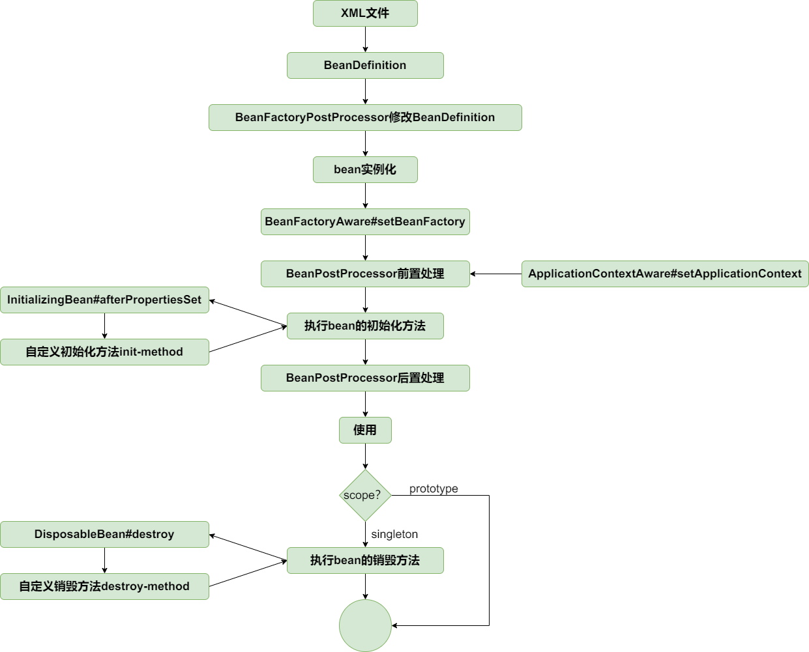

# SpringIOC与循环依赖

## 前言

记录SpringIOC的一些基本理论，引申出Spring循环依赖的问题

## Spring容器（IOC）

>IOC是一种设计原则，它的主要目的是为了解耦软件组件，促进代码模块化和可测试性。
>
>Spring的IOC容器通过XML配置文件、注解或Java配置类来==管理Bean的创建、配置和生命周期==。
>
>Spring支持两种主要的容器类型：
>
>- BeanFactory：Spring框架的基础容器，提供基本的DI功能。
>- ApplicationContext：BeanFactory的子接口，提供了更多的高级特性，如事件发布、国际化支持等。
>
>核心流程：==AbstractApplicationContext#refresh==

#### BeanDefinitionReader

一个接口，约束和规范bean信息的定义。其子类是将各种格式的bean信息转换为BeanDefinition的实现

- XmlBeanDefinitionReader转换XML
- PropertiesBeanDefinitionReader转换配置文件（Resource，Property）
- GroovyBeanDefinitionReader转换Groovy

#### BeanFactory

Bean工厂接口，此类接口上声明了Bean的创建过程。

默认的实现类是DefaultListableBeanFactory。

#### ApplicationContext

继承了BeanFactory，区别是ApplicationContext是提供给应用程序使用，BeanFactory是提供给Spring自己使用。

#### AbstractApplicationContext#==refresh==

这个抽象类中的refresh方法定义了Spring容器刷新流程，包含创建和销毁Bean，注册各种PostPrecessor。

#### AbstractAutowireCapableBeanFactory#doCreateBean

此方法执行实例化、属性填充、初始化、各种PostProcessor。

初始化方法执行顺序参考BeanFactory上的声明：

1. postProcessBeforeInitialization methods of BeanPostProcessors
2. InitializingBean's afterPropertiesSet
3. a custom init-method definition
4. postProcessAfterInitialization methods of BeanPostProcessors

#### Aware

Aware一个无声明的接口，Spring用于标识bean是否需要容器对象。

如想把`ApplicationContext`这种容器对象想作为自定义bean的属性时，则需实现`ApplicationContextAware`接口，告诉Spring（让Spring感知），Spring会在统一的地方处理为其赋值。

在Bean实例化之后，属性填充后，初始化方法中执行注入Aware：

- 初始化方法：AbstractAutowireCapableBeanFactory#initializeBean
- 首次注入Aware：AbstractAutowireCapableBeanFactory#invokeAwareMethods
  - 例如：BeanNameAware、BeanClassLoaderAware、BeanFactoryAware

- 在applyBeanPostProcessorsBeforeInitialization中执行剩余的Aware注入，实现类方法：ApplicationContextAwareProcessor#invokeAwareInterfaces
  - 例如：ApplicationContextAware、EnvironmentAware、MessageSourceAware

#### 创建和销毁的流程图



#### Bean作用域Scope

- 单例（singleton）：整个Spring IoC容器中只有一个实例。
- 原型（prototype）：每次获取Bean时都会创建一个新的实例。
  - 例如在使用责任链模式时，Handler的实现类又想交给Spring管理的话，就需要把Handler实现类的作用域声明为@Scope("prototype")，确保每次创建Handler的next属性都为空。
- 请求（request）：每次HTTP请求都会创建一个新的实例（Web应用中）。
- 会话（session）：每个HTTP会话都会创建一个新的实例（Web应用中）。

#### Bean的创建时机

1. 一个单例的bean，而且lazy-init属性为false(默认)，则在ApplicationContext创建的时候构造
2. 一个单例的bean，lazy-init属性设置为true，那么它则在第一次需要的时候被构造
3. 其它scope的bean，都是在第一次需要使用的时候创建

### Bean的生命周期（单例Bean）

#### ==一、加载bean==

1. **创建BeanFactory**
   - 创建容器，默认实现类DefaultListableBeanFactory
2. **读取BeanDefinition**
   - XmlBeanDefinitionReader转换XML
   - PropertiesBeanDefinitionReader转换配置文件（Resource，Property）
   - GroovyBeanDefinitionReader转换Groovy
   - ClassPathBeanDefinitionScanner：扫包将注解读取为Beandefinition（@Componet,@Services,@Controller）
3. **注册BeanDefinition**
   - 存储至DefaultListableBeanFactory#beanDefinitionMap
4. **执行BeanFactoryPostProcessor**
   - BeanFactoryPostProcessor#postProcessBeanFactory：在所有BeanDefintion加载完成后，但在bean实例化之前，提供修改BeanDefinition属性值的机制，例如处理BeanDefinition中的占位符、解析配置类提前注入
   - 常见的实现类：
     - ConfigurationClassPostProcessor：解析 @Configuration、@ComponentScan、@Bean、@Import、@PropertySource 等
     - PropertySourcesPlaceHolderConfigurer：替换 BeanDefinition 中的 ${ }
5. **注册BeanPostProcessor**
   - 完成BeanPostProcessor的注册工作，方便后续在实例化前后后调用before和after方法

#### ==二、实例化bean==

> 在AbstractApplicationContext#refresh中的finishBeanFactoryInitialization中体现，通过getBean在容器中查找，没有的时候再去创建Bean，把之前加载的BeanDefinition转换为Bean，通AbstractBeanFactory#createBean执行以下逻辑

1. **实例化前置处理器执行InstantiationAwareBeanPostProcessor#postProcessBefore==Instantiation==**
   - AbstractAutowireCapableBeanFactory#**resolveBeforeInstantiation**：内部会触发AbstractAutoProxyCreator#postProcessBeforeInstantiation函数，主要执行两个逻辑
     1. 初始化Advisor：为了判断是否需要跳过动态代理，会在shouldSkip中先初始化所有Advisor。
     2. 支持用户创建自定义的代理对象
2. **通过反射创建Bean**
   - AbstractAutowireCapableBeanFactory#createBeanInstance
   - SimpleInstantiationStrategy#instantiate：通过执行无参构造方法getDeclaredConstructor().newInstance()创建Bean
   - Bean的构造方法如果是有参的，且对应参数还是Bean，那么会去循环嵌套创建（例如Advisor、Adivce）
3. **提前暴露（解决循环依赖的问题）**
   - AbstractAutowireCapableBeanFactory#getEarlyBeanReference
   - 通过三级缓存解决循环依赖问题：
     - 一级缓存（singletonObjects）：成品Bean（实例化完成、初始化完成的）
     - 二级缓存（earlySingletonObjects）：半成品Bean（实例化完成、未初始化完成的）
     - 三级缓存（singletonFactories）：Lambda表达式，延迟创建的Bean（解决代理对象出现循环依赖的情况）

#### ==三、初始化bean==

1. **属性填充populateBean**
   - InstantiationAwareBeanPostProcessor#postProcessProperties执行属性注入（依赖注入）
     - 子类AutowiredAnnotationBeanPostProcessor处理@Autowired、@Value（自动装配）
   - AbstractAutowireCapableBeanFactory#applyPropertyValues通过反射填充属性
2. **Aware接口执行**

   - AbstractAutowireCapableBeanFactory#invokeAwareMethods：注入容器对象为Bean的属性
     - 例如：BeanNameAware、BeanClassLoaderAware、BeanFactoryAware
3. **初始化前置处理器执行BeanPostProcessor#postProcess==BeforeInitialization==**
   - 此处注入剩余Aware：ApplicationContextAware、EnvironmentAware、MessageSourceAware
4. **执行初始化方法**

   - InitializingBean#afterPropertiesSet：通过继承重写的方式
   - @PostConstruct：通过注解声明
   - @Bean(initMethod = "init")
5. **初始化后置处理器执行BeanPostProcessor#postProcess==AfterInitialization==**
   - AOP代理对象的生成：循环PostProcessor，通过AbstractAutoProxyCreator#postProcessAfterInitialization创建代理对象

>初始化方法执行顺序参考BeanFactory上的声明

#### ==四、销毁bean==

1. **执行销毁前置处理器DestructionAwareBeanPostProcessor#postProcessBeforeDestruction**
   1. 触发点：DefaultSingletonBeanRegistry#destroySingletons() -> DisposableBeanAdapter#destroy
   
2. **执行销毁方法**
   - DisposableBean#destroy：通过继承重写的方式
   - @PreDestroy：通过注解声明

## Spring循环依赖的问题

### 什么是循环依赖

在上文创建Bean对象流程中，放大属性赋值中自定义属性赋值流程，假设有这种情况：自定义对象A引用了自定义对象B，自定义对象B又引用了自定义对象A，这种情况称之为循环依赖（跟死锁类似）


### Spring解决方式

- Spring 引入缓存机制（二级缓存：earlySingletonObjects），允许先将尚未完全初始化的 bean 暴露出来以打破这种循环依赖

先将对象按照创建状态分类：`半成品`（实例化完成）、`成品`（初始化完成）。不同的状态存放至不同的Map中：一级缓存存放成品对象，二级缓存存放半成品对象。后续在判断容器是否存在A对象的时候，不需要去获取完整的A成品对象，只需要获取A半成品对象即可，这也是为什么Spring会把创建对象分为**实例化和初始化两个阶段**来执行的根本原因。 


> 有种特殊情况，如果A对象中的b属性，是通过构造函授方式注入 ，那么就是在A实例化阶段就需要B对象了，这种情况就无法解决循环依赖的问题！

### 为什么要三级缓存？

- 解决需要有AOP代理对象的特殊情况
- 保证不管什么时候使⽤的都是⼀个对象

回顾上面的创建流程，A实例化完成后就放到二级缓存给B用了，B此时注入的A是普通对象，假如A需要代理，A则会在初始化阶段属性填充后才会创建代理对象，并且会覆盖二级缓存中的普通对象，此时容器中的A是代理对象，但是B中的a属性却注入的是普通对象，就会出现对象版本不一致的情况。

**Spring通过引入三级缓存（singletonFactories）解决上诉问题**

- 三级缓存的设计理念是：在对象尚未完全实例化时，存储一个 **用于创建该对象的工厂**，工厂方法可以在需要的时候对对象进行代理包装。
- 使用Lambda 函数式接口（ObjectFactory）实现代理的惰性创建，是一种延迟机制，Lambda表达式只有在调用的时候才会执行，即只有在 bean 真正被获取时才决定是否需要创建代理对象。如果 bean 不需要代理，那么就直接返回原始对象。

#### 三级缓存

三级缓存本质上就是三个Map，Srping用于存放不同创建状态的Bean，详情见源码`DefaultSingletonBeanRegistry`

```java
public class DefaultSingletonBeanRegistry extends SimpleAliasRegistry implements SingletonBeanRegistry {
	...
	/** Cache of singleton objects: bean name to bean instance. */
	private final Map<String, Object> singletonObjects = new ConcurrentHashMap<>(256);

	/** Cache of singleton factories: bean name to ObjectFactory. */
	private final Map<String, ObjectFactory<?>> singletonFactories = new HashMap<>(16);

	/** Cache of early singleton objects: bean name to bean instance. */
	private final Map<String, Object> earlySingletonObjects = new ConcurrentHashMap<>(16);
  ...
}
```

**一级缓存**（`singletonObjects`）：存放成品对象（初始化完成）。

**二级缓存**（`earlySingletonObjects`）：存放半成品对象（实例化完成，未初始化完成的），用来解决循环依赖的问题。

**三级缓存**（`singletonFactories`）：存放Lambda 函数式接口ObjectFactory，解决AOP代理的问题。

#### 完整流程


在A对象从三级缓存晋升到二级缓存时， 如果判断A对象是需要代理的，则会去提前生成A对应的代理对象，替换普通返回。相当于提前执行了A的`BeanPostProcessor`，而A对象在后续的扩展阶段也无需再次生成代理类了

- `org.springframework.beans.factory.support.AbstractAutowireCapableBeanFactory#getEarlyBeanReference`

#### 最后的问题

**如果A对象是需要代理的，那么直接在`earlySingletonObjects`二级缓存中存放代理对象不行吗，为什么要使用Lambad函数式接口？**

回顾Bean的生命周期：设计原则是 Bean实例化、属性赋值、初始化之后再去执行AOP生成代理对象

但是**为了解决循环依赖但又尽量不打破这个设计原则**的情况下，使用了存储了函数式接口的第三级缓存； 如果使用二级缓存的话，可以将aop的代理工作提前到属性赋值阶段执行； 也就是说所有的bean在创建过程中就先生成代理对象再初始化和其他工作； 但是这样的话，就和spring的aop的设计原则相驳，aop的实现需要与bean的正常生命周期的创建分离； 这样只有使用第三级缓存封装一个函数式接口对象到缓存中， 发生循环依赖时，再触发代理类的生成。

- 实现代理的延迟创建，确保代理化的时机在 bean 生命周期中是正确的。

- 避免不必要的开销，只有在需要代理时才进行代理处理。

- 灵活应对复杂的依赖注入和循环依赖场景，保证代理对象在最合适的时间点被创建。