# Spring的事务管理

>Spring 事务管理（Spring Transaction Management）是 Spring 框架中的一个核心功能，旨在通过声明性或编程方式为应用提供统一的事务管理支持。它简化了在不同持久层技术中的事务管理操作，如 JDBC、Hibernate、JPA 等（事务的实现依赖各数据库自己的事务机制）。
>
>Spring事务管理主要分为两大类：
>
>- 声明式事务管理（SpringAOP的具体应用）
>- 编程式事务管理

##  核心概念

### 事务（Transaction）

事务是一个不可分割的工作单元，在事务中的操作要么全部成功，要么全部失败并回滚。事务管理的核心原则是保障数据的一致性和完整性，通常用以下四个特性来定义：

- **原子性（Atomicity）**：事务中的所有操作要么全部成功，要么全部失败，并回滚。
- **一致性（Consistency）**：事务开始前和结束后，数据保持一致的状态。
- **隔离性（Isolation）**：一个事务的操作在未提交前对其他事务是不可见的。
- **持久性（Durability）**：事务提交后，其结果是永久保留的。

### 编程式事务管理

- 在代码中显式调用事务管理的 API 来管理事物（通过 Spring 提供的 TransactionTemplate 或直接使用 PlatformTransactionManage）
- 事务管理的粒度：**代码块级别**

### 声明式事务管理

- 声明式事务是 SpringAOP 的具体应用，通过对方法前后进行拦截，将事务处理的功能编织到拦截的方法中，也就是在目标方法开始之前启动一个事务，在目标方法执行完之后根据执行情况提交或者回滚事务
- 通过 `@Transactional` 注解的方式来实现
- 事务管理的粒度：**方法级别**

### @Transactional 注解的属性

- **propagation**：事务传播行为，控制当前方法在调用其他事务方法时如何处理已有的事务。
- **isolation**：事务隔离级别，控制事务之间的隔离性。
- **timeout**：事务的超时时间，事务必须在指定时间内完成，否则将回滚。
- **readOnly**：标志事务是否只读。只读事务不会引发写操作，通常用于查询操作。
- **rollbackFor** 和 **noRollbackFor**：指定哪些异常会触发事务回滚，哪些异常不会触发回滚。

### Propagation 传播行为

Spring 事务管理的一个重要概念是传播行为（Propagation），它决定了一个事务方法在嵌套调用其他事务方法时如何处理现有的事务。

七种传播机制：

- **REQUIRED**（默认）：如果当前存在事务，则加入该事务；如果当前没有事务，则创建一个新的事务。
- **SUPPORTS**：如果当前存在事务，则加入该事务；如果当前没有事务，则以非事务方式执行。
- **MANDATORY**：如果当前存在事务，则加入该事务；如果当前没有事务，则抛出异常。
- **REQUIRES_NEW**：总是启动一个新的事务，如果当前存在事务，则将当前事务挂起。
- **NOT_SUPPORTED**：总是以非事务方式执行，如果当前存在事务，则将当前事务挂起。
- **NESTED**：如果当前存在事务，则在嵌套事务内执行。如果当前事务不存在，则行为与 REQUIRED 一样。嵌套事务是一个子事务，它依赖于父事务。父事务失败时，会回滚子事务所做的所有操作。但子事务异常不一定会导致父事务的回滚。

### Isolation 隔离级别

事务隔离级别控制并发事务之间的隔离程度，防止常见的并发问题，例如：脏读、不可重复读和幻读。

- **脏读**：A事物读取到了B事物未提交数据
- **不可重复读**：A事物读取到了B事物已提交的修改（update）数据，导致A事物内部多次查询结果不一致
- **幻读**：A事物读取到了B事物新已提交的新增（insert）数据，导致A事物内部多次查询结果不一致

在`TransactionDefinition`接口定义隔离级别：

- **ISOLATION_DEFAULT**：使用数据库默认的隔离级别，MySQL 默认的是可重复读，Oracle 默认的读已提交。

- **ISOLATION_READ_UNCOMMITTED**：读未提交，最低的隔离级别，允许读到未提交的数据，可能会导致脏读。

- **ISOLATION_READ_COMMITTED**：读已提交，能读取到已经提交的数据，防止脏读（大部分数据库的默认级别）。

- **ISOLATION_REPEATABLE_READ**：可重复读，保证同一个事务中多次读取的数据是一样的，防止不可重复读（MySQL的默认级别）。

- **ISOLATION_SERIALIZABLE**：串行化，最高隔离级别，事务完全串行化执行，防止脏读、不可重复读和幻读，但性能开销较大。

### TransactionManager 事务管理器

#### PlatformTransactionManager 平台事务管理器

TransactionManager是一个空接口，对应子接口为`PlatformTransactionManager` 平台事务管理器，其中声明了三个关键的方法：

- **getTransaction()**：根据事务信息创建事务，创建数据库连接，关闭自动提交
- **commit()**：提交事务
- **rollback()**：回滚事务

而`PlatformTransactionManager`默认实现类为`AbstractPlatformTransactionManager`，是一个模板方法抽象类，封装了事务管理的基本流程，并提供了一些钩子方法供子类实现。

- **DataSourceTransactionManager**：用于 JDBC 的事务管理。
- **JpaTransactionManager**：用于 JPA 的事务管理。
- **HibernateTransactionManager**：用于 Hibernate 的事务管理。

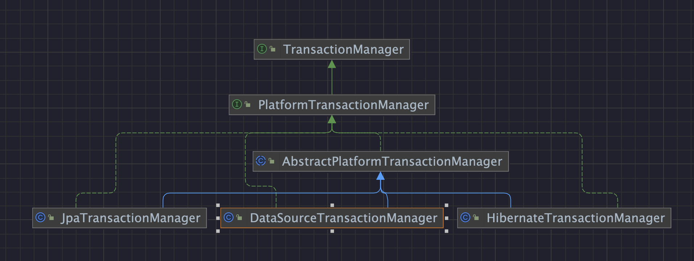

#### TransactionDefinition 事务定义

声明了上文中描述的 Propagation 传播行为、Isolation 隔离级别等属性。默认实现类为DefaultTransactionDefinition。

- `@Transactional`注解会被Spring解析并加载为`TransactionDefinition`对象。
- 是`PlatformTransactionManager#getTransaction`方法的入参

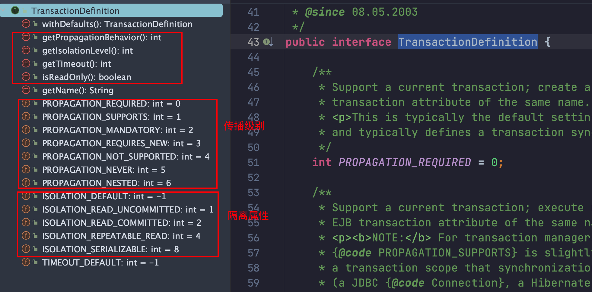

#### TransactionStatus 事务状态

主要用于表示当前事务的状态和控制事务的提交或回滚。默认实现类为`DefaultTransactionStatus`。

- 继承了 `SavepointManager`，意味着它可以创建事务保存点（`savepoints`），允许部分回滚，Spring事务的嵌套功能依赖此实现。

## Spring事务的实现

### JDBC连接的事务管理

来回顾一下以前学生时期的连接数据时的写法。

1. 获取连接 `Connection`
2. 关闭自动提交 `conn.setAutoCommit(false)`
3. 正常执行则手动提交 `conn.commit()`
4. 出现异常则回滚 `conn.rollback()`

```java
public static void main(String[] args) {
  Connection conn = null;
  Statement stmt = null;
  try {
    // 注册 JDBC 驱动
    // Class.forName("com.mysql.cj.jdbc.Driver");
    // 打开连接
    conn = DriverManager.getConnection("jdbc:mysql://localhost:3306/test", "root", "123456");
    stmt = conn.createStatement();
    conn.setAutoCommit(false); // 关闭自动提交
    String sql = "INSERT INTO T_USER(id,user_name)values(1,'管理员')";
    stmt.executeUpdate(sql);
    sql = "INSET INTO t_log(id,log)values(1,'添加了用户:管理员')";
    stmt.executeUpdate(sql);
    conn.commit(); // 上面两个操作都没有问题就提交
  } catch (Exception e) {
    e.printStackTrace();
    try {
      conn.rollback(); // 出现问题就回滚
    } catch (SQLException throwables) {
      throwables.printStackTrace();
    }
  } finally {
    try {
      if (stmt != null) stmt.close();
    } catch (SQLException se2) {
    }
    try {
      if (conn != null) conn.close();
    } catch (SQLException se) {
      se.printStackTrace();
    }
  }
}
```

### DataSourceTransactionManager 数据源事务管理

`DataSourceTransactionManager`类是`AbstractPlatformTransactionManager`抽象类的具体实现之一，其实就是对JDBC连接的事务管理的封装。

#### 1、获取事务

先看看父类`AbstractPlatformTransactionManager#getTransaction`的实现：

- 先检查当前线程是否已经存在事务，如果存在，根据传播行为 Propagation 判断是加入事务、创建嵌套事务，还是抛异常

- 如果没有事务，则创建新事务 

获取事务`doGetTransaction()`，开启事务`doBegin()`，由具体的子类`DataSourceTransactionManager`实现

> 相当于JDBC中的：
>
> 1. 获取连接 `Connection`
> 2. 关闭自动提交 `conn.setAutoCommit(false)`

- org.springframework.jdbc.datasource.DataSourceTransactionManager#doGetTransaction
- org.springframework.jdbc.datasource.DataSourceTransactionManager#doBegin

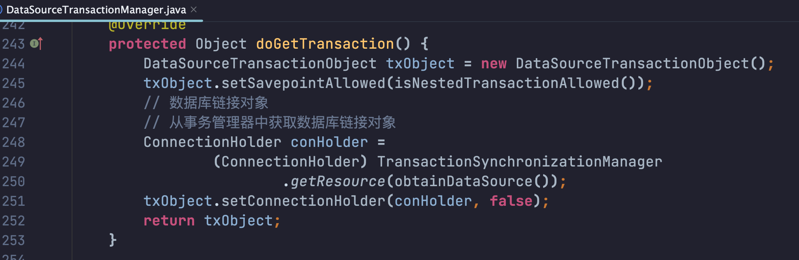

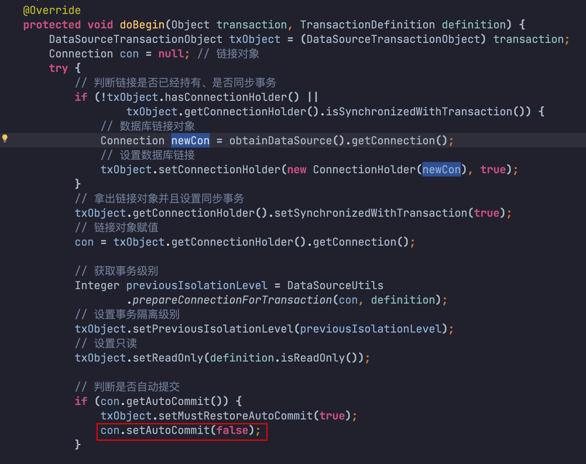

`doBegin()`中还有一个比较重要的地方：将当前获取到的连接绑定到当前线程ThreadLocal中，方便其它Service开启事务获取连接时能获取到同一个连接。

- `@Transactional`默认是`PROPAGATION_REQUIRED`，确保不同`Service`之间使用的是同一个事务，所有 SQL 操作使用的是同一个 `Connection`
- 事务结束后解绑：在事务提交或回滚时，Spring 需要清理 `ThreadLocal`，否则会导致 连接泄漏。
  - 这个解绑操作通常发生在 `AbstractPlatformTransactionManager#cleanupAfterCompletion()` 方法中
  - 这样事务结束后，当前线程就不会再持有 `Connection` 了。

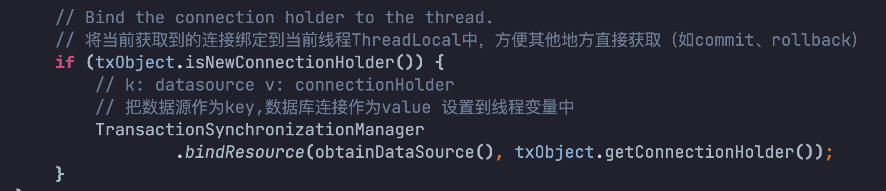

#### 2、提交事务

先看看父类`AbstractPlatformTransactionManager#commit`的实现：

- 根据事务状态判断是否需要回滚，如果是，则直接回滚
- 提交前做一些钩子操作（如 `prepareForCommit()`）
- 执行 `doCommit()`

`doCommit()`由具体的子类`DataSourceTransactionManager`实现

> 相当于JDBC中的：
>
> 3. 正常执行则手动提交 `conn.commit()`

- org.springframework.transaction.support.AbstractPlatformTransactionManager#processCommit
- org.springframework.jdbc.datasource.DataSourceTransactionManager#doCommit

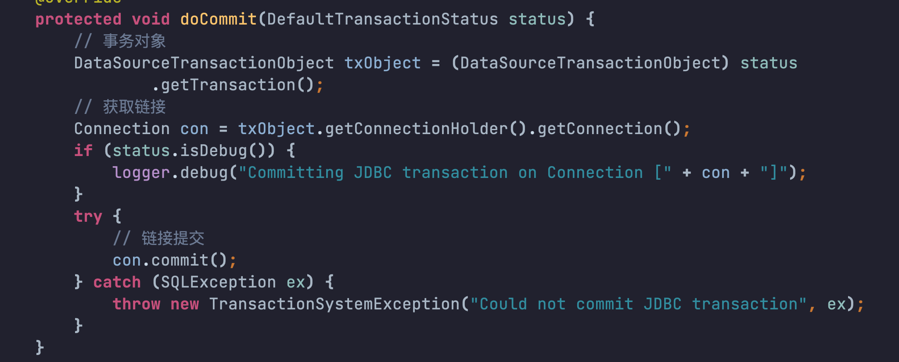

#### 3、回滚事务

先看看父类`AbstractPlatformTransactionManager#commit`的实现：

- 检查事务状态是否已完成
- 执行 `doRollback()`

`doRollback()`由具体的子类`DataSourceTransactionManager`实现

> 相当于JDBC中的：
>
> 4. 出现异常则回滚 `conn.rollback()`

- org.springframework.transaction.support.AbstractPlatformTransactionManager#processRollback
- org.springframework.jdbc.datasource.DataSourceTransactionManager#doRollback

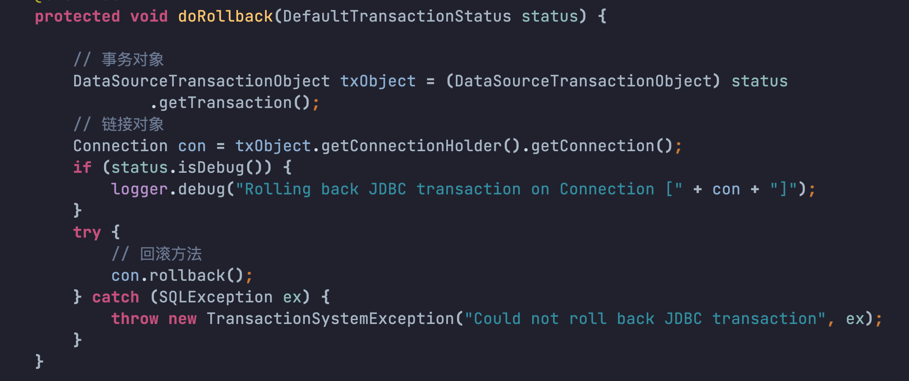

### 编程式事务的实现

其实就是在代码中显式调用事务管理的 API 来管理事物

```java
@Autowired
private PlatformTransactionManager txManager;

@Autowired
private LogService logService;

public void insertUser(User u) {

  // 1、创建事务定义
  DefaultTransactionDefinition definition = new DefaultTransactionDefinition();

  // 2、根据定义开启事务
  TransactionStatus status = txManager.getTransaction(definition);

  try {
    this.userDao.insert(u);
    Log log = new Log(System.currentTimeMillis()+ u.getUserName());
    this.logService.insertLog(log);

    // 3、提交事务
    txManager.commit(status);

  } catch (Exception e) {

    // 4、异常了，回滚事务
    txManager.rollback(status);
    throw e;
  }
}
```

### 声明式事务的实现

将上述公共代码抽取出来，通过SpringAOP来实现。

- 前置知识：[SpringAOP](2-SpringAOP.md) 

在需要事务管理的方法上声明`@Transactionl`注解，Spring会为其创建代理对象，当代理方法被调用时会触发拦截器的调用。

- 拦截器：`TransactionInterceptor`，是一个`advice`增强，使用环绕通知来实现编程式事务。
- 代理对象：通过`AnnotationAwareAspectJAutoProxyCreator`自动代理创建器生成。

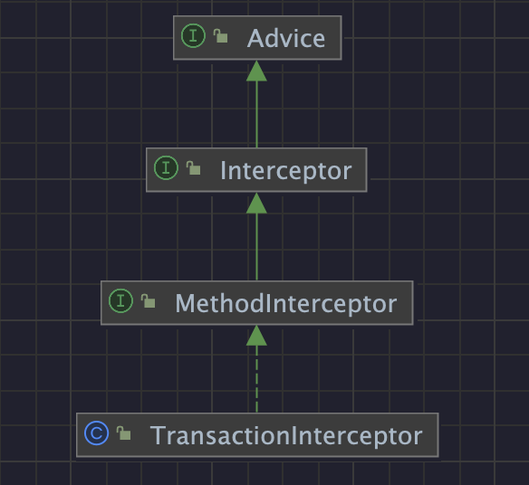

#### 1、进入拦截器

当调用一个声明了 `@Transactional` 注解的方法时，即被代理的法时，代理对象会先执行拦截器 `TransactionInterceptor`

- org.springframework.transaction.interceptor.TransactionInterceptor#invoke

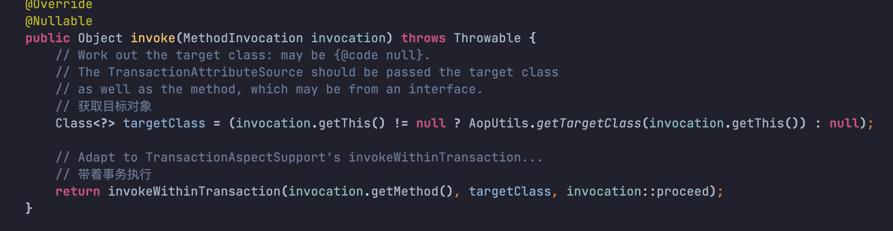

#### 2、解析事务属性

通过 `TransactionAttributeSource` 来解析`@Transactional` 注解的信息

- org.springframework.transaction.interceptor.TransactionAspectSupport#invokeWithinTransaction

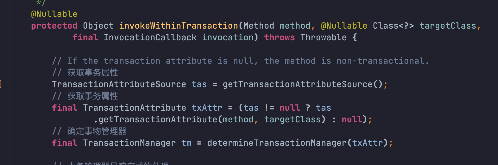

#### 3、获取事务管理器

默认会使用 `DataSourceTransactionManager`，即基于 JDBC 连接的事务管理器。

- org.springframework.transaction.interceptor.TransactionAspectSupport#determineTransactionManager

#### 4、开启事务

- org.springframework.transaction.interceptor.TransactionAspectSupport#createTransactionIfNecessary

`createTransactionIfNecessary` 该方法根据当前线程中是否已经存在事务及传播行为，决定以下几种情况：

- 复用现有事务：对于 REQUIRED、SUPPORTS 等行为，如果存在事务，则复用当前事务。
- 新建事务：对于 REQUIRES_NEW 或当前不存在事务的 REQUIRED，会新建一个事务。
- 挂起现有事务：对于 REQUIRES_NEW 或 NOT_SUPPORTED，如果当前存在事务，则先挂起当前事务（通过 suspend() 方法）。
- 嵌套事务：对于 NESTED，如果存在事务，则创建保存点（利用 SavepointManager 接口实现保存点的创建和管理）。

其内部会通过`PlatformTransactionManager#getTransaction`获取事务。

#### 5、执行目标方法，提交 or 回滚事务

通过`invocation.proceedWithInvocation()`执行目标方法

遇到异常时回滚 `completeTransactionAfterThrowing()`

正常执行完则提交事务 `commitTransactionAfterReturning()`

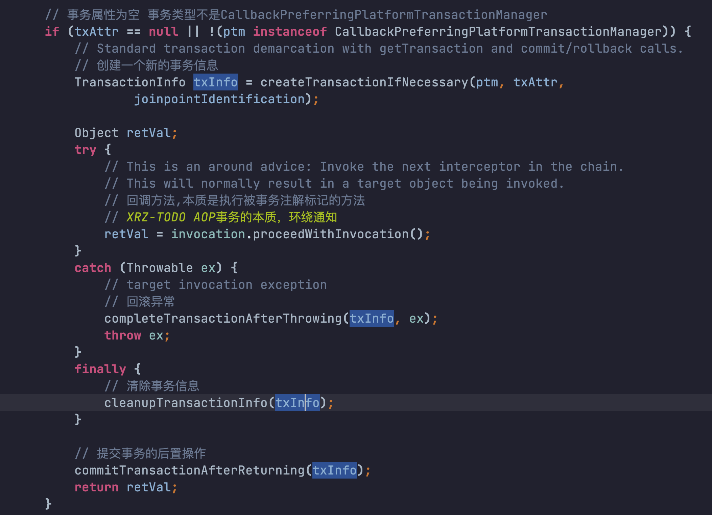

### TransactionInterceptor的注入

- 前置知识： [SpringBoot2.x自动配置](6-SpringBoot2.x.md) 

我们是通过`@EnableTransactionManagement`注解来启用声明式事务的，查看该注解详情，通过`@Import`导入配置类`TransactionManagementConfigurationSelector`

- org.springframework.transaction.annotation.EnableTransactionManagement

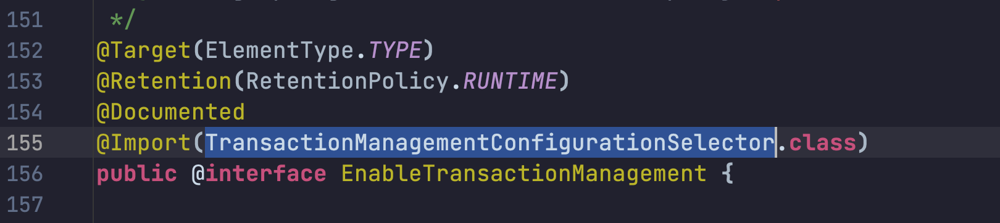

`TransactionManagementConfigurationSelector`继承了`ImportSelector`接口，支持动态注入，通过重写`selectImports()`方法，其返回值是一个`String[]`，Spring 会把返参数组转换为`BeanDefinition`自动注册到容器中。

- 默认采用了SpringAOP的动态代理模式`PROXY`，导入了`ProxyTransactionManagementConfiguration`配置类
  - ASPECTJ 模式：采用 AspectJ 的织入技术（编译时或加载时织入），直接将通知织入目标类中。

- org.springframework.transaction.annotation.TransactionManagementConfigurationSelector

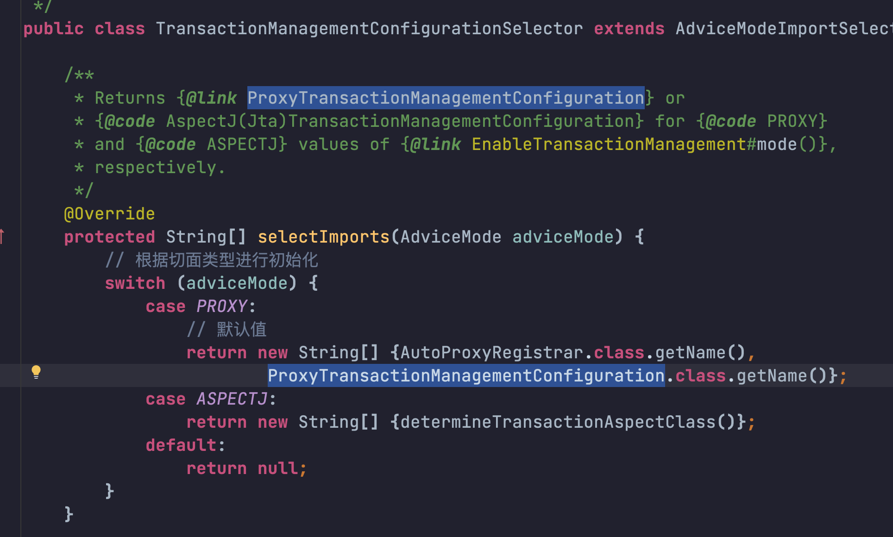

在`ProxyTransactionManagementConfiguration`中通过`@Bean`注入了`Advisor`、`TransactionAttributeSource`、`TransactionInterceptor`

- org.springframework.transaction.annotation.ProxyTransactionManagementConfiguration

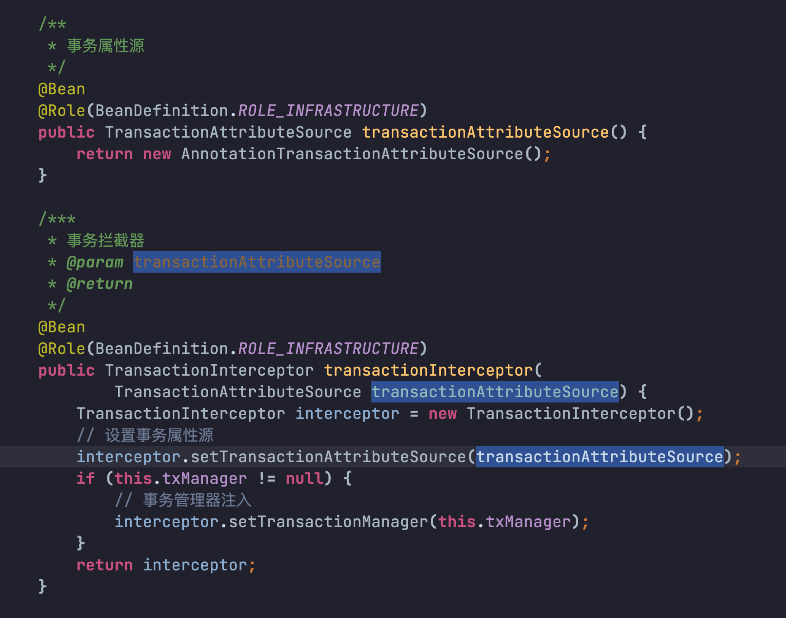

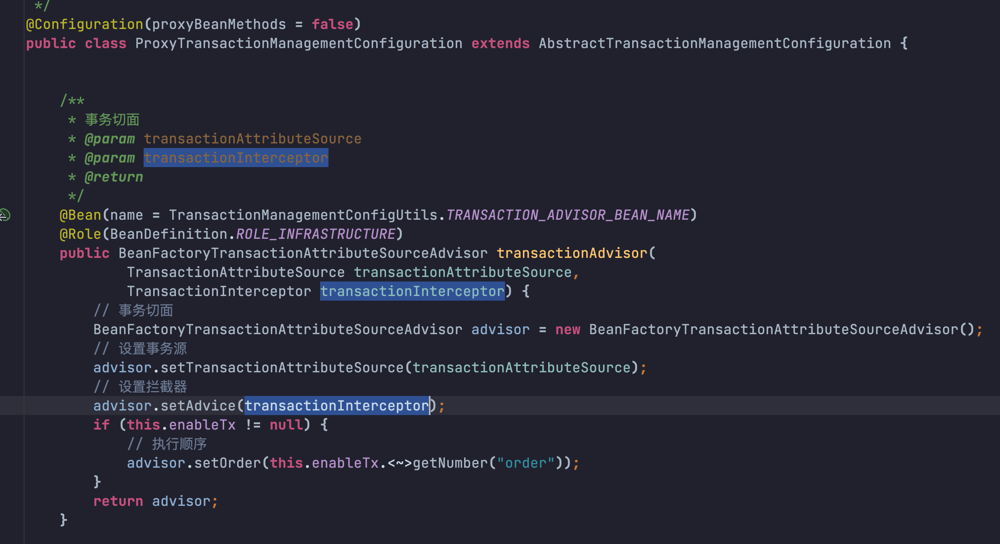

在 SpringIOC 的`refresh`方法中，在`invokeBeanFactoryPostProcessors`方法会执行一个`ConfigurationClassPostProcessor`，通过这个对象的`postProcessBeanDefinitionRegistry`方法来解析所有配置类上的注解，包括上述的@`EnableTransactionManagement`、`@Import`、`@Bean`等注解。


