# Spring事件机制

## 前言

> 记录了Spring事件机制的实现，并引申出@RefreshScope注解应用。

Spring事件机制（Spring Event）是基于**观察者模式**实现的，主要用于在应用中实现事件的发布与监听。

日常业务系统应用场景：

- 数据同步-业务单据信息推送到三方系统
- 发送通知消息
- 异步执行任务
- 三方接口异常进行补偿重试

核心组成：事件、发布器、监听器，事件是主体，发布器负责发布事件，监听器负责处理事件。

## 核心概念

### 观察者模式

观察者模式（Observer Pattern）是一种**行为型设计模式**，用于定义对象之间的一种**一对多的依赖关系**，当一个对象的状态发生变化时，所有依赖于它的对象都会自动收到通知并进行更新。

#### 核心角色：

**Subject（主题/被观察者）**：主题是被观察的对象，当它的状态发生变化时，通知所有观察者。

**Observer（观察者）**：当主题发生变化时，观察者会收到通知，并执行相应的操作。

**ConcreteSubject（具体主题）**：具体的主题类，实现`Subject`接口，包含实际的状态或行为，并负责在状态变化时通知观察者。

**ConcreteObserver（具体观察者）**：具体的观察者类，实现`Observer`接口，并在收到通知时更新自己。

#### 工作流程：

1. 观察者首先向主题注册自己（订阅）。
2. 当主题的状态发生变化时，它会遍历所有的注册观察者，调用每个观察者的通知方法。
3. 观察者接收到通知后，可以根据需要选择处理或忽略通知。

### 事件类（Event）

通过继承`ApplicationEvent`来自定义一个事件

### 事件发布器（ApplicationEventPublisher）

`ApplicationEventPublisher`负责事件发布，通过调用`publishEvent`方法发布事件。

获取方式：

- 通过@Autowired 注入 ApplicationEventPublisher
- 通过实现ApplicationEventPublisherAware接口让Spring感知注入

### 事件监听器（@EventListener or ApplicationListener）

声明方式有两种：

- 实现`ApplicationListener`接口声明监听器，通过泛型参数指定处理的事件类型。

- 使用`@EventListener`标注方法为监听器，该注解标注的方法上，方法参数为事件类型，标注该监听器要处理的事件类型

## 事件广播器的处理

事件广播器（AbstractApplicationEventMulticaster）负责把ApplicationEventPublisher发布的事件广播给对应的监听器们。其内部维护了所有监听器。

在AbstractApplicationContext#refresh方法中通过调用initApplicationEventMulticaster方法执行初始化，默认实现类为SimpleApplicationEventMulticaster

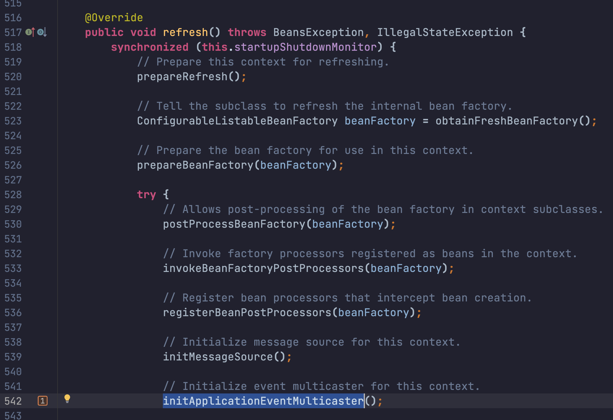

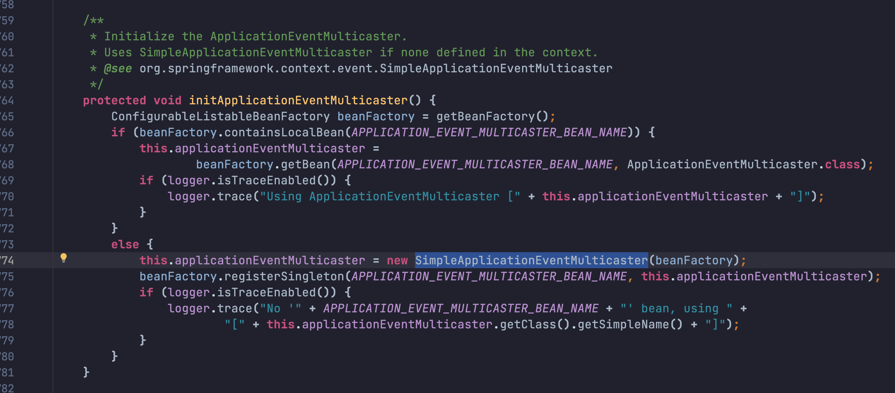

### 添加监听器到广播器中

在AbstractApplicationContext#refresh方法中通过调用registerListeners方法注册监听器，将所有事件监听器ApplicationListener注册到广播器中。

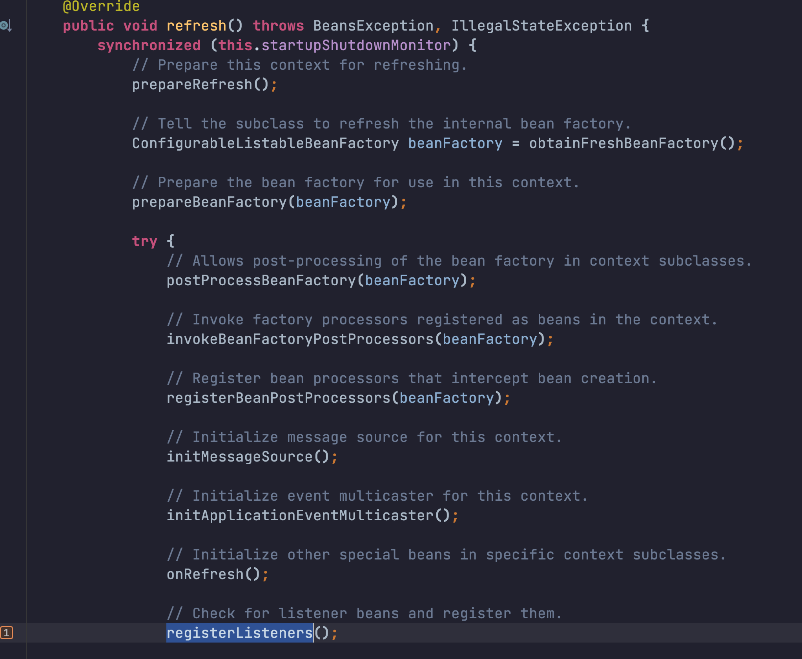

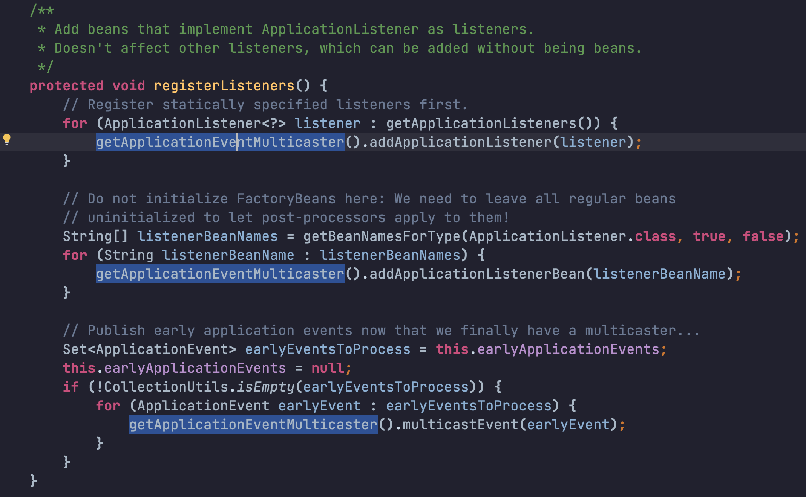

- 通过@EventListener注解声明的方法级别事件，Spring会在所有单例Bean初始化之后，将其转换为ApplicationListenerMethodAdapter，再放入广播器中。（ApplicationListenerMethodAdapter是ApplicationListener的子类）

- 调用链：refresh() ->finishBeanFactoryInitialization -> preInstantiateSingletons() -> afterSingletonsInstantiated()

- 具体执行的实现方法：EventListenerMethodProcessor#processBean
  - EventListenerMethodProcessor是Spring内置的核心Bean，在容器创建的时候就会初始化：AnnotationConfigApplicationContext#AnnotationConfigApplicationContext() -> AnnotatedBeanDefinitionReader(registry,  environment) ->  AnnotationConfigUtils#registerAnnotationConfigProcessors

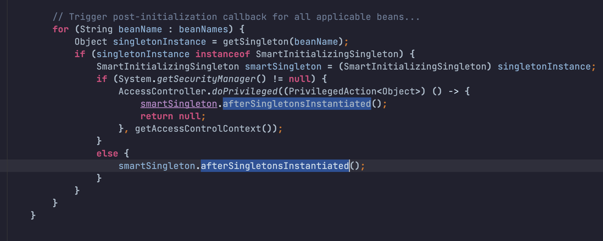

## 事件发布的执行过程

通过`AbstractApplicationContext#publishEvent`发布事件后，传递事件给广播器处理

> `ApplicationContext`是Spring的核心容器，它也继承了`ApplicationEventPublisher`，所以也能发布事件。

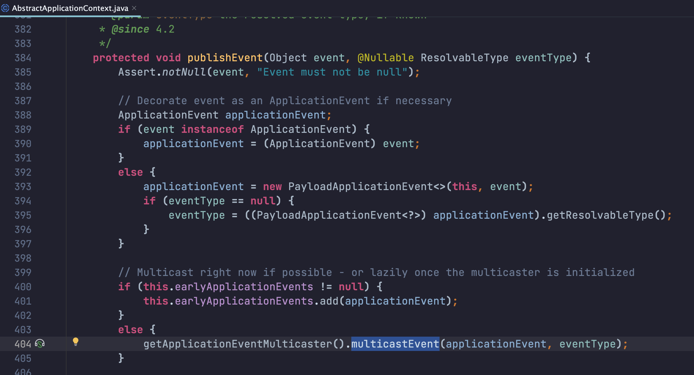

对应`SimpleApplicationEventMulticaster#multicastEvent`广播器广播事件，内部通过`AbstractApplicationEventMulticaster#getApplicationListeners`获取事件对应的监听器
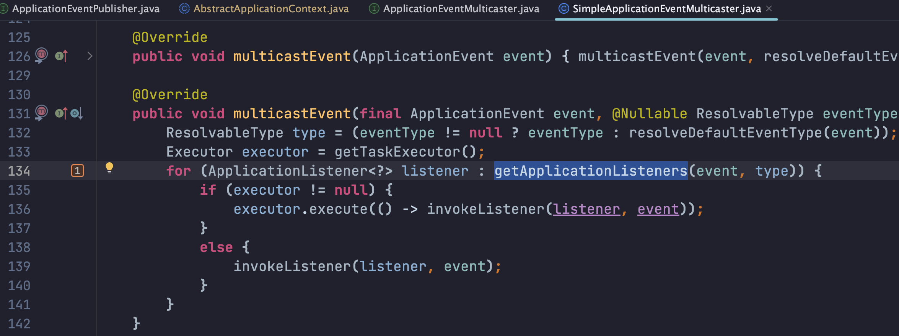

再循环执行监听器的`onApplicationEvent`方法
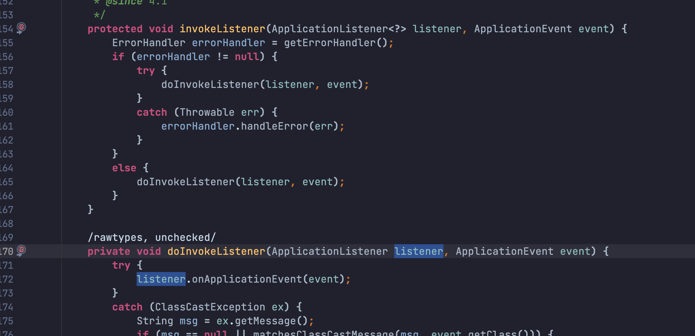

### 匹配事件

通过广播器的AbstractApplicationEventMulticaster#retrieveApplicationListeners方法匹配，先获取注册在Multicaster的所有事件，再通过supportsEvent逐一匹配。

1. 断事件类型和监听器上的泛型类型，是否匹配(子类也能匹配)。
2. 监听器是否支持事件源类型，默认情况下，都是支持的。

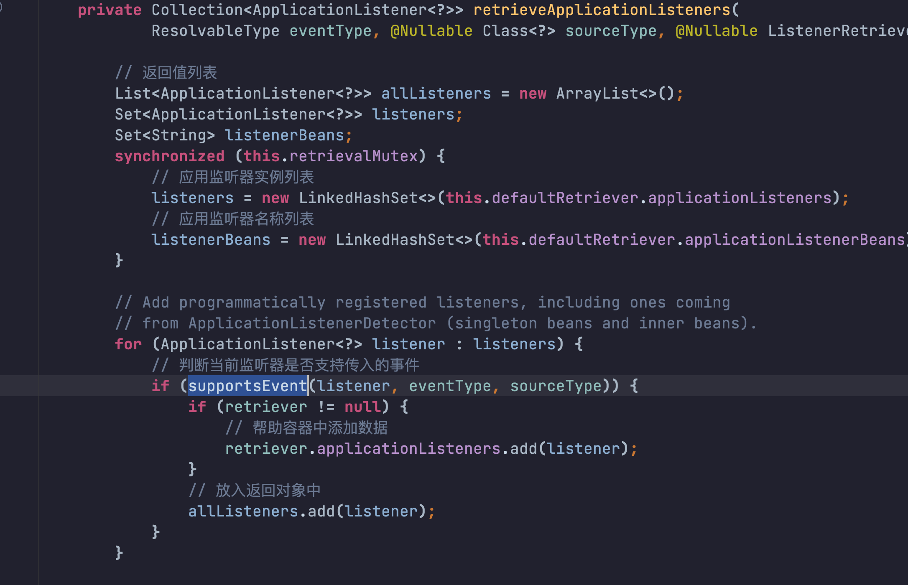

## @RefreshScope

@RefreshScope注解也是Spring事件的一个典型应用，主要作用是可以在不重启应用的情况下重新加载配置。

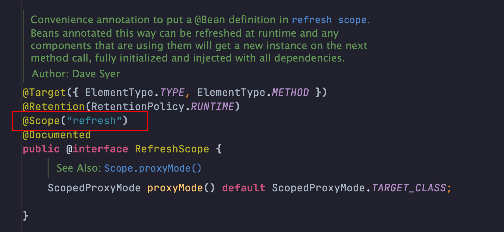

@RefreshScope是SpringCloud在@Scope基础上的一个实现，用于标识Bean的作用域为`refresh`，代理模式为CGLB基于类的代理。

- refresh作用域相当于一个懒加载的单例，即在第一次获取的时候会去创建Bean，之后独立缓存起来。
- ScopedProxyMode代理模式有四种
  - DEFAULT：不使用代理（@Scope的默认值）
  - NO：不使用代理，等价于DEFAULT。
  - INTERFACES：使用基于接口的代理
  - TARGET_CLASS：使用基于类的代理（@RefreshScope的代理模式）

### 工作流程

假设有一个Bean被@RefreshScope修饰，那么在AbstractBeanFactory#doGetBean创建的时候会被判断为是其它作用域，通过Scope#get方法去创建。

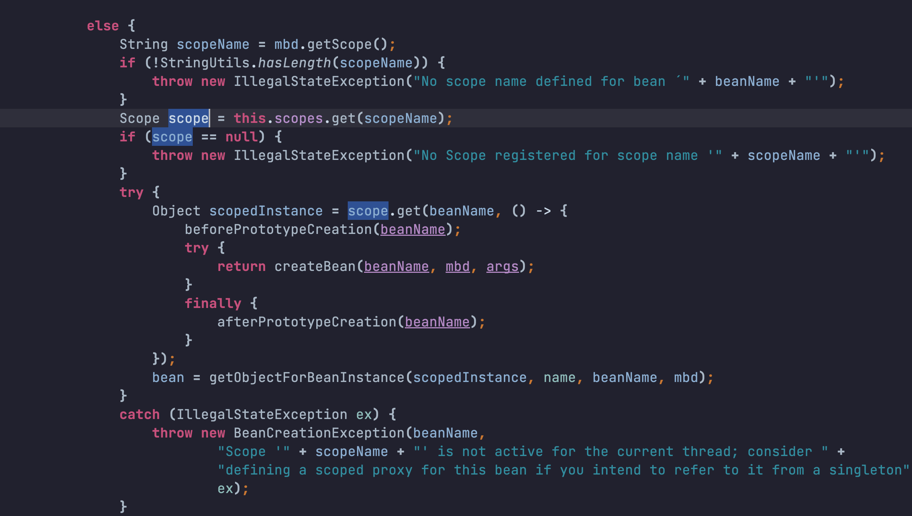

Scope是一个接口，对应的实现类是GenericScope，重点关注对应get方法的实现。

- 入参是一个BeanName和ObjectFactory对象工厂（Lambda表达，在doGetBean中放入的是一个对象创建过程）
- this.cache是BeanLifecycleWrapperCache对象，用来缓存当前作用域的Bean。
  - 内部使用的是ConcurrentMap存放
  - key是BeanName，value是Warpper包装器

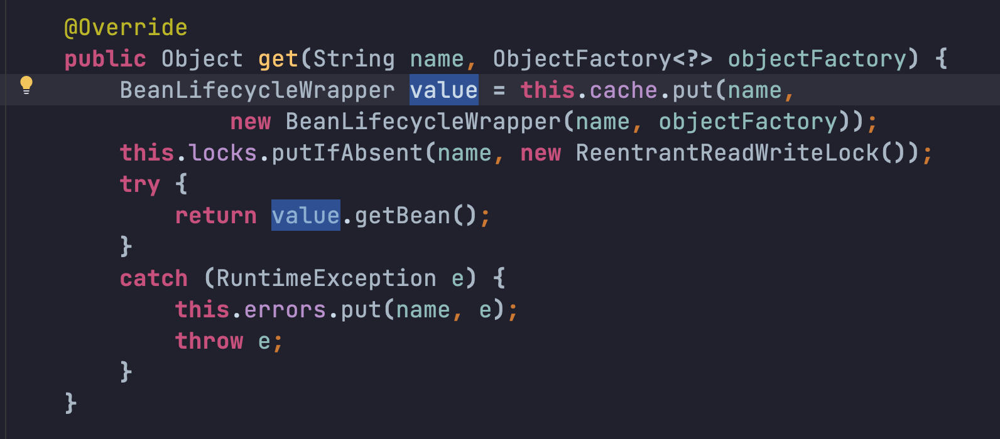

- 最终返回的是通过BeanLifecycleWrapper.getBean()方法返回ObjectFactory对象工厂创建的Bean
  - Wrapper包装器内部持有一个ObjectFactory对象工厂和Bean。
  - 在第一次调用getBean()方法的时候，会通过对象工厂创建并记录该Bean，后续再调用getBean()方法时就会直接返回记录的Bean。
  - 而记录的Bean对象，可以通过destroy()置空，那么下次再调用getBean()方法的时候，就会通过对象工厂去重新创建一个Bean对象记录起来。
    - ==这就是动态刷新配置的核心机制，只要有配置变更，就可以发送一个刷新事件，监听器再去执行对应作用域的destroy()方法清空Bean，下次再获取时就可以通过ObjectFactory重新走一边创建过程，重新读取最新配置。==

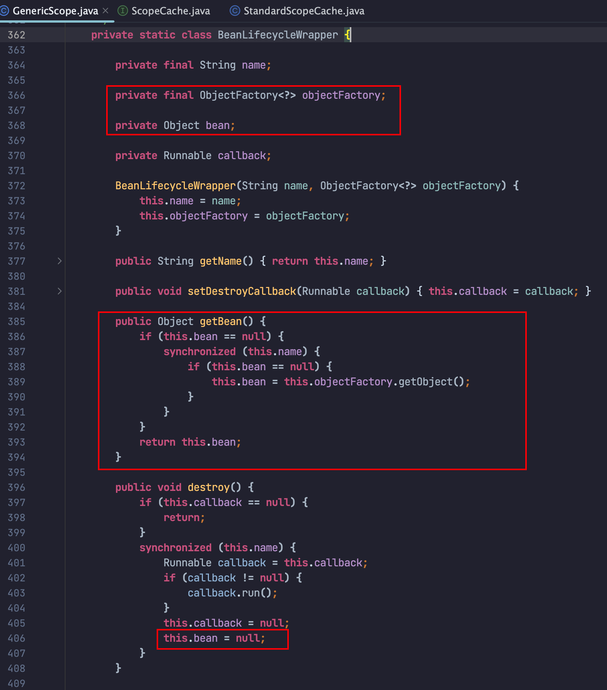

GenericScope#destroy方法作用是

- 先获取所有BeanLifecycleWrapper包装器，循环执行destroy方法，置空包装器中记录的bean
- 清空this.cache（BeanLifecycleWrapperCache）当前作用域的所有缓存

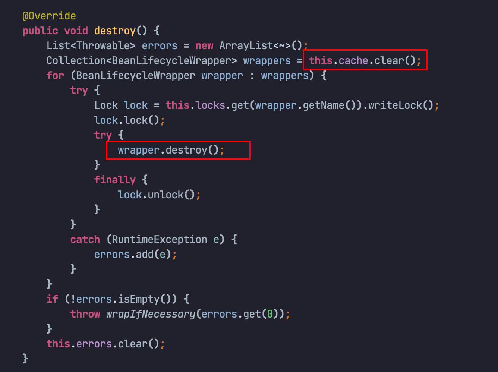

RefreshScope是GenericScope对应的子类，内部通过refreshAll执行父类GenericScope#destroy方法。

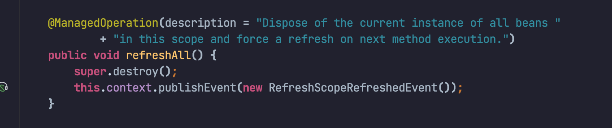

而RefreshScope#refreshAll方法又被ContextRefresher#refresh方法调用

- `ContextRefresher`是spring中专门用来刷新`RefreshScope`的类

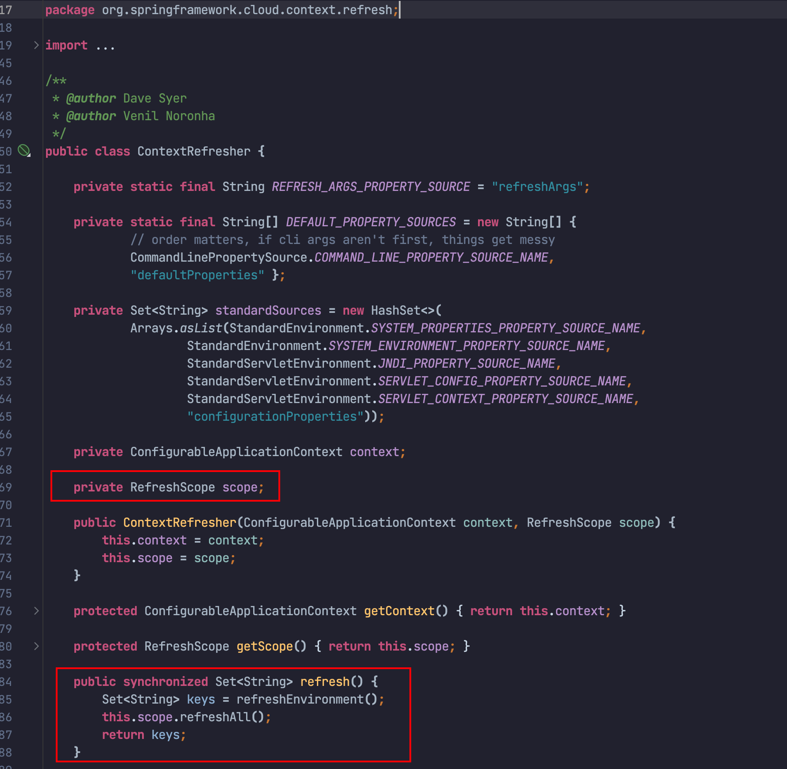

也就是说，只要我们调用ContextRefresher#refresh方法， 就可以置空所有refresh作用域的bean。

- 下一次业务请求过来时，Spring通过getBean -> doGetBean方法就可以重新创建Bean，并读取最新的配置注入该Bean。

> GenericScope是作用域的通用实现，每一种自定义的作用域bean都会维护在一个独立的缓存（StandardScopeCache内部的ConcurrentMap）中，都有独立的生命周期，与Spring的单例缓存隔离开来。
>
> - refresh作用域的实现就是RefreshScope，继承自GenericScope。
>   - RefreshScope是通过RefreshAutoConfiguration这个类自动装配到容器中，而GenericScope是实现了BeanFactoryPostProcessor，会在postProcessBeanFactory方法中将自己放入到ConfigurableListableBeanFactory的scopes属性中。
>   - 回到流程中的第一步
>     - 此时mbd.getScope()获取的就是bean修饰的@RefreshScope注解中的value=`refresh`
>     - 通过this.scopes.get("refersh")获取到的就是RefreshScope

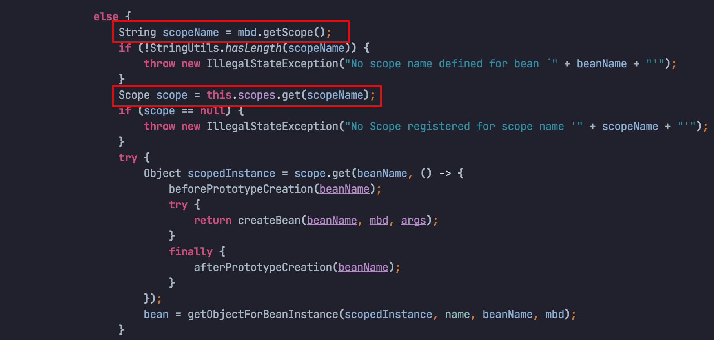

### 如何触发刷新事件 

在项目中引入Spring Boot Actuator，并配置暴露对应的端点接口`/actuator/refresh`

```yml
management:
  server:
    port: 8081
  endpoints:
    web:
      exposure:
        include: refresh
# curl -X POST http://localhost:8081/actuator/refresh
```

- 当调用 `/actuator/refresh` 时，`RefreshEndpoint` 会触发应用上下文的刷新操作，主要流程如下：

  - 从 Environment 中重新加载配置属性。

  - 更新 `@ConfigurationProperties` 和 `@Value` 注入的属性值。

  - 如果有使用 `@RefreshScope` 的 Bean，则会销毁这些 Bean，下次获取时就会重新触发 Bean 的创建过程。

#### RefreshEndpoint

- `@Endpoint` 注解是 Spring Boot Actuator 提供的一个核心注解，用于定义自定义的管理端点。
  - 通过 `EndpointDiscoverer` 类加载，这个类会扫描应用上下文中的所有 `@Endpoint` 注解的类。
  - 扫描到的端点会在 Spring 的 EndpointRegistry 中注册，并由 Spring MVC 或 WebFlux 自动映射到 `/actuator/{endpoint-id}` 的路径上，以供 HTTP 调用。
- `@WriteOperation` 标识映射为HTTP POST请求。
- 最后也是通过调用ContextRefresher#refresh方法，清空该作用域的所有Bean。

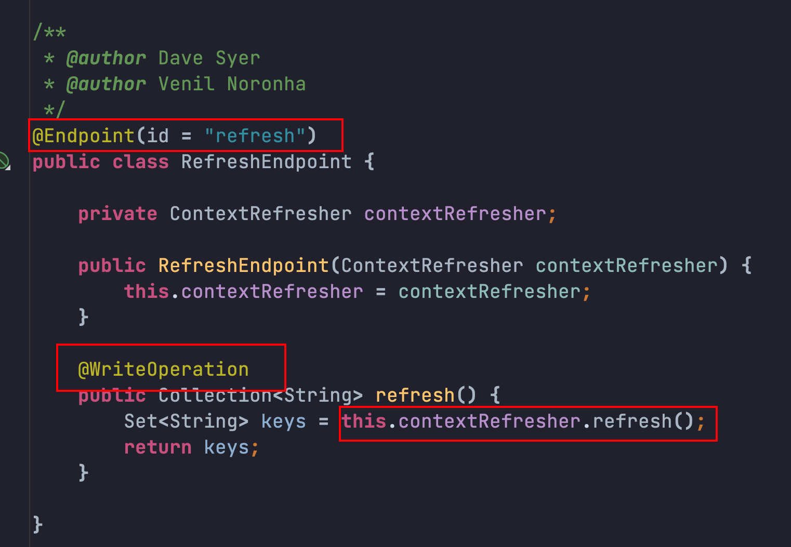


## 参考

[聊透Spring事件机制](https://juejin.cn/post/7140849555607650335)

[@RefreshScope实现动态刷新配置原理 ](https://www.cnblogs.com/zhaobo1997/p/18145195)

