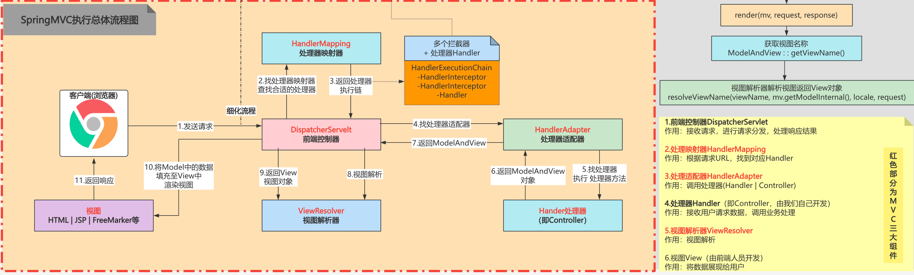

# SpringMVC

## 前言

介绍SpringMVC的基础信息，描述简单的实现过程流程。

## 核心概念

### 什么是SpringMVC

MVC英文是Model View Controller，是模型(model)－视图(view)－控制器(controller)的缩写，一种软件设计规范。本质上也是一种解耦。

- **Model**（模型）是应用程序中用于处理应用程序数据逻辑的部分。通常模型对象负责在数据库中存取数据。
- **View**（视图）是应用程序中处理数据显示的部分。通常视图是依据模型数据创建的。
- **Controller**（控制器）是应用程序中处理用户交互的部分。通常控制器负责从视图读取数据，控制用户输入，并向模型发送数据。

而Spring MVC是Spring在Spring Container Core和AOP等技术基础上，遵循上述Web MVC的规范推出的web开发框架，目的是为了简化Java栈的web开发。

### 九大内置组件

#### HandlerMappings

- HandlerMapping 是用来查找 Handler 的，也就是处理器，具体的表现形式可以是类也可以是方法。
- 比如，标注了@RequestMapping 的每个 method 都可以看成是一个Handler，由 Handler 来负责实际的请求处理。

#### HandlerAdapters

- 从名字上看，这是一个适配器。因为 Spring MVC 中 Handler 可以是任意形式的，只要能够处理请求便行, 但是把请求交给 Servlet 的时候，由于 Servlet 的方法结构都是如doService(HttpServletRequest req, HttpServletResponse resp) 这样的形式，让固定的 Servlet 处理方法调用 Handler 来进行处理，这一步工作便是 HandlerAdapter 要做的事。

#### HandlerExceptionResolvers

- 从这个组件的名字上看，这个就是用来处理 Handler 过程中产生的异常情况的组件。 
- 具体来说，此组件的作用是根据异常设置 ModelAndView, 之后再交给 render()方法进行渲 染 ， 而 render() 便将 ModelAndView 渲染成页面 。 不过有一点 ，HandlerExceptionResolver 只是用于解析对请求做处理阶段产生的异常，而渲染阶段的异常则不归他管了，这也是 Spring MVC 组件设计的一大原则分工明确互不干涉。

#### ViewResolvers

- 视图解析器，相信大家对这个应该都很熟悉了。因为通常在 SpringMVC 的配置文件中，都会配上一个该接口的实现类来进行视图的解析。 这个组件的主要作用，便是将 String 类型的视图名和Locale解析为View类型的视图。
- 这个接口只有一个resolveViewName()方法。从方法的定义就可以看出，Controller 层返回的 String 类型的视图名 viewName，最终会在这里被解析成为 View。View 是用来渲染页面的，也就是说，它会将程序返回的参数和数据填入模板中，最终生成 html 文件。ViewResolver 在这个过程中，主要做两件大事，即，ViewResolver 会找到渲染所用的模板（使用什么模板来渲染？）和所用的技术（其实也就是视图的类型，如 JSP 等）填入参数。
- 默认情况下，Spring MVC 会为我们自动配置一个 InternalResourceViewResolver，这个是针对 JSP 类型视图的。

#### RequestToViewNameTranslator

- 这个组件的作用，在于从 Request 中获取 viewName。
-  因为 ViewResolver 是根据ViewName 查找 View, 但有的 Handler 处理完成之后，没有设置 View 也没有设置ViewName， 便要通过这个组件来从 Request 中查找 viewName。

#### LocaleResolver
- 在上面我们有看到 ViewResolver 的 resolveViewName()方法，需要两个参数。那么第二个参数 Locale 是从哪来的呢，这就是 LocaleResolver 要做的事了。
-  LocaleResolver用于从 request 中解析出 Locale, 在中国大陆地区，Locale 当然就会是 zh-CN 之类，用来表示一个区域。这个类也是 i18n 的基础。

#### ThemeResolver
- 从名字便可看出，这个类是用来解析主题的。主题，就是样式，图片以及它们所形成的显示效果的集合。
- Spring MVC 中一套主题对应一个 properties 文件，里面存放着跟当前主题相关的所有资源，如图片，css 样式等。
- 创建主题非常简单，只需准备好资源，然后新建一个 “主题名.properties” 并将资源设置进去，放在 classpath 下，便可以在页面中使用了。 Spring MVC 中跟主题有关的类有 ThemeResolver, ThemeSource 和Theme。 
- ThemeResolver 负责从 request 中解析出主题名， ThemeSource 则根据主题名找到具体的主题， 其抽象也就是 Theme, 通过 Theme 来获取主题和具体的资源。

#### MultipartResolver

- 其实这是一个大家很熟悉的组件，MultipartResolver 用于处理上传请求，通过将普通的Request 包装成 MultipartHttpServletRequest 来实现。MultipartHttpServletRequest可以通过 getFile() 直接获得文件，如果是多个文件上传，还可以通过调用 getFileMap得到 Map<FileName, File> 这样的结构。
- MultipartResolver 的作用就是用来封装普通的 request，使其拥有处理文件上传的功能。

#### FlashMapManager

- 说到 FlashMapManager，就得先提一下 FlashMap。FlashMap 用于重定向 Redirect 时的参数数据传递，比如，在处理用户订单提交时，为了避免重复提交，可以处理完 post 请求后 redirect 到一个 get 请求，这个 get 请求可以用来显示订单详情之类的信息。这样做虽然可以规避用户刷新重新提交表单的问题，但是在这个页面上要显示订单的信息，那这些数据从哪里去获取呢，因为 redirect 重定向是没有传递参数这一功能的，如果不想把参数写进 url(其实也不推荐这么做，url 有长度限制不说，把参数都直接暴露，感觉也不安全)， 那么就可以通过 flashMap 来传递。只需要在 redirect 之前，将要传递的数据写入 request （可以通过ServletRequestAttributes.getRequest() 获得）的属性OUTPUT_FLASH_MAP_ATTRIBUTE 中，这样在 redirect 之后的 handler 中 Spring 就会自动将其设置到 Model 中，在显示订单信息的页面上，就可以直接从 Model 中取得数据了。而 FlashMapManager 就是用来管理 FlashMap 的。
  

## 原理分析

### 初始化阶段

1. **首先，当我们启动SpringBoot应用程序的时候，我们会创建SpringApplication对象并执行对应的run方法**
2. **在run方法中创建上下文ApplicationContext、打印Banner、准备上下文prepareContext、刷新上下文refreshContext等**
   - 默认创建AnnotationConfigServletWebServerApplicationContext（Web 应用）
3. **而在refreshContext方法中，其实就是执行SpringIOC流程的refresh方法，在后面的finishRefresh方法中会去初始化一个WebServer，默认实现是TomcatWebServer**
   - finishRefresh -> LifecycleProcessor#onRefresh
4. **在TomcatWebServer中会去初始化一个Servlet，而对应的实现类是DispatcherServlet，在init方法（父类实现）中执行initStrategies完成九大组件的初始化。**
   1. DispatcherServlet称为前端控制器，是SpringMVC整个流程控制的核心。负责接收请求，进行请求分发，处理响应结果。
   2. TomcatWebServer调用StandardWrapper#initServlet执行初始化
   3. HttpServletBean#init -> FrameworkServlet#initServletBean -> FrameworkServlet#initWebApplicationContext
   4. 在FrameworkServlet#initWebApplicationContext方法中执行对应子类DispatcherServlet的onRefresh方法

5. **在initStrategies方法中，把对应的HandlerMapping处理映射器、HandlerAdapter处理适配器、ViewResolvers视图解析器全部注入到IOC容器中。**
6. **而初始化Url和Controller的关联关系是由HandlerMapping的子类AbstractDetectingUrlHandlerMapping实现，在对应的initApplicationContext方法中会遍历所有bean，把Controller上的Url和BeanName保存到一个Map中，供后续HandlerMapping使用。**
   - 在AbstractUrlHandlerMapping#registerHandler方法存放`Map<urls,beanName> handlerMap = new LinkedHashMap<>();`

> 注意：默认项目启动的时候是不会加载去Servlet的，只有在第一次响应Web请求的时候才会去初始化。可以通过配置`spring.mvc.servlet.load-on-startup=1`，让DispatcherServlet在容器启动时就执行init方法。

### 调用阶段

1. **当程序接受到Request请求时，会统一拦截调用到DispatcherServlet#doService方法处理。**
2. **在内部的doDispatch()方法中首先通过getHandler()方法获取HandlerMapping，再通过Request请求的Url来匹配对应的Controller**
3. **DispatcherServlet找到Controller之后再通过HandlerAdapter去匹配具体的执行方法**
   1. 对应Adapter实现类是RequestMappingHandlerAdapter，通过handleInternal方法执行核心逻辑
4. **匹配逻辑就是把当前Controller上声明的Url和方法上声明的Url拼接起来，跟当前Request请求的Url循环匹配。**
5. **匹配成功之后得到具体的执行方法，再通过HandlerAdapter#handle方法执行调用，处理完成后返回一个ModelAndView对象。**
   - 具体的实现方法RequestMappingHandlerAdapter#invokeHandlerMethod -> invokeAndHandle
   - invokeAndHandle()最终要实现的目的就是：完成 Request 中的参数和方法参数上数据的绑定。
     - 通过getMethodArgumentValues()方法从Request中获取注入的参数（@RequestParam、 @PathVariable）
     - Spring MVC 中提供两种 Request 参数到方法中参数的绑定方式：
       - 通过注解进行绑定，@RequestParam。
       - 通过参数名称进行绑定。
     - 使用注解进行绑定，我们只要在方法参数前面声明@RequestParam(“name”)，就可以将 request 中参数 name 的值绑定到方法的该参数上。使用参数名称进行绑定的前提是必须要获取方法中参数的名称，Java 反射只提供了获取方法的参数的类型，并没有提供获取参数名称的方法。SpringMVC 解决这个问题的方法是用 asm 框架读取字节码文件，来获取方法的参数名称。asm 框架是一个字节码操作框架，关于 asm 更多介绍可以参考其官网。个人建议，使用注解来完成参数绑定，这样就可以省去 asm 框架的读取字节码的操作。
6. **DispatcherServlet接收到ModelAndView后，会使用 ViewResolver 来解析视图View，再把View渲染为HTML页面，最终再返回结果。**

#### Restful风格的MVC流程

1. **在目前项目都是前后端分离的情况下，通常都是直接返回一个JSON数据，而不是ModelAndView**
   - 通过@ResponseBody注解声明响应的数据格式为JSON
2. **HandlerAdapter在执行handler时，会通过RequestResponseBodyMethodProcessor处理返回值，在handleReturnValue方法中创建ServletServerHttpResponse，将返回值通过序列化写入这个Response的Body。**
3. **最后，返回一个null空的ModealAndView。**

## 参考资料

- 一步一步手绘Spring MVC运行时序图（Spring MVC原理） https://blog.csdn.net/weixin_38024782/article/details/109108162

- SpringMVC流程图 https://www.processon.com/view/link/63dc99aba7d181715d1f4569

- https://javabetter.cn/sidebar/sanfene/spring.html#_28-spring-mvc-%E7%9A%84%E6%A0%B8%E5%BF%83%E7%BB%84%E4%BB%B6

  