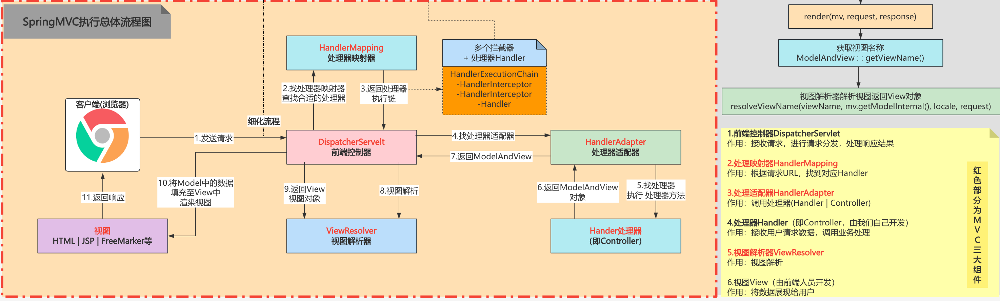

# SpringMVC（draft）

## 前言

介绍 SpringMVC 的基础信息，记录 SpringMVC 的工作流程。

## 核心概念

### 什么是SpringMVC

MVC的英文是Model View Controller，是模型(model)－视图(view)－控制器(controller)的缩写，一种软件设计规范。本质上也是一种解耦。

- **Model**（模型）是应用程序中用于处理应用程序数据逻辑的部分。通常模型对象负责在数据库中存取数据。
- **View**（视图）是应用程序中处理数据显示的部分。通常视图是依据模型数据创建的。
- **Controller**（控制器）是应用程序中处理用户交互的部分。通常控制器负责从视图读取数据，控制用户输入，并向模型发送数据。

而Spring MVC是Spring在Spring Container Core和AOP等技术基础上，遵循上述Web MVC的规范推出的web开发框架，目的是为了简化Java栈的web开发。

### Spring MVC 九大内置组件

Spring MVC 作为 Spring 框架的 Web 组件，内部提供了 九大核心组件（也称“九大策略”），用于处理 HTTP 请求并将其转换为合适的响应。它们在 DispatcherServlet 的 initStrategies 方法中被初始化。贯穿了请求的整个生命周期：

1. **HandlerMapping**：找到处理请求的 Controller。
2. **HandlerAdapter**：调用 Controller 处理请求。
3. **HandlerExceptionResolver**：处理 Controller 抛出的异常。
4. **ViewResolver**：解析 Controller 返回的视图名称。
5. **View**：渲染最终的页面或数据。
6. **LocaleResolver**：确定请求的语言环境（国际化）。
7. **ThemeResolver**：确定 Web 应用的 UI 主题。
8. **MultipartResolver**：处理文件上传请求。
9. **FlashMapManager**：支持请求间临时数据传递。

### **1. HandlerMapping（处理器映射器）**

- 作用：根据请求 URL 查找 **Handler（处理器）** 及其对应的 **拦截器链**。
- 常见实现：
  - `RequestMappingHandlerMapping`（基于 `@RequestMapping` 解析）
  - `SimpleUrlHandlerMapping`（基于 XML 配置的 URL 解析）

### **2. HandlerAdapter（处理器适配器）**

- 作用：执行 `HandlerMapping` 返回的处理器（Controller），并支持不同类型的处理器。
- 常见实现：
  - `RequestMappingHandlerAdapter`（处理 `@RequestMapping` 标注的方法）
  - `SimpleControllerHandlerAdapter`（处理 `Controller` 接口实现类）

### **3. HandlerExceptionResolver（异常解析器）**

- 作用：拦截处理器方法抛出的异常，并返回合适的响应。
- 常见实现：
  - `DefaultHandlerExceptionResolver`（处理 Spring 内置异常）
  - `ResponseStatusExceptionResolver`（处理 `@ResponseStatus` 注解的异常）
  - `ExceptionHandlerExceptionResolver`（处理 `@ExceptionHandler` 注解）

### **4. ViewResolver（视图解析器）**

- 作用：将 `Controller` 方法返回的 **逻辑视图名** 解析为 **具体的 View 视图对象**。
- 常见实现：
  - `InternalResourceViewResolver`（解析 JSP）
  - `ThymeleafViewResolver`（解析 Thymeleaf）
  - `FreeMarkerViewResolver`（解析 FreeMarker）

### **5. View（视图）**

- 作用：将数据渲染为最终的 HTML、JSON、XML 等格式返回给客户端。
- 常见实现：
  - `JstlView`（基于 JSP）
  - `ThymeleafView`（基于 Thymeleaf）
  - `MappingJackson2JsonView`（返回 JSON）

### **6. LocaleResolver（本地化解析器）**

- 作用：解析客户端语言信息，并选择合适的语言环境（国际化）。
- 常见实现：
  - `AcceptHeaderLocaleResolver`（默认使用 `Accept-Language` 头）
  - `SessionLocaleResolver`（基于 Session 存储的区域信息）
  - `CookieLocaleResolver`（基于 Cookie 存储的区域信息）

### **7. ThemeResolver（主题解析器）**

- 作用：用于解析 Web 应用的 UI 主题，以提供不同的样式或皮肤。
- 常见实现：
  - `FixedThemeResolver`（固定主题）
  - `SessionThemeResolver`（基于 Session 解析主题）
  - `CookieThemeResolver`（基于 Cookie 解析主题）

### **8. MultipartResolver（文件上传解析器）**

- 作用：解析 `multipart/form-data` 格式的请求，实现文件上传功能。
- 常见实现：
  - `StandardServletMultipartResolver`（基于 Servlet 3.0 的标准实现）
  - `CommonsMultipartResolver`（基于 Apache Commons FileUpload）

### **9. FlashMapManager（Flash 属性管理器）**

- 作用：用于在 **重定向前后** 传递临时数据（Flash Attributes）。
- 常见实现：
  - `SessionFlashMapManager`（基于 Session 存储 Flash 数据）

## 九大内置组件

#### HandlerMappings

- HandlerMapping 是用来查找 Handler 的，也就是处理器，具体的表现形式可以是类，也可以是方法。
- 比如，标注了@RequestMapping 的每个 method 都可以看成是一个Handler，由 Handler 来负责实际的请求处理。

#### HandlerAdapters

- 从名字上看，这是一个适配器。因为 Spring MVC 中 Handler 可以是任意形式的，只要能够处理请求便行, 但是把请求交给 Servlet 的时候，由于 Servlet 的方法结构都是如doService(HttpServletRequest req, HttpServletResponse resp) 这样的形式，让固定的 Servlet 处理方法调用 Handler 来进行处理，这一步工作便是 HandlerAdapter 要做的事。

#### HandlerExceptionResolvers

- 从这个组件的名字上看，这个就是用来处理 Handler 过程中产生的异常情况的组件。 
- 具体来说，此组件的作用是根据异常设置 ModelAndView, 之后再交给 render()方法进行渲 染 ， 而 render() 便将 ModelAndView 渲染成页面 。 不过有一点 ，HandlerExceptionResolver 只是用于解析对请求做处理阶段产生的异常，而渲染阶段的异常则不归他管了，这也是 Spring MVC 组件设计的一大原则分工明确互不干涉。

#### ViewResolvers

- 视图解析器，这个组件的主要作用，便是将 String 类型的视图名和Locale解析为View类型的视图。
- 通常在 SpringMVC 的配置文件中，都会配上一个该接口的实现类来进行视图的解析。 
- 这个接口只有一个resolveViewName()方法。从方法的定义就可以看出，Controller 层返回的 String 类型的视图名 viewName，最终会在这里被解析成为 View。View 是用来渲染页面的，也就是说，它会将程序返回的参数和数据填入模板中，最终生成 html 文件。ViewResolver 在这个过程中，主要做两件大事，即，ViewResolver 会找到渲染所用的模板（使用什么模板来渲染？）和所用的技术（其实也就是视图的类型，如 JSP 等）填入参数。
- 默认情况下，Spring MVC 会为我们自动配置一个 InternalResourceViewResolver，这个是针对 JSP 类型视图的。

#### RequestToViewNameTranslator

- 这个组件的作用，在于从 Request 中获取 viewName。
-  因为 ViewResolver 是根据ViewName 查找 View, 但有的 Handler 处理完成之后，没有设置 View 也没有设置ViewName， 便要通过这个组件来从 Request 中查找 viewName。

#### LocaleResolver
- 在上面我们有看到 ViewResolver 的 resolveViewName()方法，需要两个参数。那么第二个参数 Locale 是从哪来的呢，这就是 LocaleResolver 要做的事了。
-  LocaleResolver用于从 request 中解析出 Locale, 在中国大陆地区，Locale 当然就会是 zh-CN 之类，用来表示一个区域。这个类也是 i18n 的基础。

#### ThemeResolver
- 从名字便可看出，这个类是用来解析主题的。主题，就是样式，图片以及它们所形成的显示效果的集合。
- Spring MVC 中一套主题对应一个 properties 文件，里面存放着跟当前主题相关的所有资源，如图片，css 样式等。
- 创建主题非常简单，只需准备好资源，然后新建一个 “主题名.properties” 并将资源设置进去，放在 classpath 下，便可以在页面中使用了。 Spring MVC 中跟主题有关的类有 ThemeResolver, ThemeSource 和Theme。 
- ThemeResolver 负责从 request 中解析出主题名， ThemeSource 则根据主题名找到具体的主题， 其抽象也就是 Theme, 通过 Theme 来获取主题和具体的资源。

#### MultipartResolver

- 其实这是一个大家很熟悉的组件，MultipartResolver 用于处理上传请求，通过将普通的Request 包装成 MultipartHttpServletRequest 来实现。MultipartHttpServletRequest可以通过 getFile() 直接获得文件，如果是多个文件上传，还可以通过调用 getFileMap得到 Map<FileName, File> 这样的结构。
- MultipartResolver 的作用就是用来封装普通的 request，使其拥有处理文件上传的功能。

#### FlashMapManager

- 说到 FlashMapManager，就得先提一下 FlashMap。FlashMap 用于重定向 Redirect 时的参数数据传递，比如，在处理用户订单提交时，为了避免重复提交，可以处理完 post 请求后 redirect 到一个 get 请求，这个 get 请求可以用来显示订单详情之类的信息。这样做虽然可以规避用户刷新重新提交表单的问题，但是在这个页面上要显示订单的信息，那这些数据从哪里去获取呢，因为 redirect 重定向是没有传递参数这一功能的，如果不想把参数写进 url(其实也不推荐这么做，url 有长度限制不说，把参数都直接暴露，感觉也不安全)， 那么就可以通过 flashMap 来传递。只需要在 redirect 之前，将要传递的数据写入 request （可以通过ServletRequestAttributes.getRequest() 获得）的属性OUTPUT_FLASH_MAP_ATTRIBUTE 中，这样在 redirect 之后的 handler 中 Spring 就会自动将其设置到 Model 中，在显示订单信息的页面上，就可以直接从 Model 中取得数据了。而 FlashMapManager 就是用来管理 FlashMap 的。
  

1. HandlerMapping（处理器映射器）
职责 ：根据请求的URL、HTTP方法等信息，将请求映射到对应的处理器（Handler）146。
实现方式 ：通过@RequestMapping注解标注的方法或类均可视为Handler，HandlerMapping负责维护请求与Handler的映射关系810。
2. HandlerAdapter（处理器适配器）
职责 ：适配不同类型的Handler，使其符合Servlet的调用规范（如doService(HttpServletRequest, HttpServletResponse)）27。
典型场景 ：支持注解控制器（如@Controller）或自定义处理器类的调用。
3. HandlerExceptionResolver（异常解析器）
职责 ：捕获Handler执行期间的异常，并将其转换为对应的错误视图或响应（如ModelAndView）3。
限制 ：仅处理请求处理阶段的异常，不处理视图渲染阶段的异常。
4. ViewResolver（视图解析器）
职责 ：将逻辑视图名（String）与区域（Locale）解析为具体的视图对象（View）510。
默认实现 ：InternalResourceViewResolver用于JSP视图，支持模板技术（如Thymeleaf）的集成。
5. RequestToViewNameTranslator（请求视图名转换器）
职责 ：当Handler未明确指定视图名时，从请求中提取默认视图名（如URL路径）9。
6. LocaleResolver（区域解析器）
职责 ：解析请求的区域信息（如zh-CN），支持国际化（i18n）5。
实现示例 ：基于URL参数、Session或Accept-Language头的区域解析。
7. ThemeResolver（主题解析器）
职责 ：解析当前请求的主题（Theme），用于动态切换页面样式、图片等资源5。
配置方式 ：通过theme.properties文件定义主题资源，支持固定主题或用户自定义主题。
8. MultipartResolver（文件上传解析器）
职责 ：封装文件上传请求，将普通HttpServletRequest转换为MultipartHttpServletRequest，支持多文件处理7。
典型实现 ：CommonsMultipartResolver（需依赖Apache Commons FileUpload）。
9. FlashMapManager（FlashMap管理器）
职责 ：管理FlashMap，用于在重定向（Redirect）时传递临时数据（如表单提交后的结果）9。
工作原理 ：通过OUTPUT_FLASH_MAP_ATTRIBUTE存储数据，重定向后自动绑定到Model中。

## 原理分析

### 一、初始化阶段

1. **首先，当我们启动SpringBoot应用程序的时候，我们会创建SpringApplication对象并执行对应的`run`方法**
2. **在`run`方法中创建上下文ApplicationContext、打印Banner、准备上下文prepareContext、刷新上下文`refreshContext`等**
   - 默认创建AnnotationConfigServletWebServerApplicationContext（Web 应用）
3. **而在`refreshContext`方法中，其实就是执行SpringIOC流程的`refresh`方法，在后面的`finishRefresh`方法中会去初始化一个`WebServer`，默认实现是`TomcatWebServer`**
   - finishRefresh -> LifecycleProcessor#onRefresh
4. **在`TomcatWebServer`中会去初始化一个`Servlet`，而对应的实现类是`DispatcherServlet`，在init方法（父类实现）中执行`initStrategies`完成九大组件的初始化。**
   1. DispatcherServlet称为前端控制器，是SpringMVC整个流程控制的核心。负责接收请求，进行请求分发，处理响应结果。
   2. TomcatWebServer调用StandardWrapper#initServlet执行初始化
   3. HttpServletBean#init -> FrameworkServlet#initServletBean -> FrameworkServlet#initWebApplicationContext
   4. 在FrameworkServlet#initWebApplicationContext方法中执行对应子类DispatcherServlet的onRefresh方法

5. **在`initStrategies`方法中，把对应的`HandlerMapping`处理映射器、`HandlerAdapter`处理适配器、`ViewResolvers`视图解析器全部注入到IOC容器中。**
6. **而初始化`Url`和`Controller`的关联关系是由`HandlerMapping`的子类AbstractDetectingUrlHandlerMapping实现，在对应的`initApplicationContext`方法中会遍历所有bean，把`Controller`上的`Url`和`BeanName`保存到一个`Map`中，供后续`HandlerMapping`使用。**
   - 在AbstractUrlHandlerMapping#registerHandler方法存放`Map<urls,beanName> handlerMap = new LinkedHashMap<>();`

> 注意：默认项目启动的时候是不会加载去Servlet的，只有在第一次响应Web请求的时候才会去初始化。可以通过配置`spring.mvc.servlet.load-on-startup=1`，让**DispatcherServlet**在容器启动时就执行init方法。

### 二、调用阶段

1. **当程序接受到`Request`请求时，会统一拦截调用到`DispatcherServlet#doService`方法处理。**
2. **在内部的`doDispatch()`方法中首先通过getHandler()方法获取`HandlerMapping`，再通过`Request`请求的`Url`来匹配对应的`Controller`**
3. **`DispatcherServlet`找到`Controller`之后再通过`HandlerAdapter`去匹配具体的执行方法**
   1. 对应Adapter实现类是RequestMappingHandlerAdapter，通过handleInternal方法执行核心逻辑
4. **匹配逻辑就是把当前`Controller上声明的Url`和`方法上声明的Url`拼接起来，跟当前`Request请求的Url`循环匹配。**
5. **匹配成功之后得到具体的执行方法，再通过`HandlerAdapter#handle`方法执行调用，处理完成后返回一个`ModelAndView`对象。**
   - 具体的实现方法RequestMappingHandlerAdapter#invokeHandlerMethod -> invokeAndHandle
   - invokeAndHandle()最终要实现的目的就是：完成 Request 中的参数和方法参数上数据的绑定。
     - 通过getMethodArgumentValues()方法从Request中获取注入的参数（@RequestParam、 @PathVariable）
     - Spring MVC 中提供两种 Request 参数到方法中参数的绑定方式：
       - 通过注解进行绑定，@RequestParam。
       - 通过参数名称进行绑定。
     - 使用注解进行绑定，我们只要在方法参数前面声明@RequestParam(“name”)，就可以将 request 中参数 name 的值绑定到方法的该参数上。使用参数名称进行绑定的前提是必须要获取方法中参数的名称，Java 反射只提供了获取方法的参数的类型，并没有提供获取参数名称的方法。SpringMVC 解决这个问题的方法是用 asm 框架读取字节码文件，来获取方法的参数名称。asm 框架是一个字节码操作框架，关于 asm 更多介绍可以参考其官网。个人建议，使用注解来完成参数绑定，这样就可以省去 asm 框架的读取字节码的操作。
6. **`DispatcherServlet`接收到`ModelAndView`后，会使用 `ViewResolver` 来解析视图`View`，再把`View`渲染为HTML页面，最终再返回结果。**

#### Restful风格的MVC流程

1. **在目前项目都是前后端分离的情况下，通常都是直接返回一个JSON数据，而不是`ModelAndView`**
   - 通过`@ResponseBody`注解声明响应的数据格式为JSON
2. **`HandlerAdapter`在执行`handler`时，会通过`RequestResponseBodyMethodProcessor`处理返回值，在`handleReturnValue`方法中创建`ServletServerHttpResponse`，将返回值通过序列化写入这个`Response`的`Body`。**
3. **最后，返回一个null空的`ModealAndView`。**

## 参考资料

- 一步一步手绘Spring MVC运行时序图（Spring MVC原理） https://blog.csdn.net/weixin_38024782/article/details/109108162

- SpringMVC流程图 https://www.processon.com/view/link/63dc99aba7d181715d1f4569

- https://javabetter.cn/sidebar/sanfene/spring.html#_28-spring-mvc-%E7%9A%84%E6%A0%B8%E5%BF%83%E7%BB%84%E4%BB%B6

  

