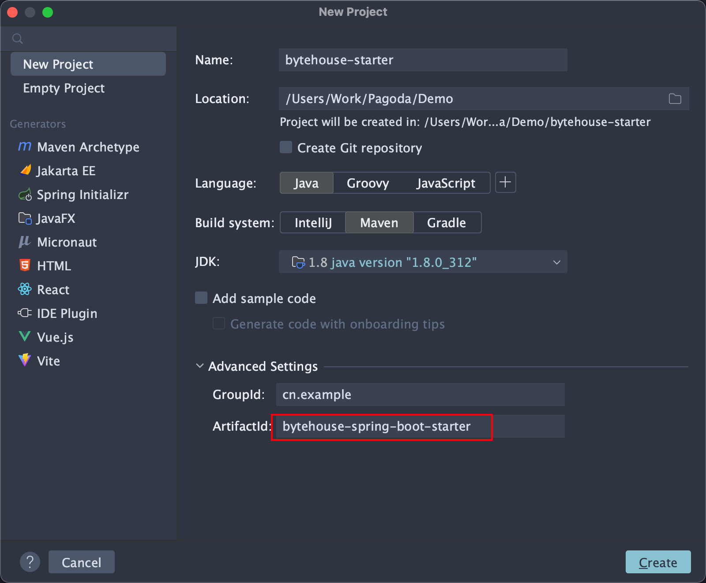
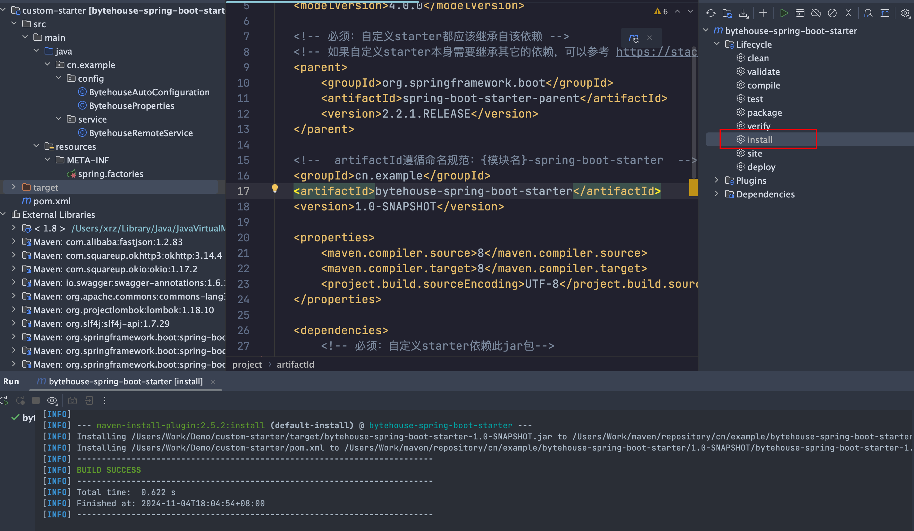
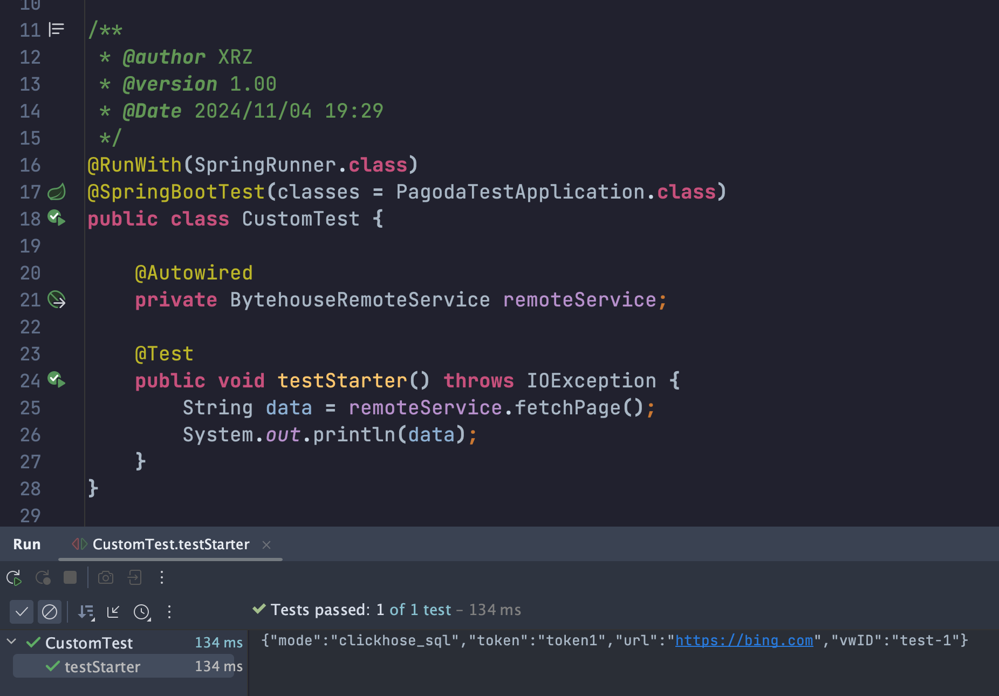

## 前言

Spring Boot 是一个用于简化 Spring 应用开发的框架。它通过约定优于配置的原则，让开发者能够快速启动和开发新应用。

## 核心概念

### 约定优于配置

约定优于配置是一个比较常见的软件设计思想，简单来说就是用一些通用的约定来减少人员手动配置。

- 比如SpringBoot内嵌的Tomcat端口默认为8080， 这就是一个默认的约定，不需要开发人员去配置。
- 只要当你想用8081端口时，才需要去配置。

### 核心特性

- 自动装配（Auto-Configuration）：是Spring Boot一个核心特性，旨在简化 Spring 应用的配置过程。

  - 自动装配是指 Spring Boot 根据应用的类路径和已配置的 Bean 自动为应用配置适合的组件。
  - 提供了一系列的起步依赖，例如 spring-boot-starter-web 用于构建 Web 应用，spring-boot-starter-data-jpa 用于数据访问，简化了 Maven 依赖管理。

- 内嵌服务器

  - Spring Boot 支持内嵌 Web 服务器（如 Tomcat、Jetty 或 Undertow），这意味着我们可以将应用打包为一个独立运行的 JAR 文件，而不需要依赖外部的应用服务器来部署。
  - 后续应用可以直接通过 `java -jar` 命令启动运行。

- 外部化配置

  - 外部化配置允许应用的配置参数（如数据库连接、端口等）从代码中分离出来，可以通过 `application.properties` 或 `application.yml` 文件、环境变量、命令行参数等多种方式进行配置。

    Spring Boot 还支持多环境配置，例如在 `application-dev.properties`、`application-prod.properties` 中定义不同环境的配置文件。

- 监控和管理（Spring Boot Actuator）：提供了监控和管理 Spring Boot 应用的功能，包括健康检查、应用指标、环境信息等。

  - 通过多种监控端点，如 `/actuator/health`、`/actuator/metrics`、`/actuator/env`来查看应用的状态和性能指标。

### 核心注解

#### @SpringBootApplication

@SpringBootApplication是SpringBoot的启动类注解，内部包含以下三个注解

- @SpringBootConfiguration：声明该类为配置类，即@Configuration。内含@Component，将加载为Bean。
- @EnableAutoConfiguration：启用自动配置功能（可以通过exclude属性排除不需要的配置类）。
  - 通过@Import注入AutoConfigurationImportSelector（负责读取spring.factories文件）
  - 通过@AutoConfigurationPackage的@Import注入AutoConfigurationPackages.Registrar
    - 这个注解的作用就是将主配置类（@SpringBootConfiguration标注的类）所在的包及其下面所有子包里面所有的组件扫描到IOC容器中。例如使用 `@Component`、`@Service`、`@Repository`、`@Controller` 等注解标记的类，会被 Spring 容器自动识别并注册为 Bean。
- @ComponentScan：自动扫描当前包及其子包中的 Spring 组件。

#### @Conditional

条件注解，每个自动配置类通常都用多个 @Conditional 注解控制是否激活。常见的条件注解包括：

- @ConditionalOnClass：只有在类路径中存在特定类时，才会激活配置。
- @ConditionalOnMissingBean：只有在 Spring 上下文中不存在特定 Bean 时，才会配置该 Bean。
- @ConditionalOnProperty：基于配置属性值是否满足条件来激活配置。

#### @Import

@Import是Spring专门用来注入配置类的一个注解。

注入的方式有三种：

- 静态注入：在配置类上直接声明需要导入的另一个配置类`@Import(AppConfig.class)`
  - 配置类指的是被@Configuration注解的类，其它@Component、@Service一样也可以。
  - 在Spring4.2之后，即使不是配置类也可以使用@Import注入。

- 动态注入：声明一个AppConfigSelector，通过实现ImportSelector接口重写selectImports方法，返回值是一个String[]，包含我们需要注入的Bean全类名。再通过`@Import(AppConfigSelector.class)`注入。
  - 在selectImports方法可以通过自定义逻辑动态选择（@Conditional）要注入的配置类。
  - Spring会把返参数组转换为BeanDefinition自动注册到容器中
- 动态注入-手动注册：通过实现ImportBeanDefinitionRegistrar接口重写registerBeanDefinitions方法实现，该方法入参一个BeanDefinitionRegistry，支持自定义注册BeanDefinition的逻辑。
  - 可以自行组装BeanDefinition信息进行注入

### spring.factories 文件

是Spring Boot 自动配置的核心文件，用于注册自动配置类。它通常位于项目的 `META-INF` 目录下，包含了一系列键值对，描述了接口与其实现类之间的映射关系。

### SpringBoot Starter

Spring Boot Starter 是一组方便的 Maven 依赖，旨在简化 Spring Boot 项目的配置和集成。

只需添加一个Starter启动器，便能自动引入该功能所需的所有相关依赖。

- 在业务场景中多用于构建通用模块（比如短信、邮件发送模块）

常见的Starter：

- **spring-boot-starter-web**：用于构建 Web 应用，包含 Spring MVC 和嵌入式 Tomcat 等依赖。
- **spring-boot-starter-security**：用于添加 Spring Security 功能，简化安全配置。
- **spring-boot-starter-test**：包含用于单元测试和集成测试的库，如 JUnit、Mockito 和 Spring Test。
- **spring-boot-starter-actuator**：提供生产环境监控和管理功能，如健康检查、指标收集等。
- **spring-boot-starter-mybatis**：用于集成 MyBatis，简化数据库操作和映射。
- **spring-boot-starter-webflux**：用于构建响应式 Web 应用，支持非阻塞式的应用程序。
- **spring-boot-starter-validation**：用于支持数据验证，集成 Hibernate Validator 和相关的注解。

## 自动配置的流程

>平时使用SpringBoot开发业务时，需要什么依赖我们直接在Maven的`pom.xml`文件中添加对应的`starter`就可以直接使用了。对应依赖的配置我们不需要关心，SpringBoot会帮我自动配置好，那么SpringBoot是如何实现的呢？

1. **首先，当我们启动SpringBoot应用程序的时候，我们会创建SpringApplication对象并执行对应的run方法**
2. **在run方法中创建上下文ApplicationContext、打印Banner、准备上下文prepareContext、刷新上下文refreshContext等**
   - 默认创建AnnotationConfigServletWebServerApplicationContext（Web 应用）
       - 在构造函数中通过AnnotatedBeanDefinitionReader执行AnnotationConfigUtils.registerAnnotationConfigProcessors方法，在此处==注册==各种关键的注解处理器：
         - `ConfigurationClassPostProcessor`：解析@Configuration、@ComponentScan、@Import、@Bean、@ImportResource、@PropertySource、@Profile
         - `AutowiredAnnotationBeanPostProcessor`：解析@Autowired
         - `CommonAnnotationBeanPostProcessor`：解析@PostConstruct、@PreDestroy
   - 核心方法：prepareContext、refreshContext

3. **在prepareContext方法中会创建BeanFactory，把当前启动类作为一个BeanDefinition注册到registry中**
   - 后续在Context的refresh方法中加载启动类时，会触发其相关注解的解析，如@SpringBootApplicaiton、@EnableAutoConfiguration。
4. **而在refreshContext方法中，其实就是执行SpringIOC流程的refresh方法。在invokeBeanFactoryPostProcessors方法会执行一个ConfigurationClassPostProcessor，通过这个对象的postProcessBeanDefinitionRegistry方法来解析@SpringBootApplicaiton、@EnableAutoConfiguration、@Bean、@Import等注解。**
     - ConfigurationClassPostProcessor类继续自BeanDefinitionRegistryPostProcessor和BeanFactoryPostProcessor。
       - 在postProcessBeanDefinitionRegistry方法中解析@PropertySource、@ComponentScan、@Bean、@Import等注解。

5. **而在解析@Import注解的时候会注入一个AutoConfigurationImportSelector，通过该Selector的selectImports方法加载`META-INF/spring.factories`配置文件，这个配置文件都是SpringBoot提前准备好的一些配置类，读取它们解析成BeanDefinition注入到Spring容器中，从而完成整体流程的自动配置。**
     - 解析@Import时会通过getImports方法从主类开始递归解析，确保所有@Import注解都能解析到。
     - 通过SpringFactoriesLoader#loadSpringFactories定位并解析所有 spring.factories 配置文件。
     - 通过ConfigurationClassPostProcessor#postProcessBeanDefinitionRegistry处理所有的配置类，包括自动配置类。
       - ConfigurationClassParser 会遍历 spring.factories 中的类名，将它们加载并解析成 ConfigurationClass。
       - ConfigurationClassBeanDefinitionReader 会将每个自动配置类转换为 BeanDefinition，并使用 BeanDefinitionRegistry.registerBeanDefinition 将其注册到 `BeanFactory` 中


## 自定义Starter

### 应用场景

前置1：产品有个需求，需要提供一个页面，支持查询业务单据操作日志，后端需要提供一些通过查询接口。

前置2：相关业务单据的操作日志通过一个record项目写入到了火山引擎的Bytehouse中。（Binlog + Flink CDC实现）

我们需要做的是在A项目中引入Bytehouse相关依赖，添加相关配置，接入相关API，经过service的处理再暴露接口给前端。过了一段时间，B项目、C项目也要接入Bytehouse，我们需要把上述过程在这些项目中重复一遍，太过繁琐了。于是决定把A项目中相关通用service处理、依赖、配置重新提取为一个独立的Starter。


其它项目直接在pom.xml文件中引用该Starter依赖，SpringBoot会通过自动配置完成依赖注入，然后在项目中注入相关Service即可使用。

#### 自动配置大致流程

- Spring Boot 在启动时通过 AutoConfigurationImportSelector 读取 META-INF/spring.factories 文件
- 根据 spring.factories 的配置加载 AutoConfiguration 自动配置类
- 再将配置类中符合 @Conditional 注解条件的 Bean 注入到容器中

> 只要遵循该流程规范，就可以简单的创建自定义的 Starter

### 创建Maven项目




注意命名规范：
- 官方的命名格式为 `spring-boot-starter-{xxxx}`
- 三方的命名格式为 `{xxxx}-spring-boot-starter`

#### 编写pom.xml文件

```xml
<?xml version="1.0" encoding="UTF-8"?>
<project xmlns="http://maven.apache.org/POM/4.0.0"
         xmlns:xsi="http://www.w3.org/2001/XMLSchema-instance"
         xsi:schemaLocation="http://maven.apache.org/POM/4.0.0 http://maven.apache.org/xsd/maven-4.0.0.xsd">
    <modelVersion>4.0.0</modelVersion>

    <!-- 必须：自定义starter都应该继承自该依赖 -->
    <!-- 如果自定义starter本身需要继承其它的依赖，可以参考 https://stackoverflow.com/a/21318359 解决 -->
    <parent>
        <groupId>org.springframework.boot</groupId>
        <artifactId>spring-boot-starter-parent</artifactId>
        <version>2.2.1.RELEASE</version>
    </parent>

    <!--  artifactId遵循命名规范：{模块名}-spring-boot-starter  -->
    <groupId>cn.example</groupId>
    <artifactId>bytehouse-spring-boot-starter</artifactId>
    <version>1.0-SNAPSHOT</version>

    <properties>
        <maven.compiler.source>8</maven.compiler.source>
        <maven.compiler.target>8</maven.compiler.target>
        <project.build.sourceEncoding>UTF-8</project.build.sourceEncoding>
    </properties>

    <dependencies>
        <!-- 必须：自定义starter依赖此jar包-->
        <dependency>
            <groupId>org.springframework.boot</groupId>
            <artifactId>spring-boot-autoconfigure</artifactId>
        </dependency>
        <!--非必须：编写配置文件时会有提示-->
        <dependency>
            <groupId>org.springframework.boot</groupId>
            <artifactId>spring-boot-configuration-processor</artifactId>
            <optional>true</optional>
        </dependency>

        <!--下按照项目所需，引入相关依赖-->
        <dependency>
            <groupId>org.projectlombok</groupId>
            <artifactId>lombok</artifactId>
            <optional>true</optional>
        </dependency>
        <dependency>
            <groupId>com.alibaba</groupId>
            <artifactId>fastjson</artifactId>
            <version>1.2.83</version>
            <optional>true</optional>
        </dependency>
    </dependencies>
</project>
```

`<optional>true</optional>`表示该依赖不会传递给其它项目。

例如当B项目引用该Starter时，B项目不能直接使用该依赖，如果要用就需要重新声明，或者通过该Starter来使用该依赖。

#### 编写propertis通用配置类

```java
@Data
@ConfigurationProperties(prefix = "bytehouse")
public class BytehouseProperties {

    private String url   = "https://www.baidu.con/";
    private String token = "asdfcga1dafasd";
    private String vwID  = "test-1";
    private String mode  = "clickhouse_sql"; // Enum: "ansi_sql" "clickhouse_sql"

}
```

`@ConfigurationProperties(prefix = "bytehouse")`表示将配置文件（如application.yml）中前缀为`bytehouse`的属性自动映射到当前类的属性上

#### 编写Service通用功能类

```java
@Setter
public class BytehouseRemoteService {

    private BytehouseProperties properties;

    public String fetchPage() throws IOException {
        // Http调用BytehouseAPI
        // 组装分页
        return JSONObject.toJSONString(properties);
    }
}
```

 例如BytehouseAPI是没有提供分页接口，我们在这里自行封装一个。

#### 编写AutoConfiguration自动配置类

```java
@Configuration(proxyBeanMethods = false)
@ConditionalOnClass(BytehouseRemoteService.class)
@EnableConfigurationProperties(BytehouseProperties.class)
public class BytehouseAutoConfiguration {

    @Autowired
    private BytehouseProperties bytehouseProperties;

    @Bean
    @ConditionalOnMissingBean
    public BytehouseRemoteService operationRecordService() {
        BytehouseRemoteService recordService = new BytehouseRemoteService();
        recordService.setProperties(bytehouseProperties);
        return recordService;
    }
}
```

- `@Configuration(proxyBeanMethods = false)`表示该类为配置类，内含@Component，将当前类加载为Bean。
    - **proxyBeanMethods = true (默认)**
        - Spring 会为 @Configuration 类生成一个 CGLIB 代理，使其 @Bean 方法变成“拦截”方法。
        - 每当调用 @Bean 方法时，Spring 会先检查该 Bean 是否已经存在于容器中，若存在则直接返回容器中的实例，若不存在则创建新的 Bean 并放入容器。这种方式可确保同一个 @Bean 方法在配置类内多次调用时获得的是同一实例。
    - **proxyBeanMethods = false**（适合多个@Bean方法之间没有依赖引用时使用）
        - Spring 不会为 @Configuration 类生成代理。这种情况下，@Bean 方法的每次调用都相当于直接执行该方法，每次调用都会创建一个新的实例，而不会从容器中获取已存在的实例。
- `@ConditionalOnClass(BytehouseRemoteService.class)`条件注解，表示项目中存在 BytehouseRemoteService.class 类时才生效该自动配置类
- `@EnableConfigurationProperties(BytehouseProperties.class)` 告诉Spring将BytehouseProperties注册为Bean。使用时就可以直接用`@Autowired`注入。
-  `@ConditionalOnMissingBean`条件注解，当Spring容器中不存在指定类型或返参的Bean才会注册。

#### 编写spring.factories文件

在 src/main/resources 下添加 META-INF/spring.factories 文件

```properties
org.springframework.boot.autoconfigure.EnableAutoConfiguration=\
  cn.example.config.BytehouseAutoConfiguration
```

- Key值为org.springframework.boot.autoconfigure.EnableAutoConfiguration

- Value值为自动配置类的全路径 cn.example.config.BytehouseAutoConfiguration

SpringBoot 会自动加载该文件并根据条件装配。

#### 打包install依赖

在 Maven 插件的 Lifecycle 下点击 install，打包项目并安装到本地 Maven 仓库中。

生成 starter 包：`bytehouse-spring-boot-starter`



### 测试Starter

#### 项目中引入Starter

在pom.xml文件中引入依赖

```xml
<dependency>
    <groupId>cn.example</groupId>
    <artifactId>bytehouse-spring-boot-starter</artifactId>
    <version>1.0-SNAPSHOT</version>
</dependency>
```

#### 调整配置（可选）

如果需要调整默认的配置，可以在application.yml文件中声明覆盖

```yaml
bytehouse:
  token: token1
  vw-i-d: test-1
  mode: clickhose_sql
  url: https://bing.com
```

#### 注入Service使用

在业务类或者测试类中使用@Autowired直接注入使用

```java
@RunWith(SpringRunner.class)
@SpringBootTest(classes = PagodaTestApplication.class)
public class CustomTest {
  
    @Autowired
    private BytehouseRemoteService remoteService;
  
    @Test
    public void testStarter() throws IOException {
        String data = remoteService.fetchPage();
        System.out.println(data);
    }
}
```

打印结果：{"mode":"clickhose_sql","token":"token1","url":"https://bing.com","vwID":"test-1"}



## 参考

- [SpringBoot自动装配原理，这一篇就够了！](https://mp.weixin.qq.com/s/f6oED1hbiWat_0HOwxgfnA)
- [自定义 SpringBoot-Starter](https://blog.csdn.net/aiwangtingyun/article/details/126557756)
- [Spring Boot Starters](https://www.nosuchfield.com/2017/10/15/Spring-Boot-Starters/)
- [聊透spring @Configuration配置类](https://juejin.cn/post/7189145749618163768)
