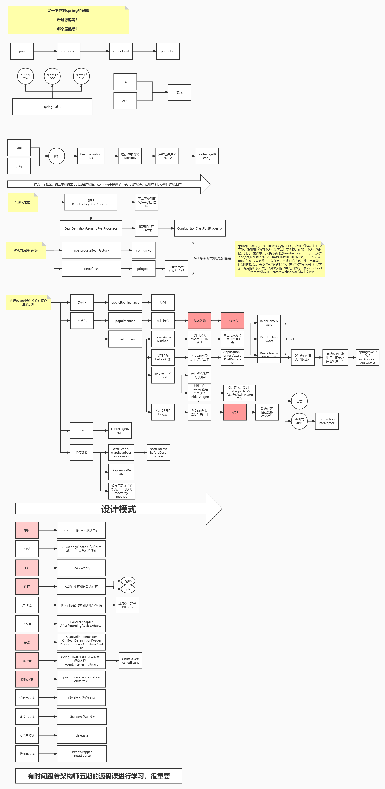

# Spring-Summary

一步一步手绘Spring DI运行时序图（Spring 自动装配之依赖注入）https://blog.csdn.net/weixin_38024782/article/details/108956819

一步一步手绘Spring AOP运行时序图（Spring AOP 源码分析）https://blog.csdn.net/weixin_38024782/article/details/109007161

- [x] Spring事件机制 
- [ ] Spring事务的实现
- [ ] Spring事务的传播
- [x] SpringMVC
- [x] SpringBoot
- [ ] OpenFeignClient
  - https://www.cnblogs.com/zzyang/p/18040165

## Spring流程图

## 答题技巧

总：当前问题回答的是那些具体的点

分：以1，2，3，4，5的方式分细节取描述相关的知识点，如果有哪些点不清楚，直接忽略过去

​		突出一些技术名词（核心概念，接口，类，关键方法）

​		避重就轻：没有重点

一个问题能占用面试官多少时间？问的越多可能露馅越多

当面试官问到一个你熟悉的点的时候，一定要尽量拖时间

---

找工作：

1、面试之前一定要调整好心态，不管你会多少东西，干就完了，出去面试就一个心态，老子天下第一，让自己超常发挥

2、得失心不要太重，全中国企业很多，好公司也有很多，没必要在一棵树上吊死，你可以有心仪的公司，留到最后，等你准备充分再去

3、找工作永远不可能准备好，很多同学怂，心态不好，不敢出去面试，我要准备，先按照你的技术储备取尝试一些公司（我就是来试水的）面试回来之后做总结，做好准备，不断总结，复盘，这样才能成长

4、希望大家保持好信息互通，乐于分享

## 常见面试题

### Spring中使用的设计模式

#### 单例模式 (Singleton Pattern)
单例模式确保一个类只有一个实例，并提供一个全局访问点，适用于频繁使用但需要确保线程安全的场景。单例模式常用于无状态服务类或共享资源类，如数据库连接池和日志记录器。

- Spring 容器中的默认 Bean 作用域为 `singleton`，确保每个 Bean 在容器中只有一个实例
- `ApplicationContext` 是 Spring 的单例容器，用于管理应用中所有的 Bean 实例
- `DefaultListableBeanFactory` 作为 Bean 容器的具体实现，提供单例 Bean 的创建和管理

#### 原型模式 (Prototype Pattern)
原型模式用于创建重复成本较高的对象，使得每次调用都会生成一个新对象的副本。这种模式适用于需要频繁创建的、有状态的对象。通过创建新的实例避免对象间状态互相影响。

- 作用域为 `prototype` 的 Bean，每次注入或获取时都会生成一个新实例，避免共享状态
- `ScopedProxyMode` 支持以代理方式注入 `prototype` Bean，从而能在单例对象中引用 `prototype` Bean

#### 模板方法模式 (Template Method Pattern)
模板方法模式定义了一个算法的骨架，并允许子类在不改变算法结构的情况下重写算法的某些步骤。它在框架设计中尤为常见，方便开发者根据需求自定义特定的实现逻辑。

- `JdbcTemplate` 的 `execute` 方法定义了数据库操作的模板，在执行 SQL 前后提供统一的操作流程
- `AbstractApplicationContext` 的 `refresh` 方法定义了 Spring 容器的初始化流程，包括加载 Bean 定义、实例化单例 Bean 等步骤
- `RestTemplate` 和 `WebClient` 使用模板方法封装了 HTTP 请求的通用逻辑，简化了客户端代码的编写

#### 观察者模式 (Observer Pattern)
观察者模式用于建立对象之间的一对多关系，使得当一个对象发生改变时，依赖它的其他对象会自动收到通知。它广泛用于事件驱动系统中，尤其适合模块之间的解耦。

- Spring 的事件驱动机制是观察者模式的实现，`ApplicationEventPublisher` 用于发布事件，`ApplicationListener` 用于监听和处理事件
- Spring 提供多种内置事件，如 `ContextRefreshedEvent`、`ContextClosedEvent`，用于在容器生命周期内触发通知
- 开发者可以自定义事件和监听器，用于模块间通信，实现松耦合

#### 简单工厂模式 (Simple Factory Pattern)
简单工厂模式通过接收参数来决定创建哪种对象，避免直接调用构造函数。适用于创建复杂对象的场景，使客户端不必直接依赖具体类。它可以灵活地返回不同的对象类型，常用于初始化类和实例的集中管理。

- `BeanFactory` 提供基于 Bean 名称和类型的实例化管理，将对象的创建逻辑从业务代码中解耦出来
- `XmlBeanFactory` 使用 XML 配置来定义 Bean，减少了业务代码对 Bean 初始化的直接依赖

#### 工厂方法模式 (Factory Method Pattern)
工厂方法模式定义了一个创建对象的接口，但将具体的实例化逻辑延迟到子类中。它使得客户端代码仅依赖于工厂接口而非具体类，方便扩展和维护。

- `FactoryBean` 接口用于自定义 Bean 的创建方式，可以根据业务需求动态返回不同的 Bean
- `ProxyFactoryBean` 用于创建代理对象，支持 Spring AOP 代理对象的灵活创建
- `LocalSessionFactoryBean` 在 Hibernate 中用于创建 `SessionFactory` 实例，简化了 Hibernate 配置

#### 装饰者模式 (Decorator Pattern)
装饰者模式用于在不改变对象结构的情况下为对象动态添加新功能。它通过将功能层层包装，实现灵活的功能扩展，同时避免类的数量迅速膨胀。

- `DataSourceWrapper` 类通过装饰器模式增强了数据源的功能，可以在不修改原始数据源的情况下增加日志、缓存等功能
- `BeanPostProcessor` 作为 Bean 初始化的增强器，在 Bean 创建过程中动态添加额外的行为
- `HandlerInterceptor` 为请求处理添加了拦截功能，如日志记录、认证校验等

#### 代理模式 (Proxy Pattern)
代理模式通过代理对象控制对目标对象的访问，允许在访问目标对象前后进行额外处理。Spring AOP 就是代理模式的典型应用，提供方法拦截和增强功能，如事务管理、权限验证等。

- Spring AOP 使用 JDK 动态代理实现接口代理，使得代理类仅需实现目标接口即可
- CGLIB 代理用于代理类而非接口，实现无接口类的动态代理
- `TransactionProxyFactoryBean` 生成事务管理的代理对象，简化了事务操作

#### 责任链模式 (Chain of Responsibility Pattern)
责任链模式将请求沿着处理链传递，直到某个处理者对请求做出响应，适用于多步骤处理或可选处理场景。责任链模式能够使多个对象都有机会处理请求，而无需明确指定处理者。

- AOP 的拦截器链使用责任链模式对方法进行多层次增强，例如在事务处理和日志记录中逐层拦截
- `DispatcherServlet` 中的 `HandlerInterceptor` 链按顺序拦截并处理 HTTP 请求
- `FilterChain` 使用责任链模式处理 Servlet 请求过滤器，按顺序执行每个过滤器逻辑

#### 适配器模式 (Adapter Pattern)
适配器模式将一个类的接口转换成另一个客户端期望的接口，通常用于接口不兼容但需要协同工作时。Spring 通过适配器模式对不同类型的接口进行统一封装，简化了框架的扩展性。

- `MethodInterceptor` 通过适配器将多种 `Advice` 转换为通用拦截器，增强 AOP 的适用范围
- `HandlerAdapter` 适配不同类型的控制器，使 Spring MVC 能处理多种控制器类型，如 `@Controller`、`HttpRequestHandler`
- `BeanFactoryAdapter` 适配 Bean 为 `FactoryBean` 类型，简化 Bean 获取方式

#### 策略模式 (Strategy Pattern)
策略模式定义了一系列算法，将每种算法封装在独立的策略类中，使得算法可以互相替换，适用于需要动态选择不同算法的场景。

- Spring 通过策略模式灵活选择不同的配置和资源加载方式。`XmlBeanDefinitionReader` 和 `PropertiesBeanDefinitionReader` 分别负责解析 XML 和属性配置文件

- `ResourceLoader` 根据不同的资源类型（如文件系统、类路径）加载资源
- `ConversionService` 选择不同的转换策略，用于类型转换

#### 委托模式 (Delegate Pattern)
委托模式将任务委托给其他类处理，适用于代码复用需求。Spring 中使用委托模式将部分功能代理给外部组件，便于集成外部框架和服务。

- `DelegatingFilterProxy` 将请求过滤委托给特定的安全框架，如 Shiro 或 Spring Security
- `RequestMappingHandlerAdapter` 委托请求处理给具体的控制器 Handler，简化请求处理流程
- `TransactionTemplate` 将事务操作委托给底层的事务管理器，实现事务管理的统一处理

### BeanFactory和FactoryBean的区别

相同点：都是用来创建bean对象的

不同点：使用BeanFactory创建对象的时候，必须要遵循严格的生命周期流程，太复杂了。如果想要简单的自定义某个对象的创建，同时创建完成的对象想交给spring来管理，那么就需要实现FactroyBean接口了
- isSingleton:是否是单例对象
- getObjectType:获取返回对象的类型
- getObject:自定义创建对象的过程(new，反射，动态代理)

### 谈谈你对Spring中AOP的理解

aop是ioc的一个扩展功能，先有的ioc，再有的aop，只是在ioc的整个流程中新增的一个扩展点而已：BeanPostProcessor

总：aop概念，应用场景，动态代理

分：

- bean的创建过程中有一个步骤可以对bean进行扩展实现，aop本身就是一个扩展功能，所以在BeanPostProcessor的后置处理方法中来进行实现
  1. 代理对象的创建过程（advice，切面，切点）
  2. 通过jdk或者cglib的方式来生成代理对象
  3. 在执行方法调用的时候，会调用到生成的字节码文件中，直接回找到DynamicAdvisoredInterceptor类中的intercept方法，从此方法开始执行
  4. 根据之前定义好的通知来生成拦截器链
  5. 从拦截器链中依次获取每一个通知开始进行执行，在执行过程中，为了方便找到下一个通知是哪个，会有一个CglibMethodInvocation的对象，找的时候是从-1的位置一次开始查找并且执行的。

### 谈谈你对Spring中事务这块的理解

spring的事务管理是如何实现的？

总：spring的事务是由aop来实现的，首先要生成具体的代理对象，然后按照aop的整套流程来执行具体的操作逻辑，正常情况下要通过通知来完成核心功能，但是事务不是通过通知来实现的，而是通过一个TransactionInterceptor来实现的，然后调用invoke来实现具体的逻辑

分：

- 先做准备工作，解析各个方法上事务相关的属性，根据具体的属性来判断是否开始新事务
- 当需要开启的时候，获取数据库连接，关闭自动提交功能，开起事务
- 执行具体的sql逻辑操作
- 在操作过程中，如果执行失败了，那么会通过completeTransactionAfterThrowing看来完成事务的回滚操作，回滚的具体逻辑是通过doRollBack方法来实现的，实现的时候也是要先获取连接对象，通过连接对象来回滚
- 如果执行过程中，没有任何意外情况的发生，那么通过commitTransactionAfterReturning来完成事务的提交操作，提交的具体逻辑是通过doCommit方法来实现的，实现的时候也是要获取连接，通过连接对象来提交
- 当事务执行完毕之后需要清除相关的事务信息cleanupTransactionInfo

如果想要聊的更加细致的话，需要知道TransactionInfo,TransactionStatus,

​	
