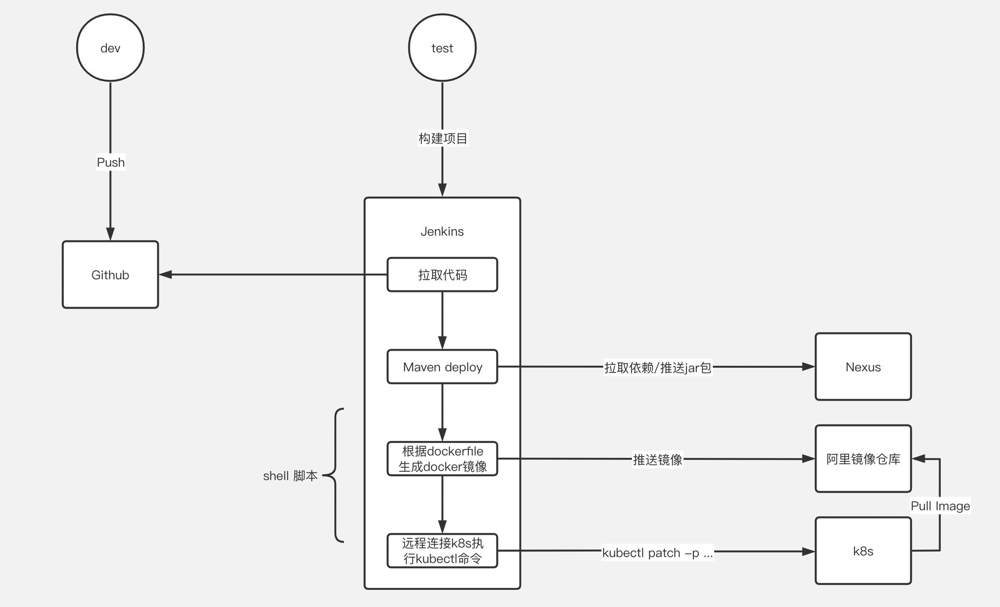
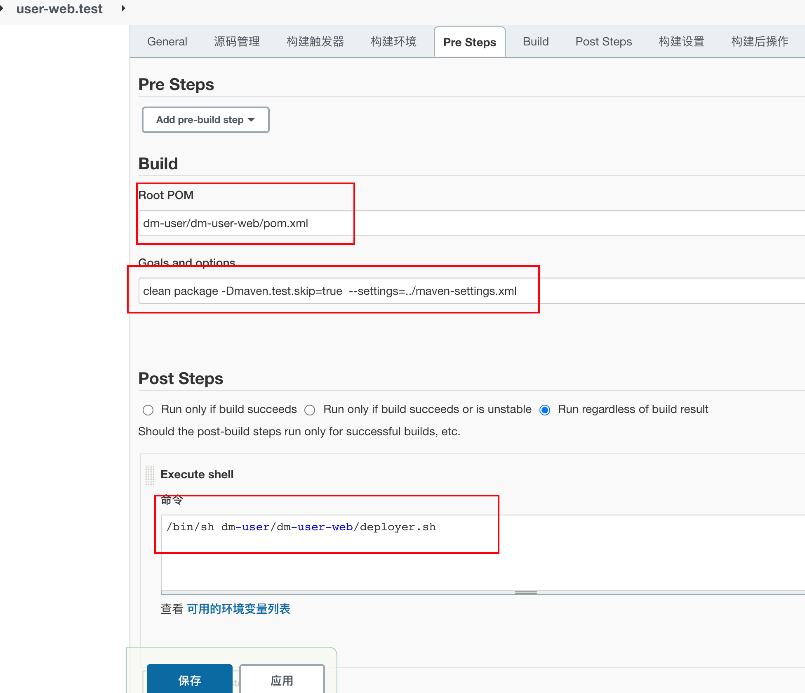
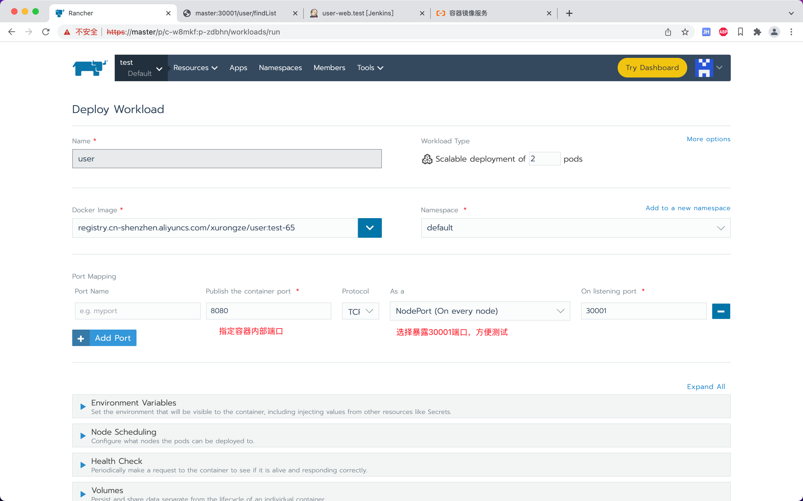
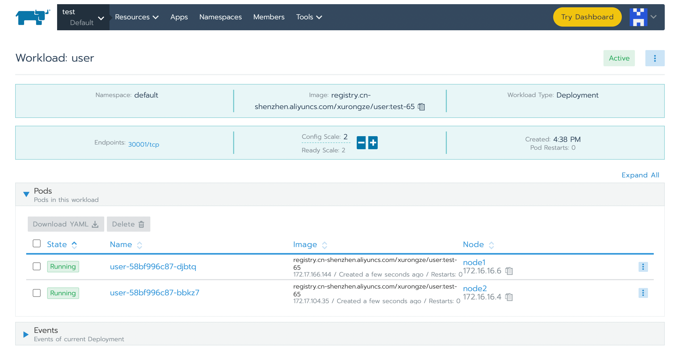
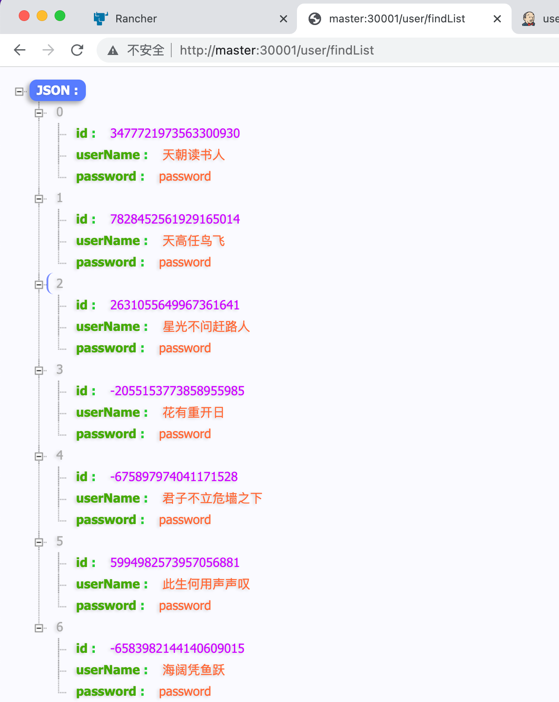
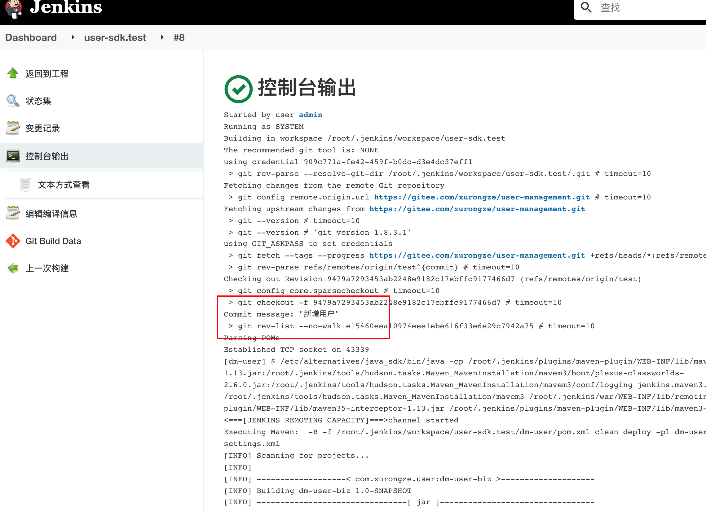
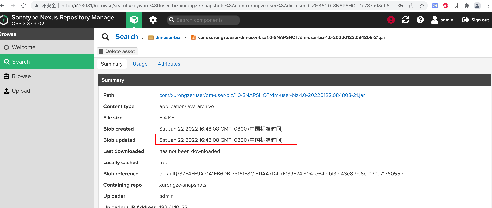
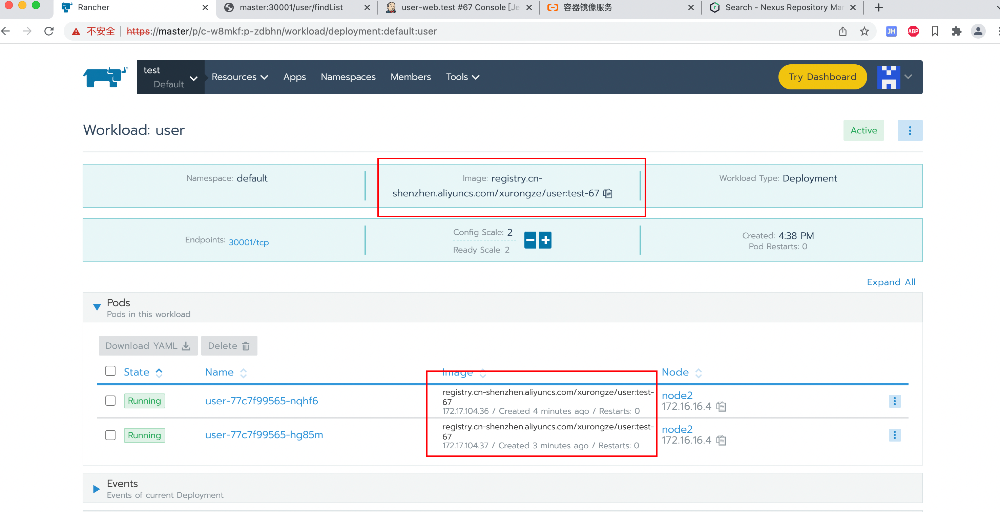
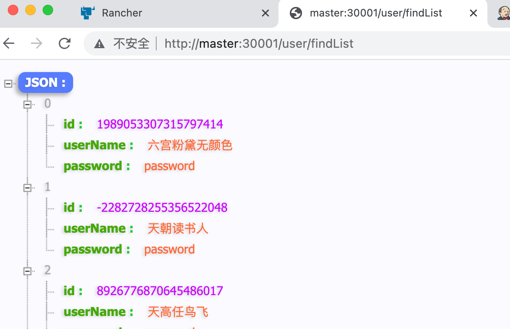

# CICD - Jenkins实现

## 流程

> 1. 开发人员推送代码至远程仓库
> 2. 测试人员在Jenkins上执行构建操作
> 3. Jenkins根据配置执行镜像构建、推送、远程更新



## 前置准备

#### 服务器

建议所有服务器均在同一VPC内，后续避免很多麻烦（此处只有BCC是在同一内网）

所有服务器均开放 所有端口、关闭防火墙、安装docker

| HostName | ServerType | Liunx OS  | Specs              |                            |
| -------- | ---------- | --------- | ------------------ | -------------------------- |
| master   | BCC        | CentOS7.6 | 2CPUs/4GB/40GB/1M  | kubernetes-master、rancher |
| node1    | BCC        | CentOS7.6 | 2CPUs/4GB/40GB/1M  | kubernetes-node1           |
| node1    | BCC        | CentOS7.6 | 2CPUs/4GB/40GB/1M  | kubernetes-node2           |
| x1       | LS         | CentOS7.6 | 2CPUs/8GB/100GB/8M | jenkins                    |
| x2       | LS         | CentOS7.6 | 2CPUs/8GB/100GB/8M | nexus、mysql               |

#### 项目

常规SpringBoot项目即可（文中使用dm-user-biz充当 sdk项目使用）

#### 远程代码仓库

选择使用Gitee（Github国内不太稳定）

#### 远程镜像仓库

选择使用阿里云的镜像容器服务（个人版镜像仓库数量上限为300）

#### Nexus安装

注意内存（默认大小是2703m）
- [Nexus安装和基本使用](./Nexus安装和基本使用.md)

#### Jenkins安装

使用war包方式安装（因需要在Jenkins内部进行docker相关操作，相比docker方式安装会避免很多不必要的麻烦）
- [Jenkins安装和基本使用](./Jenkins安装和基本使用.md)

#### Kubernetes安装

包含Rancher安装
- [Kubernetes安装和基本使用](../Kubernetes/1-Kubernetes安装和基本使用.md)

#### 相关组件安装

- [Mysql安装和基本使用](./Mysql安装和基本使用.md)
- [Docker安装和基本使用](./Docker安装和基本使用.md)

## 相关配置

#### 远程镜像仓库配置

- 在阿里镜像容器服务新增镜像仓库 user（仓库名称需和项目名称一致，方便后续进行推送）

####  Rancher私有镜像仓库凭据配置

- 命令行方式创建凭据（Master节点中配置）

  >   kubectl create secret docker-registry <SECRET_NAME> \
  >  --docker-server=<DOCKER_REGISTRY_SERVER> \
  >  --docker-username=<DOCKER_USER> \
  >  --docker-password=<DOCKER_PASSWORD> \
  >  -n [NAMESPACE]

  ```sh
  kubectl create secret docker-registry aliyun2 --docker-server=registry.cn-shenzhen.aliyuncs.com --docker-username=123 --docker-password=123 -n default
  
  #查看凭据
  kubectl get secret
  ```

  


- 使用rancher新增凭据

  集群 => 空间 => 资源 => 密文 => 镜像凭据列表 => 添加凭据

#### 项目配置

- 新增Dockerfile文件

  ```
  FROM openjdk:8
  ARG JAR_NAME
  ADD dm-${JAR_NAME}/dm-${JAR_NAME}-web/target/${JAR_NAME}.jar app.jar
  ENTRYPOINT ["java", "-jar", "/app.jar"]
  ```

  JAR_NAME变量由 `docker build --build-arg`命令声明传入

- 新增shell脚本

  ```sh
  #!/bin/bash
  
  #获取jenkins环境变量
  PROJECT_NAME=${JOB_NAME%%-*}
  PROJECT_ENV=${JOB_NAME#*.}
  
  REGISTRY_PRE="registry.cn-shenzhen.aliyuncs.com/xurongze"
  IMAGES_NAME="${REGISTRY_PRE}/${PROJECT_NAME}:${PROJECT_ENV}-${BUILD_NUMBER}"
  
  echo "================================================================构建镜像"
  docker build --build-arg JAR_NAME="${PROJECT_NAME}" -t $IMAGES_NAME  -f dm-$PROJECT_NAME/dm-$PROJECT_NAME-web/Dockerfile .
  echo "================================================================推送镜像"
  docker push $IMAGES_NAME
  echo "================================================================清理镜像"
  docker rmi $IMAGES_NAME
  kubectl patch deployments $PROJECT_NAME -p '{"spec": {"template": {"spec": {"containers": [{"name": "'${PROJECT_NAME}'", "image": "'${IMAGES_NAME}'", "imagePullPolicy": "IfNotPresent"}], "imagePullSecrets": [{"name": "aliyun"}]}}}}' --insecure-skip-tls-verify
  ```
  项目名称和环境通过 截取 Jenkins环境变量 `${JOB_NAME}`获取（Jenkins环境变量查看地址：http://x1:8080/env-vars.html）

  `${BUILD_NUMBER}`Jenkins环境变量：当前构建次数，此处用于生成镜像tag（提高辨识度）

  `kubectl patch deployments` 更新指定deployments（命令解释文档：http://docs.kubernetes.org.cn/632.html）

  `imagePullSecrets`指定私有镜像仓库凭据

  `--insecure-skip-tls-verify` 跳过 TLS 校验（因Jenkins部署的机器与k8s不在同一内网下，使用此命令跳过校验）


放置需build的项目根目录下（以上脚本均根据此目录编写）


项目上传至Gitee私有仓库

#### Jenkins配置

- docker登陆阿里云镜像仓库（用于推送私服）

  ```sh
  docker login --username=xxx registry.cn-shenzhen.aliyuncs.com
  ```

- 安装kubectl（用于管理k8s）

  ```sh
  #自定义kubernetes yum源
  cat <<EOF > /etc/yum.repos.d/kubernetes.repo
  [kubernetes]
  name=Kubernetes
  baseurl=http://mirrors.aliyun.com/kubernetes/yum/repos/kubernetes-el7-x86_64
  enabled=1
  gpgcheck=0
  repo_gpgcheck=0
  gpgkey=http://mirrors.aliyun.com/kubernetes/yum/doc/yum-key.gpg
   http://mirrors.aliyun.com/kubernetes/yum/doc/rpm-package-key.gpg
  EOF

  #生成yum缓存
  yum clean all && yum makecache

  #yum安装
  yum install -y kubectl-1.18.4 --disableexcludes=kubernetes
  ```

- 配置kubectl（远程操作集群）

  将master节点 `./kube/config` 文件复制至x1节点下

  ```sh
  scp ~/.kube/config root@x1:~/.kube/config
  ```

  编辑x1节点的 config文件，将 `clusters.server` 中的内网IP为Master节点的公网IP（如部署Jenkins机器 与K8s集群为同一内网可跳过）

- 新建Job，命名为【user-web.test】——首单词为项目名称，后缀为环境

- Git配置远程仓库信息

- Build设置

  
  `-Dmaven.test.skip=true` 不执行测试用例，也不编译测试用例类
  `--settings=../maven-settings.xml`指定settings.xml文件，配置Nexus私服账号密码

## 测试

####  Rancher上新增服务（第一次需手动部署）







#### 更改项目


#### 推送远程仓库


#### 构建sdk项目

推送Nexus私服 提供web项目引用



查看Nexus



####  构建web项目

注意当前构建次数为67


#### 查看阿里云私有镜像仓库

tag为 环境-构建次数


#### 查看Rancher中的Pods

已自动更新deployment的镜像




#### 浏览器访问




## 其它

- [Docker镜像体积优化](./Docker镜像体积优化.md)

- [CICD - 项目环境区分](./CICD%20-%20项目环境区分.md)
