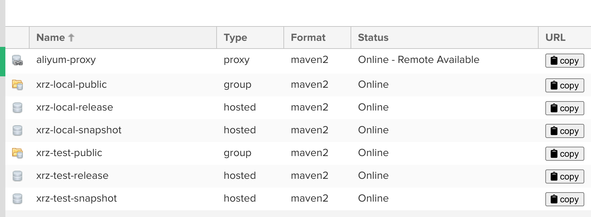
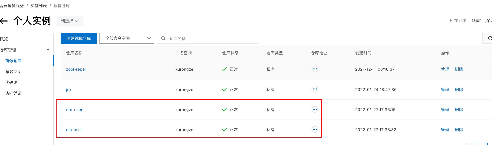
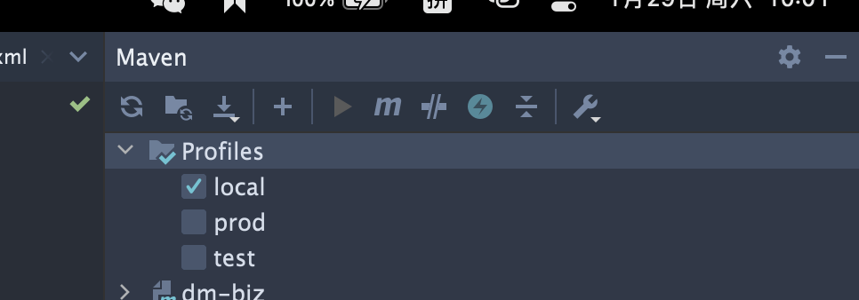

# CICD - 项目环境区分

## 前言

[CICD-Jenkins实现](./CICD%20-%20Jenkins实现.md)

在上一篇文章的基础下进行调整，增加环境区分 local、test、prod

## Nexus私服调整

清除所有仓库，新增带环境名的仓库

> local
>
> >xrz-local-public //jar包下载仓库
> >
> >xrz-local-release //正式版本jar包上传仓库
> >
> >xrz-local-snapshot //快照版本jar包上传仓库
>
> test
>
> > xrz-test-pulibc
> >
> > xrz-test-release
> >
> > xrz-test-snapshot




## 镜像仓库调整

删除原先镜像仓库，新增 ms-user、dm-user，这边选择使用tag进行项目环境区分；也可使用命名空间、镜像名称进行项目环境区分

> 完整镜像名称：registry.cn-shenzhen.aliyuncs.com/xurongze/ms-user:test-2
>
> > registry.cn-shenzhen.aliyuncs.com/命名空间/项目名称:环境-Jenkins构建次数




## 项目配置

#### pom文件调整

新增`profiles`节点

```xml
<profiles>
  <profile>
    <id>local</id>
    <properties>
      <!--提供application.yml使用 -->
      <package.environment>local</package.environment>
    </properties>
    <!--项目发布-->
    <distributionManagement>
      <repository>
        <id>xurongze-release</id>
        <url>http://x2:8081/repository/xrz-local-release/</url>
      </repository>
      <snapshotRepository>
        <id>xurongze-snapshots</id>
        <url>http://x2:8081/repository/xrz-local-snapshot/</url>
      </snapshotRepository>
    </distributionManagement>
    <!-- 依赖下载地址 -->
    <repositories>
      <repository>
        <id>xurongze</id>
        <url>http://x2:8081/repository/xrz-local-public/</url>
      </repository>
    </repositories>
  </profile>
  <profile...>
  <profile...>
</profiles>
```

maven刷新一下项目,idea侧边栏即可看见




#### application.yml文件调整

新增配置

```yml
spring:
  profiles:
    active: '@package.environment@'  //加载指定环境配置文件
```

`package.environment` 读取的是pom文件中的profile.properties节点

新增以环境结尾的application.yml文件，格式为：`application-{profile}.yml`

>application-local.yml
>
>application-test.yml
>
>application-prod.yml

## Jenkins配置调整

新增`-P test`命令，指定环境


end
