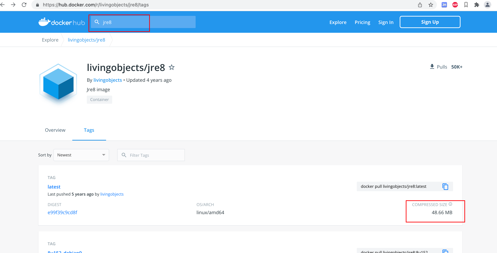

# Docker镜像体积优化

## 前言

无意中发现 项目jar包只有30M，然后构建出来的镜像居然有250多M。。

## Dockerfile

```dockerfile
FROM openjdk:8
ARG JAR_NAME
ADD dm-${JAR_NAME}/dm-${JAR_NAME}-web/target/${JAR_NAME}.jar app.jar
ENTRYPOINT ["java", "-jar", "/app.jar"]
```

根源是基础镜像 `openjdk:8`

`docker images`查看大小足有526M

而我们只是单纯的跑个jar包，jdk很多东西都用不到，更换jre即可

> jdk（开发运行环境：包含编译javac在内很多的工具类，也包括jre）

> jre（运行环境：java类库、jvm）

## 更换基础镜像

在dockerhub找一个最小的jre（也可自己制作），修改dockerfile文件（注意版本）

```dockerfile
FROM livingobjects/jre8:latest
ARG JAR_NAME
ADD dm-${JAR_NAME}/dm-${JAR_NAME}-web/target/${JAR_NAME}.jar app.jar
ENTRYPOINT ["java", "-jar", "/app.jar"]
```



效果


