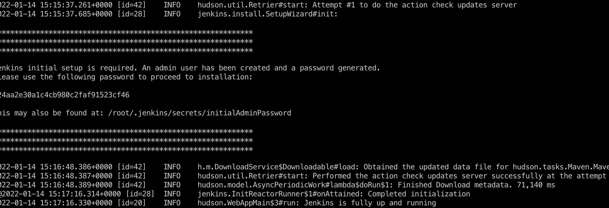
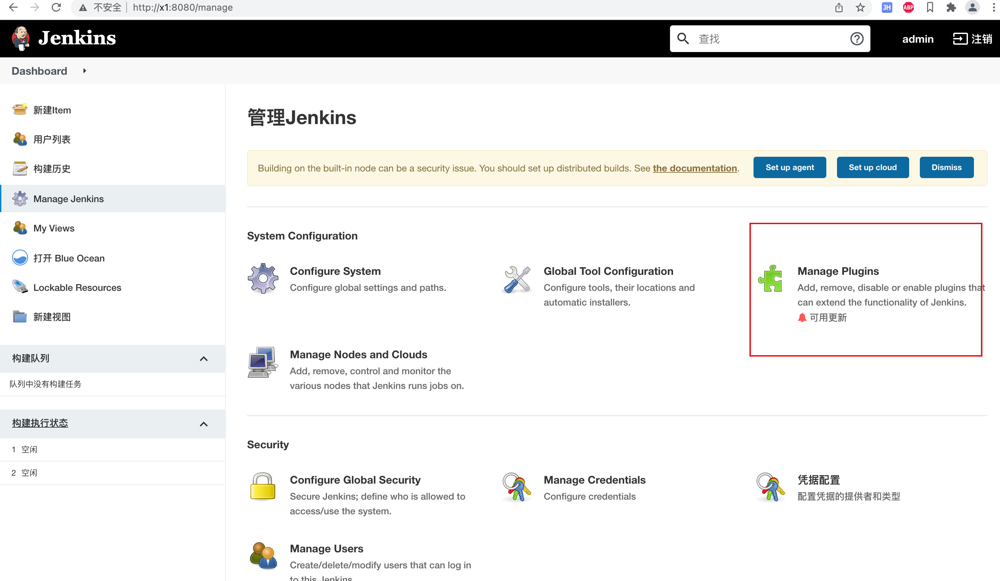
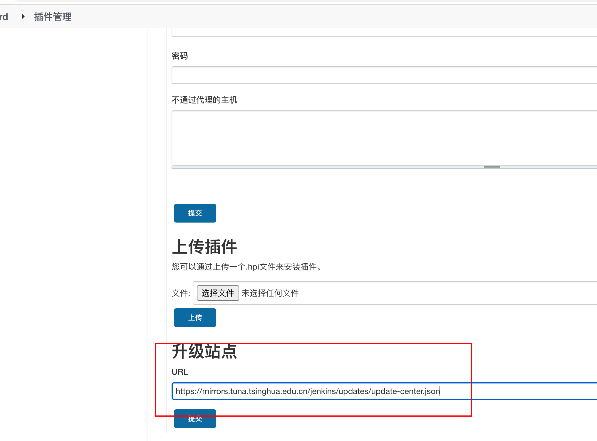
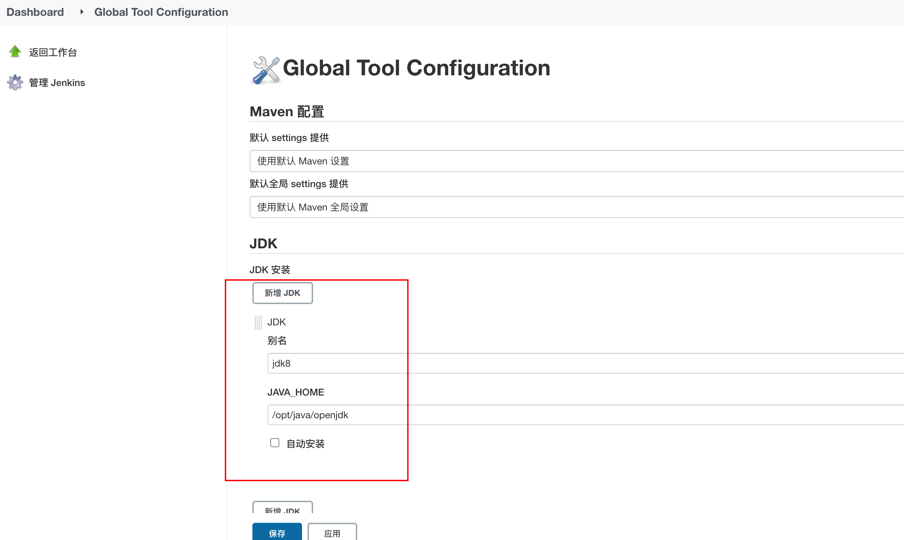
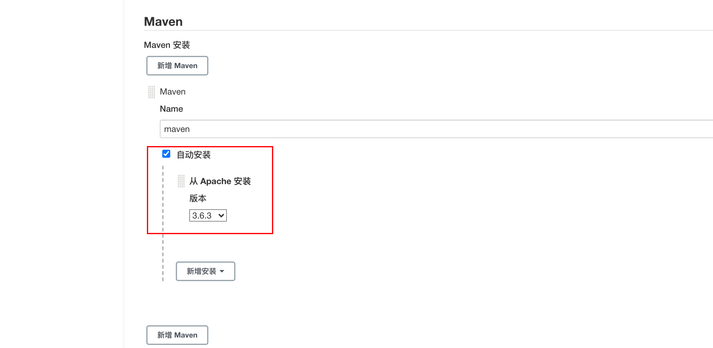
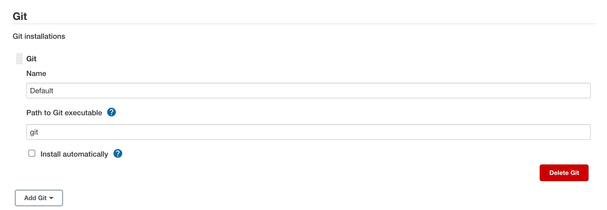
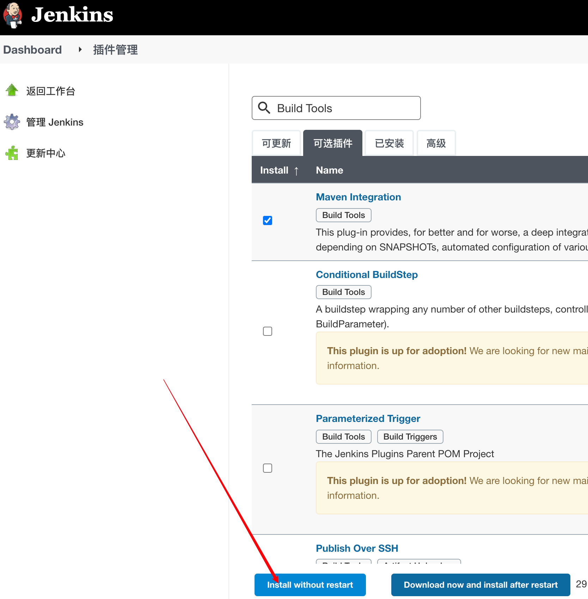
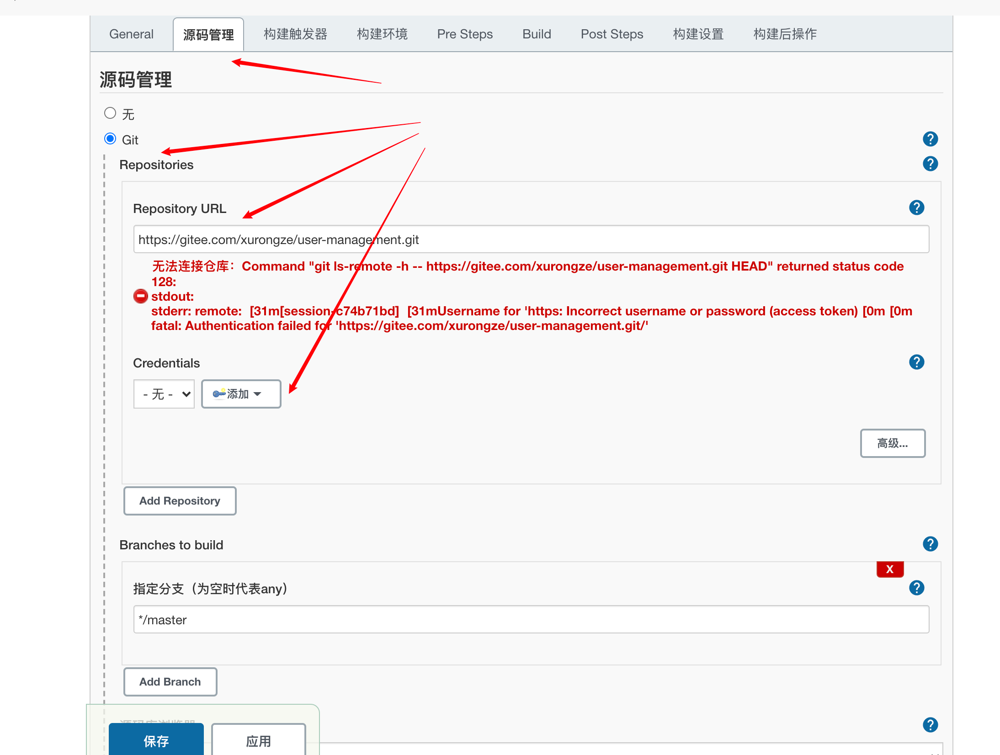
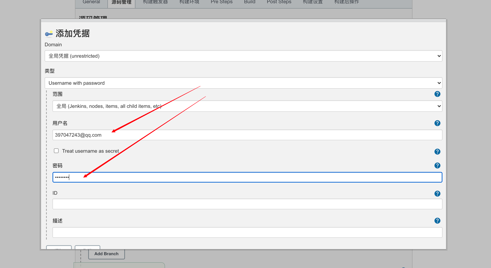
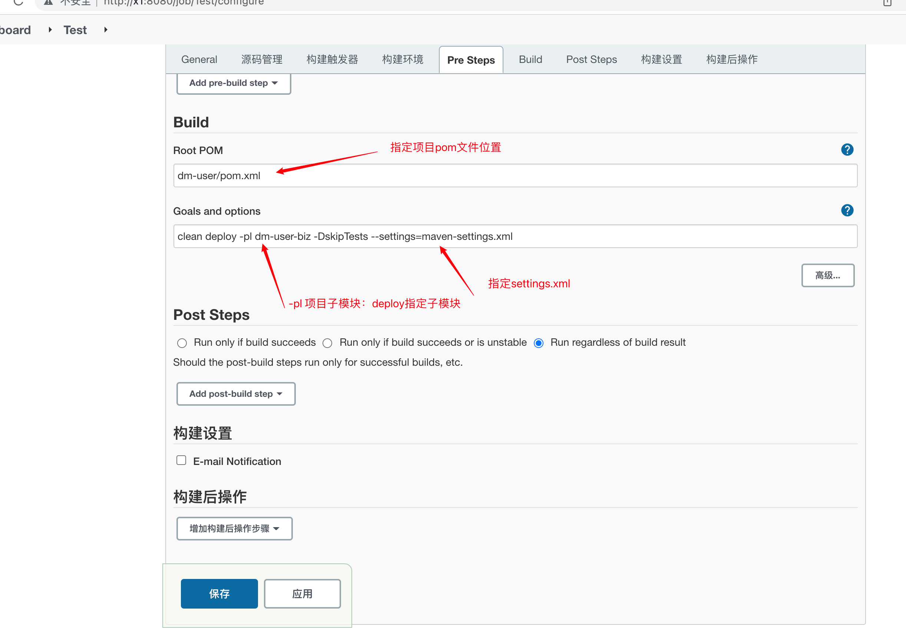

# Jenkins安装和基本使用

## 使用Docker安装

> 如果后续需要在jenkins中使用docker建议使用下方war包方式安装

直接run
```shell
docker run \
  --name jenkins-blueocean \
  -d \
  -p 8080:8080 \
  -p 50000:50000 \
  -v jenkins-data:/var/jenkins_home \
  jenkinsci/blueocean
```
进入容器内部查看密码
```shell
docker exec -it jenkins-blueocean /bin/bash

cat /var/jenkins_home/secrets/initialAdminPassword
```

## 使用war包安装

> 官方文档：https://pkg.jenkins.io/redhat-stable/

#### 配置安装JDK

```shell
#按需选择版本（默认安装 /usr/lib/jvm/ 下）
yum install java-1.8.0-openjdk* -y
```
默认$JAVA_HOME：`/etc/alternatives/java_sdk`

#### 下载安装Jenkins

```shell
#下载依赖
sudo wget -O /etc/yum.repos.d/jenkins.repo https://pkg.jenkins.io/redhat-stable/jenkins.repo --no-check-certificate

#导入密钥
sudo rpm --import https://pkg.jenkins.io/redhat-stable/jenkins.io.key

#安装
yum install epel-release
yum install jenkins
```

> 相关目录解释:
> /usr/lib/jenkins/：jenkins安装目录，war包会放在这里
> /etc/sysconfig/jenkins：jenkins配置文件，“端口”，“JENKINS_HOME”等都可以在这里配置
> /var/lib/jenkins/：默认的JENKINS_HOME
> /var/log/jenkins/jenkins.log：jenkins日志文件

#### 启动Jenkins
```shell
#直接控制台启动
java -jar /usr/lib/jenkins/jenkins.war

#后台启动
nohup java -jar /usr/lib/jenkins/jenkins.war  > jenkins.log  2>&1 &
```

> `jenkins.log  2>&1 &` 将标准输出和错误输出 写入 jenkins.log文件上


#### 配置Jenkins

查看密码（第一次启动时会有打印）
```shell
cat /root/.jenkins/secrets/initialAdminPassword
```



## 基本配置（建议安装推荐插件）

#### 更换插件下载源
> https://mirrors.tuna.tsinghua.edu.cn/jenkins/updates/update-center.json






#### 全局配置 和基础插件安装

- jdk
    - 容器内部有，无需安装，配置指定路径即可
      ```shell
      #进入容器内部
      docker exec -it jenkins-blueocean bash
  
      #查看jdk路径
      echo $JAVA_HOME
      ```
    - war包安装的使用 `/etc/alternatives/java_sdk`
- maven 选择自动安装，注意选择版本
- git 默认安装
    - war包安装方式  可执行 `yum install -y git` 快速安装






在插件管理中 直接安装，安装完成重启


## 测试项目构建

#### 新建job





#### 指定mvn命令

将指定项目打包 推送到私服

`clean deploy -pl dm-user-biz -DskipTests --settings=maven-settings.xml`

> `deploy -pl [module-name]`  //deploly 指定模块（有些项目是无需上传到私服的，即无需提供其它模块方引用，用此命令即可指定deploy的模块）

> `--settings=maven-settings.xml`  //此文件放置项目与pom文件同级 ，配置 server节点用于 上传下载nexus私服jar包





查看私服

