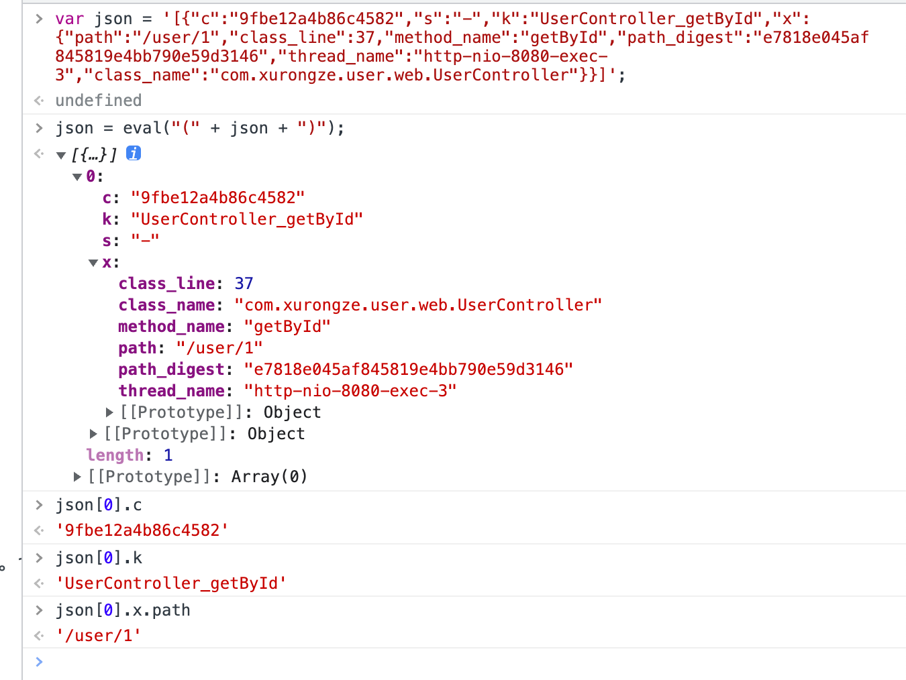

# 3-Kubernetes中的日志管理（EFK）

## 前言

前置：
- [Kubernetes安装和基本使用](./1-Kubernetes安装和基本使用.md)
- [CICD-Jenkins实现](../CICD/CICD%20-%20Jenkins实现.md)
- [CICD-项目环境区分](../CICD/CICD%20-%20项目环境区分.md)
- [Kubernetes中的服务发现](./2-Kubernetes中的服务发现.md)

在Kubernetes上的微服务架构系统上接入EFK日志系统。

#### 实现方案

- 使用Kubernetes的DaemonSet应用类型部署filebeat，负责收集docker容器内部`/var/lib/docker/containers`的日志，再推送到ELasticsearch
    - 收集日志的方案有很多，因为是kuberetes形式的微服务系统 ，最终选择使用官方最为推荐的方案
    - DaemonSet：k8s的一种应用类型，简单来说就会自动在每一台k8s工作节点上启动一个守护进程
- ELasticsearch，负责存储日志，提供强大的搜索功能
- Kibana，负责提供可视化的搜索操作页面

## 项目配置

选择使用Logtube，公司内部大佬开发的，觉得非常好用！

> GitHub文档：https://github.com/logtube/logtube-java/tree/master/docs

### POM文件调整

dm和ms项目进入jar包

```xml
<dependency>
  <groupId>io.github.logtube</groupId>
  <artifactId>logtube</artifactId>
  <version>0.43.0</version>
</dependency>
```

### 新增logtube.yml配置文件

放置src/main/resources目录下

```yml
logtube:
  # 项目名
  project: dm-user
  # 项目环境
  env: test
  topics:
    # 全局主题过滤器，设置为不包括 trace 和 debug
    root: ALL,-trace,-debug
  #
  # 分包主题过滤器
  #
  # logtube.topics.com.google.gson=error
  # logtube.topics.com.google.gson=error
  #
  # 全局主题映射，trace 合并进入 debug, error 重命名为 err
  topic-mappings: trace=debug,error=err
  ##########################################
  #
  # 命令行输出
  #
  ##########################################
  console:
    # 是否开启命令行输出，设置为关闭
    enabled: true
    # 命令行设置为包括所有主题
    topics: ALL

  ##########################################
  #
  # 文本日志文件输出 需要logtube 0.33
  #
  ##########################################
  file:
    # 是否开启文本日志文件输出，设置为开启
    enabled: true
    # 日志文件输出包含所有主题（仍然受制于全局过滤器）
    topics: ALL
    # 文本日志文件输出的默认文件夹
    dir: /logs
    # 文本日志信号文件，touch 该文件，会触发文件描述符重新打开，用于日志轮转
    signal: /tmp/xlog.reopen.txt
    subdir-mappings: ALL=xlog,trace=others,debug=others

  ##########################################
  #
  # 远程输出，SPTP 协议
  #
  ##########################################
  remote:
    # 是否开启远程输出，设置为关闭
    enabled: false
    # # 远程输出目标主机，设置为为 127.0.0.1:9921，可使用逗号分隔多个主机
    hosts: 127.0.0.1:9921
    # 远程输出设置为包含所有主题
    topics: ALL
  ##########################################
  #
  # 远程输出，Redis 协议
  #
  ##########################################
  redis:
    # 是否开启远程输出，设置为关闭
    enabled: false
    # 远程输出目标主机，设置为为 127.0.0.1:6379，可使用逗号分隔多个主机
    hosts: 127.0.0.1:6379
    # 远程输出 Redis 键值
    key: xlog
    # 远程输出设置为包含所有主题
    topics: ALL
  #########################################
  #
  # 组件配置
  #
  #########################################
  filter:
    # HTTP 过滤器忽略记录某些请求，比如健康检查
    # 默认已经包含 HEAD /, GET /check, GET /favicon.ico 等常见的无用请求
    http-ignores:
      - GET /health/check
    # 响应时间 > 100 ms 的 Redis 操作会被 LogtubeRedis 组件汇报
    redis-min-duration: 100
    # 结果集 > 1000 bytes 的 Redis 操作会被 LogtubeRedis 组件汇报
    redis-min-result-size: 1000
```

文本日志文件输出：可关闭，也可输出文件，提供日志收集框架处理；本文收集的是docker内部的日志。输出的日志文件只是用于备份或者当日志收集系统出问题、延迟等原因为能及时写入es时，可下载该日志进行查看。

### 注入LogFilter Bean

```java
package com.xurongze.user.config;

import io.github.logtube.http.LogtubeHttpFilter;
import org.springframework.boot.web.servlet.FilterRegistrationBean;
import org.springframework.context.annotation.Bean;
import org.springframework.context.annotation.Configuration;
import org.springframework.core.Ordered;

/**
 * @Author XRZ
 * @Date 2022/2/10 11:12
 * @Version :
 * @Description :
 */
@Configuration
public class LogtubeFilter {

    @Bean
    public FilterRegistrationBean xlogFilter(){
        FilterRegistrationBean<LogtubeHttpFilter> bean=new FilterRegistrationBean<>();
        bean.setFilter(new LogtubeHttpFilter());
        bean.addUrlPatterns("/*");
        bean.setOrder(Ordered.HIGHEST_PRECEDENCE+1);
        return bean;
    }
}

```

### Feign项目特殊配置

因dm是通过feign方式调用ms，为了保持`traceid`能够透传至ms，需要统一设置fegin请求头参数

```java
package com.xurongze.user.config;

import feign.RequestInterceptor;
import feign.RequestTemplate;
import io.github.logtube.Logtube;
import io.github.logtube.LogtubeConstants;
import org.springframework.context.annotation.Configuration;
import org.springframework.http.HttpHeaders;

/**
 * @Author XRZ
 * @Date 2022/2/10 11:38
 * @Version :
 * @Description : 统一设置fegin请求头参数，将logtube的crid传递至ms项目
 */
@Configuration
public class FeignRequestInterceptor implements RequestInterceptor {

    @Override
    public void apply(RequestTemplate requestTemplate) {
        requestTemplate.header(LogtubeConstants.HTTP_CRID_HEADER, Logtube.getProcessor().getCrid());
    }
}

```

### 使用试例

```java
package com.xurongze.user.web;

import com.xurongze.user.dto.UserDTO;
import com.xurongze.user.service.UserManagementService;
import io.github.logtube.Logtube;
import io.github.logtube.core.IEventLogger;
import org.springframework.beans.factory.annotation.Autowired;
import org.springframework.web.bind.annotation.*;

import java.util.List;

/**
 * @Author XRZ
 * @Date 2022/1/8 10:15
 * @Version :
 * @Description :
 */
@RestController
@RequestMapping("/user")
public class UserController {

    @Autowired
    public UserManagementService userManagementService;

    private static final IEventLogger LOGGER = Logtube.getLogger(UserController.class);

    @GetMapping("/{userId}")
    public UserDTO getById(@PathVariable Long userId){
        LOGGER.keyword("UserController_getById").info("[input]============>{}",userId);
        return userManagementService.getById(userId);
    }
}

```


## Docker容器日志配置

Docker默认的日志驱动（LogDriver）是json-driver，其会将日志以JSON文件的方式存储。所有容器输出到控制台的日志，都会以`*-json.log`的命名方式保存在`/var/lib/docker/containers/`目录下

- 限制容器日志大小

    - 修改`/etc/docker/daemon.json`文件，添加log-dirver和log-opts参数

      ```json
      {
            "log-driver":"json-file",
            "log-opts": {"max-size":"50m","max-file":"3"}
      }
      ```

      限制每个容器日志文件最大为50M和日志文件数量为三个（如果超过会向上滚动删除和删除最旧的文件）

      ```sh
      #重启docker服务
      systemctl daemon-reload
      systemctl restart docker
      ```

## 安装Elasticsearch、Kibana

均在一台独立的主机上使用docker安装，提供Kubernetes节点使用（因k8s内存有限，目前只用于部署应用服务）

### Elasticsearch

```sh
#拉取镜像
docker pull elasticsearch:7.7.1 

#启动容器
docker run -d \
-e ES_JAVA_POTS="-Xms512m -Xmx512m"  \
-e "discovery.type=single-node" \
-p 9200:9200 \
-p 9300:9300 \
--name es [镜像ID]
```

`-e ES_JAVA_POTS="-Xms512m -Xmx512m"`elasticsearch默认内存是两个多G，不足时可通过该指令指定内存

`-e "discovery.type=single-node"` 以单节点方式启动

测试访问：http://ip:9200

### Kibana

```sh
#拉取镜像
docker pull kibana:7.7.1 

#启动容器
docker run -d -p 5601:5601 --name kibana [镜像ID] 

#进入容器内部
docker exec -it kibana bash

#修改配置文件
vi config/kibana.yml
```

```yml
server.name: kibana
server.host: "0"
elasticsearch.hosts: [ "http://ip:9200" ] #修改Elasticsearch指定IP
monitoring.ui.container.elasticsearch.enabled: true
i18n.locale: "zh-CN" #汉化页面
```

测试访问：http://ip:5601

## 安装Filebeat

依据官方文档进行部署

> https://www.elastic.co/guide/en/beats/filebeat/current/running-on-kubernetes.html

下载官方提供的yaml文件

```sh
curl -L -O https://raw.githubusercontent.com/elastic/beats/8.0/deploy/kubernetes/filebeat-kubernetes.yaml
```

调整相关配置

```yaml
---
apiVersion: v1
kind: ConfigMap
metadata:
  name: filebeat-config
  namespace: kube-system
  labels:
    k8s-app: filebeat
data:
  filebeat.yml: |-
    filebeat.inputs: #日志收集来源
    - type: container
      paths:
        - /var/lib/docker/containers/*.log #调整对应路径
      processors:
        - add_kubernetes_metadata: #在日志上增加k8s元数据信息
            host: ${NODE_NAME}
            matchers:
            - logs_path:
                logs_path: "/var/lib/docker/containers/" #调整对应路径

    # To enable hints based autodiscover, remove `filebeat.inputs` configuration and uncomment this:
    #filebeat.autodiscover:
    #  providers:
    #    - type: kubernetes
    #      node: ${NODE_NAME}
    #      hints.enabled: true
    #      hints.default_config:
    #        type: container
    #        paths:
    #          - /var/log/containers/*${data.kubernetes.container.id}.log

    processors:
      - add_cloud_metadata:
      - add_host_metadata:

    cloud.id: ${ELASTIC_CLOUD_ID}
    cloud.auth: ${ELASTIC_CLOUD_AUTH}

    output.elasticsearch:
      hosts: ['${ELASTICSEARCH_HOST:elasticsearch}:${ELASTICSEARCH_PORT:9200}']
     	#username: ${ELASTICSEARCH_USERNAME} 无账号密码留空
      #password: ${ELASTICSEARCH_PASSWORD}
---
apiVersion: apps/v1
kind: DaemonSet
metadata:
  name: filebeat
  namespace: kube-system
  labels:
    k8s-app: filebeat
spec:
  selector:
    matchLabels:
      k8s-app: filebeat
  template:
    metadata:
      labels:
        k8s-app: filebeat
    spec:
      serviceAccountName: filebeat
      terminationGracePeriodSeconds: 30
      hostNetwork: true
      dnsPolicy: ClusterFirstWithHostNet
      containers:
      - name: filebeat
        image: docker.elastic.co/beats/filebeat:7.7.1 #调整对应版本
        args: [
          "-c", "/etc/filebeat.yml",
          "-e",
        ]
        env:
        - name: ELASTICSEARCH_HOST
          value: "106.12.117.225" #调整指定IP
        - name: ELASTICSEARCH_PORT
          value: "9200"
        - name: ELASTICSEARCH_USERNAME
          value: #无账号密码留空
        - name: ELASTICSEARCH_PASSWORD
          value: #无账号密码留空
        - name: ELASTIC_CLOUD_ID
          value:
        - name: ELASTIC_CLOUD_AUTH
          value:
        - name: NODE_NAME
          valueFrom:
            fieldRef:
              fieldPath: spec.nodeName
        securityContext:
          runAsUser: 0
          # If using Red Hat OpenShift uncomment this:
          #privileged: true
        resources:
          limits:
            memory: 200Mi
          requests:
            cpu: 100m
            memory: 100Mi
        volumeMounts:
        - name: config
          mountPath: /etc/filebeat.yml
          readOnly: true
          subPath: filebeat.yml
        - name: data
          mountPath: /usr/share/filebeat/data
        - name: varlibdockercontainers
          mountPath: /var/lib/docker/containers
          readOnly: true
        - name: varlog
          mountPath: /var/log
          readOnly: true
      volumes:
      - name: config
        configMap:
          defaultMode: 0640
          name: filebeat-config
      - name: varlibdockercontainers
        hostPath:
          path: /var/lib/docker/containers
      - name: varlog
        hostPath:
          path: /var/log
      # data folder stores a registry of read status for all files, so we don't send everything again on a Filebeat pod restart
      - name: data
        hostPath:
          # When filebeat runs as non-root user, this directory needs to be writable by group (g+w).
          path: /var/lib/filebeat-data
          type: DirectoryOrCreate
---
apiVersion: rbac.authorization.k8s.io/v1
kind: ClusterRoleBinding
metadata:
  name: filebeat
subjects:
- kind: ServiceAccount
  name: filebeat
  namespace: kube-system
roleRef:
  kind: ClusterRole
  name: filebeat
  apiGroup: rbac.authorization.k8s.io
---
apiVersion: rbac.authorization.k8s.io/v1
kind: RoleBinding
metadata:
  name: filebeat
  namespace: kube-system
subjects:
  - kind: ServiceAccount
    name: filebeat
    namespace: kube-system
roleRef:
  kind: Role
  name: filebeat
  apiGroup: rbac.authorization.k8s.io
---
apiVersion: rbac.authorization.k8s.io/v1
kind: RoleBinding
metadata:
  name: filebeat-kubeadm-config
  namespace: kube-system
subjects:
  - kind: ServiceAccount
    name: filebeat
    namespace: kube-system
roleRef:
  kind: Role
  name: filebeat-kubeadm-config
  apiGroup: rbac.authorization.k8s.io
---
apiVersion: rbac.authorization.k8s.io/v1
kind: ClusterRole
metadata:
  name: filebeat
  labels:
    k8s-app: filebeat
rules:
- apiGroups: [""] # "" indicates the core API group
  resources:
  - namespaces
  - pods
  - nodes
  verbs:
  - get
  - watch
  - list
- apiGroups: ["apps"]
  resources:
    - replicasets
  verbs: ["get", "list", "watch"]
---
apiVersion: rbac.authorization.k8s.io/v1
kind: Role
metadata:
  name: filebeat
  # should be the namespace where filebeat is running
  namespace: kube-system
  labels:
    k8s-app: filebeat
rules:
  - apiGroups:
      - coordination.k8s.io
    resources:
      - leases
    verbs: ["get", "create", "update"]
---
apiVersion: rbac.authorization.k8s.io/v1
kind: Role
metadata:
  name: filebeat-kubeadm-config
  namespace: kube-system
  labels:
    k8s-app: filebeat
rules:
  - apiGroups: [""]
    resources:
      - configmaps
    resourceNames:
      - kubeadm-config
    verbs: ["get"]
---
apiVersion: v1
kind: ServiceAccount
metadata:
  name: filebeat
  namespace: kube-system
  labels:
    k8s-app: filebeat
---
```

在kubernetes上的Master节点进行部署

```sh
kubkubectl apply -f filebeat-kubernetes.yaml
```

上Rancher或者通过`kubectl get ds -n kube-system -owide`命令查看启动状态


## 测试

### 先调用提前准备的项目生成日志


### 确认日志输出

- 直接在rancher上查看
- 在工作节点的`/var/lib/docker/containers/`目录查看


###  在Kibana上查看

访问：http://x3:5601/

提示先创建索引（默认生成一个`filebeat-*`索引）


搜索指定内容


## 日志打印优化

目前日志打印的格式属实有点不尽人意

### 调整思路

1. 利用好Logtube打印的日志，文件目录统一调整输出至/logs。
2. 所有的应用Pod增加数据挂载卷，将主机/logs的目录映射到容器内部/logs。
3. 确保所有工作节点上的Pod日志都输出在 同一路径，方便filebeat收集。
4. 调整filebeat的输入输出
    1. 根据Log文件名创建对应的索引
    2. 简单处理一下日志（根据logtube打印的格式进行调整）

### 项目调整

调整logtube.yml配置文件，增加环境配置

`logtube.yml`

```yml
logtube:
  config-file: logtube-@package.environment@.yml #引入pom文件 profile.properties 环境变量；需要启用 resources filtering
```

`logtube-test.yml`

```yml
logtube:
  project: dm-user
  env: local
  ...
  file:
    enabled: true
    topics: ALL
    dir: /logs #文件目录统一调整输出至/logs
```

输出log文件名格式为`[env].[info or warn or error].[项目名].log`（后续用于生成索引）


### Kuberentes调整

直接上Rancher调整对应的项目，增加主机路径映射


在node节点上查看/logs/xlog目录


### Filebeat调整

调整后的filebeat-kubernetes.yaml

主要修改两个地方：

- filebeat.yml相关配置
    - 根据logtube输出的日志文件进行索引区分，再通过processors对内容进行简单的处理
    - processors官方详细文档 https://www.elastic.co/guide/en/beats/filebeat/8.0/filtering-and-enhancing-data.html
- filebeat容器调整挂载目录/logs/xlog/

```yml
---
apiVersion: v1
kind: ConfigMap
metadata:
  name: filebeat-config
  namespace: kube-system
  labels:
    k8s-app: filebeat
data:
  filebeat.yml: |-
    filebeat.inputs:
      - type: log
        paths:
          - /logs/xlog/test.info.*.log
        fields:
          env: test
          type: info
      - type: log
        paths:
          - /logs/xlog/test.warn.*.log
        fields:
          env: test
          type: warn
      - type: log
        paths:
          - /logs/xlog/test.err.*.log
        fields:
          env: test
          type: err
        # 多行分割模式（异常需要特殊处理）
        multiline.pattern: '^\[\d{4}[/-]\d{2}[/-]\d{2} \d{2}:\d{2}:\d{2}.\d+'
        multiline.negate: true
        multiline.match: after
      - type: log
        paths:
          - /logs/xlog/test.x-access.*.log
        fields:
          env: test
          type: x-access

    #7版本自定义ES的索引需要把ilm设置为false
    setup.ilm.enabled: false

    #数据处理
    processors:
      - drop_fields: #移除无用字段
          fields: ["ecs", "agent", "log", "input", "host"]
      - script: #使用指定脚本处理
          lang: javascript
          id: logtube
          source: >
            function process(event) {
              var msg = event.Get("message");

              //根据日志格式处理
              var jsonIndexStart = msg.indexOf("[{");
              var jsonIndexEnd = msg.indexOf("}]");

              var json = msg.substring(jsonIndexStart,jsonIndexEnd+2);
              var newMsg = msg.substring(jsonIndexEnd+2);

              //转换message中的json对象
              json = eval("(" + json + ")");

              //设置字段
              event.Put("crid", json[0].c);
              event.Put("keyword", json[0].k);
              event.Put("path", json[0].x.path);
              //event.Put("logtube.message", newMsg);
              event.Put("message", newMsg);
							//异常信息处理
              if(json[0].x.exception_stack != null){
                  event.Put("logtube.error", json[0].x.exception_stack);
              }
            }

    output.elasticsearch:
      hosts: ['${ELASTICSEARCH_HOST:elasticsearch}:${ELASTICSEARCH_PORT:9200}']
      indices:
        - index: "test-info-%{+yyyy.MM.dd}"
          when.equals:
            fields:
              env: "test"
              type: "info"
        - index: "test-warn-%{+yyyy.MM.dd}"
          when.equals:
            fields:
              env: "test"
              type: "warn"
        - index: "test-err-%{+yyyy.MM.dd}"
          when.equals:
            fields:
              env: "test"
              type: "err"
        - index: "test-x-access-%{+yyyy.MM.dd}"
          when.equals:
            fields:
              env: "test"
              type: "x-access"
---
apiVersion: apps/v1
kind: DaemonSet
metadata:
  name: filebeat
  namespace: kube-system
  labels:
    k8s-app: filebeat
spec:
  selector:
    matchLabels:
      k8s-app: filebeat
  template:
    metadata:
      labels:
        k8s-app: filebeat
    spec:
      serviceAccountName: filebeat
      terminationGracePeriodSeconds: 30
      hostNetwork: true
      dnsPolicy: ClusterFirstWithHostNet
      containers:
        - name: filebeat
          image: docker.elastic.co/beats/filebeat:7.7.1
          args: [
              "-c", "/etc/filebeat.yml",
              "-e",
          ]
          env:
            - name: ELASTICSEARCH_HOST
              value: "106.12.117.225"
            - name: ELASTICSEARCH_PORT
              value: "9200"
            - name: ELASTICSEARCH_USERNAME
              value:
            - name: ELASTICSEARCH_PASSWORD
              value:
            - name: ELASTIC_CLOUD_ID
              value:
            - name: ELASTIC_CLOUD_AUTH
              value:
            - name: NODE_NAME
              valueFrom:
                fieldRef:
                  fieldPath: spec.nodeName
          securityContext:
            runAsUser: 0
            # If using Red Hat OpenShift uncomment this:
            #privileged: true
          resources:
            limits:
              memory: 200Mi
            requests:
              cpu: 100m
              memory: 100Mi
          volumeMounts:
            - name: config
              mountPath: /etc/filebeat.yml
              readOnly: true
              subPath: filebeat.yml
            - name: data
              mountPath: /usr/share/filebeat/data
            - name: node-log-path  #挂载主机的log日志文件路径，这样filebeat才能找到日志
              mountPath: /logs/xlog/
              readOnly: true
            - name: varlog
              mountPath: /var/log
              readOnly: true
      volumes:
        - name: config
          configMap:
            defaultMode: 0640
            name: filebeat-config
        - name: node-log-paht #声明主机log日志的文件路径（名字只能小写）
          hostPath:
            path: /logs/xlog/
        - name: varlog
          hostPath:
            path: /var/log
        # data folder stores a registry of read status for all files, so we don't send everything again on a Filebeat pod restart
        - name: data
          hostPath:
            # When filebeat runs as non-root user, this directory needs to be writable by group (g+w).
            path: /var/lib/filebeat-data
            type: DirectoryOrCreate
---
apiVersion: rbac.authorization.k8s.io/v1
kind: ClusterRoleBinding
metadata:
  name: filebeat
subjects:
  - kind: ServiceAccount
    name: filebeat
    namespace: kube-system
roleRef:
  kind: ClusterRole
  name: filebeat
  apiGroup: rbac.authorization.k8s.io
---
apiVersion: rbac.authorization.k8s.io/v1
kind: RoleBinding
metadata:
  name: filebeat
  namespace: kube-system
subjects:
  - kind: ServiceAccount
    name: filebeat
    namespace: kube-system
roleRef:
  kind: Role
  name: filebeat
  apiGroup: rbac.authorization.k8s.io
---
apiVersion: rbac.authorization.k8s.io/v1
kind: RoleBinding
metadata:
  name: filebeat-kubeadm-config
  namespace: kube-system
subjects:
  - kind: ServiceAccount
    name: filebeat
    namespace: kube-system
roleRef:
  kind: Role
  name: filebeat-kubeadm-config
  apiGroup: rbac.authorization.k8s.io
---
apiVersion: rbac.authorization.k8s.io/v1
kind: ClusterRole
metadata:
  name: filebeat
  labels:
    k8s-app: filebeat
rules:
  - apiGroups: [""] # "" indicates the core API group
    resources:
      - namespaces
      - pods
      - nodes
    verbs:
      - get
      - watch
      - list
  - apiGroups: ["apps"]
    resources:
      - replicasets
    verbs: ["get", "list", "watch"]
---
apiVersion: rbac.authorization.k8s.io/v1
kind: Role
metadata:
  name: filebeat
  # should be the namespace where filebeat is running
  namespace: kube-system
  labels:
    k8s-app: filebeat
rules:
  - apiGroups:
      - coordination.k8s.io
    resources:
      - leases
    verbs: ["get", "create", "update"]
---
apiVersion: rbac.authorization.k8s.io/v1
kind: Role
metadata:
  name: filebeat-kubeadm-config
  namespace: kube-system
  labels:
    k8s-app: filebeat
rules:
  - apiGroups: [""]
    resources:
      - configmaps
    resourceNames:
      - kubeadm-config
    verbs: ["get"]
---
apiVersion: v1
kind: ServiceAccount
metadata:
  name: filebeat
  namespace: kube-system
  labels:
    k8s-app: filebeat
---
```
script选择的是 javascript，根据输出日志的格式进行测试





`kubectl apply -f filebeat-kuberentes.yaml`重新部署一下即可

如果只是单纯修改filebeat.yml可以直接上rancher的config中进行调整，save后重新部署filebeat即可


### Kibana配置索引

运行测试接口后，在kibana页面中Elasticsearch索引管理中就可以看到对应的索引了


新增索引模式

`test-*`

`test-info-*`

`test-warn-*`

`test-warn-*`

`test-x-access-*`


### 查看效果

测试代码

```java
@GetMapping("/getById/{userId}")
public UserDTO getById(@PathVariable Long userId){
  LOGGER.keyword("UserController_getById").info("[input]============>{}",userId);
  LOGGER.keyword("UserController_getById").warn("[warn]============>{}",userId);
  LOGGER.keyword("UserController_getById").error("[error]============>{}",userId);
  UserDTO res = userManagementService.getById(userId);
  LOGGER.keyword("UserController_getById").info("[res]============>{}", JSONObject.toJSONString(res));
  return res;
}
```

`test-info-*`


`test-err-*`


通过CRID查询调用链


### 日志中文乱码

调整Dockerfile文件，新增`-Dfile.encoding=UTF-8`，`-Dsun.jnu.encoding=UTF-8`启动命令

```dockerfile
FROM registry.cn-shenzhen.aliyuncs.com/xurongze/jre:8
ARG JAR_NAME
ADD ${JAR_NAME}/ms-starter/target/${JAR_NAME}.jar app.jar
ENTRYPOINT ["java", "-jar","-Dfile.encoding=UTF-8","-Dsun.jnu.encoding=UTF-8","/app.jar"]
```


## 总结

​	最开始是想直接收集docker容器内部的日志进行输出就完事了，结果有点不尽人意，这日志打印的还不如不看。后续结合logtube打印的日志对filebeat.yml进行一波调整，勉强能过眼了。

​	其实公司内部大佬除了开发出logtube，还对其进行开发了一系列的组件，说是一条龙服务都不为过 。奈何本人水平有限，看不太懂，只能通过调整filebeat.yml对数据进行简单的处理了，毕竟是个demo。

​	过程中调整filebeat.yml文件的时间是投入最大的，主要是你需要根据项目日志框架输出的格式进行调整，目前是只提取出了`env`、`type`、`keyword`、`crid`、`path`、`error`等类型的应用日志，像sql、project这些都没有，公司内部是有打印的，可能还需要深入了解一下logtube才能操作。不过后续有机会可以自定义一下日志的输出。

最终实现方案：

1. 项目引入logtube进行日志的打印 及输出日志文件到指定目录
2. 通过filebeat收集进行简单分类处理，再输出至elasticsearch
3. 通过kibana图形化页面查询elasticsearch中存储的日志

### 其它

- Elasticsearch索引、文档的管理（冷热索引、空间清理）
- 集群压力大时filebeat接入中间件进行处理（kafka、redis）