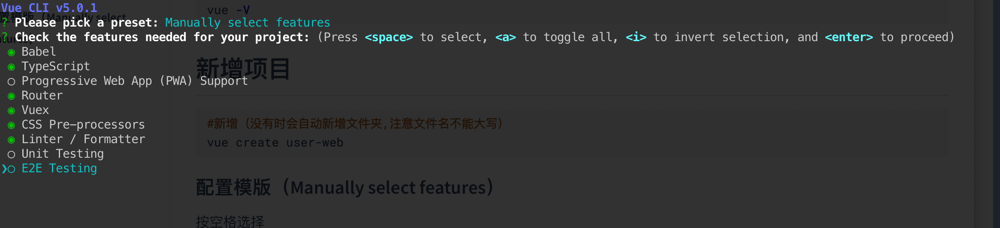
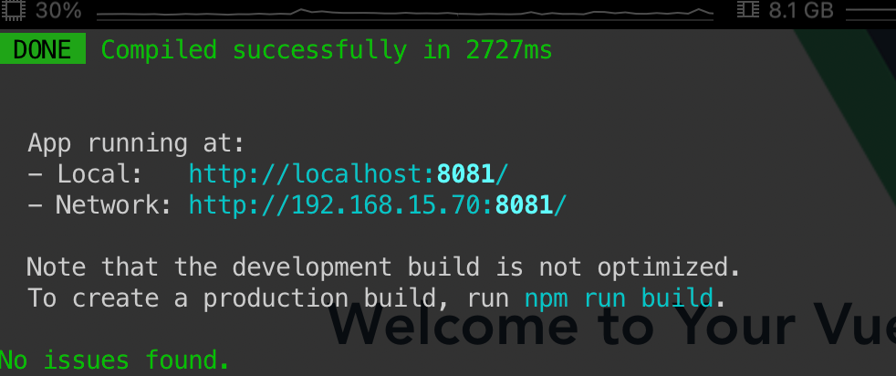

# Mac中配置前端开发环境

##  更换brew镜像源(Homebrew)

```sh
#查看当前源
cd "$(brew --repo)" && git remote -v

cd "$(brew --repo homebrew/core)" && git remote -v

#更换为阿里的源
cd "$(brew --repo)" && git remote set-url origin https://mirrors.aliyun.com/homebrew/brew.git
cd "$(brew --repo)/Library/Taps/homebrew/homebrew-core" && git remote set-url origin https://mirrors.aliyun.com/homebrew/homebrew-core.git

#配置.zshrc
echo 'export HOMEBREW_BOTTLE_DOMAIN=https://mirrors.aliyun.com/homebrew/homebrew-bottles' >> ~/.zshrc

#刷新
source ~/.zshrc
```

## 安装Node

自带npm

```sh
#查看版本
brew search node

#安装指定版本
brew install node@16

#根据提示配置环境变量
echo 'export PATH="/opt/homebrew/opt/node@16/bin:$PATH"' >> ~/.zshrc

#刷新
source ~/.zshrc

#查看对应版本
node -v

npm -v
```

## 配置npm淘宝镜像源

```sh
#配置
npm config set registry https://registry.npmmirror.com

#查看
npm config get registry
```

## 安装 vue/cli

```sh
#选择全局安装
npm install -g @vue/cli

#查看版本
vue -V
```

## 安装yarn

```sh
#选择全局安装
npm install -g yarn

#查看版本
yarn --version

#更换镜像源
yarn config set registry https://registry.npmmirror.com

#查看镜像源
yarn config list
```


## 新增项目（使用vue/cli方式生成）

```sh
#新增（没有时会自动新增文件夹,注意文件名不能大写）
vue create user-web
```

### 配置模版（Manually select features）

按空格选择

`Babel`：支持使用Babel编译器
`TypeScript`：支持使用 TypeScript 书写源码
`Progressive Web App (PWA) Support`：支持PWA
`Router`：支持 vue-router
`Vuex`：支持 vuex
`CSS Pre-processors`：支持 CSS 预处理器
`Linter / Formatter`：支持代码风格检查和格式化
`Unit Testing`：支持单元测试
`E2E Testing`： 支持 E2E 测试


后续选项全部为Y或者回车（最后选项为是否保留当前配置）

相关解释可参考：https://xiabing.blog.csdn.net/article/details/119945472

```sh
#根据提示进入目录启动项目
cd user-web

npm run serve
```



### 项目配置

调整项目根目录的`vue.config.js`

```js
const { defineConfig } = require('@vue/cli-service')
module.exports = defineConfig({
  transpileDependencies: true,
    devServer: {
        open: true, // 是否自动启动浏览器
        host: '0.0.0.0',
        port: 8080,
    }
})
```

## 新增项目（使用vite方式生成）

> Vite：下一代前端开发与构建工具（https://cn.vitejs.dev/）

```sh
#使用vite-app模版 创建 user-web项目
yarn create vite-app user-web

#进入项目
cd user-web

#启动项目
yarn dev
```
