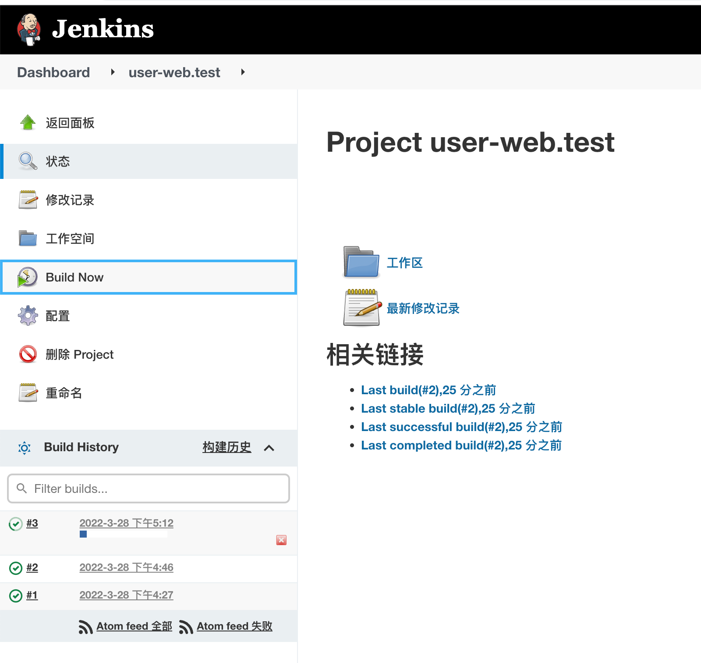

# Vue3+TypeScript的基本使用（3）部署上线

## 前言

继上一篇：[Vue3+TypeScript的基本使用（2）](./Vue3+TypeScript的基本使用（2）.md)

部署项目至Kubernetes上，实现通过域名访问整体服务

## 项目打包

调整`vue.config.js`配置打包文件的路径

```js
const { defineConfig } = require('@vue/cli-service')
module.exports = defineConfig({
  transpileDependencies: true,

    //配置打包文件的相对路径
    publicPath:'./',

    devServer: {
        port: 10086
    }
})

```

执行`yarn build`命令进行打包，生成dist文件


打开index.html即可测试访问项目

## 制作镜像

### 编写Dockerfile文件

在项目根目录下新建`Dockerfile`文件

```dockerfile
FROM nginx:1.11

COPY /dist /usr/share/nginx/html
```

很简单，就是起一个nginx，再将dist目录复制到nginx默认的html上，通过index.html访问

### 编写deployer.sh文件

在项目根目录下新建`deployer.sh`文件

```sh
#!/bin/bash

# 获取jenkins环境变量
PROJECT_NAME=${JOB_NAME%.*}
PROJECT_ENV=${JOB_NAME#*.}

REGISTRY_PRE="registry.cn-shenzhen.aliyuncs.com/xurongze"
IMAGES_NAME="${REGISTRY_PRE}/${PROJECT_NAME}:${PROJECT_ENV}-${BUILD_NUMBER}"

echo "================================================================构建项目"
npm install && npm run build
echo "================================================================构建镜像"
docker build -t $IMAGES_NAME  -f ./Dockerfile .
echo "================================================================推送镜像"
docker push $IMAGES_NAME
echo "================================================================清理镜像"
docker rmi $IMAGES_NAME
kubectl --namespace default patch deployments $PROJECT_NAME -p '{"spec": {"template": {"spec": {"containers": [{"name": "'${PROJECT_NAME}'", "image": "'${IMAGES_NAME}'", "imagePullPolicy": "IfNotPresent"}], "imagePullSecrets": [{"name": "aliyun"}]}}}}' --insecure-skip-tls-verify
```

需提前创建对应的镜像仓库， 相比后端项目多执行了一个`npm install && npm run build`node打包命令

## 接入CICD

相关参考之前文章

[CICD - Jenkins实现.md](../60-DevOps/CICD/CICD%20-%20Jenkins实现.md)

### 配置环境

在部署Jenkins的服务器上配置node环境

```sh
# 用yum方式安装
curl -sL https://rpm.nodesource.com/setup_16.x | bash -

yum install -y nodejs

# 更换镜像源
npm config set registry https://registry.npmmirror.com
```

### 配置Jenkins

新增一个`Freestyle Project`的任务

任务名称为`user-web.test`，前面是项目名字，镜像仓库名称保持一致，后缀为环境

**配置git仓库信息**


**设置执行shell**


**Build Now**




第一次会构建失败，因为`deployer.sh`中有更新Kubernetes的命令，而上面又没有这个项目，不过这次构建的目的是为了推送镜像至阿里镜像仓库

### 配置Rancher

新项目第一次需要手动新增


**名称**与Jenkins任务名称和镜像仓库名称保持一致

**容器端口**开放内部nginx的80端口


通过http://master:32044访问项目

## 配置域名访问

域名、Ingress相关配置参考之前文章
 
> 后端项目配置域名访问：[kubernetes之配置域名访问](../60-DevOps/Kubernetes/4-kubernetes之配置域名访问.md)
 
### 调整项目端口

调整项目端口映射的网络模式，更改为集群内部访问，后续通过Ingress暴露出去


### 调整Ingress规则

原后端项目调整为由`/`调整为`/dm-user`，把`/`留给前端项目使用

#### 通过Rancher调整


#### 通过Yaml方式调整

```yaml
apiVersion: extensions/v1beta1
kind: Ingress
metadata:
  name: user-web
  annotations:
    kubernetes.io/ingress.class: "nginx" # 指定 Ingress Controller 的类型
    # 配置跨域  
    # headers 指定可传递的请求头，如果需要传递自定义请求头参数，需在此声明（必须大写开头）；例Token
    nginx.ingress.kubernetes.io/cors-allow-headers: Token,DNT,X-CustomHeader,Keep-Alive,User-Agent,X-Requested-With,If-Modified-Since,Cache-Control,Content-Type,Authorization
    nginx.ingress.kubernetes.io/cors-allow-methods: PUT, GET, POST, OPTIONS
    nginx.ingress.kubernetes.io/cors-allow-origin: '*'
    nginx.ingress.kubernetes.io/enable-cors: "true"
spec:
  tls:
  - hosts:
    - user.xurongze.com
    secretName: https-user #secret证书名称
  rules:
    - host: user.xurongze.com
      http:
        paths:
        - path: /dm-user #此路径需与后端接口路径保持一致
          pathType: Prefix
          backend:
            serviceName: dm-user
            servicePort: 8080
        - path: /
          pathType: Prefix
          backend:
            serviceName: user-web
            servicePort: 80

```

在master上执行`kubectl apply -f user-ingress.yaml`应用配置


## 测试

花有重开日/password

https://user.xurongze.com


## 其它

### 相关官方文档

> 环境区分：https://cli.vuejs.org/zh/guide/mode-and-env.html
>
> 部署：https://cli.vuejs.org/zh/guide/deployment.html#docker-nginx