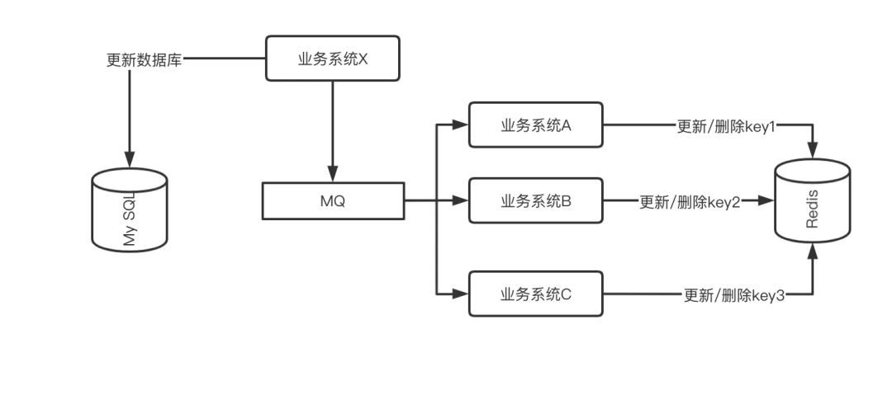
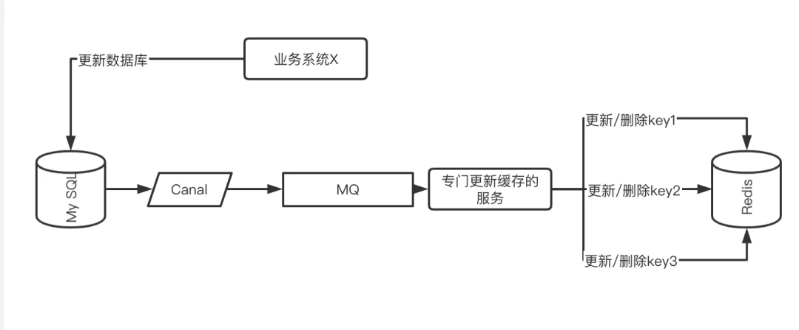

# 缓存同步方案

## 前言

记录使用 MySQL 和 Redis 之间数据同步的一些方案。

普通情况下，针对`千`级别的读 QPS，使用 MySQL 足以，但想要支撑`万`级别的读 QPS，就得使用缓存（Redis）了。

> 相同配置下的 QPS（Queries per second）：单实例4核8G
>
> - MySQL：500~5000+
> - Redis：10W+
>
> 一个是硬盘存储，一个是内存存储，典型的空间换时间。

## 缓存同步的问题

正常情况下，数据都是存储在数据库 MySQL 中，但是某些热点数据需要频繁访问，那就要把这部分热点数据同步到缓存 Redis 中。那这里就会产生一个问题，MySQL 和 Redis 之间数据同步的问题。

- 在这个数据同步的时间窗口内，就会出现数据不一致的情况。
- 强一致性：想要强制保证数据的一致性，可以考虑使用事务，不过这会极大降低接口的性能，某些情况甚至比不使用缓存缓慢。
- 最终一致性：只要把数据同步的时间窗口尽量缩小，并且保证缓存与数据库中的数据最终一致即可。

### 更新的策略

#### 先更新数据库 后删除缓存（==最适合==）

- 适合**读多写少**场景

- 缺点：在数据同步的时间窗口内，并发线程可能会读取到旧的数据，不过大部分业务场景下可以忽略不计。
  - **前置**： MySQL、Redis 数据值=99
  - **A线程（Time1）**：更新 MySQL 数据99 -> 100
  - **B线程（Time2）**：读取 Redis 缓存值99 （读取旧值）
  - **A线程（Time3）**：删除 Redis 缓存值99
  - **C线程（Time4）**：读取 Redis 缓存值为空，查询 MySQL 数据 100，并更新 Redis 缓存值为100。

#### 先更新数据库 后更新缓存

- 适合**读写相当**、**写多读少**场景
  - 在写多的场景下，如果采用后删除缓存策略，会频繁删除缓存，导致缓存利用率降低。所以在写多的场景下，最好采用更新缓存。

- 缺点：更新顺序不同步导致短暂不一致，可以忽略，小概率问题。

###  如何保证最终一致性？

在更新/删除缓存时，是有可能失败的，比如Redis服务挂了、网络问题、服务重启等等。

这时候需要一些兜底方案确保数据的最终一致性：

1. **缓存设置过期时间**：比如设置缓存过期时间为1分钟，即使出现更新缓存失败的极端场景，不一致的时间窗口最多也只有1分钟。
2. **利用消息中间件重试**：例如RocketMQ。另外在极端场景下，可以结合事务消息来确保消息发送成功

## 复杂业务场景

某些业务场景中，一个数据库值的更新，可能是需要同步更新多个缓存值，而且不同的业务逻辑可能是分散在系统各处。

- 使用 MQ 消息通知机制，集中化管理缓存更新操作。
- 不同服务订阅 MQ 消息，独立维护各自的缓存。

上述MQ处理方式需要显式地发送 MQ 消息，进一步优化可以通过订阅 MySQL 的 binlog，监听数据的真实变化情况以处理相关的缓存。

- 目前业界类似的产品有 Canal

## 参考

- https://cloud.tencent.com/developer/article/2464044?pos=comment

