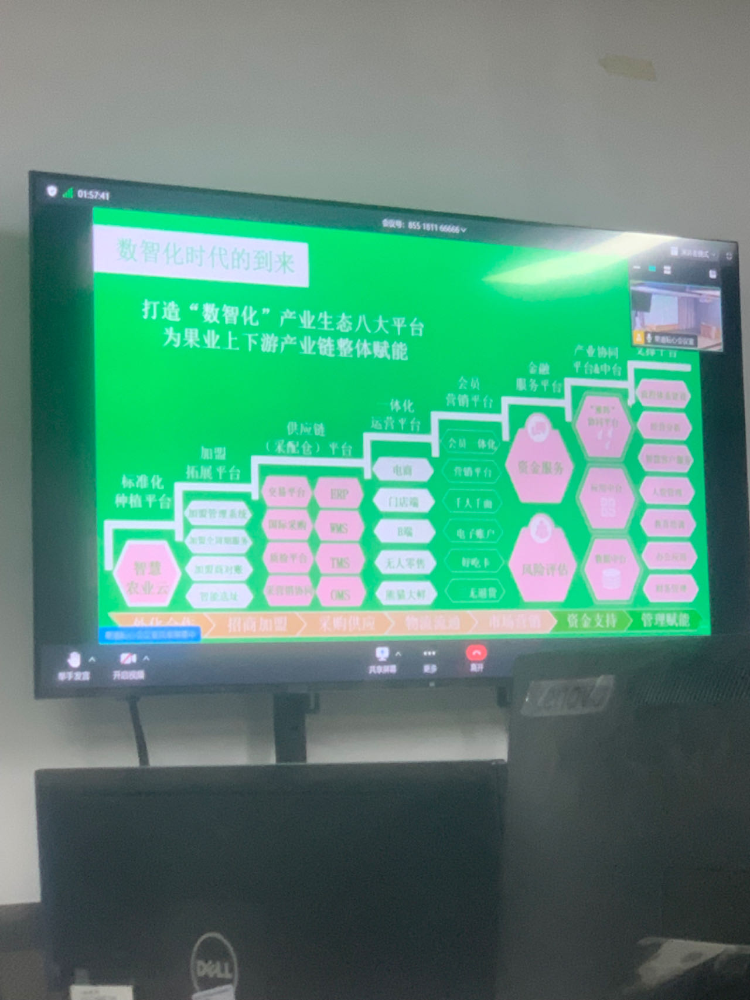
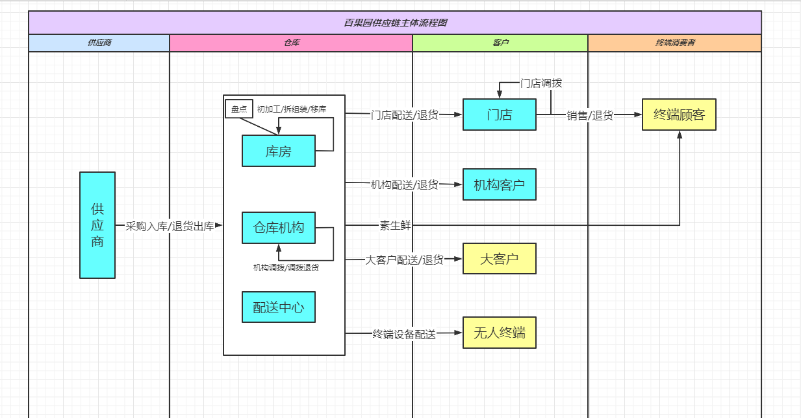
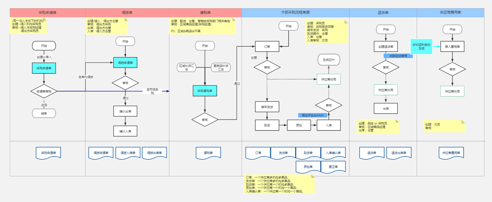
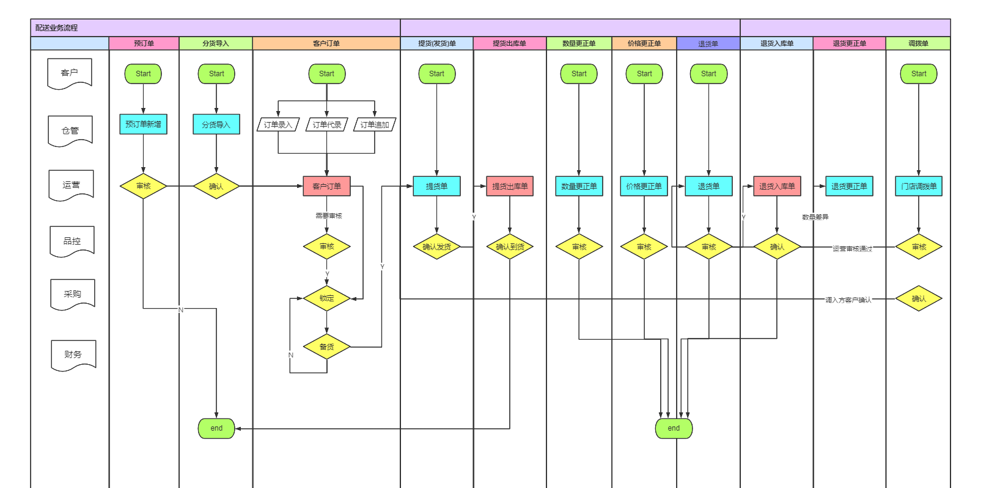
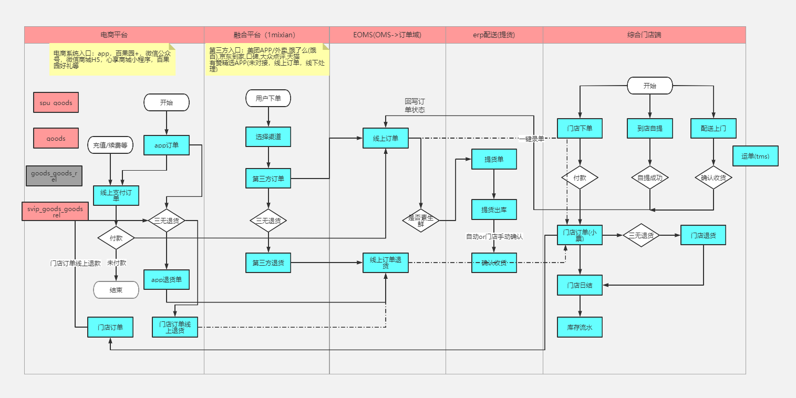

## 整体架构

### “数智化”产业生态八大平台，为果业上下游产业链整休赋能

- **标准化种植平台：**智慧农业云

- **加盟平台：**加盟管理系统、加盟商对账、智能选址
- **供应链平台**：交易平台、国际采购、质检平台、采销协同、ERP、WMS、TMS、OMS
- **一体化运营平台：**电商、门店端、B端、无人零售、熊猫大鲜
- **会员营销平台：**会员一体化、营销平台、电子账户、好吃卡、三无退货
- **金融服务平台：**资金服务、风险评估
- **产业协同平台&中台**
- **支撑平台（管理赋能）**

## 供应链整体业务流程

供应链整体业务流程是指：百果园集团从供端的种植基地（合作基地/果农果园/其他基地等）或供应商（普通供应商/贸易商等）处采购商品，通过各种运输方式到达百果园的“仓库”内，在仓库进行包装加工后售卖给客户群体（门店/机构客户/企业客户等），再由客户群体（主要指门店）通过各种平台（自营/三方/线下）或渠道（app/小程序/美团/饿百等）卖到终端消费者手上的全过程。

### 采购业务过程

百果园集团采购业务，就是采购员从水果产地，综合市场等处采购果品，经多方运输渠道，送达至集团各个配送中心（库房），经到货确认、质检后入库截止。包括了该过程需要的前置条件，单据及费用等，主要涉及到的使用部门为集团商品中心、品控中心等，是集团最重要核心的业务环节之一。

### 配送业务过程

配送业务是百果园集团将采购回来的商品，通过配送中心发往各个客户（门店/机构客户/企业客户等）的业务过程。在erp系统中从客户订货、配送中心发货，到客户收货、退货、以及客户之间的调拨，全流程的管理过程，包括前期客户定义、客户关系维护，以及按照配送、运营要求，满足各种业务场景的灵活业务控制及参数配置。

### 销售业务过程

销售业务指百果园门店通过各种平台（自营/三方/线下）或渠道（app/小程序/美团/饿百等）将商品卖到“终端消费者”手上的全过程。

## 业务模式

百果园是一家以水果销售为主的连锁零售企业，它的业务模式有几个核心特点：

1. **垂直供应链管理**： 百果园从源头控制水果的质量，采用“产地直采”模式，直接与水果种植户或供应商合作。这种模式减少了中间环节，确保了水果的新鲜度和质量。此外，百果园还自建了冷链物流体系，确保水果在运输过程中保持新鲜。
2. **标准化产品与服务**： 百果园实行标准化的水果品控体系，制定严格的质量标准，包括糖度、大小等参数。这确保了消费者无论在哪家门店购买，都能享受到一致的水果品质。并且，百果园承诺提供“不好吃三无退货”服务，如果消费者对水果的质量不满意，可以随时退货。
3. **线上线下结合**： 百果园不仅拥有大量的线下实体店，还发展了线上业务。通过自有的百果园APP、微信小程序以及合作的外卖平台，消费者可以随时下单并享受快速的配送服务。线上线下的结合不仅扩大了消费者的选择，还提升了用户体验。
4. **会员体系与精准营销**： 百果园有一套完善的会员体系，通过积累用户的消费数据，进行个性化的精准营销。会员可以享受积分、优惠券等福利，企业根据会员的消费习惯，定制相应的促销活动，增加客户粘性。
5. **门店加盟与直营结合**： 百果园采用直营与加盟并存的模式来扩展市场。直营店的管理更为严格，保证了品牌形象与质量控制；而加盟店的快速扩张帮助公司快速占领市场，提高品牌的市场渗透率。

总的来说，百果园通过深耕供应链、标准化的产品质量管理、线上线下渠道的融合以及会员体系等手段，打造了一个以水果为核心的全渠道零售模式。

### 新零售和传统零售的区别

> “传统零售”更多地依赖于单一的线下渠道，重视实体店体验，“新零售”通过技术手段，实现了线上线下的融合，更注重用户数据、体验和供应链效率的提升。

#### 渠道模式

- **传统零售**： 主要依赖于线下实体店销售，消费者需要到店购买，渠道单一，用户购物场景受限。
- **新零售**： 线上线下融合，打破了时间和空间的限制。新零售企业通常会通过电商平台、社交媒体、APP、小程序等线上渠道，并结合线下实体店，实现“全渠道”覆盖，让消费者可以随时随地购买商品。

#### 供应链管理

- **传统零售**： 供应链较为分散，信息流、物流和资金流的整合度较低，库存管理和商品更新速度慢，导致商品流通效率不高，容易出现库存积压或者缺货问题。
- **新零售**： 新零售通过技术手段，实时整合供应链上的各个环节，提高库存周转效率。基于大数据，企业可以更精准地预测市场需求，优化库存管理。此外，智能化的物流配送体系（如无人仓库、自动化分拣、冷链配送等）提升了整体供应链的响应速度和效率。

####  数据与技术驱动

- **传统零售**： 主要依赖经验驱动和单纯的销售数据，缺乏对用户行为的深度洞察，难以提供个性化的服务和产品。
- **新零售**： 以大数据、人工智能和物联网等技术为核心驱动力，通过数据收集和分析，了解消费者的行为和偏好，制定精细化的运营策略。

#### 互动与营销

- **传统零售**： 营销方式主要是传统广告、线下促销等，互动性较低，消费者获取商品信息的方式有限。
- **新零售**： 借助社交媒体、直播、短视频等多样化的渠道，增强与消费者的互动，打通线上线下的营销链路。用户不仅是消费者，也是内容的创造者和传播者，这种互动性有助于品牌的社交传播和粉丝经济的形成。

#### 用户体验

- **传统零售**： 用户体验相对单一，主要依赖于线下购物的服务质量。商品信息有限，购买体验相对传统。
- **新零售**： 新零售注重用户的全方位体验，通过线上大数据分析，为消费者提供个性化推荐，优化购买体验。此外，智能客服、AR/VR试衣、扫码购等新技术的应用也大大提升了用户的购物体验。

