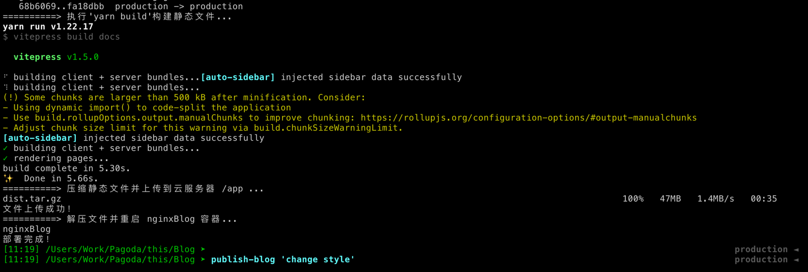

# Blog自动部署

## 前言

为建立个人知识库，打造个人博客，用于记录成体系的知识、随笔等。

最终实现效果：

1. 在本地Typora编写文章
2. 执行`publish-blog`命令即可发布（执行deploy.sh脚本）
   1. 将需要发布的文章复制到Blog项目的docs目录中
   2. 推送Blog项目至Github备份
   3. 重新构建Blog生成静态html文件
   4. 压缩静态文件推送至远程服务器/app目录再解压
   5. 重启用docker部署的Nginx容器


## 编写Blog项目（Vitepress）

经过多方考察，最终选择了VitePress。

- VitePress 是一个[静态站点生成器](https://en.wikipedia.org/wiki/Static_site_generator) (SSG)，专为构建快速、以内容为中心的站点而设计。
- 简而言之，VitePress 获取用 Markdown 编写的内容，对其应用主题，并生成可以轻松部署到任何地方的静态 HTML 页面。


安装启动运行参考官网：[Vitepress快速开始](https://vitepress.dev/zh/guide/getting-started)

- 根据文件目录自动生成侧边栏插件：https://github.com/QC2168/vite-plugin-vitepress-auto-sidebar
- 样式美化参考：https://vitepress.yiov.top/style.html
  - [动态彩虹背景样式](https://vitepress.yiov.top/style.html#%E5%BD%A9%E8%99%B9%E8%83%8C%E6%99%AF%E5%8A%A8%E7%94%BB)
  - [评论功能](https://vitepress.yiov.top/plugin.html#%E8%AF%84%E8%AE%BA)

### 文章摘要

网上没找到，自己实现一个吧。

大致思路是在构建时触发一个js函数，读取项目中所有.md文件，截取文档前一部分内容作为文章摘要。

- 再写入到项目中提前创建好的一个js文件中，并且包装为一个Map对象，key为文章Path，value为文章摘要。
- 之后在需要使用的组件中导入该js对象即可

> 这种方案是在构建时预处理，提前生成一个索引文件，无需动态加载所有文件，所以运行时性能最佳

使用示例：

```js
import { articlesMap } from '../../../public/articles.js';

// 填充文章概述
currentArticles.forEach(article => {
  article.summary = articlesMap[article.path];
})
```

生成的Map对象示例：

```js
// articles.js
export const articlesMap = {
    "Essay/Blog自动部署.md":" ## 前言  为建立个人知识库，打造个人博客，用于记录成体系的知识、随笔。 "，
    "Essay/使用ECS为本地搭建开发环境.md": " ## 服务器准备  > 购买的华为云服务： > > - 116.205.134.4",
  }
```

引入示例：

```ts
export default defineConfig({
  vite: {
        // 当 Vite 构建项目时，会自动加载并执行这些插件
    plugins: [
      {
        name: 'generate-articles-json',
        buildStart() {
          generateArticlesSummaryJSON();
        },
      },
    ],
  }
})
```

::: details 触发的JS函数（读取文章生成摘要）

```js
import fs from 'fs';
import path from 'path';

/**
 * 在构建时调用，读取所有MD文件生成文章概述js文件。在分类页面（Category.vue）引入该js文件，通过文章path读取对应文章概述
 */
export function generateArticlesSummaryJSON(){
    // Markdown 文件所在目录
    const articlesDir = path.resolve(__dirname, '../../../../docs');
    // 输出 JSON 文件路径
    const outputPath = path.resolve(__dirname, '../../../../docs/public/articles.js');

    const markdownFiles = getMarkdownFiles(articlesDir);
    const articlesMap = {};

    markdownFiles.forEach(filePath => {
        // 读取 Markdown 文件
        const content = fs.readFileSync(filePath, 'utf-8');
        // 清理无用内容
        const cleanText = cleanContent(content);
        // 提取前 200 个字符作为摘要
        const summary = cleanText.slice(0, 200).replace(/[\r\n]/g, ' ');
        // 使用相对路径作为key
        const relativePath = path.relative(articlesDir, filePath);
        // 记录
        articlesMap[relativePath] = summary;
    });

    // 将数据导出为 JavaScript 模块
    const fileContent = `export const articlesMap = ${JSON.stringify(articlesMap, null, 2)}`;

    fs.writeFileSync(outputPath, fileContent);
}


function cleanContent(content) {
    // 跳过 YAML Front Matter
    content = content.replace(/^---[\s\S]*?---/, '').trim();
    // 移除标题（例如 # 一级标题）
    content = content.replace(/^#\s*[^#\n]*\n/gm, '');
    // 替换  标签
    content = content.replace(/]*>/gi, '');
    // 移除 Markdown 图片引用 
    content = content.replace(/!\[[^\]]*\]\([^\)]+\)/g, '');
    // 处理 http:// 和 https:// 开头的 URL，保留前 15 个字符并在后面加上省略号
    content = content.replace(/(https?:\/\/[^\s]+)(?=\s|$)/gi, (match) => match.slice(0, 15) + '...');
    // 移除加粗文本（**加粗文本**）
    content = content.replace(/\*\*[^*]*\*\*/g, '');
    // 移除所有 == 高亮文本
    content = content.replace(/==[^=]*==/g, '');
    return content;
}

function getMarkdownFiles(dir) {
    const results = [];
    fs.readdirSync(dir).forEach(file => {
        const filePath = path.join(dir, file);
        const stats = fs.statSync(filePath);

        if (stats.isDirectory()) {
            // 递归扫描子文件夹
            results.push(...getMarkdownFiles(filePath));
        } else if (stats.isFile() && file.endsWith('.md')) {
            results.push(filePath);
        }
    });
    return results;
}
```

:::


## 本地配置自动部署

部署方式有很多种，最终选择本地编写脚本的方式部署，因为本地的各种环境已经搭建好，而且有自己有云服务器，所以只要构建好静态文件推送到服务器即可。

### 服务器准备

在根目录/下创建app文件夹，创建nginx.conf配置文件

- `/app`用于存放Vitepres构建的静态文件
- `/nginx.conf`参考Vitepress提供的配置文件，不过需要做一些调整，否则会出现各种问题
  - Vitepress提供Nginx配置文件：https://vitepress.dev/zh/guide/deploy#nginx

::: details  完整nginx.conf配置

```sh

# 设置并行CPU核心数，在轻量级应用或单核环境中：可以设置为 1。
worker_processes 1;

events {
    # 定义每个 worker_process 可以同时处理的最大连接数。默认值1024
    worker_connections 1024;
}

http {

    # 确保JavaScript文件被服务器识别为js文件
    include       /etc/nginx/mime.types;
    default_type  application/octet-stream;

    server {
        gzip on;
        gzip_types text/plain text/css application/json application/javascript text/xml application/xml application/xml+rss text/javascript;

        listen 80;
        server_name _;
        index index.html;

        location / {
            # 静态文件目录
            root /app;

            # exact matches -> reverse clean urls -> folders -> not found
            try_files $uri $uri.html $uri/ =404;

            # non existent pages
            error_page 404 /404.html;

            # a folder without index.html raises 403 in this setup
            error_page 403 /404.html;

            # adjust caching headers
            # files in the assets folder have hashes filenames
            location ~* ^/assets/ {
                expires 1y;
                add_header Cache-Control "public, immutable";
            }
        }
    }
}
```

:::

安装Nginx：参考另一篇博客 [使用ECS为本地搭建开发环境](./0-使用ECS为本地搭建开发环境.md) 中使用docker部署Nginx

- 注意挂载目录的路径

设置编码格式：（解决上传的静态文件名中文乱码的问题）

```sh
# 检查当前服务器的语言环境 
locale

# 使用cat <<EOF >快速写入
cat <<EOF >/etc/locale.conf
LANG=zh_CN.UTF-8
LC_ALL=zh_CN.UTF-8
EOF

# 配置刷新
source /etc/locale.conf
```


### 编写deploy.sh

`REPO_PATH`是本地编写文章的知识库目录。（放置iCloud中多重保险）

`BLOG_PATH`Blog项目，进入该目录执行git、yarn构建相关命令。（会推送GitHub）

`SYNC_DIRS`知识库部分内容包含隐私内容，所以会指定同步的文件夹，只有这些文件夹的内容才需要打包构建。如果全部内容都是开放的甚至可以直接在Blog项目中编写文章，就不需要移动复制了。

::: details deploy.sh

```sh
#!/bin/bash

# 定义变量
start_time=$(date +%s)
REPO_PATH="/Users/xrz/Library/Mobile Documents/com~apple~CloudDocs/KnowledgeRepository"
BLOG_PATH="/Users/Work/this/Blog"
SYNC_DIRS=("00-TechnicalFile" "01-Essay" "02-English" "Image")

#REMOTE_SERVER="root@cloudserver"
REMOTE_SERVER="root@tencentserver"
REMOTE_PATH="/app"
NGINX_CONTAINER_NAME="nginxBlog"


# 默认 Commit 信息
if [ -z "$1" ]; then
  COMMIT="auto commit"
else
  COMMIT="$1"
fi

echo "==============================> 同步知识库到Blog项目docs目录中..."
for DIR in "${SYNC_DIRS[@]}"; do
  SOURCE_DIR="$REPO_PATH/$DIR"
  TARGET_DIR="$BLOG_PATH/docs/$DIR"

  if [ -d "$SOURCE_DIR" ]; then
    rsync -av --delete "$SOURCE_DIR/" "$TARGET_DIR/"
    if [ $? -ne 0 ]; then
      echo "$DIR 文件同步失败，请检查！"
      exit 1
    fi
  else
    echo "源目录 $SOURCE_DIR 不存在，跳过同步。"
  fi
done

echo "==============================> 执行'yarn build'构建静态文件..."
cd "$BLOG_PATH" || { echo "无法进入 $BLOG_PATH，请检查路径！"; exit 1; }
yarn build
if [ $? -ne 0 ]; then
  echo "静态文件构建失败，请检查！"
  exit 1
fi


echo "==============================> 进入Blog项目执行Git提交并推送..."
cd "$BLOG_PATH" || { echo "无法进入 $BLOG_PATH，请检查路径！"; exit 1; }
git add .
git commit -m "$COMMIT"
git push
if [ $? -ne 0 ]; then
  echo "Git 提交或推送失败，请检查！"
  exit 1
fi

echo "==============================> 压缩静态文件并上传到云服务器 $REMOTE_PATH ..."
DIST_PATH="$BLOG_PATH/docs/.vitepress/dist"
ARCHIVE_NAME="dist.tar.gz"

tar -czf "$DIST_PATH/$ARCHIVE_NAME" -C "$DIST_PATH" .
if [ $? -ne 0 ]; then
  echo "静态文件压缩失败，请检查！"
  exit 1
fi

ssh "$REMOTE_SERVER" "rm -rf $REMOTE_PATH && mkdir -p $REMOTE_PATH"
scp "$DIST_PATH/$ARCHIVE_NAME" "$REMOTE_SERVER:$REMOTE_PATH/"
if [ $? -ne 0 ]; then
  echo "压缩文件上传失败，请检查！"
  exit 1
fi
echo "文件上传成功！"

echo "==============================> 解压文件并重启 $NGINX_CONTAINER_NAME 容器..."
ssh "$REMOTE_SERVER" "tar -xzf $REMOTE_PATH/$ARCHIVE_NAME -C $REMOTE_PATH"
if [ $? -ne 0 ]; then
  echo "文件解压失败，请检查！"
  exit 1
fi
ssh "$REMOTE_SERVER" "docker restart $NGINX_CONTAINER_NAME"
if [ $? -ne 0 ]; then
  echo "$NGINX_CONTAINER_NAME 容器重启失败，请检查！"
  exit 1
fi

end_time=$(date +%s)
elapsed_time=$((end_time - start_time))

echo "==========> 部署完成！执行耗时: $elapsed_time 秒"


```

:::

### 配置全局命令（alias）

本地使用的是zsh，在 `~/.zshrc` 中配置对应的命令别名，执行deploy.sh

```sh
alias publish-blog="/Users/Work/this/Blog/deploy.sh"
```

使配置生效

```sh
source ~/.zshrc
```

之后在Terminal任意处执行`publish-blog`即可发布博客



## 其它部署方式

Vitepress各种部署方式参考：https://vitepress.dev/zh/guide/deploy

### GitHub Pages

如果选择部署到Github Pages可以使用Github Action。当检测到分支合并，自动执行脚本进行部署。

- Github Action：https://docs.github.com/zh/actions
- 优点：免费流量、天然集成Github
- 缺点：域名有限制、国内网络不好

### Webhooks

Github提供的一个钩子，监听到代码合并时，可以执行一个请求。

- Webhooks：https://docs.github.com/en/webhooks/about-webhooks
- 缺点：需要在服务器上部署jar，而且需要为执行sh脚本搭建所需的环境。 

比如可以编写一个jar部署到云服务器上， 提供一个接口，当前调用时执行自定义的sh。

示例代码：

```java
@RestController
@RequestMapping("/webhook")
public class WebhookListener {
    
    @GetMapping("/publish")
    public String publish(){
        try {
            String fullName = "/deploy.sh";
            
            ProcessBuilder processBuilder = new ProcessBuilder("sh", fullName);
            processBuilder.redirectErrorStream(true);
            // 执行
            Process process = processBuilder.start();

            // 读取执行结果
            BufferedReader reader = new BufferedReader(new InputStreamReader(process.getInputStream()));
            String line,mesg= "";
            while ((line = reader.readLine()) != null) {
                mesg = mesg+line+"\n";
            }
            //校验执行码
            int exitCode = process.waitFor();
            if(exitCode != 0) return mesg;

        } catch (Exception e) {
            return "ErrorMesage:"+e.getMessage();
        }
        return "SUCCESS";
    }
}
```

## 备案

**不管域名是在哪里购买的，只要想解析到中国大陆境内的服务器，就必须要备案！否则属于非法行为！**

- 备案流程，参考腾讯云：https://cloud.tencent.com/product/ba
- 工信部审核时长：12~20天左右。
- 备案号悬挂说明：https://cloud.tencent.com/document/product/243/19142
  - 注意，没有悬挂备案号会处五千元以上一万元以下罚款。另外备案成功后还需要在30天内去公安局备案：https://cloud.tencent.com/document/product/243/19142
- 备案注销：如果申请备案的域名即将过期而不续费，一定要在云厂商==申请注销该域名的备案！！！切记！！否则后续其它人申请该域名从事非法活动时，又查到备案主体是你的话会很麻烦！！！==

>如不想备案，可购买境外服务，例如：香港、新加坡

## SSL证书的问题

**问题：云厂商提供的免费SSL证书只有三个月，很麻烦。**

**解决方案：把 Nginx 替换为 Caddy 这种自带 HTTPS 的 Web 服务器**

> - Caddy官网：https://caddyserver.com/
>
> - 核心功能：默认启用HTTPS（域名）、HTTP/3 支持、**证书自动续期**、**内容自动更新**、反向代理、免费开源。

#### 服务器内创建文件夹

```sh
# 批量创建（caddy目录会自动创建）
mkdir -p /caddy/{app,caddy_data,caddy_config}
```

`app`存放静态文件

`caddy_data`存储 TLS 证书等持久化数据（后续挂载docker）

`caddy_config`存储 Caddy 的配置文件数据（后续挂载docker）

#### 配置Caddyfile

创建Caddyfile文件，作用类似nginx.config

```sh
# 使用cat <<EOF >快速写入
cat <<EOF >/caddy/Caddyfile
baizer.info www.baizer.info {
    root * /srv #指定静态文件的根目录。
    file_server #启用静态文件服务器功能。
}
EOF
```

#### Docker部署Caddy

docker使用参考： [使用ECS为本地搭建开发环境](0-使用ECS为本地搭建开发环境.md) 

```sh
# 一键部署
docker run -d --name caddyBlog \
  -p 80:80 \
  -p 443:443 \
  -v /caddy/Caddyfile:/etc/caddy/Caddyfile \
  -v /caddy/app:/srv \
  -v /caddy/caddy_data:/data \
  -v /caddy/caddy_config:/config \
  --memory 50m \
  caddy:latest
```

`--memory 50m`实际使用内存10M左右

`/caddy/Caddyfile`：本地的 Caddy 配置文件路径。

`/caddy/app`：静态网站文件的路径（如 HTML、CSS 等）。

`/caddy/caddy_data`：用于存储 TLS 证书等持久化数据。

`/caddy/caddy_config`：存储 Caddy 的配置文件数据。

#### depoly.sh 调整

修改远程服务器的上传目录即可

```sh
#REMOTE_PATH="/app"
REMOTE_PATH="/caddy/app"
```

移除重启docker代码，待验证

## 自建浏览量服务

#### **1. 构建带 `exec` 插件的 Caddy**

利用 `caddy:builder` 构建包含 `exec` 插件的 Caddy 二进制文件：

```sh
docker run --rm -v $(pwd):/out caddy:builder \
    xcaddy build --with github.com/greenpau/caddy-exec
    
    
    docker build -t caddy-with-exec --build-arg CADDY_VERSION=v2.8.2 --build-arg PLUGINS="exec" https://github.com/caddyserver/caddy.git

```

#### **2. 创建包含新 Caddy 二进制文件的 Docker 镜像**

使用一个自定义 `Dockerfile`，打包新构建的 Caddy 二进制文件：

```sh
cat <<EOF >./Dockerfile
# 基于官方 Caddy 镜像
FROM caddy:alpine
# 替换 Caddy 二进制文件
COPY ./caddy /usr/bin/caddy
# 添加配置文件
COPY ./Caddyfile /etc/caddy/Caddyfile
EOF
```

然后构建镜像：

```sh
docker build -t my-caddy .
```


update_views.sh

```sh
#!/bin/bash
FILE="/path/to/views.json"
SLUG=$1

if [ -f "$FILE" ]; then
    VIEWS=$(cat "$FILE" | jq ".${SLUG} += 1")
    echo "$VIEWS" > "$FILE"
fi
```


```sh

cat <<EOF >/caddy/Caddyfile
http://:9527 {
    root * /srv #指定静态文件的根目录。
    file_server #启用静态文件服务器功能。
    
    handle /view/increase { 
      # 执行sh脚本，并且提取请求参数中slug，传递至sh脚本
    	exec bash /path/to/update_views.sh {query.slug} 
    }
    
    handle /view/get {
       #响应指定文件内容
    	respond /srv/views.json 200
    }
}
EOF

caddy:builder sh
  docker run -d --name caddyBlog \
  -p 9527:9527 \
  -v /caddy/Caddyfile:/etc/caddy/Caddyfile \
  -v /caddy/app:/srv \
  -v /caddy/view:/view \
  -v /caddy/caddy_data:/data \
  -v /caddy/caddy_config:/config \
  --memory 50m \
  caddy:builder sh
```


