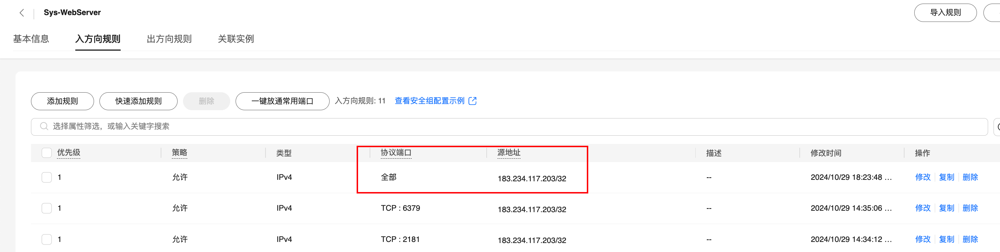
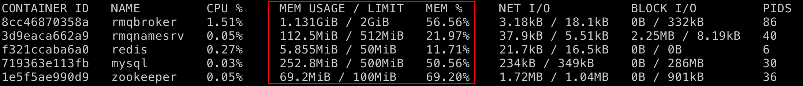

# 使用ECS为本地搭建开发环境

## 服务器准备

> 购买的华为云服务：
>
> - 116.205.134.46
>
> - 2vCPUs | 4GiB | ac7.large.2
>
> - CentOS 7.6 64bit

注意为对应安全组开放端口，或者直接开放所有端口，并限制只允许本机IP访问

- 查询本机IP地址：https://ip111.cn/



#### 本地配置

配置host映射，后续可直接使用hostname登入服务器

```sh
cat >> /etc/hosts <<EOF
116.205.134.46  cloudserver
EOF
```

配置免密登陆，生成密钥对

```sh
ssh-keygen -t rsa
```

将本地公钥发送到服务器上（提示没有ssh目录时自行创建）

```sh
ssh root@cloudserver 'cat >> .ssh/authorized_keys' < ~/.ssh/id_rsa.pub
```

后续直接通过`ssh root@cloudserver`登录服务器

#### 基础配置

调整命令行字符颜色（防止眼瞎）

```sh
# 使用cat <<EOF >快速写入
cat >> ~/.bashrc <<EOF
PS1='\[\e[32;40m\]\u@\h \W ➤ \e[m'
EOF

# 配置刷新
source ~/.bashrc
```

设置服务器的语言环境（解决上传的静态文件名中文乱码的问题）

```sh
# 检查当前服务器的语言环境 
locale

# 使用cat <<EOF >快速写入
cat <<EOF >/etc/locale.conf
LANG=zh_CN.UTF-8
LC_ALL=zh_CN.UTF-8
EOF

# 配置刷新
source /etc/locale.conf
```

## 安装Docker

### yum安装

```sh
#配置docker阿里云的yum源
curl -o /etc/yum.repos.d/docker-ce.repo http://mirrors.aliyun.com/docker-ce/linux/centos/docker-ce.repo
 
#生成yum缓存
yum clean all && yum makecache
 
#使用yum安装
yum install docker-ce -y

#配置云厂商的镜像仓库加速地址（在对应云厂商控制台获取个人加速地址）
mkdir -p /etc/docker
 
cat <<EOF > /etc/docker/daemon.json
{
 "registry-mirrors": ["https://6ea1ae24c9ac497e86911de1ff6c1eea.mirror.swr.myhuaweicloud.com"]
}
EOF
```

> 镜像仓库加速地址必须要配置同一个云厂商的，例如华为云的服务器就配置华为云的镜像加速地址（华为云服务器配置阿里云镜像加速地址会失效）

### 一键安装脚本

```sh
curl -fsSL https://get.docker.com | bash -s docker --mirror Aliyun
```

### 启动

```sh
#启动docker
systemctl start docker
#查看状态
systemctl status docker
#停止docker
systemctl stop docker
#重启
systemctl restart docker

#设置开机启动
systemctl enable docker
#查看版本
docker version
#查看信息
docker info
```

### Docker常用命令

```sh
# 搜索镜像，或者在镜像仓库寻找
docker search [keyword]
# 拉取镜像
docker pull [镜像名称:版本]
# 列出镜像
docker iamge
# 删除指定镜像
docker rmi [镜像Id]

# 显示正在运行的容器
docker ps
# 显示所有容器，包括正在运行的和已停止的
docker ps -a
# 格式化输出
docker ps --format "table {{.ID}}\t{{.Names}}\t{{.Status}}"

# 启动容器
docker run <container>
# 停止容器
docker stop <container>
#删除容器
docker rm <container>
#进入容器（-it: 在容器内启动一个交互式终端，以便输入命令）
docker exec -it <container> bash

#查看容器的日志
docker logs <container>
#实时显示容器的资源使用情况
docker stats <container>
```

### 其它命令

```sh
#强制删除所有镜像
docker rmi -f `docker images -q`

#强制删除所有容器
docker rm -f `docker ps -a -q`

#实时查看容器镜像日志
docker logs -f [CONTAINER ID or NAME]

#搜索指定镜像
docker images | grep [NAME]
```

## 快速部署应用

官方镜像仓库地址：https://hub.docker.com/search?type=image

华为云镜像中心：https://console.huaweicloud.com/swr/?region=cn-south-1#/swr/mirror

#### 检测内存

- 查看云服务器的内存：`free -h`
- 查看容器使用资源：`docker stats`、`docoker stats <container>`
  - **MEM USAGE / LIMIT**：显示当前内存使用量和限制值。
  - **MEM %**：当前内存使用占设定限制的百分比。
  - 

####  run 命令参数介绍

```sh
docker run -d \ 		     # 以后台模式运行容器，将容器放置在后台运行，作为守护进程
  --name my_nginx \  #为容器指定一个名称
  -p 80:8081 \            #将主机的端口80映射到容器端口8081
  -v /host/a:/container/b \   # 将主机上的/a目录挂载到容器的/b目录
  -e ENV_VARIABLE=value \  #设置容器的环境变量
  --memory 100m \ 						 #设置容器可使用的内存限制
  nginx:latest											 #运行的容器名称和版本号，没有时会去镜像仓库拉取
```

### 部署 Zookeeper

```sh
docker run -d --name zookeeper \
  -p 2181:2181 \
  --memory 100m \
  zookeeper
```

### 部署 Redis

```sh
docker run -d --name redis \
  -p 6379:6379 \
  --memory 50m \
  -e REDIS_PASSWORD=redispassword \
  redis redis-server --bind 0.0.0.0 --requirepass redispassword 
```

通过 `--bind 0.0.0.0` 命令允许外部 IP 连接 Redis。

使用 `--requirepass` 设置访问密码。

### 部署 MySQL

```sh
docker run -d --name mysql \
  -e MYSQL_ROOT_PASSWORD=mysqlpassword \
  -p 3306:3306 \
  --memory 500m \
  mysql:5.7
```

默认用户名为`root`

### 部署 RocketMQ

RocketMQ4.x官方部署文档：https://rocketmq.apache.org/zh/docs/4.x/quickstart/02quickstartWithDocker

#### 单机版（含Dashboard）

>  内存最少需要1.7G，可分配2G

```sh

docker run -itd \
 --name=rocketmq \
 --hostname rocketmq \
 --memory 2g \
 -p 8080:808 \
 -p 9876:9876 \
 -p 10909:10909 \
 -p 10911:10911 \
 -p 10912:10912 \
 -e "NAMESRV_XMX=256m" \
 -e "NAMESRV_XMS=256m" \
 -e "NAMESRV_XMN=128m" \
 -e "BROKER_XMX=2048m" \
 -e "BROKER_XMS=1024m" \
 -e "BROKER_XMN=256m" \
 -e "BROKER_MDM=256m" \
 -e "JAVA_OPTS=-Drocketmq.console.listenPort=8081" \
 -v /etc/localtime:/etc/localtime \
 -v /var/run/docker.sock:/var/run/docker.sock \
 --net=host \
 xuchengen/rocketmq:4.9.4
```

- Console帐号以及密码
  - 帐号：admin   密码：admin
  - 帐号：normalt 密码：normal
  - 端口内部配置文件默认写死8080，如需调整需挂载配置文件

- 访问地址：116.205.134.46:8080、116.205.134.46:9876
- 镜像仓库地址：https://hub.docker.com/r/xuchengen/rocketmq

#### NameServer

RocketMQ 的 NameServer 负责存储路由信息，相对轻量。

```sh
docker run -d --name rmqnamesrv \
  -p 9876:9876 \
  --memory 512m \
  -e "JAVA_OPT=-server -Xms128m -Xmx256m" \
  apache/rocketmq:4.9.6 \
  sh mqnamesrv
```

在容器启动后，执行 `sh mqnamesrv` 命令，启动 NameServer

#### Broker

Broker 负责消息的存储和传递，它的内存需求相对较大（默认为8G）。

```sh
docker run -d --name rmqbroker \
  -p 10911:10911 -p 10909:10909 \
  --link rmqnamesrv:namesrv \
  --memory 2g \
  -e "NAMESRV_ADDR=namesrv:9876" \
  -e "JAVA_OPT=-server -Xms512m -Xmx1500m -Xmn256m" \
  apache/rocketmq:4.9.6 \
  sh mqbroker -n namesrv:9876
```

在容器启动后，执行 `sh mqbroker` 命令，启动 Broker。执行`-n namesrv:9876` 指定 Broker 连接的 NameServer 的地址和端口。

### 部署Nginx

内存需求很小，5M以内。

```sh
docker run -d --name nginxBlog \
  -p 80:80 \
  -p 443:443 \
  -v /nginx.conf:/etc/nginx/nginx.conf \
  -v /app:/app \
  -v /data/certd/auto:/data/certd/auto \
  --memory 100m \
  nginx
```

`  -v /nginx.conf:/etc/nginx/nginx.conf` 挂载自定义的配置文件

`  -v /app:/app `挂载静态文件目录

`/data/certd/auto `挂载SSL证书目录

### 部署Caddy

实际使用内存10M左右

```sh
docker run -d --name caddyBlog \
  -p 80:80 \
  -p 443:443 \
  -v /caddy/Caddyfile:/etc/caddy/Caddyfile \
  -v /caddy/app:/srv \
  -v /caddy/caddy_data:/data \
  -v /caddy/caddy_config:/config \
  --memory 50m \
  caddy:latest
```

`/caddy/Caddyfile`：本地的 Caddy 配置文件路径。

`/caddy/app`：静态网站文件的路径（如 HTML、CSS 等）。

`/caddy/caddy_data`：用于存储 TLS 证书等持久化数据。

`/caddy/caddy_config`：存储 Caddy 的配置文件数据。

### 部署certd

```sh
docker run -d --name certdAuto \
  -p 7001:7001 \
  -p 7002:7002 \
  -v /data/certd:/app/data \
  --memory 200m \
  greper/certd:latest
```

  `-v /data/certd:/app/data ` 挂载数据目录，证书也可以配置生成在此处

http://your_server_ip:7001
https://your_server_ip:7002
默认账号密码：admin/123456
