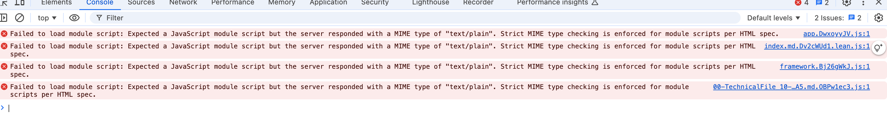

# Blog自动部署

## 前言

为建立个人知识库，打造个人博客，用于记录成体系的知识、随笔等。

最终实现效果：

1. 在本地Typora编写文章
2. 执行`deploy-blog`命令（执行deploy.sh脚本）
   1. 将需要发布的文章复制到Blog项目的docs目录中
   2. 重新构建Vitepress生成静态html文件
   3. 压缩静态文件推送至远程服务器/app目录再解压（配合Nginx部署）
   4. 推送本地项目至Github


## 编写Blog项目

经过多方考察，最终选择了VitePress。

- VitePress 是一个[静态站点生成器](https://en.wikipedia.org/wiki/Static_site_generator) (SSG)，专为构建快速、以内容为中心的站点而设计。
- 简而言之，VitePress 获取用 Markdown 编写的内容，对其应用主题，并生成可以轻松部署到任何地方的静态 HTML 页面。


安装启动运行参考官网：[Vitepress快速开始](https://vitepress.dev/zh/guide/getting-started)

- 根据文件目录自动生成侧边栏插件：https://github.com/QC2168/vite-plugin-vitepress-auto-sidebar

- 样式美化参考：https://vitepress.yiov.top/style.html

## 本地配置自动部署

部署方式有很多种，最终选择本地编写脚本的方式部署，因为本地的各种环境已经搭建好，而且有自己有云服务器，所以只要构建好静态文件推送到服务器即可。

### 编写deploy.sh

`REPO_PATH`是本地编写文章的知识库目录。（放置iCloud中多重保险）

`BLOG_PATH`Blog项目，进入该目录执行git、yarn构建相关命令。（会推送GitHub）

`SYNC_DIRS`知识库部分内容包含隐私内容，所以会指定同步的文件夹，只要这些文件夹的内容才需要打包构建。如果全部内容都是开放的甚至可以直接在Blog项目中编写文章，就不需要移动复制了。

```sh
# todo
```

### 本地配置执行命令

本地使用的是zsh，所以可以通过配置 `~/.zshrc` 执行命令

```sh
alias deploy-blog="/Users/Work/Pagoda/this/Blog/deploy.sh"
```

在任意处执行`deploy-blog`即可发布博客

### 服务器准备

安装Nginx：参考另一篇博客 [使用ECS为本地搭建开发环境](./使用ECS为本地搭建开发环境.md) 中的#部署Nginx

安装上传工具rsync：

```sh
# yam 安装
yum install -y rsync

# 查看版本
rsync --version
```

设置编码格式：（解决上传的静态文件名中文乱码的问题）

```sh
# 检查当前服务器的语言环境 
locale

# 设置环境变量并且导出到子进程
export LANG=en_US.UTF-8
export LC_ALL=en_US.UTF-8
```




```sh
curl -I http://116.205.134.46/assets/index.md.Dv2cWUd1.lean.js
HTTP/1.1 200 OK
Server: nginx/1.27.2
Date: Tue, 19 Nov 2024 09:55:18 GMT
Content-Type: text/plain
Content-Length: 194
Last-Modified: Tue, 19 Nov 2024 04:04:54 GMT
Connection: keep-alive
ETag: "673c0e66-c2"
Expires: Wed, 19 Nov 2025 09:55:18 GMT
Cache-Control: max-age=31536000
Cache-Control: public, immutable
Accept-Ranges: bytes
```


## 其它部署方式

Vitepress各种部署方式参考：https://vitepress.dev/zh/guide/deploy

### GitHub Pages

如果选择部署到Github Pages可以使用Github Action。当检测到分支合并，自动执行脚本进行部署。

- Github Action：https://docs.github.com/zh/actions
- 优点：免费流量、天然集成Github
- 缺点：域名有限制、国内网络不好

### Webhooks

Github提供的一个钩子，监听到代码合并时，可以执行一个请求。

- Webhooks：https://docs.github.com/en/webhooks/about-webhooks
- 缺点：需要在服务器上部署jar，而且需要为执行sh脚本搭建所需的环境。 

比如可以编写一个jar部署到云服务器上， 提供一个接口，当前调用时执行自定义的sh。

示例代码：

```java
@RestController
@RequestMapping("/webhook")
public class WebhookListener {
    
    @GetMapping("/publish")
    public String publish(){
        try {
            String fullName = "/deploy.sh";
            
            ProcessBuilder processBuilder = new ProcessBuilder("sh", fullName);
            processBuilder.redirectErrorStream(true);
            // 执行
            Process process = processBuilder.start();

            // 读取执行结果
            BufferedReader reader = new BufferedReader(new InputStreamReader(process.getInputStream()));
            String line,mesg= "";
            while ((line = reader.readLine()) != null) {
                mesg = mesg+line+"\n";
            }
            //校验执行码
            int exitCode = process.waitFor();
            if(exitCode != 0) return mesg;

        } catch (Exception e) {
            return "ErrorMesage:"+e.getMessage();
        }
        return "SUCCESS";
    }
}
```

