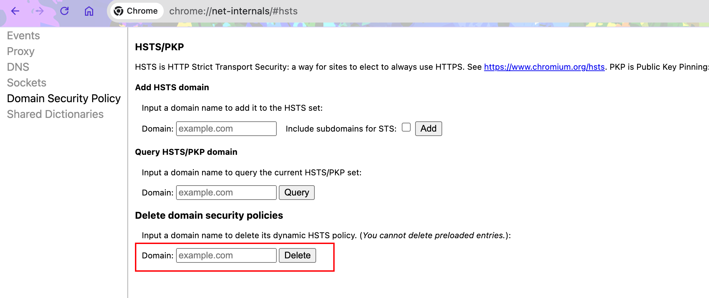

# Chrome强制访问https的问题

某些私人网站开启了HSTS导致Chrome无法访问，异常信息：

`You cannot visit xxx.xxx.com right now because the website uses HSTS. Network errors and attacks are usually temporary, so this page will probably work later.`

> HSTS（HTTP Strict Transport Security）是一种安全机制，强制浏览器只通过HTTPS协议访问该网站，以保护数据传输安全。当浏览器发现网站启用了HSTS，就会拒绝所有非HTTPS的请求。

解决：

1. 换个浏览器
2. 在Chrome地址栏输入：`chrome://net-internals/#hsts`
   - 在Delete domain security policies中删除HSTS策略
   - 