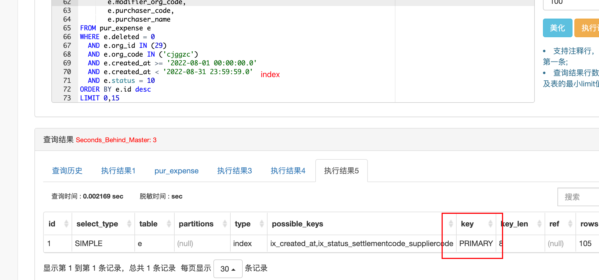
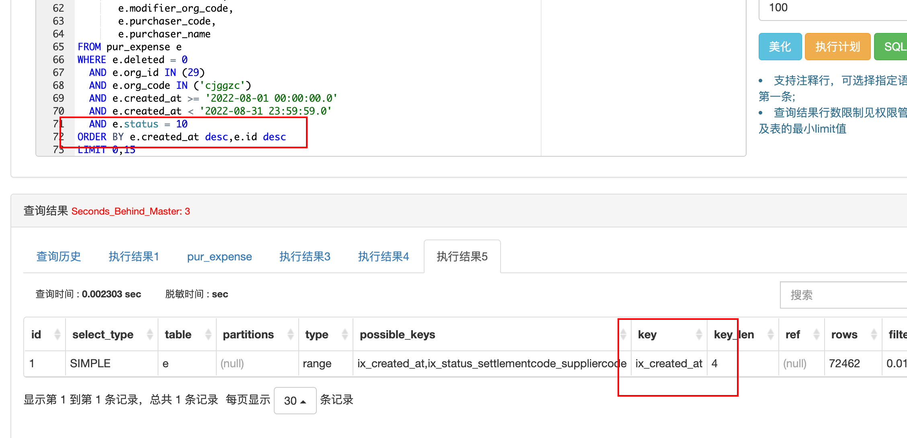

# order by导致where中索引失效的问题

where和order by都存在索引的情况下，MySQL由于自身的优化器选择，可能会导致不使用where条件中的索引，导致全表扫描查询

需要使用explain确认最终使用的索引

## 示例

`created_at`和 `id`均为索引的情况下，通过explain查看实际使用的索引是 ID primary主键索引，没有用到where中的`created_at`索引，导致全表扫描！
```sql
WHERE e.deleted = 0
  AND e.org_id IN (29)
  AND e.org_code IN ('xxx')
  AND e.created_at >= '2022-08-01 00:00:00.0'
  AND e.created_at < '2022-08-31 23:59:59.0'
  AND e.status = 10
ORDER BY e.id desc
LIMIT 0,15
```

调整后

> 保留`e.id desc`是为了防止created_at一致时导致排序失效的情况
```sql
WHERE e.deleted = 0
  AND e.org_id IN (29)
  AND e.org_code IN ('xxx')
  AND e.created_at >= '2022-08-01 00:00:00.0'
  AND e.created_at < '2022-08-31 23:59:59.0'
  AND e.status = 10
ORDER BY e.created_at desc,e.id desc
LIMIT 0,15
```

## 其它
官方文档也有描述这个问题，在MySQL8.0.21开始可以通过`optimizer_switch `这个参数来关闭 优化器的选择
> https://dev.mysql.com/doc/refman/8.0/en/limit-optimization.html
原文：
For a query with an ORDER BY or GROUP BY and a LIMIT clause, the optimizer tries to choose an ordered index by default when it appears doing so would speed up query execution. Prior to MySQL 8.0.21, there was no way to override this behavior, even in cases where using some other optimization might be faster. Beginning with MySQL 8.0.21, it is possible to turn off this optimization by setting the optimizer_switch system variable's prefer_ordering_index flag to off.
翻译：
对于带有ORDER BY或GROUP BY和LIMIT子句的查询，优化器会在默认情况下尝试选择有序索引，因为这样做可以加快查询的执行速度。在MySQL 8.0.21之前，没有办法覆盖这种行为，即使在使用其他优化可能更快的情况下。从MySQL 8.0.21开始，可以通过将optimizer_switch系统变量的prefer_ordering_index标志设置为关闭来关闭这种优化。