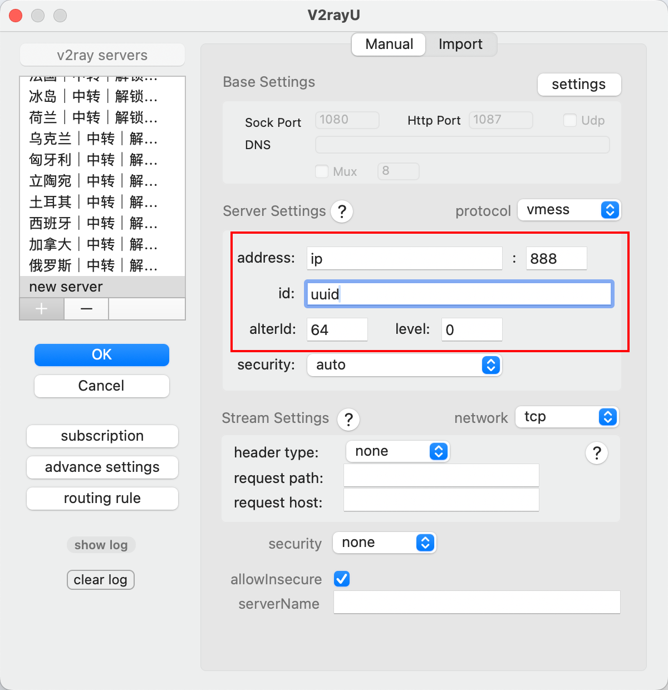
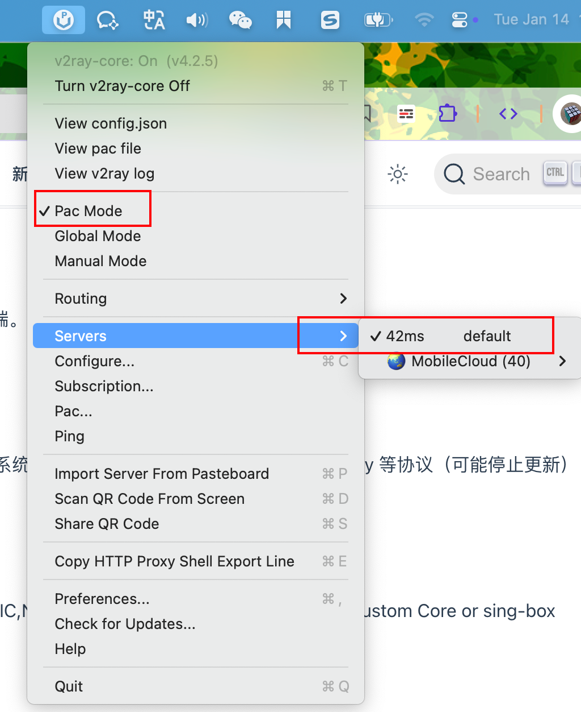
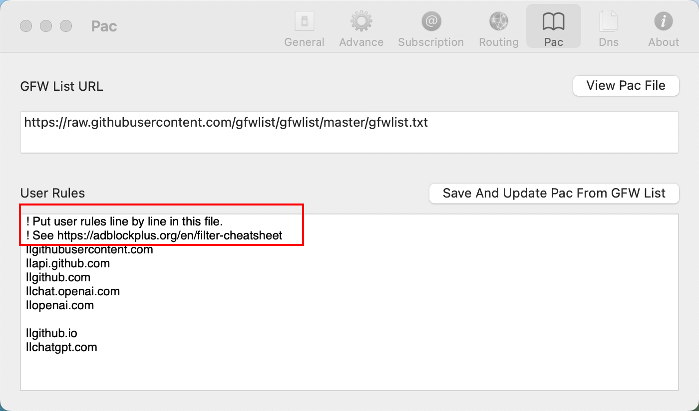

# 自建代理服务器

## 购买境外服务器

- **推荐地区**：香港、日本、新加坡等地，连接速度较快且延迟较低。

- **常见服务商**：
  - 云服务商：AWS、Google Cloud、阿里云国际、腾讯云国际、DigitalOcean。
  - 专用服务商：Vultr、BandwagonHost、Hostwinds。
  
- **操作系统选择**：建议使用 Debian 9.x, Debian 10 以上或 Ubuntu 18.04 及以上的 Linux 发行版


## 安装代理软件（V2Ray）

>  选用 V2Ray ：https://www.v2fly.org/

**更新系统**：

```sh
yum update && yum upgrade -y
```

**一键安装脚本**：

- https://github.com/v2fly/fhs-install-v2ray

```bash
bash <(curl -L https://raw.githubusercontent.com/v2fly/fhs-install-v2ray/master/install-release.sh)
```

**配置 V2Ray**：

- 修改 `/usr/local/etc/v2ray/config.json`：

  ```json
  cat <<EOF > /usr/local/etc/v2ray/config.json
  {
    "inbounds": [{
      "port": 8888,
      "protocol": "vmess",
      "settings": {
        "clients": [{
          "id": "02d4b343b-a3dba-4bs20-be7s9-1d7d66ad88241b",
          "alterId": 64
        }]
      }
    }],
    "outbounds": [{
      "protocol": "freedom",
      "settings": {}
    }]
  }
  EOF
  ```

**生成 UUID**：

```bash
 uuidgen
```

**启动 V2Ray 服务**：

```sh
# 启动
systemctl start v2ray
# 设置为开机自启
systemctl enable v2ray 
# 查看启动状态
systemctl status v2ray
# 重启
systemctl restart v2ray
```

## 配置客户端

> 在本机安装客户端连接代理服务器。

### V2RayU（成功连接）

> https://github.com/yanue/V2rayU/tree/master

#### 安装

[V2rayU-arm64.dmg](https://github.com/yanue/V2rayU/releases/download/v4.2.5/V2rayU-arm64.dmg)

#### 配置



#### 使用

选择新增的服务 `default` ， 再勾选 `Pac Mode` 开启代理




#### 代理模式介绍

**PAC 模式（Pac Mode）**

- 特点：仅对特定域名和 IP 地址的流量进行代理，其他流量则直接连接。


- 适用场景：想仅代理国外网站流量，而国内流量走直连。


- 实现机制：使用 PAC (Proxy Auto-Configuration) 文件来定义规则。

  - PAC 文件中包含一组匹配规则（如域名和 IP 地址），根据规则判断流量是否需要通过代理。

**全局模式（Global Mode）**

- 特点：将所有网络流量（包括国内和国外的流量）都通过代理转发。


- 适用场景：需要完全匿名的网络环境、访问一些被严重干扰的网站或服务。


- 缺点：占用带宽较高，国内流量也会走代理，可能降低国内访问速度。


**手动模式（Manual Mode）**

- 特点：代理不会自动生效，用户需要手动设置代理。
- 适用场景：希望对某些特定应用程序单独设置代理。

- 操作方式：需要在浏览器、终端或其他应用中手动配置代理地址为 127.0.0.1:1080（或自定义端口）。


#### 自定义路由规则

**编辑 PAC 文件：在 V2rayU 菜单中选择 `Pac...`**

- 逐行配置，遵循 Adblock Plus 的过滤规则规范：https://adblockplus.org/en/filter-cheatsheet

**基本规则格式**

- `!`表示注释
- `||`匹配域名及所有子域名
- `|`匹配以特定字符开始的网址（全路径匹配）
- `^`通配符，用于匹配任意字符。例如：`||example.com^`，匹配 example.com 以及所有路径（如 example.com/abc）
- `@@` 排除某些域名（不代理）。例如：`@@||example.com`



### ClashX（未成功连接）

**编写配置文件**：创建 `config.yaml` 文件，之后导入ClashX启用代理，内容如下：

```yaml
port: 7890 # Clash 监听的端口，可以自定义
socks-port: 7891 # SOCKS5 监听端口，可以自定义
redir-port: 7892 # 透明代理监听端口，可以自定义
allow-lan: true # 是否允许局域网连接
mode: Rule # 运行模式，Rule（规则模式）、Global（全局模式）、Direct（直连模式）
log-level: debug # 日志等级
external-controller: 127.0.0.1:9090 # 用于 Clash 的外部控制器，例如 Clash Dashboard。

proxies:
  - name: "Singapore" # 代理服务器名称，自定义
    type: vmess # 代理类型为 vmess
    server: xxx.xxx.xxx.xxx # 你的服务器 IP 地址或域名
    port: 8888 # V2Ray 服务器监听的端口
    uuid: 024b343b-xxx-xxx-xxx-xxxx
    alterId: 64 # 你的 alterId
    cipher: auto # 加密方式，通常 auto 即可
#    udp: false #启用 UDP 转发  需要确保你的 V2Ray 服务器也配置了 UDP 转发，并且你的网络环境允许 UDP 流量通过
#    tls: false # 是否启用 TLS，如果你的 V2Ray 没有配置 TLS，则设置为 false
#    skip-cert-verify: true # 是否跳过证书验证，如果 tls 为 false，则此项无效。如果使用自签名证书，建议设置为 true，否则设置为 false
    # ws: true # 如果你的 V2Ray 使用 WebSocket，则取消注释并配置相关参数
    # ws-path: "/path" # WebSocket 路径
    # ws-headers: # WebSocket Header
    #   Host: "your_host"

proxy-groups:
  - name: Proxy # 代理组名称，自定义
    type: select # 代理组类型为 select，手动选择代理
    proxies: # 包含的代理服务器
      - "Singapore"
      - DIRECT #测试延迟

# 自定义分流规则
rules:
  - DOMAIN-SUFFIX,google.com,Proxy
  - DOMAIN-SUFFIX,facebook.com,Proxy
  - GEOIP,CN,DIRECT
  - MATCH,Proxy # 默认走代理
```

### V2Ray客户端（未成功连接）

#### 编写配置文件

```json
cat <<EOF > ./config.json
{
  "inbounds": [{
    "port": 10086,
    "listen": "127.0.0.1",
    "protocol": "socks",
    "settings": {
      "auth": "noauth"
    }
  }],
  "outbounds": [{
    "protocol": "vmess",
    "settings": {
      "vnext": [{
        "address": "xx.xx.xxx.xx", // 与V2Ray服务端保持一致
        "port": 8888, // 与V2Ray服务端保持一致
        "users": [{
          "id": "xxx-xxx-xxx-xxx-xxxx", // 与V2Ray服务端保持一致
          "alterId": 64, // 与V2Ray服务端保持一致
          "security": "auto"
        }]
      }]
    }
  }]
}
EOF
```

#### 启动 V2Ray

```
# 测试配置文件
v2ray test ./config.json

# 指定配置文件启动
v2ray run -config ./config.json
```

#### 设置系统代理

对应网络配置中，启用 **SOCKS 代理**，地址填写 `127.0.0.1`，端口填写 `10086`。

## 其它

- 云服务器注意需要在防火墙开放对应端口号
  - 本机测试命令：`nc -zv 43.xx.xx.xx 8888`