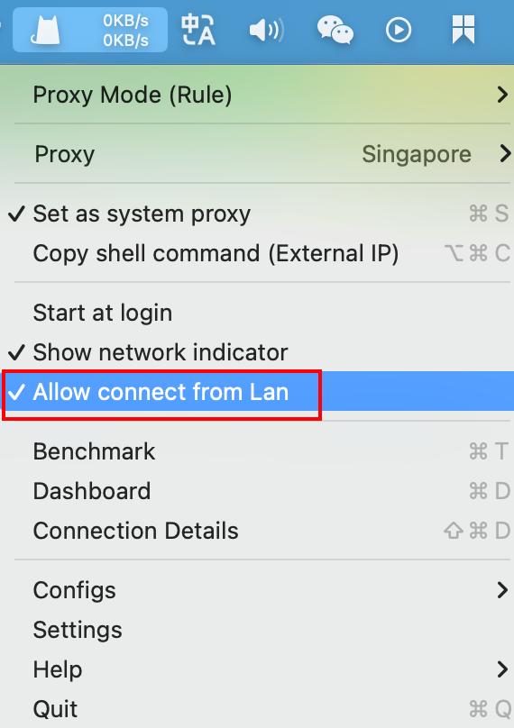
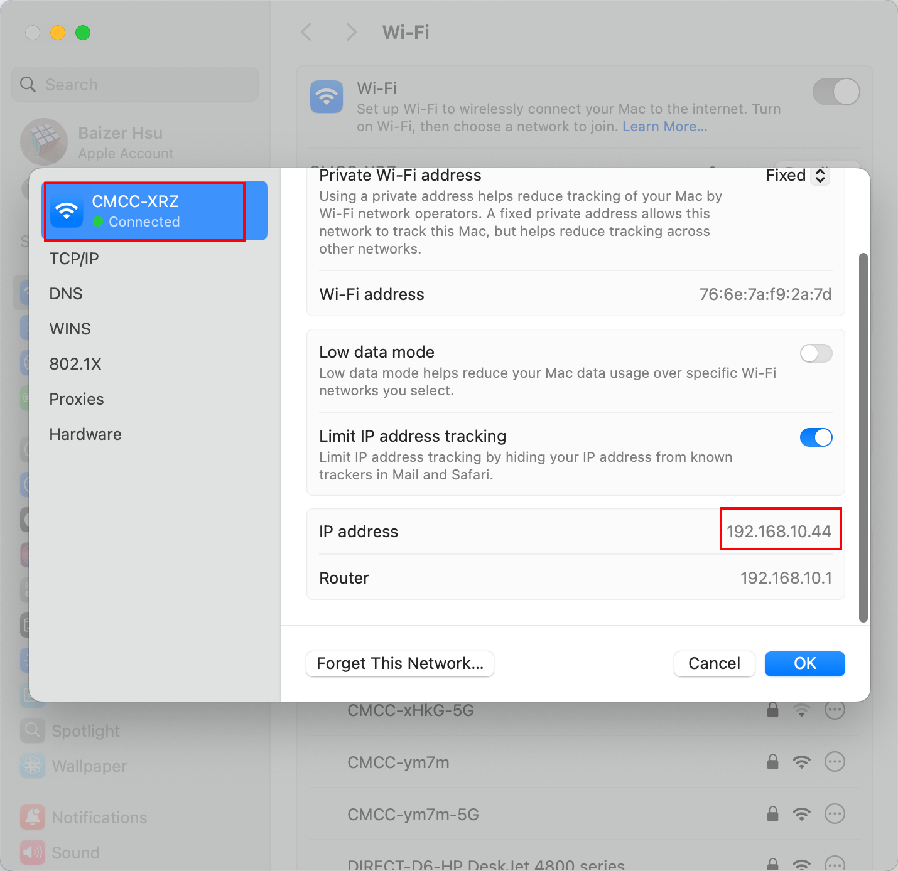
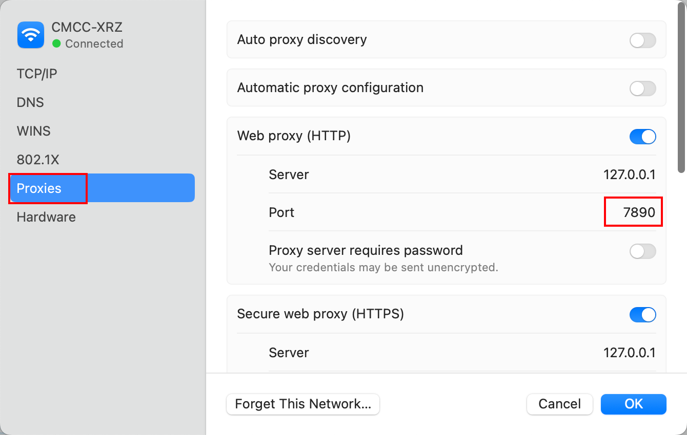
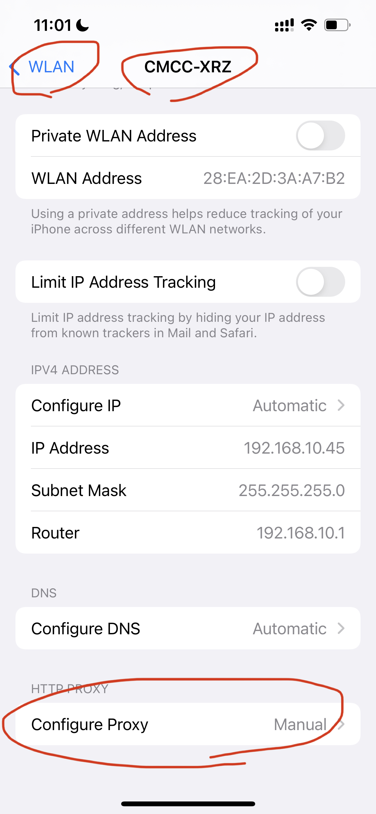
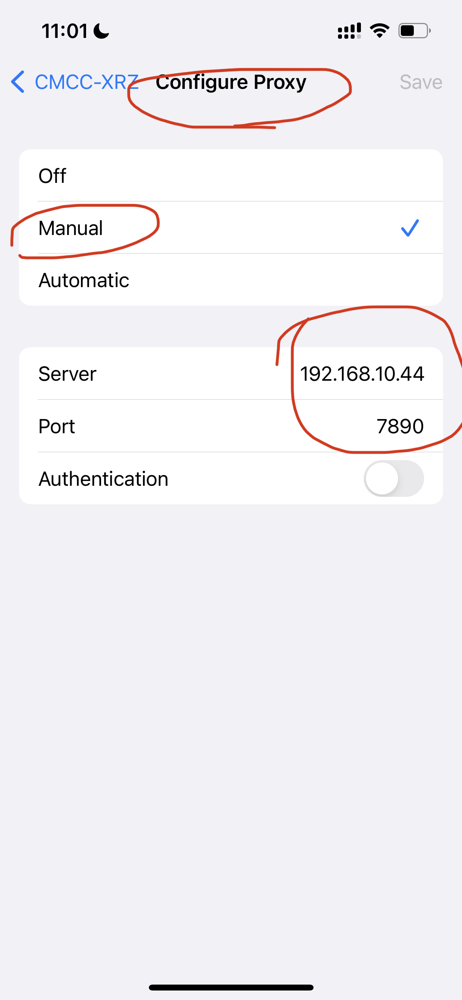

# 自建代理服务器2

## 前言

继上一篇 [自建代理服务器.md](自建代理服务器.md) 之后，通过ClashX可在Mac上可连接代理服务器。

本篇介绍如何在手机连接该代理服务。

## 方式1：在同一网络下共享

### 前置条件

>  Mac与手机连接同一 Wi-Fi，或共处同一网络下。

### 1、Mac上的ClashX设置允许本地连接

### 2、查看Mac上的本地连接IP地址和代理端口号

### 3、将获取的IP和Port填写手机端代理设置

手机上选择连接Wi-Fi的详情，下拉底部的代理设置，进入选择手动模式，并填写对应Mac的IP和代理端口，保存后即可使用。

