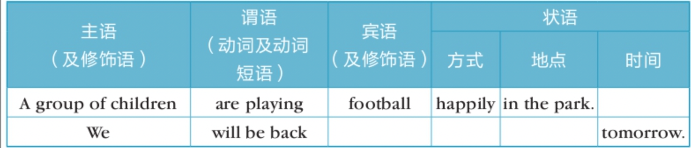
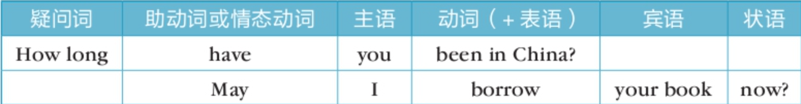

# EnglishGrammar 英语语法

## 句子种类

>**按目的分为四种：**
>
>- 陈述句、疑问句、祈使句、感叹句
>
>**按结构分为三种：**
>
>- 简单句、并列句、复合句（各种从句）

### 陈述句(statements)

陈述一个事实，表明一个愿望、猜测等：

- I wish you success.（愿望）
- He may be in bed now.（猜测）

### 祈使句(imperatives)

提出命令、请求等：

- Get everything ready tomorrow.（命令）
- Take care!（叮嘱）

### 感叹句(exclamations)

表示赞美、惊异等情绪：

- How beautiful (this is)!
- How silly (you are)!

### 问句(questions)

#### 一般疑问句(general questions)

也可称为“yes/no” questions（是否型问句），因为它一般是由 yes 或 no 回答的：

- Are you from Japan? —Yes, I am.
- Do you like horror films? —No, I don't.

#### 特殊疑问句(special questions)

也可称为“wh” -questions，因为它们多数都以who、what、where、when、which、whose、why这类词开头：

- Who is it on the phone?
- Where have you been?

#### 选择问句(alternative questions)

一般提出两种可能，看哪一种属实。这类问句都由两部分组成，由or把它们连接起来。通常前面部分用升调，后面部分用降调：

- Are you from the South or from the North?
- Is he going by train or by plane?

#### 反意问句(disjunctive questions)

- 这种问句由两部分组成，前面部分是一个陈述句，后面部分为一简短问句（称为question tag），如：
  - This is your car, isn't it?
  - They are your children, aren't they?
- 要注意，如果前面部分是肯定句，后面的简短问句一般要用否定形式（上面例句都是这样的）。反之，如果前面部分为否定句，则后面的简短问句要用肯定形式，如：
  - You don't like rock music, do you?
  - Your wife isn't in China now, is she?
- 在个别情况下，前后两部分可以都是肯定或都是否定。这时有特殊的含义，如：
  - So he won't pay his bills, won't he? We'll see about that.(=He is too naive to think.)（有威胁的意思。）
  - You sold that lovely bracelet, did you? (=I'm sorry you did.)（真遗憾。）

## 语序

在构成句子时有一定的顺序，肯定句通常按下列顺序排列：

### 自然语序(natural word order)

### 倒装语序(inverted word order)

谓语有时全部或部分地提到主语前面时，称为倒装语序。问句很多都用倒装语序

## 句子成分

### 由单词表示的句子成分

**主语**：名词、代词、数词、动名词

**系统词**：be动词（am、is、are）

**谓语**：动词、动词短语

**表语**：代词、名词、形容词

**宾语**：代词、名词

**定语：**代词、形容词、数词、 

**补语**：形容词、名词、介词短语

### 由短语表示的句子成分

- 介词短语（prepositional phrases）
- 不定式短语(infinitive phrases)
- 动名词短语(gerund phrases)
- 现在分词短语(-ing participle phrases)
- 过去分词短语(-en participle phrases)
- 名词短语(noun phrases)
- 动词短语(verb phrases)

## 基础句型（简单句）

### 主系表

> 表示什么是什么

**主语**：名词、代词

**系统词**：be动词（am、is、are）

**表语**：介词短语、名词、形容词

eg

- The teacher is beautiful
- How is the teacher?
- We are Chinese

### 主谓宾

> 表示什么做了什么

**主语**：名词、代词

**谓语**：动词

**宾语**：名词

eg

- I love you
- Children plant trees

### 主谓

> 和主谓宾的区别是此句型使用的动词do是不及物动词vi，后面不能带宾语
>
> 如果非要带宾语 需要在vi后面加介词

**主语**：名词、代词

**谓语**：不及物动词（vi）

eg

- Spring comes
- The teacher <u>listens to</u> the music

### 主谓宾补

> 有些句子使用主谓宾是无法完整表达句子意思的，所以需要一个补语补充

**主语**：名词、代词

**谓语**：动词

**宾语**：名词

**补语**：形容词、名词、介词短语

eg

- She found the pen <u>on the floor</u>

### 主谓宾宾

> 谓语由==双宾语动词==组成，间接宾语通常指“人”，直接宾语通常指“物”
>
> 也可以对调，但是需要借助介词 to 或者 for

**主语**：名词、代词

**谓语**：动词（双宾语动词）

**宾语**：间接宾语

**宾语**：直接宾语

eg

- Her father bought <u>her</u> <u>a bicycle</u>

- Her father bought <u>a bicycle</u> <u>for</u> <u>her</u>

- The old man is telling <u>the childre</u> <u>stories</u>

- The old man is telling <u>stories</u> <u>to</u> <u>the childre</u>

### There be

> 表示 时间、空间 存在某种事物

**There is**：单数可数名词、不可数名词时使用

**There are ...**：复数可数名词时使用

eg

- <u>There is</u> a teacher in the classroom（教室里有一个老师）

- <u>There is</u> a class afternoon（下午有一节课）

- <u>There are</u> three apples on the table（桌子上面有三个苹果）

**There do**： do指不及物动词

> 表示==存在、发生、出现、坐落==等意义的不及物动词也可以与There连用

eg

- <u>There was</u> an accident（这里发生了事故）

## 并列句

用并列连词连接起来的2个或者2个以上的简单句组成的句子

**结构：简单句 + 并列连词 + 简单句**

- I help him ==and== he helps me. 我帮助他，他帮助我。
- My sister ==not only== sings well,==but also== dances well. 我妹妹不仅唱得好，而且跳舞也很好
- I bought my sister a present,==but== she didn't like it. 我给我妹妹买了一份礼物，但她不喜欢。
- Is it a girl ==or== a boy? 是男孩还是女孩？
- They were making a lot of noise,==so== the teacher got angry. 他们制造了很多噪音，所以老师生气了。

**结构：分号（;）连接**

- It was getting late==;== she must start back home. 天色已晚；她必须动身回家。
- We fished all day==;== we didn't catch a thing. 我们钓了一整天的鱼；我们什么也没抓到。

## 谓语动词 PredicateVerb

### 动词的状态

==进行状态==：这兔子正在吃着胡萝卜

==完成状态==：这兔子吃掉了胡萝卜

==完成进行状态==：这兔子从早上就开始吃胡萝卜，现在还没停呢（不但已经完成了的，还要继续进行的）

==一般状态==：一般，没有具体说明、表中性的、实事陈述

- 兔子吃胡萝卜
- 太阳从东边升起
- 你喜欢她

> 状态结合时间，总共可以出现16种时态

### 动词的时间（现在）

**==一般现在时态==**

- **动词原型**：I <u>eat</u> carrots. 我吃胡萝卜
- **动词原型+s（第三人称单数时）**：She <u>eats</u> carrots. 她吃胡萝卜

**==现在进行时态==  am/are/is + 动词的现在分词**

- I <u>am eating</u> a carrot. 我正在吃一跟胡萝卜
- You <u>are eating</u> a carrot. 你正在吃一根胡萝卜
- He <u>is eating</u> a carrot. 他正在吃一根胡萝卜

**==现在完成时态==	have/has + 动词的过去分词**

- The rabbit <u>has eaten</u> a carrot. 这兔子吃了一根胡萝卜

**==现在完成进行时态==	have/has + been + 动词的现在分词**（已经完成了还在继续）

- The rabbit <u>has been eating</u> carrots. 这兔子一直在吃胡萝卜

### 动词的时间（过去）

**==一般过去时态==	动词过去式**

- The rabbit <u>ate</u> carrots. 兔子吃胡萝卜

**==过去进行时态==	was/were + 动词的现在分词**（在过去某个节点正在发生的）

- The rabbit <u>was/were eating</u> a carrot. 这兔子正在吃一根胡萝卜

**==过去完成时态==	had + 动词的过去分词**（在过去某个节点已经发生的）

- The rabbit <u>had eaten</u> a carrot. 这兔子吃了一根胡萝卜

**==过去完成进行时态==	hed + been + 动词的现在分词**（在过去某个节点已经发生一段时间还在继续）

- The rabbit <u>hed been eating</u> carrots. 这兔子一直在吃胡萝卜

### 动词的时间（将来）

**==一般将来时态==**

- **be的变位(am/are/is) + going + to + 动词原型**
  - I <u>am going to visit</u> my grandparents this weekend. 我这个周末要去看望我的祖父母。
  - They <u>are going to watch</u> a movie tonight. 他们今晚打算看电影。

- **be的变位(am/are/is) + about +to + 动词原型**
  - She <u>is about to leave</u> for the airport. 她即将前往机场。
  - The train <u>is about to arrive</u> at the station. 火车即将到站。

- **be的变位(am/are/is) + to + 动词原型**
  - The president <u>is to meet</u> the delegates tomorrow. 总统将于明天会见代表团。
  - The event <u>is to start</u> at 10 a.m. sharp. 活动将在上午十点准时开始。

- **will + 动词原型**
  - The sun <u>will rise</u> again tomorrow. 太阳明天也会照常升起
  - We <u>will succeed</u> if we work hard. 如果我们努力，我们会成功的。
  - I <u>will call</u> you as soon as I get home. 我到家后会马上给你打电话。

**==将来进行时态==	will + be + 动词的现在分词**（在将来的某个时间，某个动作是在进行的过程中）

- I <u>will be eating</u> a carrot for lunch tomorrow. 我明天午饭要吃胡萝卜

**==将来完成时态==	will + have + 动词的过去分词**

- The rabbit <u>will have eaten</u> a carrot. 兔子会吃掉一根胡萝卜

**==将来完成进行时态==	will + have + been + 动词的现在分词**

- The rabbit <u>will have been eating</u> carrots. 这兔子会一直在吃胡萝卜

### 动词的时间（过去将来）

>通常出现在从句

**==一般过去将来时态==**

- **was/were + going + to + 动词原型**
- **was/were + about +to + 动词原型**
- **was/were + to + 动词原型**
- **would + 动词原型**
  - I said I <u>would eat</u> a carrot for lunch. 我（之前）说过我午饭要吃胡萝卜
  - We knew it <u>would rain</u> later that day. 我们知道那天下午会下雨。

**==过去将来进行时态==	would + be + 动词的现在分词**

- I thought we <u>would be traveling</u> by now. 我以为我们现在应该在旅途中。

- They said they <u>would be working</u> late tonight. 他们说今晚会工作到很晚。

**==将来完成时态==	would + have + 动词的过去分词**

- By the time you arrived, I <u>would have finished</u> my dinner. 在你到之前，我晚饭应该已经吃完了。

- She <u>would have completed</u> the project if she had more time. 如果她有更多时间，她本该完成这个项目了。

**==将来完成进行时态==	would + have + been + 动词的现在分词**

- By the end of the year, I <u>would have been working</u> here for five years. 到今年年底，我将在这里工作五年了。

- He said he <u>would have been studying</u> for hours by the time the exam started. 他说考试开始时他会已经复习好几个小时了。

## 非谓语动词

==一个简单句中只能有一个核心的谓语动词，其它动词只能充当非谓语动词。==

- 中文：我喜欢吃胡萝卜，有两个动词：喜欢、吃
- 英文：直译I like eat carrots，是错误的，第二个动词eat只能用非谓语动词的形式来表达（动词不定式、动名词、现在分词、过去分词）

### 动词不定式

**==to + 动词原型==**：I like **to eat** carrots.（to某些情况可以省略）

> 某些动词不能使用to，例如：avoid、consider、mind、put off、give up
>
> 有些介词短语后面是自带to的，不能当成动词不定式
>
> - The rabiit is looking <u>forward to</u> seeing the wolf again. 兔子期望再次见到狼
>   - looking/seeing均为动名词的形式

### 动名词

**==动词原型 + ing==**: （将动词转化为名词的形式）

- Seeing is **beliveing**. 看到就是相信（眼见为实）
- a **swimming** pool. 游泳池

### 现在分词

**==动词的现在分词（v+ing）==**：（将动词转化为形容词的形式）

- The story is **interesting**. 这个故事很有趣

>动词的现在分词形式通常是在后面+ing的形式，和动名词一样，如何区分呢？
>
>- 动名词：a sleeping pill. 一片安眠药（此sleeping是说明药片的性质、功能和用途，是名词，是说吃了这片药可以睡觉）
>- 现在分词：a sleeping rabbit. 一只睡着的兔子（此sleeping是说明兔子的状态，是形容词，修饰兔子在睡觉）

### 过去分词

**==动词的过去分词（v+ed）==**：（将动词转化为形容词的形式）

- The rabbit is interested. 兔子很有兴趣

>过去分词和现在分词都是形容词，二者区别在于主动和被动的关系。
>
>现在分词：**主动的、进行中的**
>
> - The story is interesting. 这个故事很有趣（暗含这个故事让人感到有兴趣）
> - The rabbit was frightening. 兔子令人感到害怕（兔子主动去吓人，使用现在分词）
> - the developing countries. 发展中国家
>
>过去分词：**被动的、已完成的**
>
> - The rabbit is interested. 兔子很有兴趣（暗含兔子被某事某物引起了兴趣）
> - The rabbit was frightened. 兔子感到害怕（兔子被某事吓到了，所以使用过去分词）
> - the developed countries. 发达国家（发展阶段已经结束了）

## SubordinateClause 从句

英语五大基础句型中，除了动词之外，其它都可以==使用从句==通过==连词扩展==替代

- 主语 + ==动词==
- 主语 + ==动词== + 宾语
- 主语 + ==动词== + 间接宾语 + 直接宾语
- 主语 + ==动词== + 宾语 + 补语、宾语
- 主语 + ==动词== + 表语、主语、补语

> 大体可分为以下三种从句：形容词从句、名词从句、副词从句

### 形容词从句（定语从句、关系从句）

这类从句对某个人或者某个事物进行描述，具有形容词的性质

同时有充当定义成分，又称定义从句。

#### 	形容词从句的思维方式

原句：这兔子在吃一根胡萝卜。 The rabbit is eating a carrot. 

扩展从句：这兔子在吃一根我来买的胡萝卜

- 中文思维：这兔子在吃一根我来买的胡萝卜，”我买来的“定语是前置的

- 英文思维：这兔子在吃一根胡萝卜that 我来买的，定语是后置的，即The rabbit is eating a carrot **that I bought**

>二者区别在于前后置，那个好一点视情况而定。
>
>中文的好处是顺序思维，但是如果定语太长时，就无法直观的了解和知道主语。
>
>- 一只<u>几个月前开始上传视频专门教英语的讨人喜爱的</u>兔子（说了半天才知道是只兔子）
>- This is a rabbit <u>who started uploading videos since a few months ago to focus on English teaching and is liked by students.</u>
>- 不过通常这种情况都是拆句表达：这是一只从几个月前开始上传视频，专注于英语教学的兔子，受到了学生们的喜欢。

#### 	形容词从句的构成

从句需要通过关系词引导，关系词（连词）又分：关系代词、关系副词。

具体使用哪一个关系词取决于上下文。

#### 关系代词

- **that 那个**（The rabbit is eating a carrot **that** bought.）
- **which 哪一个**（The food **which** the teacher likes is a carrot.）
- **who 谁**（The teacher **who** ate a carrot is a rabbit.）
- **whom 谁**（The teacher **whom** I saw yesterday is a rabbit.）
- **whose 谁的**（The teacher **whose** favorite food is carrot is a rabbit.）

> that和which的区别，取决于先行词是否唯一

#### 关系副词

- **where 哪里**（This was the **place where** the rabbit ate the carrot.）
- **why 为什么**（This is the **reason why** the rabbit ate the carrot.）
- **when 什么时候**（That was the **day when** the rabbit ate the carrot for the first time.）

> 关系副词也可以转换为 **介词 + which** 来表达
>
> - This is the reason <u>why</u> the rabbit ate the carrot. 这就是兔子吃胡萝卜的原因。
> - This is the reason <u>for which</u> the rabbit ate the carrot. 这就是兔子吃胡萝卜的原因。

#### 形容词从句的限定性和非限定性

The rabbit ate the carrot <u>which was on the table</u>. 兔子吃了桌上的胡萝卜

- 限定是兔子吃的是桌上的胡萝卜

The rabbit ate the carrot,which was on the table. 兔子吃了桌上的胡萝卜

- 言下之意是指：兔子吃了胡萝卜，这根恰巧在桌上
- 同时which也是有代指的意思，此处which代指了The rabbit ate the carrot

### 名词从句（主语从句）

原句：<u>The fact</u> is obvious. 这实事是明显的

扩展主语从句：<u>That the rabbit ate a carrot</u> is obvious. 兔子吃了胡萝卜这件事是明显的

#### 引导词

- **that 那个**（**That** the rabbit ate the carrot is obvious. 兔子吃了胡萝卜是明显的）
- **whether 是否**（**Whether** the rabbit ate the carrot is obvious. 兔子是否吃了胡萝卜是明显的）
- **where 哪里**（ **Where** the rabbit ate the carrot is obvious. 兔子哪里吃的胡萝卜是明显的）
- **when 什么时候**（**When** the rabbit ate the carrot is obvious. 兔子什么时候吃的胡萝卜是明显的）
- **how 怎么样**（**How** the rabbit ate the carrot is obvious. 兔子怎样吃地胡萝卜是明显的）
- **who 谁**（**Who** ate the carrotis obvious. 谁吃了胡萝卜是明显的）
- **what 什么**（**What** the rabbit ate is obvious. 兔子吃的什么是明显的）

> 当描述的信息是确定时使用that，不确定时使用其它

#### 形式主语

当主语从句很长时，英语通常使用==it==作为形式主语代替从句，从而将主语从句放到后面

<u>That he learns English</u> is difficult. 他学英语很难

- ==It== is diffcult <u>that he learns English.</u> 他学英语很难

<u>What the rabbit ate</u> is obvious.

- **It** is obvious <u>what the rabbit ate.</u>

### 名词从句（宾语从句）

原句：I saw a rabbit. 我看见一只兔子

扩展宾语从句：I saw that rabbit ate a carrot. 我看见这只兔子吃了根胡萝卜

#### 引导词

- **that 那个**（I saw **that** rabbit ate a carrot. 我看见这只兔子吃了根胡萝卜）
- **whether 是否**
- **where 哪里**
- **when 什么时候**
- **how 怎么样**
- **who 谁**
- **what 什么**

> 当描述的信息是确定时使用that，不确定时使用其它

#### that的省略

在某些不影响句子意思的地方，可以省略that。

I know (that) the rabbit ate a carrot. 我知道兔子吃了一根胡萝卜
- 这种情况会导致一个简单中出现两个谓语动词，需注意甄别

#### 否定前置（陈述句语序）

从句定义都是陈述句语序，描述否定意思时，需要将否定词前置

- I think <u>that the rabbit isn't smart</u>. 我认为兔子不聪明
- I don't think <u>that the rabbit is smart</u>. 我认为兔子不聪明

#### 主从时态一致

即从句时态要和主句保持一致

- I <u>knew</u> that the rabbit <u>liked</u> carrots. 我知道兔子喜欢胡萝卜 

描述不变的客观现象时是例外

- I <u>knew</u> that the sun <u>rises</u> in the east. 我知道太阳从东方升起

### 状语从句（副词从句）

#### 时间状语

**==While== 当···时候、与···同时**

- **While** my wife was reding the newspaper,I was watching TV. 当我妻子在看报纸时，我正在看电视。

**==When== 在···时候、什么时候**

- **When** I lived in the countryside,I used to carry some water for him. 当我住在乡下的时候，我常常给他挑水。

#### 条件状语

**==if== 如果**

- We will give you a good price **if** you are thinking of buying it. 如果你想买的话，我们会给你一个好价钱。

#### 原因状语

**==because== 因为**

- I did that **because** she told me to. 我这么做是因为她让我这么做的。

**==since== 自从、既然**

- **Since** you can’t answer the question,you can ask him for help. 既然你不能回答这个问题，你可以向他寻求帮助。

#### 目的状语

**==so that== 因此、以便**

- He must get up early **so that** he can go to work on time. 他必须早起，这样他才能按时上班。

**==in order to== 为了···**

- He worked hard **in order to** succeed. 他为了成功而努力工作。

#### 结果状语

**==so that== 因此、以便**

- It was very cold,**so that** the river froze. 天气很冷，所以河水结冰了。

#### 让步状语

**==Although/Though== 虽然、尽管、即使**

- **Although** he was exhausted,he kept on working. 尽管他筋疲力尽，但他仍继续工作。

**==whether== 是否、无论、不管**

- **Whether** you believe it or not,it's true. 不管你信不信，这是真的。

#### 地点状语

**==wherever== 无论什么地方**

- Sit **wherever** you like. 你喜欢坐哪儿都行。

**==where== 哪里**

- I walk into the canteen **where** students are eating. 我走进学生们正在吃饭的食堂。

## 参考资料

- 英语兔语法讲解：https://www.bilibili.com/video/BV1XY411J7aG
- 《张道真英语语法（第三版）（精华版）》